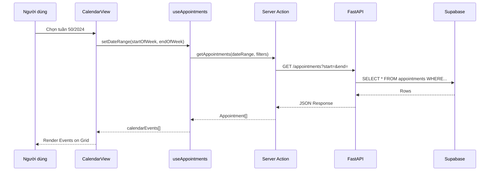

# Thiết kế Hệ thống: Giao diện Quản lý Lịch hẹn

## Tổng quan Kiến trúc

### Cấu trúc hệ thống cấp cao

```mermaid
graph TD
    subgraph "App Layer (app/admin/appointments)"
        Page["page.tsx (Server)"]
    end

    subgraph "Feature Layer (features/appointments)"
        Actions["actions.ts (Server Actions)"]
        Types["types.ts"]
        Schemas["schemas.ts (Zod)"]
        Constants["constants.ts"]
        MockData["mock-data.ts"]

        subgraph "Components"
            MainPage["AppointmentsPage"]
            Dashboard["AppointmentDashboard"]

            subgraph "Calendar Views"
                CalendarView["CalendarView"]
                DayView["DayGridView"]
                WeekView["WeekGridView"]
                MonthView["MonthGridView"]
                AgendaView["AgendaListView"]
            end

            subgraph "Resource Views"
                ResourceTimeline["ResourceTimeline"]
                StaffTimeline["StaffTimelineRow"]
                RoomTimeline["RoomTimelineRow"]
            end

            subgraph "Event Components"
                EventCard["EventCard"]
                EventPopover["EventPopover"]
                EventSheet["AppointmentSheet"]
                EventForm["AppointmentForm"]
            end

            subgraph "Interaction"
                DnDContext["CalendarDnDContext"]
                DragOverlay["DragOverlayCard"]
                ResizeHandle["ResizeHandles"]
            end

            subgraph "Toolbar"
                ViewSwitcher["ViewSwitcher"]
                DateNavigator["DateNavigator"]
                FilterBar["FilterBar"]
                ZoomControl["ZoomControl"]
            end

            subgraph "Metrics"
                MetricsCards["MetricsCards"]
                OccupancyCard["OccupancyCard"]
                TodayCard["TodayAppointmentsCard"]
            end
        end

        subgraph "Hooks"
            useCalendar["useCalendarState"]
            useAppointments["useAppointments"]
            useDragDrop["useCalendarDnD"]
            useConflict["useConflictDetection"]
            useRecurrence["useRecurrence"]
        end
    end

    subgraph "Shared Layer"
        UI["@/shared/ui"]
        Lib["@/shared/lib"]
        Hooks["@/shared/hooks"]
    end

    subgraph "External Features"
        Staff["features/staff"]
        Services["features/services"]
        Resources["features/resources"]
        Customers["features/customers"]
    end

    Page --> MainPage
    MainPage --> Dashboard
    MainPage --> CalendarView
    MainPage --> ResourceTimeline
    MainPage --> EventSheet

    CalendarView --> DayView
    CalendarView --> WeekView
    CalendarView --> MonthView
    CalendarView --> AgendaView

    DayView --> EventCard
    EventCard --> EventPopover
    EventCard --> DnDContext

    EventSheet --> EventForm
    EventForm --> Schemas

    Actions --> Types
    Actions --> Lib

    MainPage --> Staff
    MainPage --> Services
    MainPage --> Resources
    MainPage --> Customers
```



### Các thành phần chính và trách nhiệm

| Component | Loại | Trách nhiệm |
|-----------|------|-------------|
| `AppointmentsPage` | Client | Container chính, quản lý state global |
| `AppointmentDashboard` | Client | Hiển thị Key Metrics Cards |
| `CalendarView` | Client | Switch giữa Day/Week/Month/Agenda |
| `ResourceTimeline` | Client | Timeline ngang theo KTV/Phòng |
| `EventCard` | Client | Thẻ sự kiện, draggable, hover popover |
| `AppointmentSheet` | Client | Side panel xem/sửa chi tiết |
| `AppointmentForm` | Client | Form tạo/sửa với validation |
| `CalendarDnDContext` | Client | Context cho @dnd-kit |
| `FilterBar` | Client | Bộ lọc multi-select |

### Lựa chọn Công nghệ

| Mục | Lựa chọn | Lý do |
|-----|----------|-------|
| **Calendar Engine** | Custom-built | FullCalendar khó customize style, không cần đến mức phức tạp đó |
| **Drag & Drop** | @dnd-kit | Đã có trong project, lightweight, accessible |
| **Date Library** | date-fns | Đã có, treeshakeable, immutable API |
| **State** | React useState + Context | Không cần global state manager |
| **Form** | react-hook-form + Zod | Đã có pattern trong project |

---

## Mô hình Dữ liệu

### Các thực thể cốt lõi

```typescript
// types.ts

/** Trạng thái cuộc hẹn */
export type AppointmentStatus =
  | 'pending'      // Chờ xác nhận
  | 'confirmed'    // Đã xác nhận
  | 'in_progress'  // Đang thực hiện
  | 'completed'    // Hoàn thành
  | 'cancelled'    // Đã hủy
  | 'no_show';     // Khách không đến

/** Thực thể Cuộc hẹn */
export interface Appointment {
  id: string;
  customerId: string;
  customerName: string;
  customerPhone: string;

  staffId: string;
  staffName: string;
  staffAvatar?: string;

  serviceId: string;
  serviceName: string;
  serviceColor: string;

  resourceId?: string; // Phòng/Giường (tùy chọn)
  resourceName?: string;

  startTime: Date;
  endTime: Date;
  duration: number; // phút

  status: AppointmentStatus;

  notes?: string;
  internalNotes?: string; // Ghi chú nội bộ (KTV ghi)

  // Recurrence
  isRecurring: boolean;
  recurrenceRule?: string; // RRULE string
  recurrenceParentId?: string;
  recurrenceIndex?: number;

  createdAt: Date;
  updatedAt: Date;
  createdBy: string;
}

/** Event Card hiển thị trên Calendar */
export interface CalendarEvent {
  id: string;
  title: string; // customerName + serviceName
  start: Date;
  end: Date;
  color: string; // serviceColor
  status: AppointmentStatus;
  staffId: string;
  resourceId?: string;
  isRecurring: boolean;

  // Metadata cho popover
  appointment: Appointment;
}

/** Cấu hình Timeline Resource */
export interface TimelineResource {
  id: string;
  type: 'staff' | 'room';
  name: string;
  avatar?: string;
  color?: string;
  isActive: boolean;
}

/** Cấu hình View */
export type CalendarViewType = 'day' | 'week' | 'month' | 'agenda' | 'timeline';

export interface CalendarViewConfig {
  view: CalendarViewType;
  date: Date; // Ngày/tuần/tháng đang xem
  zoomLevel: 15 | 30 | 60 | 240; // phút/đơn vị width (cho timeline)
  densityMode: 'comfortable' | 'compact';
  showWeekends: boolean;
  startHour: number; // 8
  endHour: number;   // 21
}

/** Recurrence Rule (RRULE) */
export interface RecurrenceConfig {
  frequency: 'daily' | 'weekly' | 'monthly' | 'yearly';
  interval: number; // Mỗi X [frequency]
  byDay?: number[]; // 0=CN, 1=T2, ..., 6=T7
  endType: 'never' | 'count' | 'until';
  count?: number;
  until?: Date;
}

/** Xung đột lịch */
export interface ConflictInfo {
  eventId: string;
  conflictsWith: string[];
  type: 'overlap' | 'double_booking';
  severity: 'warning' | 'error';
  message: string;
}

/** Filter State */
export interface AppointmentFilters {
  staffIds: string[];
  serviceIds: string[];
  resourceIds: string[];
  statuses: AppointmentStatus[];
  searchQuery: string;
}
```

### Luồng dữ liệu



---

## Phân rã Thành phần Chi tiết

### 1. Layout Chính

```
┌─────────────────────────────────────────────────────────────────┐
│ AdminLayout (Sidebar + Header)                                   │
├─────────────────────────────────────────────────────────────────┤
│ ┌─────────────────────────────────────────────────────────────┐ │
│ │ MetricsCards (4 cards)                                      │ │
│ │ [Hôm nay: 15] [Chờ xác nhận: 3] [Tỷ lệ: 78%] [Doanh thu: X] │ │
│ └─────────────────────────────────────────────────────────────┘ │
│ ┌─────────────────────────────────────────────────────────────┐ │
│ │ Toolbar                                                      │ │
│ │ [< Hôm nay >] [Ngày|Tuần|Tháng|Danh sách|Timeline] [Lọc ▼]  │ │
│ └─────────────────────────────────────────────────────────────┘ │
│ ┌─────────────────────────────────────────────────────────────┐ │
│ │                                                              │ │
│ │                    CalendarView / Timeline                   │ │
│ │                     (Main Content Area)                      │ │
│ │                                                              │ │
│ │                                                              │ │
│ └─────────────────────────────────────────────────────────────┘ │
└─────────────────────────────────────────────────────────────────┘
```

### 2. Day/Week View Layout

```
┌────────┬────────────────────────────────────────────────────────┐
│        │  T2 16/12   │  T3 17/12   │  T4 18/12 (Hôm nay)  │ ... │
│        ├─────────────┼─────────────┼──────────────────────┼─────┤
│ 08:00  │             │ ▓▓▓▓▓▓▓▓▓▓▓ │                      │     │
│        │             │ Nguyễn A    │                      │     │
│        │             │ Massage 60' │                      │     │
├────────┼─────────────┼─────────────┼──────────────────────┼─────┤
│ 09:00  │ ░░░░░░░░░░░ │             │ ▓▓▓▓▓▓▓▓▓▓▓▓▓▓▓▓▓▓▓▓ │     │
│        │ Trần B      │             │ Lê C - Facial 90'    │     │
│        │ Spa 45'     │             │                      │     │
├────────┼─────────────┼─────────────┼──────────────────────┼─────┤
│ 10:00  │             │ ▓▓▓ ▓▓▓    │ (tiếp)               │     │
│        │             │ Overlap!    │                      │     │
└────────┴─────────────┴─────────────┴──────────────────────┴─────┘

Chú thích:
▓ = Event Card (màu theo service)
░ = Event Card khác màu
Overlap = 2 events side-by-side
```

### 3. Timeline View Layout

```
┌──────────────────┬────────────────────────────────────────────────┐
│                  │ 08:00   09:00   10:00   11:00   12:00   13:00  │
│                  │    |       |       |       |       |       |   │
├──────────────────┼────────────────────────────────────────────────┤
│ 👤 Nguyễn Thảo   │ ▓▓▓▓▓▓▓▓▓▓▓▓    ░░░░░░░░░░        ▓▓▓▓▓▓▓▓   │
├──────────────────┼────────────────────────────────────────────────┤
│ 👤 Trần Linh     │         ▓▓▓▓▓▓▓▓▓▓▓▓▓▓▓▓▓▓▓▓▓▓▓                │
├──────────────────┼────────────────────────────────────────────────┤
│ 👤 Lê Hương      │     ░░░░░░░░        ░░░░░░░░░░░░░░░░░░░░       │
├──────────────────┼────────────────────────────────────────────────┤
│ 🛋️ Phòng VIP 1  │ ▓▓▓▓▓▓▓▓▓▓▓▓▓▓▓▓▓▓                     ░░░░░   │
├──────────────────┼────────────────────────────────────────────────┤
│ 🛋️ Phòng VIP 2  │                  ▓▓▓▓▓▓▓▓                       │
└──────────────────┴────────────────────────────────────────────────┘

← Sticky Column     Scrollable Horizontally →
```

### 4. Event Card States

```
┌─────────────────────────┐      ┌─────────────────────────┐
│ Default State           │      │ Hover State             │
│ ┌─────────────────────┐ │      │ ┌─────────────────────┐ │
│ │ 🟢 09:00-10:00      │ │      │ │ 🟢 09:00-10:00      │ │ ← Popover trigger
│ │ Nguyễn Văn A        │ │ --→  │ │ Nguyễn Văn A        │ │
│ │ Massage toàn thân   │ │      │ │ Massage toàn thân   │ │
│ │ 👤 Trần Linh        │ │      │ │ 👤 Trần Linh        │ │
│ └─────────────────────┘ │      │ └─────────────────────┘ │
└─────────────────────────┘      │ ┌─────────────────────┐ │
                                  │ │ Popover             │ │
                                  │ │ 📱 0912 345 678     │ │
                                  │ │ 📍 Phòng VIP 1      │ │
                                  │ │ [Xem] [Sửa] [Hủy]   │ │
                                  │ └─────────────────────┘ │
                                  └─────────────────────────┘

┌─────────────────────────┐      ┌─────────────────────────┐
│ Dragging State          │      │ Conflict State          │
│ ┌─────────────────────┐ │      │ ┌─────────────────────┐ │
│ │ ⬛⬛⬛⬛⬛⬛⬛⬛⬛⬛⬛ │ │      │ │ 🔴 09:00-10:00      │ │
│ │ (Ghost - 30% opacity)│ │      │ │ ⚠️ XUNG ĐỘT         │ │
│ └─────────────────────┘ │      │ │ Nguyễn Văn A        │ │
│                         │      │ └─────────────────────┘ │
│ ┌─────────────────────┐ │      │ Border: Red, dashed     │
│ │ 🟢 10:30-11:30 ←New │ │      └─────────────────────────┘
│ │ Nguyễn Văn A        │ │
│ │ Shadow: Large       │ │
│ │ Scale: 1.05         │ │
│ └─────────────────────┘ │
└─────────────────────────┘
```

### 5. Cấu trúc Thư mục Đề xuất

```
features/appointments/
├── index.ts                    # Public API
├── actions.ts                  # Server Actions
├── types.ts                    # TypeScript types
├── schemas.ts                  # Zod validation schemas
├── constants.ts                # Status colors, view configs
├── mock-data.ts               # Development mock data
│
├── hooks/
│   ├── index.ts
│   ├── use-calendar-state.ts   # View, date, zoom state
│   ├── use-appointments.ts     # Data fetching & caching
│   ├── use-calendar-dnd.ts     # Drag & Drop logic
│   ├── use-conflict-detection.ts
│   └── use-recurrence.ts       # RRULE builder
│
├── components/
│   ├── index.ts
│   ├── appointments-page.tsx   # Main container
│   │
│   ├── dashboard/
│   │   ├── metrics-cards.tsx
│   │   └── today-summary.tsx
│   │
│   ├── toolbar/
│   │   ├── view-switcher.tsx
│   │   ├── date-navigator.tsx
│   │   ├── filter-bar.tsx
│   │   └── zoom-control.tsx
│   │
│   ├── calendar/
│   │   ├── calendar-view.tsx   # View router
│   │   ├── day-view.tsx
│   │   ├── week-view.tsx
│   │   ├── month-view.tsx
│   │   ├── agenda-view.tsx
│   │   ├── time-grid.tsx       # Shared time axis
│   │   └── date-header.tsx     # Shared date header
│   │
│   ├── timeline/
│   │   ├── resource-timeline.tsx
│   │   ├── timeline-header.tsx
│   │   ├── timeline-row.tsx
│   │   └── timeline-zoom.tsx
│   │
│   ├── event/
│   │   ├── event-card.tsx
│   │   ├── event-popover.tsx
│   │   ├── event-creation-overlay.tsx
│   │   └── resize-handles.tsx
│   │
│   ├── sheet/
│   │   ├── appointment-sheet.tsx
│   │   ├── appointment-form.tsx
│   │   ├── recurrence-builder.tsx
│   │   └── conflict-warning.tsx
│   │
│   └── dnd/
│       ├── calendar-dnd-context.tsx
│       ├── drag-overlay.tsx
│       └── drop-zone.tsx
│
└── lib/
    ├── date-utils.ts           # date-fns wrappers
    ├── rrule-utils.ts          # RRULE parsing/generation
    └── conflict-utils.ts       # Overlap detection
```

---

## Các Quyết định Thiết kế

### QĐ1: Custom Calendar vs FullCalendar

**Quyết định**: Custom-built với @dnd-kit

**Lý do**:
- FullCalendar v6 có license phức tạp cho custom styling
- Design system của Synapse (oklch colors) khó áp dụng vào FullCalendar
- @dnd-kit đã có trong project, hỗ trợ tốt accessibility
- Cần full control cho UX đặc thù của Spa

**Trade-off**:
- Tốn thời gian phát triển hơn (~3-4 tuần thay vì 1-2)
- Phải tự implement các edge cases (timezone, recurrence)

### QĐ2: Side Panel thay vì Modal cho Edit

**Quyết định**: Sử dụng Sheet (Drawer) từ phải

**Lý do**:
- Giữ ngữ cảnh: Người dùng vẫn thấy lịch nền
- Cho phép so sánh thời gian khi chỉnh sửa
- Pattern hiện đại (tham khảo: Notion, Linear, Figma)

### QĐ3: Compound Component Pattern

**Quyết định**: Sử dụng Compound Components cho Calendar

```tsx
<CalendarView>
  <CalendarView.Header>
    <DateNavigator />
    <ViewSwitcher />
  </CalendarView.Header>
  <CalendarView.Body view={currentView}>
    {(props) => <DayView {...props} />}
  </CalendarView.Body>
</CalendarView>
```

**Lý do**: Flexibility cao, dễ customize per-view

### QĐ4: Optimistic Updates cho Drag-Drop

**Quyết định**: Cập nhật UI ngay, rollback nếu lỗi

**Lý do**: UX mượt mà, không chờ network

---

## Yêu cầu Phi chức năng

### Hiệu suất
- **First Contentful Paint**: < 1.5s
- **Time to Interactive**: < 2s với 100 events
- **Drag latency**: < 16ms (60fps)
- **Virtualization**: Áp dụng cho Timeline với >20 resources

### Khả năng tiếp cận (Accessibility)
- Keyboard navigation đầy đủ (Arrow keys, Tab, Enter)
- Screen reader announcements cho drag-drop
- Focus trap trong modals/sheets
- Color contrast ratio >= 4.5:1

### Bảo mật
- Authorization: Chỉ xem appointments thuộc Spa của mình (RLS)
- Validation: Server-side validation tất cả inputs
- Rate limiting: Chống spam tạo appointments

### Độ tin cậy
- Conflict detection: 100% trong mọi trường hợp
- Data integrity: Không mất data khi network fail (retry + local cache)
- Error boundaries: Graceful degradation khi component lỗi

---

## Wireframes & Mockups

### Mobile Agenda View

```
┌─────────────────────────────┐
│ ← Lịch hẹn         🔍 ⋮    │
├─────────────────────────────┤
│ Thứ 2, 16/12/2024 ──────── │ ← Sticky Date Header
├─────────────────────────────┤
│ ┌─────────────────────────┐ │
│ │ 09:00                   │ │
│ │ **Nguyễn Văn A**        │ │
│ │ Massage toàn thân       │ │
│ │ 👤 Trần Linh  📍 VIP 1  │ │
│ │ 🟢 Đã xác nhận          │ │
│ └─────────────────────────┘ │
│                             │
│ ┌─────────────────────────┐ │
│ │ 10:30                   │ │
│ │ **Trần Thị B**          │ │
│ │ Chăm sóc da mặt         │ │
│ │ 👤 Lê Hương   📍 VIP 2  │ │
│ │ 🟡 Chờ xác nhận         │ │
│ └─────────────────────────┘ │
│                             │
│ Thứ 3, 17/12/2024 ──────── │
│ ...                         │
├─────────────────────────────┤
│ [+] Thêm lịch hẹn     (FAB) │
└─────────────────────────────┘
```

---

## Phụ thuộc với các Module khác

| Module | Phụ thuộc | Loại |
|--------|-----------|------|
| `features/staff` | Lấy danh sách KTV | Read |
| `features/services` | Lấy danh sách dịch vụ | Read |
| `features/resources` | Lấy danh sách phòng/giường | Read |
| `features/customers` | Lấy thông tin khách hàng | Read |
| `features/settings/operating-hours` | Lấy giờ làm việc | Read |
| `shared/ui` | Sử dụng components | Import |
| `shared/hooks` | useTableParams, useMobile | Import |
