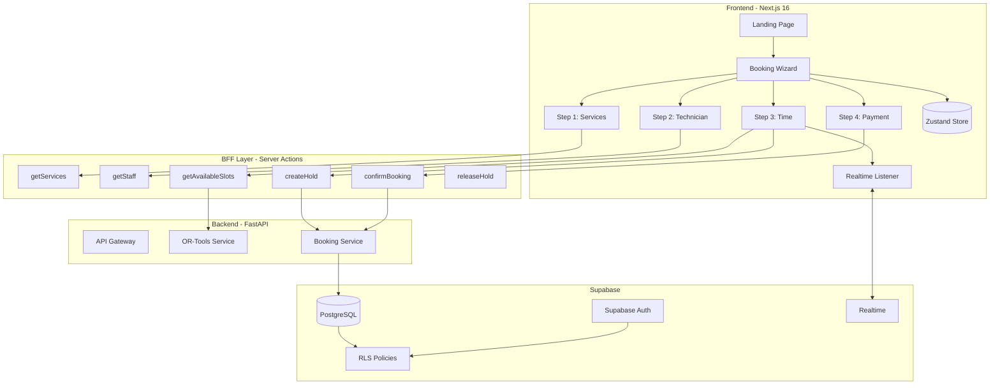
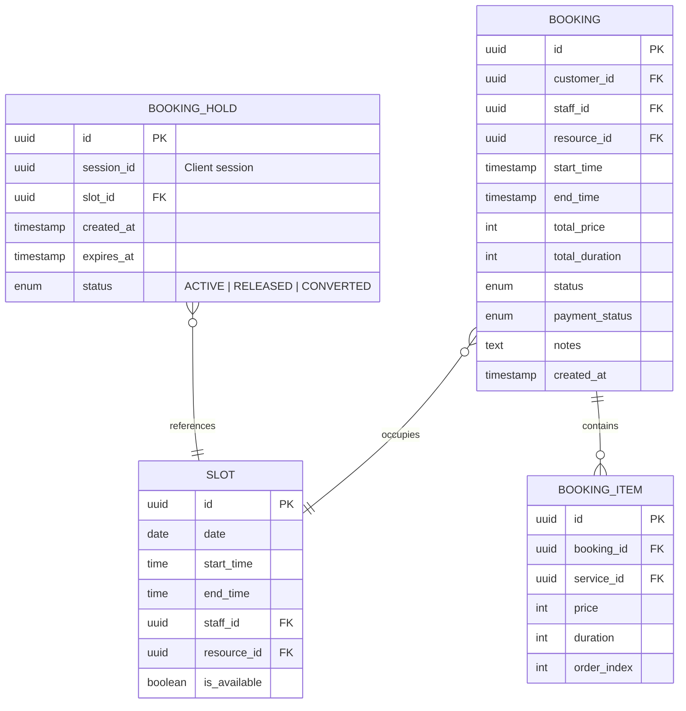

# Thiết kế Hệ thống & Kiến trúc: Booking Wizard

## Tổng quan Kiến trúc

**Cấu trúc hệ thống cấp cao**

### Biểu đồ Kiến trúc Tổng thể



### Các thành phần chính

| Thành phần | Trách nhiệm | Công nghệ |
|-----------|-------------|-----------|
| **Booking Wizard UI** | Render 4 bước, quản lý navigation, validation | Next.js, shadcn/ui |
| **Zustand Store** | Persist booking state qua các bước, localStorage backup | Zustand + Persist |
| **Server Actions** | BFF layer, gọi Backend, xử lý errors | Next.js Server Actions |
| **OR-Tools Service** | Tính toán slot khả dụng dựa trên constraints | FastAPI + google-ortools |
| **Booking Service** | CRUD bookings, hold management, conflict check | FastAPI + SQLModel |
| **Supabase Realtime** | Broadcast hold events, sync slot availability | Supabase Realtime Channels |

### Lựa chọn công nghệ & Lý do

| Công nghệ | Lý do lựa chọn |
|-----------|----------------|
| **Zustand** | Lightweight, persist middleware, không cần context |
| **Server Actions** | Bảo mật API key, giảm bundle size client |
| **Supabase Realtime** | Built-in với Supabase, low-latency broadcast |
| **OR-Tools** | Google-backed, proven cho scheduling problems |

---

## Mô hình Dữ liệu

**Chúng ta cần quản lý dữ liệu gì?**

### Entities & Relationships



### Schema mới cần tạo

```sql
-- Table: booking_holds (Giữ chỗ tạm thời)
CREATE TABLE booking_holds (
    id UUID PRIMARY KEY DEFAULT gen_random_uuid(),
    session_id TEXT NOT NULL,
    staff_id UUID REFERENCES staff(id),
    resource_id UUID REFERENCES resources(id),
    slot_date DATE NOT NULL,
    slot_start TIME NOT NULL,
    slot_end TIME NOT NULL,
    total_duration INT NOT NULL, -- phút
    created_at TIMESTAMPTZ DEFAULT NOW(),
    expires_at TIMESTAMPTZ NOT NULL,
    status TEXT DEFAULT 'ACTIVE' CHECK (status IN ('ACTIVE', 'RELEASED', 'CONVERTED')),

    UNIQUE(staff_id, slot_date, slot_start, status) -- Prevent double hold
);

-- RLS Policy: Any authenticated can create, only owner can release
ALTER TABLE booking_holds ENABLE ROW LEVEL SECURITY;

CREATE POLICY "Anyone can view active holds" ON booking_holds
    FOR SELECT USING (status = 'ACTIVE');

CREATE POLICY "Session owner can manage" ON booking_holds
    FOR ALL USING (session_id = current_setting('request.session_id', true));

-- Index for fast lookup
CREATE INDEX idx_holds_active ON booking_holds(staff_id, slot_date, status)
    WHERE status = 'ACTIVE';

-- Supabase Realtime: Enable
ALTER PUBLICATION supabase_realtime ADD TABLE booking_holds;
```

### Luồng dữ liệu

```
[User chọn Service]
    → Zustand: { selectedServices: [...] }

[User chọn KTV]
    → Zustand: { staffId: '...' | 'any' }

[User chọn Slot]
    → Server Action: createHold(sessionId, staffId, slotDate, slotStart)
    → Database: INSERT booking_holds
    → Supabase Realtime: BROADCAST to channel "booking_holds"
    → Other Clients: Receive event, disable slot in UI

[User confirm booking]
    → Server Action: confirmBooking(holdId, paymentInfo)
    → Database:
        1. UPDATE booking_holds SET status = 'CONVERTED'
        2. INSERT bookings
        3. INSERT booking_items
    → Supabase Realtime: BROADCAST slot unavailable
```

---

## Thiết kế API

**Các thành phần giao tiếp như thế nào?**

### Server Actions (BFF Layer)

```typescript
// frontend/src/features/booking-wizard/actions.ts

/**
 * Lấy danh sách dịch vụ theo danh mục
 */
export async function getServicesForBooking(categoryId?: string): Promise<ActionResponse<ServiceItem[]>>

/**
 * Lấy danh sách KTV khả dụng cho dịch vụ đã chọn
 */
export async function getAvailableStaff(params: {
    serviceIds: string[];
    date?: Date;
}): Promise<ActionResponse<StaffItem[]>>

/**
 * Lấy slot khả dụng từ OR-Tools
 */
export async function getAvailableSlots(params: {
    serviceIds: string[];
    staffId: string | 'any';
    dateRange: { start: Date; end: Date };
}): Promise<ActionResponse<TimeSlot[]>>

/**
 * Tạo hold cho slot
 */
export async function createSlotHold(params: {
    sessionId: string;
    staffId: string;
    resourceId?: string;
    slotDate: Date;
    slotStart: string; // "HH:mm"
    totalDuration: number;
}): Promise<ActionResponse<{ holdId: string; expiresAt: Date }>>

/**
 * Giải phóng hold (user quay lại bước trước)
 */
export async function releaseSlotHold(holdId: string): Promise<ActionResponse<void>>

/**
 * Xác nhận booking
 */
export async function confirmBooking(params: {
    holdId: string;
    customerInfo: CustomerInfo;
    paymentMethod: 'COD' | 'ONLINE';
    notes?: string;
}): Promise<ActionResponse<{ bookingId: string; confirmationCode: string }>>
```

### Backend API Endpoints (FastAPI)

| Method | Endpoint | Mô tả |
|--------|----------|-------|
| GET | `/api/v1/services/booking` | Danh sách services cho booking UI |
| GET | `/api/v1/staff/available` | KTV khả dụng theo service + date |
| POST | `/api/v1/slots/calculate` | OR-Tools tính slot khả dụng |
| POST | `/api/v1/holds` | Tạo temporary hold |
| DELETE | `/api/v1/holds/{id}` | Release hold |
| POST | `/api/v1/bookings` | Confirm booking |

### Định dạng Request/Response

```typescript
// Request: Calculate Slots
interface CalculateSlotsRequest {
    service_ids: string[];
    staff_id: string | null; // null = any
    date_start: string; // ISO date
    date_end: string;
    buffer_minutes: number; // Thời gian đệm giữa các booking
}

// Response: Available Slots
interface CalculateSlotsResponse {
    slots: {
        date: string;
        staff_id: string;
        staff_name: string;
        resource_id?: string;
        start_time: string; // "HH:mm"
        end_time: string;
        is_held: boolean; // true nếu đang bị hold bởi session khác
    }[];
    total_duration: number;
    total_price: number;
}
```

### Xác thực & Ủy quyền

| Endpoint | Auth Required | RLS |
|----------|---------------|-----|
| Services/Staff | ❌ Public | N/A |
| Calculate Slots | ❌ Public | N/A |
| Create Hold | ⚠️ Session ID | session_id match |
| Confirm Booking | ⚠️ Session ID + Customer Info | Validate phone OTP (optional) |

---

## Phân rã Thành phần

**Các khối xây dựng chính**

### Frontend Components (FSD Structure)

```
frontend/src/features/booking-wizard/
├── index.ts                    # Public API exports
├── types.ts                    # TypeScript interfaces
├── schemas.ts                  # Zod validation schemas
├── actions.ts                  # Server Actions
├── constants.ts                # UI constants, step config
│
├── components/
│   ├── booking-wizard.tsx      # Main Wizard container
│   ├── wizard-header.tsx       # Progress bar + back button
│   ├── wizard-footer.tsx       # CTA buttons (fixed bottom)
│   │
│   ├── step-services/
│   │   ├── services-step.tsx   # Step 1 container
│   │   ├── category-tabs.tsx   # Horizontal scroll tabs
│   │   ├── service-list.tsx    # Service cards list
│   │   ├── service-card.tsx    # Individual service card
│   │   └── floating-summary.tsx # Bottom bar: count + total
│   │
│   ├── step-technician/
│   │   ├── technician-step.tsx # Step 2 container
│   │   ├── any-option.tsx      # "Bất kỳ KTV" option
│   │   └── staff-list.tsx      # Staff cards with availability
│   │
│   ├── step-time/
│   │   ├── time-step.tsx       # Step 3 container
│   │   ├── date-picker.tsx     # Horizontal date selector
│   │   ├── time-slots.tsx      # Slot grid by period
│   │   ├── slot-button.tsx     # Individual slot button
│   │   └── hold-timer.tsx      # Countdown timer component
│   │
│   ├── step-payment/
│   │   ├── payment-step.tsx    # Step 4 container
│   │   ├── booking-summary.tsx # Summary card
│   │   ├── customer-form.tsx   # Name, phone, email
│   │   └── payment-methods.tsx # COD / Online options
│   │
│   └── shared/
│       ├── step-indicator.tsx  # Progress dots/numbers
│       └── loading-skeleton.tsx
│
├── hooks/
│   ├── use-booking-store.ts    # Zustand store
│   ├── use-slot-realtime.ts    # Supabase realtime subscription
│   └── use-hold-timer.ts       # Countdown logic
│
└── lib/
    ├── format-price.ts         # VND formatting
    └── session-id.ts           # Generate/persist session ID
```

### Zustand Store Design

```typescript
// hooks/use-booking-store.ts
interface BookingState {
    // Step 1
    selectedServices: ServiceItem[];

    // Step 2
    staffId: string | 'any' | null;

    // Step 3
    selectedDate: Date | null;
    selectedSlot: TimeSlot | null;
    holdId: string | null;
    holdExpiresAt: Date | null;

    // Step 4
    customerInfo: CustomerInfo | null;
    paymentMethod: 'COD' | 'ONLINE' | null;

    // Navigation
    currentStep: 1 | 2 | 3 | 4;

    // Actions
    addService: (service: ServiceItem) => void;
    removeService: (serviceId: string) => void;
    setStaff: (staffId: string | 'any') => void;
    setSlot: (date: Date, slot: TimeSlot, holdId: string, expiresAt: Date) => void;
    clearHold: () => void;
    setCustomerInfo: (info: CustomerInfo) => void;
    setPaymentMethod: (method: 'COD' | 'ONLINE') => void;
    goToStep: (step: 1 | 2 | 3 | 4) => void;
    reset: () => void;

    // Computed
    totalPrice: number;
    totalDuration: number;
    canProceedToStep: (step: number) => boolean;
}
```

### Backend Modules

```
backend/src/modules/
├── booking_wizard/              # NEW MODULE
│   ├── __init__.py
│   ├── router.py                # API endpoints
│   ├── service.py               # Business logic
│   ├── schemas.py               # Pydantic models
│   ├── models.py                # SQLModel entities
│   └── ortools_solver.py        # OR-Tools integration
│
├── services/                    # EXISTING - reuse
├── staff/                       # EXISTING - reuse
└── appointments/                # EXISTING - extend for bookings
```

---

## Các Quyết định Thiết kế

**Tại sao chúng ta chọn cách tiếp cận này?**

### Quyết định 1: Zustand thay vì URL State cho Wizard

| Lựa chọn | Pros | Cons |
|----------|------|------|
| URL State | Bookmark-able, SSR-friendly | Complex for multi-step data |
| **Zustand + Persist** ✅ | Simple, localStorage backup, fast | Không bookmark được |
| React Context | Built-in | Prop drilling, re-render issues |

**Quyết định**: Zustand với persist middleware. Lý do: Wizard data phức tạp (arrays, nested objects); persist giúp recover nếu app crash.

### Quyết định 2: Server Actions thay vì API Routes

**Quyết định**: Server Actions cho tất cả mutations + data fetching.
- ✅ Type-safe end-to-end
- ✅ Không expose API endpoints
- ✅ Automatic error handling với try/catch
- ✅ Revalidation built-in

### Quyết định 3: Session-based Hold thay vì User-based

**Quyết định**: Dùng `sessionId` (UUID lưu localStorage) thay vì yêu cầu login.
- ✅ Guest Checkout không cần auth
- ✅ Mỗi tab/session độc lập
- ⚠️ Trade-off: User không thể resume booking từ device khác

### Quyết định 4: Realtime Broadcast vs Polling

| Lựa chọn | Latency | Complexity | Cost |
|----------|---------|------------|------|
| Polling (5s) | 5s delay | Low | High (nhiều requests) |
| **Supabase Realtime** ✅ | ~100ms | Medium | Low (websocket) |
| Server-Sent Events | ~100ms | High | Medium |

**Quyết định**: Supabase Realtime. Lý do: Built-in với Supabase, low-latency, dễ integrate.

---

## Yêu cầu Phi chức năng

**Hệ thống nên hoạt động như thế nào?**

### Mục tiêu Hiệu suất

| Metric | Target | Notes |
|--------|--------|-------|
| LCP (Largest Contentful Paint) | ≤ 2.5s | Step 1 service list |
| Time to Interactive | ≤ 3s | All steps |
| Slot Calculation (OR-Tools) | ≤ 1s | Backend response time |
| Realtime Latency | ≤ 500ms | Hold event broadcast |

### Cân nhắc Khả năng mở rộng

- **Concurrent Holds**: Supabase Realtime hỗ trợ ~200 concurrent connections/project (free tier). Upgrade nếu cần.
- **OR-Tools Performance**: Cache kết quả tính toán theo (date, staffId, totalDuration) key.
- **Database**: Index on `booking_holds(staff_id, slot_date, status)`.

### Yêu cầu Bảo mật

| Concern | Mitigation |
|---------|------------|
| Session Hijacking | UUID v4 session ID, httpOnly cookie |
| DoS via Hold Spam | Rate limiting: max 3 active holds/session |
| OTP Bypass | Validate OTP trước khi confirm (optional) |
| Data Exposure | RLS policies, no sensitive data in client |

### Độ tin cậy

- **Hold Expiration**: Cronjob/Edge Function chạy mỗi phút để cleanup expired holds.
- **Network Failure**: Optimistic UI với retry logic.
- **Conflict Resolution**: Last-write-wins với real-time sync.

