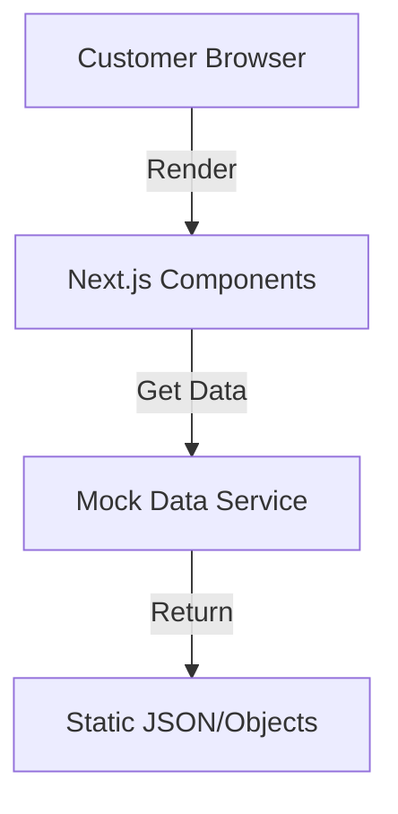

# Thiết kế Hệ thống & Kiến trúc

## Tổng quan Kiến trúc
**Cấu trúc hệ thống cấp cao là gì?**

- **Chiến lược**: Frontend First. Xây dựng toàn bộ UI và Logic hiển thị trước, sử dụng Mock Data để mô phỏng Backend.
- **Frontend**: Next.js App Router.
- **Data Layer**: Tạm thời sử dụng Mock Service (file TS) thay vì gọi API thực.



## Mô hình Dữ liệu (TypeScript Interfaces)
**Chúng ta cần quản lý dữ liệu gì?**

- **User**:
    ```typescript
    interface User {
      id: string;
      fullName: string;
      email: string;
      phone: string;
      avatarUrl?: string;
    }
    ```
- **Appointment (Lịch hẹn)**:
    ```typescript
    type AppointmentStatus = 'PENDING' | 'CONFIRMED' | 'COMPLETED' | 'CANCELLED' | 'NO_SHOW';
    interface Appointment {
      id: string;
      serviceName: string; // Mock: tên dịch vụ
      startTime: string; // ISO String
      status: AppointmentStatus;
      location?: string; // Tên phòng hoặc chi nhánh
    }
    ```
- **Treatment/Package (Liệu trình)**:
    ```typescript
    type TreatmentStatus = 'ACTIVE' | 'COMPLETED' | 'EXPIRED';
    interface Treatment {
      id: string;
      packageName: string;
      totalSessions: number;
      usedSessions: number;
      status: TreatmentStatus;
      expiryDate?: string;
    }
    ```

## Thiết kế Mock API
**Các thành phần giao tiếp như thế nào?**

- Tạo file `src/features/customer-dashboard/services/mock-api.ts`:
    - `getUserProfile(): Promise<User>`
    - `getAppointments(): Promise<Appointment[]>`
    - `getTreatments(): Promise<Treatment[]>`
    - `updateUserProfile(data: Partial<User>): Promise<User>`

## Phân rã Thành phần
**Các khối xây dựng chính là gì?**

- **Layout**: `app/(dashboard)/layout.tsx` (Sidebar, Header).
- **Pages**:
    - `app/(dashboard)/page.tsx` (Overview).
    - `app/(dashboard)/appointments/page.tsx`.
    - `app/(dashboard)/treatments/page.tsx`.
    - `app/(dashboard)/profile/page.tsx`.
- **Components**:
    - `AppointmentList`, `AppointmentItem`.
    - `TreatmentGrid`, `TreatmentCard`.
    - `ProfileForm`.

## Các Quyết định Thiết kế
**Tại sao chúng ta chọn cách tiếp cận này?**

- **Frontend First**: Giúp chốt sớm giao diện và trải nghiệm người dùng (UX) mà không bị chặn bởi Backend.
- **Mock Data**: Dễ dàng kiểm soát các trường hợp biên (empty, error, many items) để test UI.

## Yêu cầu Phi chức năng
- **Responsive**: Mobile First.
- **Aesthetics**: Sử dụng Shadcn UI và Tailwind để đảm bảo giao diện đẹp, hiện đại.
