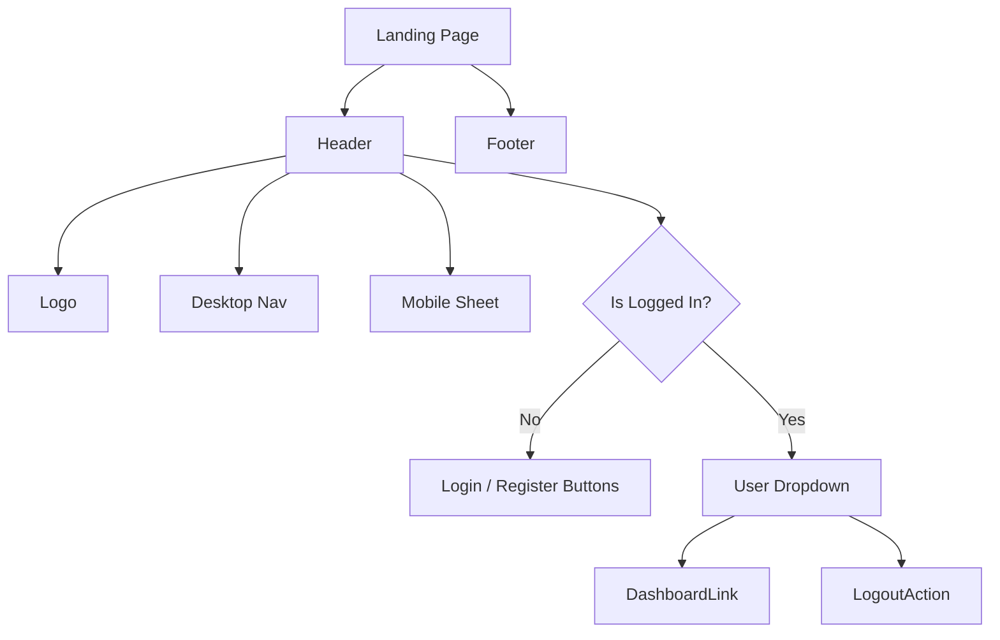

# Landing Page UI Design

## 1. Architecture Overview
- **Components**:
    - `Header` (`frontend/src/shared/ui/custom/header.tsx`): Component điều hướng chính.
    - `Footer` (`frontend/src/shared/ui/custom/footer.tsx`): Component thông tin chân trang.
    - `LandingLayout` (hoặc tích hợp trực tiếp vào `page.tsx`): Layout bao bọc nội dung trang chủ.
- **State Management**:
    - Sử dụng `useAuth` (hoặc check session từ server component) để xác định trạng thái đăng nhập.

## 2. Data Model & Schema Changes
- Không có thay đổi về Database.

## 3. API Design
- Không có API mới.
- Header cần truy cập thông tin User (nếu đã đăng nhập) từ Auth Context hoặc Session.

## 4. Component Design
### Header
- **Layout**: Flexbox (`justify-between`).
- **Left**: Logo (Text "Synapse" hoặc Image).
- **Center**: Navigation Links (Home, Features, Pricing, About). Ẩn trên Mobile.
- **Right**:
    - **Guest**: Button "Đăng nhập" (Ghost variant), Button "Đăng ký" (Primary variant).
    - **Logged In**: User Dropdown (Avatar, Name, Link to Dashboard, Logout).
- **Mobile**: Hamburger menu (Sheet component của Shadcn) chứa Navigation Links.

### Footer
- **Layout**: Grid (4 cột trên Desktop, 1 cột trên Mobile).
- **Content**:
    - Col 1: Logo & Tagline.
    - Col 2: Product Links.
    - Col 3: Company/Legal Links.
    - Col 4: Social Icons.

## 5. Design Decisions
- **Styling**: Sử dụng Tailwind CSS, tuân thủ Design System hiện tại (font, màu sắc).
- **Reference**: Lấy cảm hứng từ MoniApp (clean, whitespace, rounded buttons).
- **Icons**: Lucide React.

## 6. Security & Performance
- **Performance**: Header/Footer là Server Components (nếu có thể) hoặc Client Components tối ưu.
- **Security**: Không hiển thị thông tin nhạy cảm trên Header.
