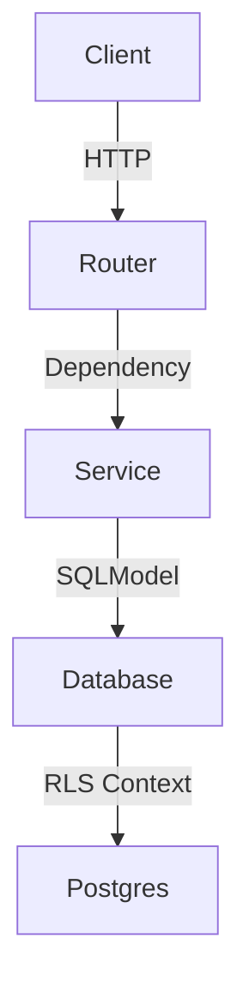

# Thiết kế Hệ thống & Kiến trúc

## Tổng quan Kiến trúc
**Cấu trúc hệ thống cấp cao là gì?**

Tuân thủ Vertical Slice Architecture:

- **Router**: Chỉ xử lý HTTP (Request/Response), gọi Service.
- **Service**: Chứa Business Logic, gọi DB. Được inject vào Router.
- **Common**: Chỉ chứa hạ tầng (DB config, Security utils).

## Mô hình Dữ liệu
**Chúng ta cần quản lý dữ liệu gì?**

- Giữ nguyên Schema hiện tại của `User`.
- Cập nhật `models.py` để sử dụng `datetime.now(timezone.utc)` thay vì `utcnow`.
- Cập nhật `schemas.py` để dùng `ConfigDict`.

## Thiết kế API
**Các thành phần giao tiếp như thế nào?**

- **Dependency Injection**:
    - `get_db_session`: Inject User Claims vào Session.
    - `UserService`: Inject `AsyncSession` vào constructor.
    - Router: Inject `UserService`.

## Phân rã Thành phần
**Các khối xây dựng chính là gì?**

1.  **`src/app/dependencies.py`**:
    - Tạo mới.
    - Chứa `get_db_session` với logic RLS.

2.  **`src/common/database.py`**:
    - Xóa `get_session` cũ (hoặc cập nhật nó để dùng logic mới, nhưng tốt nhất là chuyển sang `dependencies.py` hoặc giữ ở `common` nhưng thêm logic RLS).
    - *Quyết định*: Theo `backend.md`, `dependencies.py` chứa "Global Dependencies (Auth, RLS Injection)". Vậy `get_db_session` nên nằm ở `src/app/dependencies.py` hoặc `src/common/dependencies.py`. Cấu trúc mẫu ghi `src/app/dependencies.py`.

3.  **`src/modules/users`**:
    - `service.py`: Class `UserService`.
    - `router.py`: Refactor để dùng `UserService`.

4.  **`src/app/main.py`**:
    - Thêm `app.add_exception_handler`.

## Các Quyết định Thiết kế
**Tại sao chúng ta chọn cách tiếp cận này?**

- **RLS Injection**: Bắt buộc để bảo mật dữ liệu đa người dùng (Multi-tenancy) trên Supabase.
- **Service Layer**: Tách biệt logic khỏi HTTP handler giúp dễ test và tái sử dụng.

## Yêu cầu Phi chức năng
**Hệ thống nên hoạt động như thế nào?**

- **Bảo mật**: Mọi query DB đều phải chạy trong context của user (trừ các query system/public).
