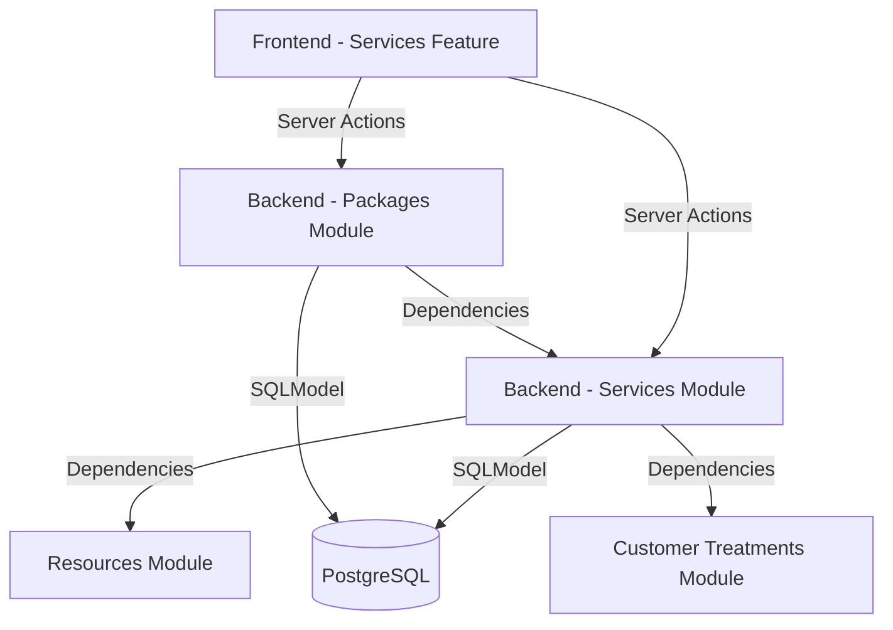

# Thiết kế Tính năng: Quản lý Dịch vụ (MVP)

## Kiến trúc Hệ thống
Hệ thống tuân thủ Modular Monolith (Backend) và FSD (Frontend).

## Mô hình Dữ liệu

### Cập nhật Schema Database
- **Bảng `services`**: Thêm trường `is_package` (bool), `total_sessions` (int, mặc định 1).
- **Bảng `service_resource_requirements`**: Đã tồn tại, API cần xử lý CRUD đồng bộ khi lưu Service.
- **Bảng `service_skills`**: Liên kết Service với các Skill ID hiện có.
- **Bảng `service_packages`**: Lưu thông tin định danh gói (tên, giá tổng, thời hạn).
- **Bảng `package_services`**: Liên kết N-N giữa Gói và Dịch vụ đơn lẻ (kèm số lượng buổi).

### Mối quan hệ thực thể
- `Service` 1 -> N `ServiceResourceRequirement` -> 1 `ResourceGroup`.
- `Service` 1 -> N `ServiceSkill` -> 1 `Skill`.
- `ServicePackage` 1 -> N `PackageService` -> 1 `Service`.

## Thiết kế API (Backend)

### Service Management
- `POST /services/`: Hỗ trợ thêm `resource_requirements` trong payload.
- `PATCH /services/{id}`: Cập nhật thông tin cơ bản và yêu cầu tài nguyên.
- `GET /services/`: Trả về chi tiết bao gồm cả tài nguyên và kỹ năng.

### Package Management (New)
- `POST /packages/`: Tạo gói combo gồm danh sách dịch vụ và số buổi.
- `GET /packages/`: Lấy danh sách gói kèm chi tiết dịch vụ bên trong.

### Resource Requirements (Internal logic)
- Tự động xóa cũ - thêm mới (Sync) tài nguyên yêu cầu khi cập nhật service.

## Phân rã Thành phần (Frontend)

### Components
1. **ServiceForm**: Cập nhật Tabs.
    - **General**: Thêm `is_package`, `total_sessions`.
    - **Resources**: Component mới để chọn Resource Groups và số lượng.
    - **Skills**: Giữ nguyên hoặc tối ưu logic Smart Tagging.
2. **ResourceRequirementSelect**: Component dùng chung để chọn nhóm tài nguyên.

### Server Actions
- `createServiceAction`, `updateServiceAction`: Cập nhật để gửi kèm dữ liệu tài nguyên.

## Các Quyết định Thiết kế
- **Atomic Sync**: Khi cập nhật resources hoặc skills, thực hiện xóa toàn bộ liên kết cũ và chèn lại bộ mới trong một Transaction để đảm bảo tính nhất quán.
- **Data Protection**: Thêm kiểm tra ở tầng Service để ngăn xóa `ResourceGroup` hoặc `Skill` nếu chúng đang được ít nhất một `Service` yêu cầu.
- **Manual Mapping**: UI cung cấp Multi-select để chọn kỹ năng và tài nguyên, không tự động sinh dữ liệu mới để Admin kiểm soát chặt chẽ danh mục.

## Bảo mật & Hiệu suất
- **RLS**: Đảm bảo chỉ Admin mới có quyền sửa đổi schema dịch vụ.
- **Validation**: Pydantic V2 trên Backend để chặn dữ liệu rác (ví dụ: duration <= 0).
