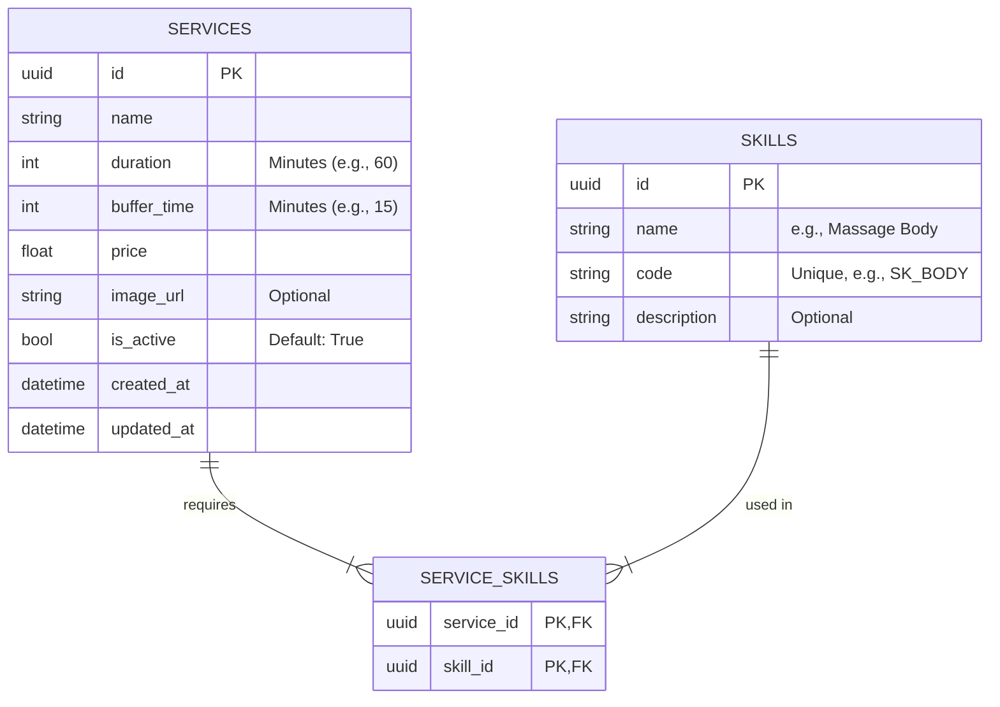

# Thiết Kế Tính Năng: Quản lý Dịch vụ Spa

## 1. Kiến trúc Hệ thống
Sử dụng kiến trúc **Modular Monolith**. Tạo một module mới tên là `services` trong Backend.
- **Backend**: `src/modules/services/`
- **Frontend**: `src/features/services/` (Admin Dashboard)

## 2. Mô hình Dữ liệu (Database Schema)

Sử dụng `SQLModel` (SQLAlchemy + Pydantic).



## 3. API Design (RESTful)

### 3.1. Skills API
- `GET /api/v1/services/skills`: Lấy danh sách kỹ năng.
- `POST /api/v1/services/skills`: Tạo kỹ năng mới.
    - Body: `{ name: str, code: str, description: str | None }`
- `PUT /api/v1/services/skills/{id}`: Cập nhật kỹ năng.
- `DELETE /api/v1/services/skills/{id}`: Xóa kỹ năng.

### 3.2. Services API
- `GET /api/v1/services`: Lấy danh sách dịch vụ (có filter `is_active`).
- `GET /api/v1/services/{id}`: Lấy chi tiết dịch vụ (kèm danh sách skills).
- `POST /api/v1/services`: Tạo dịch vụ mới.
    - Body:
      ```json
      {
        "name": "Massage Body",
        "duration": 60,
        "buffer_time": 15,
        "price": 500000,
        "skill_ids": ["uuid-1", "uuid-2"]
      }
      ```
- `PUT /api/v1/services/{id}`: Cập nhật dịch vụ.
- `DELETE /api/v1/services/{id}`: Soft delete hoặc Hard delete (ưu tiên Soft delete bằng `is_active=False`).

## 4. Thành phần Frontend (Next.js)

### Routes
- `/admin/services`: Danh sách dịch vụ (Table).
- `/admin/services/new`: Form tạo dịch vụ.
- `/admin/services/[id]`: Form chỉnh sửa.
- `/admin/skills`: Quản lý kỹ năng (Modal hoặc Page riêng).

### Components
- `ServiceTable`: Hiển thị danh sách, cột: Tên, Thời gian (Total), Giá, Trạng thái.
- `ServiceForm`: Form nhập liệu, sử dụng `react-hook-form` + `zod`.
    - Field `skill_ids`: Multi-select dropdown.
- `SkillManager`: UI đơn giản để thêm/sửa/xóa Skill.

## 5. Bảo mật
- Chỉ user có role `manager` hoặc `admin` mới được phép thực hiện các thao tác CUD (Create, Update, Delete).
- `GET` có thể public hoặc cho `authenticated` user tùy chính sách (hiện tại cho phép public để khách xem menu).
