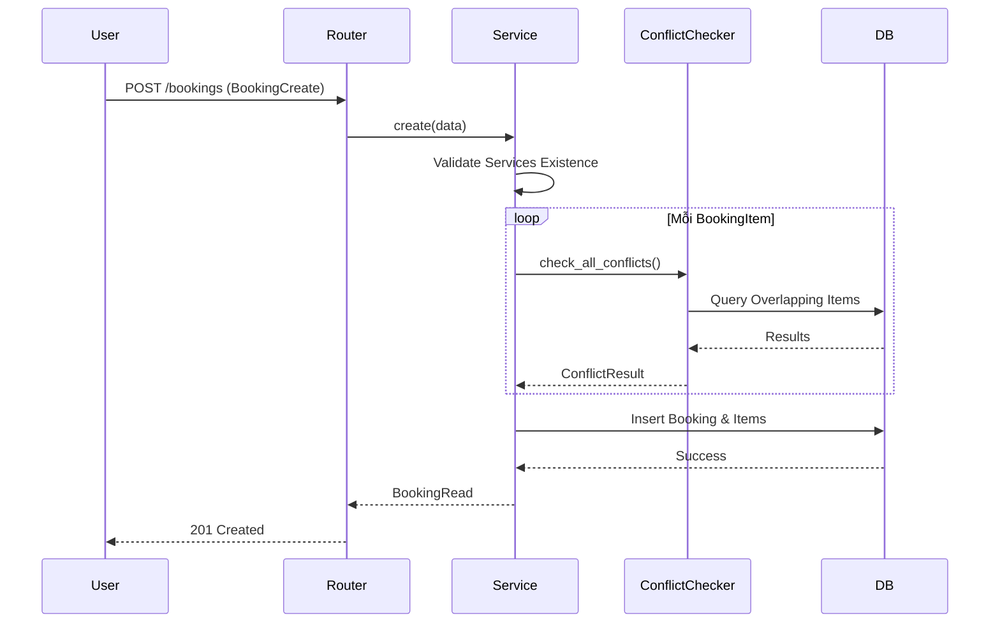

# Knowledge: Bookings Module (backend/src/modules/bookings)

## Tổng Quan (Overview)
Module **Bookings** là trung tâm điều khiển của hệ thống Synapse CRM, chịu trách nhiệm quản lý toàn bộ vòng đời của lịch hẹn khách hàng. Đây là module phức tạp nhất, kết nối thông tin giữa Khách hàng, Nhân viên (KTV), Dịch vụ và Tài nguyên (Phòng/Máy).

- **Mục đích**: Quản lý lịch hẹn, kiểm tra xung đột tài nguyên và tích hợp với bộ giải lập lịch thông minh (RCPSP).
- **Ngôn ngữ**: Python 3.12+ (FastAPI, SQLModel).
- **Trạng thái**: Đã triển khai các chức năng CRUD cơ bản và logic kiểm tra xung đột nâng cao.

## Chi Tiết Triển Khai (Implementation Details)

### 1. Mô Hình Dữ Liệu (Deep Data Models)
Tách biệt giữa thực thể "Lịch hẹn" và "Dịch vụ trong lịch hẹn":
- **`Booking`**: Đại diện cho một lần khách đến Spa. Bao gồm thông tin khách hàng, ghi chú tổng, tổng tiền và trạng thái lifecycle.
- **`BookingItem`**: Đại diện cho một Activity cụ thể. Đây là đơn vị nhỏ nhất để lập lịch, bao gồm thời gian thực hiện, KTV đảm nhận và phòng/máy sử dụng.

### 2. Vòng Đời Lịch Hẹn (Lifecycle Management)
Trạng thái của `Booking` tuân theo luồng nghiêm ngặt:
1.  **`PENDING`**: Lịch mới tạo, chờ xác nhận.
2.  **`CONFIRMED`**: Đã xác nhận giữ chỗ.
3.  **`IN_PROGRESS`**: Khách đã check-in và đang thực hiện dịch vụ.
4.  **`COMPLETED`**: Kết thúc dịch vụ, sẵn sàng thanh toán.
5.  **`CANCELLED`**: Hủy lịch (yêu cầu lý do).
6.  **`NO_SHOW`**: Khách không đến đúng hẹn.

### 3. Logic Kiểm Tra Xung Đột (Core Conflict Engine)
Tọa lạc tại `conflict_checker.py`, engine này đảm bảo tính toàn vẹn của lịch trình:
- **Nguyên tắc chồng chéo**: `new_start < existing_end AND new_end > existing_start`.
- **Xung đột KTV**: Kiểm tra xem KTV có bị gán 2 việc cùng lúc không.
- **Xung đột Tài nguyên**: Kiểm tra phòng/máy có bị Double Booking không.
- **Xung đột Ca làm việc**: Kiểm tra thời gian đặt lịch có nằm trong ca làm việc (`Shift`) của KTV hay không (Giai đoạn 2).

### 4. Service Pattern
`BookingService` thực hiện Encapsulation hoàn toàn:
- Sử dụng `selectinload` để tải trước (Eager Load) các `BookingItem` nhằm tránh lỗi `MissingGreenlet` trong môi trường Async.
- Tự động tính toán lại `total_price` và `start_time`/`end_time` của `Booking` mỗi khi items thay đổi.

## Phụ Thuộc (Dependencies)

### Nội bộ (Internal)
- `src.modules.users`: Thông tin Khách hàng (`User`).
- `src.modules.staff`: Thông tin Kỹ thuật viên (`Staff`).
- `src.modules.services`: Thông tin Dịch vụ (`Service`).
- `src.modules.resources`: Thông tin Phòng/Máy (`Resource`).
- `src.common.database`: Cung cấp Session đã inject RLS context.

### Bên ngoài (External)
- `FastAPI`: Framework web.
- `SQLModel / SQLAlchemy`: ORM xử lý database.
- `Pydantic V2`: Data validation và Serialization.

## Biểu Đồ Luồng (Flow Diagrams)

### Quy trình Tạo Lịch Hẹn

## Thông Tin Bổ Sung (Additional Information)

### Bảo mật (Security)
- Toàn bộ truy vấn SQL qua SQLAlchemy đều chịu sự chi phối của **Row Level Security (RLS)** thông qua việc inject `auth.uid()` vào session context.
- Chỉ người tạo hoặc Admin/Receptionist mới có quyền can thiệp vào Booking.

### Hiệu năng (Performance)
- Đưa logic kiểm tra xung đột về SQL query (`EXISTS`) để đảm bảo tốc độ khi số lượng booking tăng cao.
- Sử dụng `flush()` để lấy ID trước khi commit, giúp giảm số lượng transaction round-trip.

## Siêu Dữ Liệu (Metadata)
- **Ngày thu thập**: 2025-12-18
- **Phiên bản**: 1.0
- **Tệp phân tích**: `models.py`, `schemas.py`, `service.py`, `conflict_checker.py`, `router.py`, `__init__.py`.

## Các Bước Tiếp Theo (Next Steps)
1.  **Tích hợp Realtime**: Sử dụng Supabase Realtime để thông báo cho Lễ tân khi có lịch hẹn mới.
2.  **Audit Log**: Ghi lại lịch sử thay đổi trạng thái (ai thay đổi, lúc nào).
3.  **Tự động gán tài nguyên**: Sử dụng module `scheduling` để tự động điền `staff_id` và `resource_id` cho các booking ở trạng thái `PENDING`.
