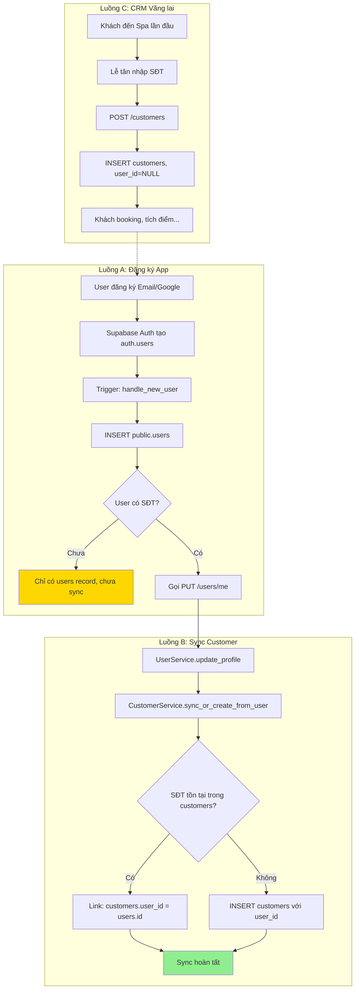

# Knowledge: Customer-User Sync Architecture

> **Điểm nhập phân tích:** `UserService.update_profile` và `CustomerService`
> **Ngày phân tích:** 2025-12-25
> **Độ sâu:** Toàn bộ luồng end-to-end

---

## Tổng quan

### Vấn đề Kinh doanh
Hệ thống Synapse Spa CRM vận hành theo mô hình **Hybrid**:
- **Khách vãng lai:** Đến Spa trực tiếp, Lễ tân nhập SĐT vào CRM.
- **Khách App:** Đăng ký/đăng nhập qua Google hoặc Email, có thể chưa từng đến Spa.

Thách thức: Làm sao để 2 nhóm khách này có thể được **hợp nhất thành 1 profile duy nhất** khi có điểm chung (SĐT)?

### Giải pháp: Lazy Sync & Identity Resolution via Phone

**Nguyên tắc cốt lõi:**
1. **Số điện thoại (SĐT)** là khóa định danh duy nhất xuyên suốt hệ thống.
2. **Sync xảy ra lazily** — Chỉ khi User chủ động cập nhật SĐT, không sync ngay khi đăng ký.
3. **Bảng `customers` là Master Data** — Mọi nghiệp vụ CRM (tích điểm, lịch sử, ghi chú y tế) đều dựa vào bảng này.

---

## Chi tiết Triển khai

### Data Model

```
┌─────────────────────────────────────────────────────────────────┐
│                        auth.users                               │
│  (Supabase Auth - Quản lý đăng nhập)                            │
│  ├── id (UUID, PK)                                              │
│  ├── email                                                      │
│  └── raw_user_meta_data (JSON: full_name, avatar_url, role)     │
└──────────────────────────┬──────────────────────────────────────┘
                           │ Trigger: handle_new_user
                           ▼
┌─────────────────────────────────────────────────────────────────┐
│                      public.users                               │
│  (App Account - Profile cơ bản)                                 │
│  ├── id (UUID, PK, FK → auth.users.id)                          │
│  ├── email                                                      │
│  ├── full_name                                                  │
│  ├── phone_number (NULLABLE)  ◄──── Key for sync                │
│  ├── role (manager/receptionist/technician/customer)            │
│  └── is_active                                                  │
└──────────────────────────┬──────────────────────────────────────┘
                           │ API: PUT /users/me {phone_number}
                           │ Logic: sync_or_create_from_user()
                           ▼
┌─────────────────────────────────────────────────────────────────┐
│                     public.customers                            │
│  (CRM Profile - Nghiệp vụ Spa)                                  │
│  ├── id (UUID, PK)                                              │
│  ├── phone_number (NOT NULL, UNIQUE) ◄── Business Key           │
│  ├── full_name                                                  │
│  ├── email                                                      │
│  ├── user_id (NULLABLE, FK → users.id) ◄── Link to App Account  │
│  ├── loyalty_points                                             │
│  ├── membership_tier                                            │
│  ├── allergies, medical_notes                                   │
│  └── preferred_staff_id                                         │
└─────────────────────────────────────────────────────────────────┘
```

### Luồng Dữ liệu (Data Flow)



---

## Dependencies

### Backend Modules

| Module | File | Vai trò |
|--------|------|---------|
| `users` | `service.py` | Quản lý App Account, trigger sync |
| `customers` | `service.py` | Quản lý CRM Profile, execute sync |
| `common` | `database.py` | Cung cấp async session |

### Database Triggers

| Trigger | Bảng | Hành động |
|---------|------|-----------|
| `on_auth_user_created` | `auth.users` | INSERT → `public.users` |

### External Systems

- **Supabase Auth:** Quản lý đăng nhập, cấp JWT token.
- **Google OAuth:** Provider cho social login.

---

## Edge Cases & Error Handling

| Tình huống | Xử lý |
|------------|-------|
| User A và User B cùng nhập 1 SĐT | Chỉ User đầu tiên được link. User sau sẽ không thể tạo mới (SĐT trùng) |
| User cập nhật SĐT mới (đã có Customer khác link) | Không thay đổi Customer cũ. Có thể cần logic đặc biệt nếu muốn "chuyển" account |
| Lễ tân tạo Customer, sau đó khách tải App + nhập đúng SĐT | Link thành công, khách thấy lịch sử cũ |
| Transaction fail giữa 2 bảng | Rollback tự động (dùng chung session) |

---

## Security & Performance

### Security
- **RLS:** Bảng `customers` nên có policy chỉ cho phép user đọc record có `user_id = auth.uid()`.
- **Phone Verification (Roadmap):** Thêm OTP xác thực SĐT trước khi link để tránh chiếm account.

### Performance
- **Index:** `customers.phone_number` đã có UNIQUE INDEX.
- **No N+1:** Sync logic chỉ query 1 lần (get_by_phone).

---

## Roadmap Nâng cấp

| Giai đoạn | Tính năng |
|-----------|-----------|
| MVP (Hiện tại) | Sync khi update phone, không bắt buộc xác thực |
| Phase 2 | Thêm OTP xác thực SĐT qua SMS trước khi link |
| Phase 3 | Bi-directional sync: Update customer cũng update user |
| Phase 4 | Merge duplicate customers (admin tool) |

---

## Metadata

| Key | Value |
|-----|-------|
| Ngày phân tích | 2025-12-25 |
| Entry Points | `UserService.update_profile`, `CustomerService.sync_or_create_from_user` |
| Files đã phân tích | users/service.py, customers/service.py, customers/models.py, users/models.py |
| Độ sâu dependency | 3 |

---

## Các bước Tiếp theo

1. Triển khai code theo implementation_plan.md
2. Test thủ công các luồng A, B, C
3. Commit với message: `feat(customers): implement lazy sync with users via phone`
4. Capture knowledge tiếp cho module `bookings` nếu cần hiểu luồng đặt lịch
