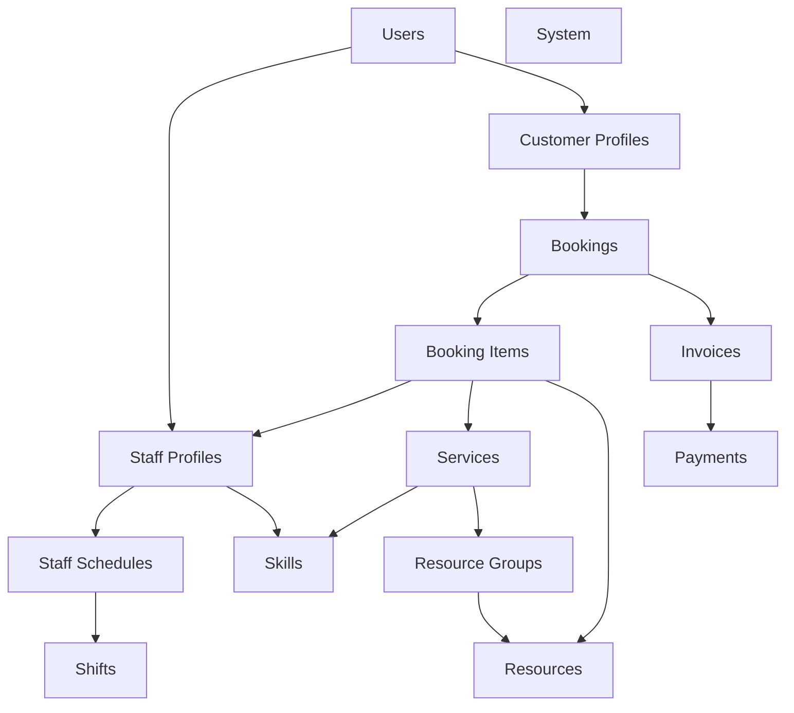

# Tổng quan về Dữ liệu Synapse

Tài liệu này cung cấp cái nhìn tổng quan về kiến trúc dữ liệu và thiết kế cơ sở dữ liệu của hệ thống Synapse, dựa trên tài liệu thiết kế phiên bản 2.1.

## 1. Tổng quan Kiến trúc

Hệ thống sử dụng cơ sở dữ liệu **PostgreSQL** trên nền tảng **Supabase**. Thiết kế tuân theo mô hình **Modular Monolith**, với dữ liệu được tổ chức thành các module nghiệp vụ rõ ràng nhưng vẫn duy trì sự liên kết chặt chẽ thông qua các khóa ngoại.

*   **Phiên bản thiết kế**: 2.1
*   **Công nghệ**: PostgreSQL 14+, Supabase extensions (`uuid-ossp`, `pg_trgm`).
*   **Nguyên tắc cốt lõi**:
    *   **Bảo mật**: Áp dụng Row Level Security (RLS) triệt để.
    *   **Toàn vẹn**: Sử dụng mạnh mẽ các ràng buộc (`FOREIGN KEY`, `CHECK`, `UNIQUE`, `ENUM`).
    *   **Hiệu năng**: Tối ưu hóa Index cho các truy vấn phổ biến (đặc biệt là lịch hẹn và tìm kiếm).
    *   **An toàn dữ liệu**: Sử dụng Soft Delete (`deleted_at`) cho các dữ liệu quan trọng.

## 2. Các Module Dữ liệu Chính

Hệ thống bao gồm 11 module nghiệp vụ với tổng cộng 24 bảng:

### 2.1. Quản lý Người dùng (Users Module)
Module lõi quản lý định danh và hồ sơ chi tiết.
*   **`users`**: Bảng trung tâm lưu trữ tài khoản (Auth ID, email, role). Sử dụng cơ chế kế thừa thông tin cho các loại người dùng cụ thể.
*   **`staff_profiles`**: Thông tin mở rộng cho nhân viên (chức danh, hoa hồng, màu hiển thị). Quan hệ 1-1 với `users`.
*   **`customer_profiles`**: Thông tin mở rộng cho khách hàng (hạng thành viên, điểm tích lũy, tiền sử y tế). Quan hệ 1-1 với `users`.
*   *Điểm đặc biệt*: Phân tách rõ ràng giữa *Auth/Identity* (`users`) và *Profile* (`staff`/`customer`).

### 2.2. Dịch vụ (Services Module)
Quản lý danh mục sản phẩm/dịch vụ của Spa.
*   **`services`**: Dịch vụ cụ thể (giá, thời lượng).
*   **`service_categories`**: Phân loại dịch vụ.
*   **`service_required_skills`**: Định nghĩa yêu cầu kỹ năng cho từng dịch vụ (liên kết N-N với Skills).
*   **`service_resource_requirements`**: Định nghĩa yêu cầu tài nguyên (phòng/máy) cho từng dịch vụ.

### 2.3. Lịch hẹn (Bookings Module) - Module Phức tạp nhất
Trái tim của hệ thống CRM.
*   **`bookings`**: Thông tin tổng quan của một lần đặt hẹn (khách hàng, thời gian tổng, trạng thái, giá).
*   **`booking_items`**: Chi tiết từng dịch vụ trong buổi hẹn. Đây là nơi xảy ra các logic phân bổ tài nguyên:
    *   Gán Nhân viên (`staff_id`)
    *   Gán Tài nguyên (`resource_id`)
    *   Gán Dịch vụ (`service_id`) hoặc Liệu trình (`treatment_id`)
*   *Logic nghiệp vụ*: Kiểm tra xung đột dựa trên `booking_items` (Staff/Resource không thể ở 2 nơi cùng lúc).

### 2.4. Lịch làm việc & Phân ca (Scheduling Module)
Quản lý khả năng cung ứng dịch vụ.
*   **`shifts`**: Định nghĩa các ca làm việc (Sáng, Chiều, Tối).
*   **`staff_schedules`**: Phân công nhân viên vào các ca làm việc theo ngày.

### 2.5. Tài nguyên (Resources Module)
Quản lý cơ sở vật chất.
*   **`resource_groups`**: Nhóm tài nguyên (Phòng đơn, Phòng đôi, Máy triệt lông...).
*   **`resources`**: Các đơn vị tài nguyên vật lý cụ thể.

### 2.6. Kinh doanh & Tiếp thị (Packages & Treatments)
*   **`service_packages`**: Gói dịch vụ bán trước (Combo).
*   **`customer_treatments`**: Theo dõi việc sử dụng liệu trình của khách hàng (số buổi còn lại, hạn sử dụng).

### 2.7. Tài chính (Billing Module)
*   **`invoices`**: Hóa đơn (liên kết 1-1 với Booking).
*   **`payments`**: Giao dịch thanh toán (hỗ trợ thanh toán nhiều lần/split payment).

## 3. Các Cơ chế Kỹ thuật Quan trọng

### 3.1. Row Level Security (RLS)
Hệ thống không dựa hoàn toàn vào ứng dụng để bảo mật mà áp dụng chính sách ngay tại tầng Database:
*   **Khách hàng**: Chỉ xem được hồ sơ và lịch hẹn của chính mình.
*   **Nhân viên**: Xem được thông tin cần thiết để phục vụ.
*   **Hàm hỗ trợ**: `auth.uid()`, `auth.role()`, `auth.is_staff()` được định nghĩa sẵn trong DB để đơn giản hóa việc viết Policy.

### 3.2. Ràng buộc Toàn vẹn (Data Integrity)
Dữ liệu được bảo vệ chặt chẽ bằng các Constraints:
*   **Thời gian**: `end_time > start_time`.
*   **Giá trị**: `price >= 0`, `commission_rate` từ 0-100.
*   **Trạng thái**: Sử dụng `ENUM` cho tất cả các cột trạng thái (booking status, payment method...).

### 3.3. Tối ưu Hiệu năng
Index được đánh trọng tâm vào các truy vấn tìm kiếm và kiểm tra xung đột:
*   Tìm kiếm xung đột lịch: `(staff_id, start_time, end_time)`, `(resource_id, start_time, end_time)`.
*   Truy vấn lịch làm việc: `(staff_id, work_date)`.
*   Trạng thái đơn hàng: Partial index cho `status = 'PENDING'` (truy vấn danh sách chờ duyệt nhanh hơn).

## 4. Biểu đồ Quan hệ (Tóm tắt)

## 5. Lưu ý cho Nhà phát triển

1.  **Khi truy vấn Booking**: Luôn nhớ `bookings` chỉ là vỏ bọc, chi tiết thực sự về ai làm gì, ở đâu nằm trong `booking_items`.
2.  **Khi thêm dữ liệu mẫu**: Phải tuân thủ các ràng buộc `CHECK` (ví dụ: thời gian kết thúc phải lớn hơn bắt đầu), nếu không DB sẽ từ chối.
3.  **Xử lý xóa**: Các bảng chính (`users`, `services`, `resources`) dùng Soft Delete (`deleted_at`). Cần filter `WHERE deleted_at IS NULL` khi query thủ công (nếu không dùng ORM hỗ trợ).
4.  **Bảo mật**: Khi viết API mới, hãy kiểm tra xem RLS policy hiện tại có cho phép user truy cập dữ liệu đó không.

## Tài liệu tham khảo
*   Chi tiết thiết kế: `docs/design/database_design.md`
*   Đặc tả dữ liệu: `docs/design/data_specification.md`
