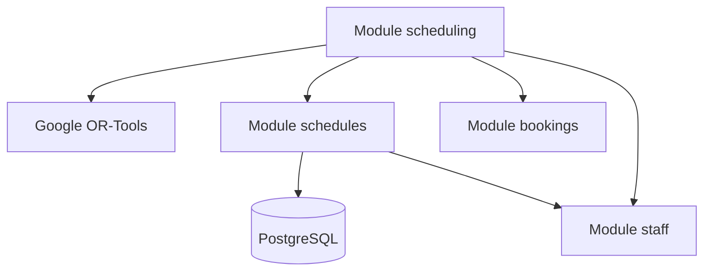

# Kiến thức Hệ thống Lập lịch (Schedules & Scheduling)

## 1. Tổng quan
Hệ thống lập lịch của Synapse được chia thành hai module riêng biệt nhưng có mối quan hệ cộng sinh chặt chẽ:
- **`schedules`**: Quản lý "Khung thời gian" (Xác định ai có mặt lúc nào).
- **`scheduling_engine`**: Quản lý "Phân bổ công việc" (Xác định ai làm việc gì cho khách nào).

Sự tách biệt này giúp hệ thống vừa linh hoạt trong việc quản lý ca làm việc (Shift management), vừa mạnh mẽ trong việc tối ưu hóa vận hành (Optimization).

## 2. Chi tiết Triển khai

### 2.1. Module `schedules` (Drafting & Persistence)
Module này tập trung vào các thao tác CRUD và quản lý trạng thái lịch làm việc của nhân viên.

- **Thực thể chính**:
    - `Shift`: Định nghĩa các ca làm việc mẫu (ví dụ: Ca sáng 8h-14h).
    - `StaffSchedule`: Bản ghi cụ thể gán một nhân viên vào một ca trong một ngày cụ thể. Có trạng thái `DRAFT` và `PUBLISHED`.
- **Logic quan trọng**:
    - `get_staff_availability`: Trả về danh sách các `TimeSlot` mà nhân viên đó có mặt dựa trên các lịch đã `PUBLISHED`. Đây là hàm cầu nối quan trọng cho bộ giải (Solver).
    - `bulk_create`: Cho phép lên lịch nhanh cho nhiều nhân viên trong nhiều ngày.

### 2.2. Module `scheduling_engine` (Optimization Engine)
Đây là module chứa logic học thuật phức tạp nhất của dự án, giải quyết bài toán RCPSP (Resource-Constrained Project Scheduling Problem).

- **Công nghệ**: Google OR-Tools (CP-SAT Solver).
- **Quy trình xử lý**:
    1. **Data Extraction**: `DataExtractor` thu thập dữ liệu về Booking cần gán, KTV có mặt (từ module `schedules`), Skills của KTV, và Resources (Phòng/Máy).
    2. **Model Building**: `SpaSolver.build_model` thiết lập các biến Boolean và các ràng buộc (Constraints).
    3. **Solving**: Giải bài toán với giới hạn thời gian (mặc định 30 giây).
    4. **Metric Calculation**: Tính toán hiệu quả của giải pháp (Utilization, Jain Fairness Index).

- **Các ràng buộc (Constraints)**:
    - **Cứng (Hard)**: Không chồng chéo lịch (NoOverlap) cho cả KTV và Phòng; KTV phải có đủ Skill; Phòng phải đúng loại; KTV phải đang trong ca làm việc.
    - **Mềm (Soft)**: Ưu tiên gán đúng KTV mà khách hàng yêu cầu (Preferred Staff).

## 3. Phụ thuộc (Dependencies)

## 4. Các chỉ số đánh giá (Solution Metrics)
Hệ thống sử dụng các chỉ số học thuật để đánh giá lịch hẹn:
- **Jain Fairness Index**: Đảm bảo công việc được chia đều cho các KTV (tránh người làm quá nhiều, người không có việc).
- **Utilization**: Tỷ lệ sử dụng tài nguyên (KTV và Phòng).
- **Preference Satisfaction**: Tỷ lệ đáp ứng yêu cầu đích danh KTV của khách hàng.

## 5. Siêu dữ liệu (Metadata)
- **Ngày phân tích**: 2025-12-19
- **Độ sâu phân tích**: Logic thực thi & Cấu trúc dữ liệu.
- **Tệp liên quan**:
    - `backend/src/modules/schedules/service.py`
    - `backend/src/modules/scheduling_engine/solver.py`
    - `backend/src/modules/scheduling_engine/models.py`

## 6. Các bước tiếp theo
- **Tối ưu hóa**: Cải thiện hàm mục tiêu (Objective Function) để cân bằng tốt hơn giữa `Fairness` và `Utilization`.
- **Tính năng mới**: Thêm logic "Travel Time" nếu Spa có nhiều chi nhánh hoặc diện tích quá lớn cần thời gian di chuyển giữa các phòng.
