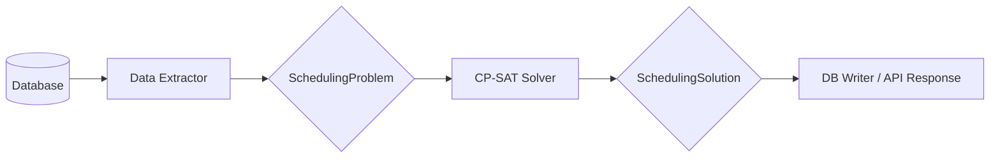

# Knowledge: Cơ chế Lập lịch Thông minh (Scheduling Engine)

**Điểm nhập:** `backend/src/modules/scheduling_engine`
**Loại:** Core Module / Algorithmic Engine
**Trạng thái:** MVP (Core Constraints Implemented)

## 1. Tổng quan
Scheduling Engine là "trái tim" thông minh của hệ thống Synapse, chịu trách nhiệm tự động hóa việc phân bổ nhân viên (Technical Staff) và tài nguyên (Phòng, Máy móc) cho các yêu cầu đặt lịch (Bookings). Thay vì sử dụng các thuật toán Heuristic đơn giản (như First-Come-First-Served), module này sử dụng mô hình toán học **Constraint Satisfaction Problem (CSP)** để tìm ra giải pháp tối ưu.

## 2. Kiến trúc & Luồng dữ liệu

Module hoạt động theo mô hình Pipeline 3 bước:

### 2.1. Các thành phần chính
1.  **Data Extractor (`data_extractor.py`)**:
    -   Chịu trách nhiệm trích xuất dữ liệu thô từ Database (SQL).
    -   Chuyển đổi thành cấu trúc dữ liệu bài toán chuyên biệt (`SchedulingProblem`).
    -   Lọc dữ liệu rác, xử lý các quan hệ (Join tables).

2.  **Solver (`solver.py`)**:
    -   Sử dụng thư viện **Google OR-Tools** (CP-SAT).
    -   Biến đổi `SchedulingProblem` thành các biến số (Variables) và ràng buộc (Constraints) toán học.
    -   Tìm kiếm nghiệm tối ưu hoặc khả thi trong không gian giải pháp.

3.  **Evaluator (`evaluator.py`)**:
    -   Đánh giá chất lượng của một lịch (Manual hoặc Auto).
    -   Tính toán các chỉ số KPI: Utilization (Tỷ lệ lấp đầy), Fairness (Độ công bằng), Preference Match (Đúng sở thích).

## 3. Lý thuyết Toán học & Cài đặt

Bài toán được mô hình hóa dưới dạng **RCPSP (Resource-Constrained Project Scheduling Problem)** với các biến thể cho ngành dịch vụ.

### 3.1. Các Ràng buộc (Constraints) đã cài đặt

| Mã | Tên Ràng buộc | Trạng thái | Logic Cài đặt (OR-Tools) |
|:---|:---|:---|:---|
| **H01** | **Assignment Completeness** | ✅ Hoàn thành | `model.AddExactlyOne(...)`: Mỗi Booking Item phải được gán, và chỉ gán 1 lần. |
| **H02** | **Staff No-Overlap** | ✅ Hoàn thành | `model.AddNoOverlap(intervals)`: Một nhân viên không làm 2 việc cùng lúc. |
| **H03** | **Resource No-Overlap** | ✅ Hoàn thành | `model.AddNoOverlap(intervals)`: Một phòng/máy không phục vụ 2 khách cùng lúc. |
| **H04** | **Skill Matching** | ✅ Hoàn thành | Lọc trước miền giá trị (Domain Filtering): Chỉ tạo biến gán cho nhân viên có Skill phù hợp. |
| **H05** | **Shift Constraint** | ✅ Hoàn thành | Kiểm tra thời gian Booking nằm trong ca làm việc (`StartShift <= StartBooking` và `EndBooking <= EndShift`). |
| **H09** | **Existing Conflicts** | ✅ Hoàn thành | Loại bỏ các khoảng thời gian đã có Booking cũ (Confirmed) khỏi miền khả dụng. |

### 3.2. Hàm Mục tiêu (Objective Function)
Hiện tại, Solver đang tối ưu hóa dựa trên:
$$ Minimize \sum (Penalty_{Preference}) $$
-   **Preference Penalty**: Phạt 10 điểm nếu gán nhân viên không đúng sở thích của khách (Preferred Staff).

## 4. Hướng dẫn Demo & Đánh giá

### 4.1. Chuẩn bị Dữ liệu Demo
Để demo hiệu quả, cần setup dữ liệu mẫu phong phú:
1.  **Create Staff**: Tạo 3 nhân viên (A, B, C) với các Skill khác nhau (VD: A giỏi Massage, B giỏi Facial, C giỏi cả hai).
2.  **Create Shifts**: Phân ca làm việc (A: Sáng, B: Chiều, C: Full).
3.  **Create Resources**: Tạo 2 giường (Bed 1, Bed 2).
4.  **Create Bookings**: Tạo 5-10 Booking ở trạng thái `PENDING` chồng chéo nhau về thời gian.

### 4.2. Kịch bản Demo (Scenario)
**Tình huống:** Có 3 khách đặt lịch lúc 10:00 AM, nhưng chỉ có 2 giường.
1.  **Gọi API:** `POST /scheduling/solve` với `target_date`.
2.  **Kết quả mong đợi:**
    -   Hệ thống trả về `FEASIBLE` hoặc `OPTIMAL`.
    -   2 Booking được xếp vào 10:00 AM (Bed 1, Bed 2).
    -   Booking thứ 3 bị đẩy sang khung giờ khác (nếu cho phép dời giờ) hoặc báo lỗi (nếu cố định giờ).
    -   **Lưu ý:** Hiện tại Solver đang giải bài toán "Assign Staff/Resource cho giờ cố định". Nếu trùng giờ mà hết tài nguyên, nó sẽ trả về `INFEASIBLE`.

### 4.3. Cách đánh giá Hiệu quả
Sử dụng API `POST /scheduling/evaluate` để so sánh:
1.  **Manual Schedule:** Lấy lịch hiện tại do con người tạo. Ghi lại các chỉ số (Utilization, Fairness).
2.  **Optimized Schedule:** Chạy Solver.
3.  **So sánh:** Chứng minh rằng Solver cho ra:
    -   **Utilization cao hơn:** Lấp đầy các khoảng trống nhỏ.
    -   **Fairness tốt hơn:** Phân chia việc đều hơn (thông qua chỉ số Jain Index).
    -   **Time:** Tốc độ xử lý (< 500ms so với con người mất 5-10 phút).

## 5. Các hạn chế & Hướng cải thiện (Future Work)
Đây là các điểm quan trọng cần nêu rõ trong Khóa luận (Limitations):

1.  **Single Resource Assignment:** Hiện tại Solver chỉ hỗ trợ gán **1 Tài nguyên** cho mỗi Booking Item. Các dịch vụ phức tạp cần combo (Giường + Máy) chưa được hỗ trợ tối ưu đa chiều.
    -   *Giải pháp:* Cần nâng cấp mô hình biến số thành `x[item, staff, resource1, resource2]`.
2.  **Objective Function Đơn giản:** Chưa đưa metrics "Load Balancing" vào trực tiếp hàm mục tiêu (chỉ tính sau khi giải).
    -   *Giải pháp:* Thêm biến `deviations` vào hàm mục tiêu để Solver chủ động cân bằng tải.
3.  **Rescheduling Strategy:** Chưa cài đặt thuật toán "Minimal Perturbation" (Xáo trộn tối thiểu). Hiện tại khi chạy lại, lịch có thể bị thay đổi hoàn toàn.

## 6. Kết luận
Scheduling Engine đã hoàn thành các chức năng cốt lõi (Core Constraints) để đảm bảo không bị trùng lịch và tuân thủ nghiệp vụ Spa. Đây là nền tảng vững chắc để phát triển các tính năng nâng cao tiếp theo.
