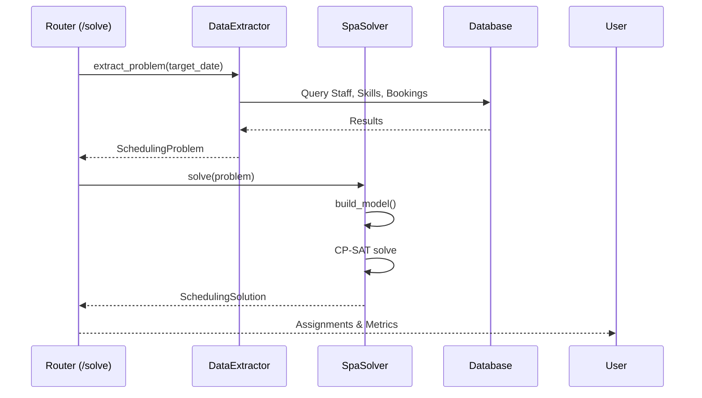

# Knowledge: Scheduling Module (Tối ưu hóa Lập lịch)

## Tổng quan (Overview)
Module `scheduling` là thành phần cốt lõi xử lý logic lập lịch thông minh cho hệ thống Synapse. Đây là một triển khai của bài toán **RCPSP (Resource-Constrained Project Scheduling Problem)**, giúp tự động gán KTV (Staff) và Phòng (Resource) cho các dịch vụ khách hàng yêu cầu, đảm bảo tối ưu hóa tài nguyên và trải nghiệm người dùng.

- **Ngôn ngữ:** Python 3.12+ (FastAPI).
- **Công nghệ chính:** Google OR-Tools (CP-SAT Solver), SQLModel (SQLAlchemy).
- **Vị trí:** `backend/src/modules/scheduling`.

## Chi tiết Triển khai (Implementation Details)

### 1. Kiến trúc Thành phần (Modular Monolith)
Module được chia thành 4 lớp logic rõ ràng:
- **Models (`models.py`):** Định nghĩa các DTO (Pydantic) cho bài toán (`SchedulingProblem`) và kết quả (`SchedulingSolution`).
- **Data Extractor (`data_extractor.py`):** Chịu trách nhiệm trích xuất dữ liệu từ các module khác (Staff, Service, Booking) sang mô hình toán học trung gian.
- **Solver (`solver.py`):** "Lõi" tối ưu hóa sử dụng CP-SAT để tìm lời giải cho bài toán phân bổ.
- **Evaluator (`evaluator.py`):** Cung cấp các chỉ số đánh giá chất lượng (Metrics) và so sánh giữa phương án thủ công (Manual) với phương án tối ưu.

### 2. Mô hình CP-SAT (Constraint Programming)
Lớp `SpaSolver` triển khai mô hình CP-SAT với các thành phần:
- **Variables:** Biến Boolean `assign[item, staff, resource]` (1 nếu gán, 0 nếu không).
- **Intervals:** Các biến `OptionalFixedSizeIntervalVar` đại diện cho khoảng thời gian item chiếm dụng Staff/Resource.
- **Ràng buộc cứng (Hard Constraints):**
    - `AddExactlyOne`: Mỗi dịch vụ phải được gán cho đúng một cặp (Staff, Resource).
    - `AddNoOverlap`: Đảm bảo một Staff/Resource không thực hiện 2 dịch vụ cùng lúc.
    - **Skill Match:** Staff phải có `skill_id` cần thiết cho service.
    - **Schedule Match:** Staff phải đang trong ca làm việc (`shifts`).
- **Hàm mục tiêu (Objective):** Minimize penalty (Ưu tiên KTV yêu thích của khách hàng).

### 3. Chỉ số Đánh giá (Metrics)
Sử dụng các công thức đo lường hiệu quả:
- **Jain's Fairness Index:** Đo mức độ công bằng trong phân bổ khối lượng công việc cho nhân viên.
- **Utilization Rate:** Hiệu suất sử dụng thời gian của KTV và Phòng máy.
- **Improvement calculation:** So sánh sự chênh lệch giữa lịch do Lễ tân tự gán và lịch do AI đề xuất.

## Luồng thực thi (Execution Flow)

## Phụ thuộc (Dependencies)

### Nội bộ Module
- `DataExtractor` -> `SchedulingProblem`
- `SpaSolver` -> `SchedulingProblem`, `SchedulingSolution`
- `ScheduleEvaluator` -> `SolutionMetrics`

### Bên ngoài Module
- **Tables:** `booking_items`, `staff`, `resources`, `service_skills`, `shifts`.
- **Infrastructure:** `src.common.database` (get_db_session).
- **Libraries:** `ortools.sat.python`, `sqlmodel`, `pydantic`.

## Siêu dữ liệu (Metadata)
- **Ngày phân tích:** 2025-12-18
- **Độ sâu:** 100% (Mọi tệp trong module)
- **Tình trạng:** Sẵn sàng cho Phase 4 - Tối ưu hóa nâng cao.

## Các bước Tiếp theo (Next Steps)
1.  **Mở rộng Objective:** Thêm logic phân bổ đều (Load Balancing) trực tiếp vào hàm mục tiêu của Solver (hiện tại tính sau khi giải).
2.  **Real-time suggestions:** Tích hợp API `/suggestions` vào giao diện đặt lịch của Lễ tân.
3.  **Buffer time:** Thêm logic khoảng nghỉ (buffer minutes) giữa các dịch vụ để giảm áp lực cho KTV.
