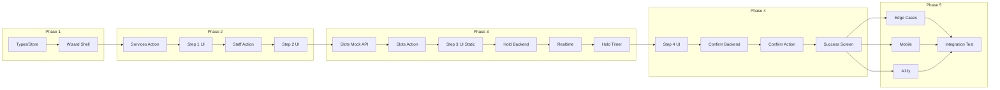

# Lập kế hoạch Dự án & Phân rã Nhiệm vụ: Booking Wizard

## Các Mốc quan trọng

**Các điểm kiểm tra chính**

| Milestone | Mô tả | Target | Status |
|-----------|-------|--------|--------|
| M1 | **Foundation Setup** - Cấu trúc FSD, types, store | 2 ngày | ⬜ |
| M2 | **Step 1-2 UI** - Services + Technician selection | 3 ngày | ⬜ |
| M3 | **Step 3 + Realtime** - Time selection + Hold system | 4 ngày | ⬜ |
| M4 | **Step 4 + Confirm** - Payment + Booking completion | 3 ngày | ⬜ |
| M5 | **Polish & Testing** - Bug fixes, edge cases, UX polish | 2 ngày | ⬜ |

**Tổng thời gian ước tính: 14 ngày (2 tuần)**

---

## Phân rã Nhiệm vụ

**Công việc cụ thể nào cần được thực hiện?**

### Phase 1: Foundation (M1) - 2 ngày

#### Nhiệm vụ 1.1: Khởi tạo Feature Structure
- [x] Tạo thư mục `frontend/src/features/booking-wizard/`
- [x] Tạo `index.ts` với public exports
- [x] Tạo `types.ts` với interfaces (ServiceItem, StaffItem, TimeSlot, BookingState, etc.)
- [x] Tạo `constants.ts` với STEP_CONFIG, HOLD_DURATION, etc.
- [x] Tạo `schemas.ts` với Zod validation schemas

**Deliverable**: Feature folder với type definitions hoàn chỉnh.

#### Nhiệm vụ 1.2: Zustand Store Setup
- [x] Tạo `hooks/use-booking-store.ts`
- [x] Implement state: selectedServices, staffId, selectedSlot, etc.
- [x] Implement actions: addService, setStaff, setSlot, reset, etc.
- [x] Cấu hình persist middleware (localStorage)
- [x] Tạo `lib/session-id.ts` để generate/persist session UUID

**Deliverable**: Zustand store hoạt động với persist.

#### Nhiệm vụ 1.3: Wizard Shell UI
- [x] Tạo `components/booking-wizard.tsx` - Main container
- [x] Tạo `components/wizard-header.tsx` - Progress indicator + back button
- [x] Tạo `components/wizard-footer.tsx` - Fixed bottom CTA
- [x] Tạo `components/shared/step-indicator.tsx` - Progress dots
- [x] Tạo route `/booking` (page.tsx) với Wizard component

**Deliverable**: Wizard UI skeleton với step navigation.

---

### Phase 2: Services & Technician Steps (M2) - 3 ngày

#### Nhiệm vụ 2.1: Server Actions - Services
- [x] Tạo `actions.ts` với `getServicesForBooking()`
- [x] Fetch từ existing services module hoặc mock data
- [x] Return grouped by category

**Deliverable**: Action lấy danh sách services.

#### Nhiệm vụ 2.2: Step 1 - Services UI
- [x] Tạo `components/step-services/services-step.tsx`
- [x] Tạo `components/step-services/category-tabs.tsx` - Horizontal scroll tabs
- [x] Tạo `components/step-services/service-list.tsx` - Virtualized list
- [x] Tạo `components/step-services/service-card.tsx` - Selectable card
- [x] Tạo `components/step-services/floating-summary.tsx` - Bottom bar
- [x] Integrate với Zustand store (add/remove service)

**Deliverable**: Step 1 hoạt động với multi-select services.

#### Nhiệm vụ 2.3: Server Actions - Staff
- [x] Tạo `getAvailableStaff()` action
- [x] Filter staff by skills matching selected services
- [x] Return với availability indicator

**Deliverable**: Action lấy danh sách KTV khả dụng.

#### Nhiệm vụ 2.4: Step 2 - Technician UI
- [x] Tạo `components/step-technician/technician-step.tsx`
- [x] Tạo `components/step-technician/any-option.tsx` - "Bất kỳ KTV" prominent
- [x] Tạo `components/step-technician/staff-list.tsx` - Staff cards
- [x] Show rating, avatar, "Có chỗ hôm nay" badge
- [x] Integrate với Zustand store

**Deliverable**: Step 2 hoạt động với staff selection.

---

### Phase 3: Time Selection + Realtime (M3) - 4 ngày

#### Nhiệm vụ 3.1: Backend - OR-Tools Slot Calculation (Mock)
- [x] Tạo mock API endpoint `/api/v1/slots/calculate`
- [ ] Return sample slots based on date + staff
- [ ] (Future: Integrate real OR-Tools)

**Deliverable**: Mock API trả về slot khả dụng.

#### Nhiệm vụ 3.2: Server Actions - Slots
- [x] Tạo `getAvailableSlots()` action
- [ ] Call backend với serviceIds, staffId, dateRange
- [ ] Parse response và return TimeSlot[]

**Deliverable**: Action lấy slots từ backend.

#### Nhiệm vụ 3.3: Step 3 - Time UI (Static)
- [x] Tạo `components/step-time/time-step.tsx`
- [x] Tạo `components/step-time/date-picker.tsx` - Horizontal date selector
- [x] Tạo `components/step-time/time-slots.tsx` - Group by Sáng/Chiều/Tối
- [x] Tạo `components/step-time/slot-button.tsx` - Available/Selected/Disabled states

**Deliverable**: Step 3 UI với date/time selection.

#### Nhiệm vụ 3.4: Backend - Hold System
- [ ] Tạo Supabase migration cho `booking_holds` table
- [ ] Tạo backend endpoints: POST /holds, DELETE /holds/{id}
- [ ] Implement hold expiration logic

**Deliverable**: Database table + API cho hold system.

#### Nhiệm vụ 3.5: Realtime Integration
- [ ] Tạo `hooks/use-slot-realtime.ts`
- [ ] Subscribe to Supabase Realtime channel `booking_holds`
- [ ] On event: Update slot availability in UI
- [ ] Tạo Server Action `createSlotHold()` và `releaseSlotHold()`

**Deliverable**: Realtime sync slot availability.

#### Nhiệm vụ 3.6: Hold Timer UI
- [x] Tạo `hooks/use-hold-timer.ts` - Countdown logic
- [x] Tạo `components/step-time/hold-timer.tsx` - Countdown display
- [x] Color coding: Green → Yellow → Red
- [x] Handle expiration: Show modal, release hold

**Deliverable**: Countdown timer với UX handling.

---

### Phase 4: Payment & Confirmation (M4) - 3 ngày

#### Nhiệm vụ 4.1: Step 4 - Payment UI
- [x] Tạo `components/step-payment/payment-step.tsx`
- [x] Tạo `components/step-payment/booking-summary.tsx` - Summary card
- [x] Tạo `components/step-payment/customer-form.tsx` - Name, Phone, Email (optional)
- [x] Tạo `components/step-payment/payment-methods.tsx` - COD / Online radio
- [x] Form validation với React Hook Form + Zod

**Deliverable**: Step 4 UI với customer info + payment selection.

#### Nhiệm vụ 4.2: Backend - Confirm Booking
- [ ] Tạo endpoint POST /bookings
- [ ] Convert hold to booking
- [ ] Insert booking + booking_items
- [ ] Generate confirmation code

**Deliverable**: API xác nhận booking.

#### Nhiệm vụ 4.3: Server Action - Confirm
- [ ] Tạo `confirmBooking()` action
- [ ] Validate holdId, customer info
- [ ] Call backend
- [ ] Return booking confirmation

**Deliverable**: Action hoàn tất booking.

#### Nhiệm vụ 4.4: Success Screen
- [x] Tạo Success component hiển thị sau confirm
- [x] Show confirmation code, booking details
- [x] CTA: "Xem Chi tiết" → Customer Dashboard (future)
- [x] CTA: "Đặt lịch tiếp" → Reset và quay lại Step 1

**Deliverable**: Booking success screen.

---

### Phase 5: Polish & Testing (M5) - 2 ngày

#### Nhiệm vụ 5.1: Edge Cases Handling
- [ ] Network error → Retry with toast
- [ ] Hold expired → Modal + re-select
- [ ] No available slots → Empty state UI
- [ ] Payment failed → Error handling

**Deliverable**: Robust error handling.

#### Nhiệm vụ 5.2: Mobile Optimization
- [ ] Test trên viewport 320px, 375px, 414px
- [ ] Ensure thumb-friendly tap targets (48px+)
- [ ] Bottom sheet optimization
- [ ] Keyboard handling cho forms

**Deliverable**: Mobile-first verified.

#### Nhiệm vụ 5.3: Accessibility
- [ ] Semantic HTML (landmarks, headings)
- [ ] ARIA labels cho interactive elements
- [ ] Focus management between steps
- [ ] Screen reader testing

**Deliverable**: A11y compliance.

#### Nhiệm vụ 5.4: Integration Testing
- [ ] Test full flow: Service → Tech → Time → Payment → Success
- [ ] Test concurrent users (2 clients same slot)
- [ ] Test hold expiration flow
- [ ] Test network failure recovery

**Deliverable**: E2E tests passed.

---

## Các Phụ thuộc

**Cái gì cần xảy ra theo thứ tự nào?**

### Dependency Graph

### Phụ thuộc bên ngoài

| Dependency | Owner | Status |
|------------|-------|--------|
| Services Module | Existing | ✅ Ready |
| Staff Module | Existing | ✅ Ready |
| OR-Tools Backend API | Backend Team | ⬜ Need Mock |
| Supabase Realtime | Supabase | ✅ Ready |
| Payment Gateway | TBD | ⬜ Mock for MVP |

---

## Thời gian & Ước tính

**Khi nào mọi thứ sẽ hoàn thành?**

| Phase | Tasks | Effort | Buffer | Total |
|-------|-------|--------|--------|-------|
| M1 Foundation | 3 | 2 days | 0.5 day | 2.5 days |
| M2 Step 1-2 | 4 | 3 days | 0.5 day | 3.5 days |
| M3 Step 3 + Realtime | 6 | 4 days | 1 day | 5 days |
| M4 Step 4 + Confirm | 4 | 3 days | 0.5 day | 3.5 days |
| M5 Polish | 4 | 2 days | 0.5 day | 2.5 days |

**Total: ~17 working days (với buffer)**

### Ngày mục tiêu

| Milestone | Target Date |
|-----------|-------------|
| M1 Complete | +2 days từ start |
| M2 Complete | +5 days |
| M3 Complete | +10 days |
| M4 Complete | +13 days |
| M5 Complete / MVP Release | +15 days |

---

## Rủi ro & Giảm thiểu

**Điều gì có thể đi sai hướng?**

### Rủi ro Kỹ thuật

| Rủi ro | Xác suất | Ảnh hưởng | Giảm thiểu |
|--------|----------|-----------|------------|
| OR-Tools API không ready | Trung bình | Cao | Mock API trước, integrate sau |
| Supabase Realtime latency | Thấp | Trung bình | Test load; fallback polling |
| Hold race conditions | Trung bình | Cao | Unique constraint + optimistic locking |
| Mobile Safari issues | Trung bình | Trung bình | Test sớm; use tested patterns |

### Rủi ro Tài nguyên

| Rủi ro | Xác suất | Ảnh hưởng | Giảm thiểu |
|--------|----------|-----------|------------|
| Backend resource conflict | Trung bình | Cao | Coordinate với Backend team |
| Scope creep | Cao | Trung bình | Strict MVP scope; track phi mục tiêu |

---

## Tài nguyên Cần thiết

**Chúng ta cần gì để thành công?**

### Nhân lực
- Frontend Developer: 1 (primary)
- Backend Developer: 0.5 (support for APIs/migrations)
- QA: 0.25 (manual testing)

### Công cụ & Dịch vụ
- [x] Next.js 16 environment
- [x] Supabase project với Realtime enabled
- [ ] OR-Tools backend container (hoặc mock)
- [ ] Device farm cho mobile testing (optional)

### Cơ sở hạ tầng
- [x] Development server
- [x] Supabase (dev project)
- [ ] Staging environment (post-MVP)

### Tài liệu/Kiến thức
- [x] `docs/UX/booking.md` - UX Research
- [x] Existing features pattern (`appointments`, `services`)
- [ ] OR-Tools API documentation
- [ ] Payment Gateway API documentation

