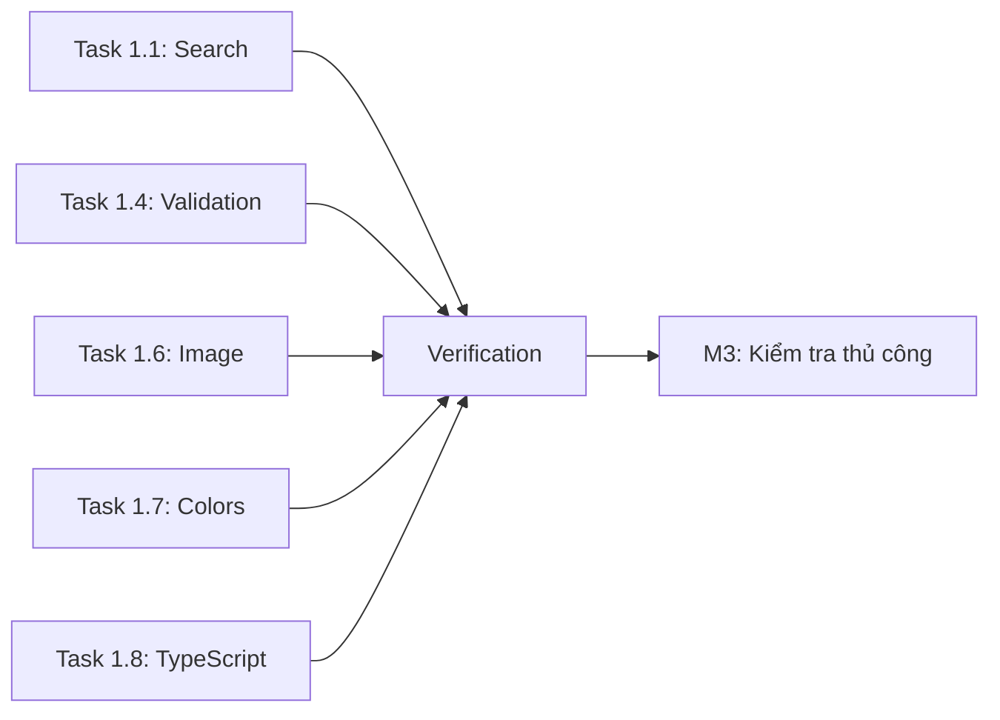

# Kế hoạch Triển khai Phase 1

> **Mục tiêu:** Đảm bảo các tính năng hiện có hoạt động đúng
> **Timeline:** 2-3 giờ
> **Độ ưu tiên:** P0 (Critical)

---

## Các Mốc Quan Trọng

- [ ] **M1:** Hoàn thành tất cả Quick Fixes (Task 1.1, 1.4, 1.6)
- [ ] **M2:** Lint & Type-check pass
- [ ] **M3:** Kiểm tra thủ công pass

---

## Phân Rã Nhiệm Vụ Chi Tiết

### 🔧 Task 1.1: Kết nối Search Input - ServicesPage
**Độ ưu tiên:** 🔴 Critical
**Ước lượng:** 30 phút
**File:** `frontend/src/features/services/components/services-page.tsx`

#### Subtasks:
- [ ] **1.1.1** Import hooks cần thiết (`useRouter`, `usePathname`, `useSearchParams`, `useTransition`)
- [ ] **1.1.2** Import `useDebouncedCallback` từ `use-debounce`
- [ ] **1.1.3** Thêm state management cho search (tương tự `customers-page.tsx`)
- [ ] **1.1.4** Implement `handleSearch` function với debounce 300ms
- [ ] **1.1.5** Kết nối `onChange` cho Input component
- [ ] **1.1.6** Truyền search query vào `getServices` action call
- [ ] **1.1.7** Kiểm tra thủ công: Gõ tìm kiếm → URL thay đổi → Danh sách filter

#### Code Reference (từ CustomersPage):
```typescript
const handleSearch = useDebouncedCallback((term: string) => {
  const params = new URLSearchParams(searchParams)
  if (term) {
    params.set("search", term)
  } else {
    params.delete("search")
  }
  params.set("page", "1")
  startTransition(() => {
    router.replace(`${pathname}?${params.toString()}`)
  })
}, 300)
```

---

### 🔧 Task 1.4: Validation Thời gian Ca làm việc
**Độ ưu tiên:** 🔴 Critical
**Ước lượng:** 20 phút
**File:** `frontend/src/features/staff/components/scheduling/shift-form.tsx`

#### Subtasks:
- [ ] **1.4.1** Thêm Zod `.refine()` validation vào schema
- [ ] **1.4.2** Thêm message lỗi tiếng Việt: "Giờ kết thúc phải sau giờ bắt đầu"
- [ ] **1.4.3** Kiểm tra thủ công: Nhập `startTime: 17:00`, `endTime: 08:00` → Hiện lỗi

#### Code Implementation:
```typescript
const formSchema = z.object({
  name: z.string().min(1, "Vui lòng nhập tên ca"),
  startTime: z.string().regex(/^([0-1]?[0-9]|2[0-3]):[0-5][0-9]$/, "Giờ không hợp lệ"),
  endTime: z.string().regex(/^([0-1]?[0-9]|2[0-3]):[0-5][0-9]$/, "Giờ không hợp lệ"),
  color: z.string(),
}).refine(
  (data) => {
    const [startH, startM] = data.startTime.split(':').map(Number);
    const [endH, endM] = data.endTime.split(':').map(Number);
    const startMinutes = startH * 60 + startM;
    const endMinutes = endH * 60 + endM;
    return endMinutes > startMinutes;
  },
  {
    message: "Giờ kết thúc phải sau giờ bắt đầu",
    path: ["endTime"],
  }
);
```

---

### 🔧 Task 1.6: Image Fallback - ServiceCard
**Độ ưu tiên:** 🟡 High
**Ước lượng:** 25 phút
**File:** `frontend/src/features/landing-page/components/service-card.tsx`

#### Subtasks:
- [ ] **1.6.1** Tạo constant cho fallback image URL
- [ ] **1.6.2** Thêm logic fallback khi `image_url` rỗng/null
- [ ] **1.6.3** Thêm `onError` handler cho `next/image`
- [ ] **1.6.4** Sử dụng `useState` để track image error state
- [ ] **1.6.5** Kiểm tra thủ công: Xóa URL ảnh trong mock → Hiện placeholder

#### Code Implementation:
```typescript
const FALLBACK_IMAGE = "/images/placeholder-service.jpg";
// Hoặc sử dụng external: "https://images.unsplash.com/photo-placeholder..."

// Trong component:
const [imgSrc, setImgSrc] = useState(service.image_url || FALLBACK_IMAGE);

<Image
  src={imgSrc}
  alt={service.name}
  fill
  onError={() => setImgSrc(FALLBACK_IMAGE)}
  // ... other props
/>
```

---

### 🔧 Task 1.7: Sửa Hardcoded Colors (Bonus)
**Độ ưu tiên:** 🟢 Medium
**Ước lượng:** 15 phút
**File:** `frontend/src/features/notifications/components/notification-popover.tsx`

#### Subtasks:
- [ ] **1.7.1** Thay `text-slate-500` → `text-muted-foreground`
- [ ] **1.7.2** Thay `text-blue-600` → `text-primary`
- [ ] **1.7.3** Thay `hover:text-slate-900` → `hover:text-foreground`
- [ ] **1.7.4** Kiểm tra visual: Theme switching vẫn hoạt động đúng

---

### 🔧 Task 1.8: Xóa @ts-expect-error (Bonus)
**Độ ưu tiên:** 🟢 Low
**Ước lượng:** 10 phút
**File:** `frontend/src/features/customer-dashboard/components/booking-dialog.tsx`

#### Subtasks:
- [ ] **1.8.1** Refactor default service prop với proper typing
- [ ] **1.8.2** Xóa dòng `// @ts-expect-error`
- [ ] **1.8.3** Kiểm tra TypeScript: `pnpm type-check` pass

---

## Các Phụ Thuộc



**Không có phụ thuộc chéo** - Tất cả tasks có thể làm song song.

---

## Thời gian & Ước tính

| Task | Ước lượng | Thực tế | Trạng thái |
|------|-----------|---------|------------|
| 1.1 Search ServicesPage | 30 phút | - | ⏳ Pending |
| 1.4 Validation ShiftForm | 20 phút | - | ⏳ Pending |
| 1.6 Image Fallback | 25 phút | - | ⏳ Pending |
| 1.7 Hardcoded Colors | 15 phút | - | ⏳ Pending |
| 1.8 TypeScript Fix | 10 phút | - | ⏳ Pending |
| **Verification** | 20 phút | - | ⏳ Pending |
| **TỔNG** | **~2 giờ** | - | - |

---

## Rủi ro & Giảm Thiểu

| Rủi ro | Xác suất | Ảnh hưởng | Giảm thiểu |
|--------|----------|-----------|------------|
| Search break existing logic | Low | Medium | Test với các filter hiện có |
| Validation block edge cases (ca đêm) | Medium | Low | Thêm support cho overnight shifts sau |
| Image error loop | Low | Low | Sử dụng try-catch và state check |

---

## Checklist Trước Khi Merge

- [ ] Tất cả subtasks hoàn thành
- [ ] `pnpm lint` pass với 0 errors
- [ ] `pnpm type-check` pass
- [ ] Kiểm tra thủ công 4 trang (Services, Staff, Landing, Notifications)
- [ ] Không có regression trên các module khác
- [ ] Code tuân thủ Design System (dùng tokens)

---

## Thứ Tự Thực Hiện Đề Xuất

1. **Task 1.4** (dễ nhất, ít risk) → Warm up
2. **Task 1.6** (độc lập, visible result) → Quick win
3. **Task 1.1** (quan trọng nhất, cần test kỹ) → Core fix
4. **Task 1.7** (bonus, nếu còn thời gian)
5. **Task 1.8** (bonus, nếu còn thời gian)

---

## Ghi Chú Triển Khai

### Đã Kiểm Tra (Reference Code)
- ✅ `useSearchParam` hook tại `shared/hooks/use-search-param.ts`
- ✅ `useDebouncedCallback` từ `use-debounce` package
- ✅ Pattern search đang dùng tại `customers-page.tsx`, `staff-page.tsx`
- ✅ Zod refinement tại các schema khác

### Cần Tạo (Nếu Chưa Có)
- [ ] Placeholder image tại `public/images/placeholder-service.jpg`
