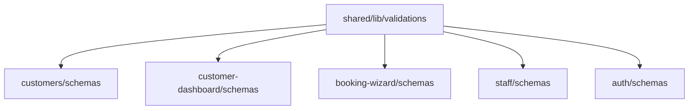

# Analysis Log

---

## 2025-12-15 - Đánh Giá Admin Sidebar UX/UI & Routes

### 🔍 Tổng Quan Đánh Giá

**Mã Issue**: ADMIN-SIDEBAR-001
**Mức độ nghiêm trọng**: ⚠️ MEDIUM (Route không khớp gây lỗi 404)

---

### 1. Kiểm Tra Route Mapping

#### SIDEBAR_ITEMS trong `constants.ts`:

| Menu Item  | Route trong Constants  | Folder trong app/admin | Status            |
| ---------- | ---------------------- | ---------------------- | ----------------- |
| Tổng quan  | `/admin/overview`      | `dashboard/`           | ❌ **KHÔNG KHỚP** |
| Lịch hẹn   | `/admin/appointments`  | `appointments/`        | ✅ Khớp           |
| Khách hàng | `/admin/customers`     | `customers/`           | ✅ Khớp           |
| Nhân sự    | `/admin/staff`         | `staff/`               | ✅ Khớp           |
| Dịch vụ    | `/admin/services`      | `services/`            | ✅ Khớp           |
| Tài nguyên | `/admin/resources`     | `resources/`           | ✅ Khớp           |
| Tin nhắn   | `/admin/messages`      | ❌ **KHÔNG CÓ**        | ❌ **LỖI**        |
| Thông báo  | `/admin/notifications` | ❌ **KHÔNG CÓ**        | ❌ **LỖI**        |
| Thành phần | `/admin/components`    | ❌ **KHÔNG CÓ**        | ❌ **LỖI**        |
| Cài đặt    | `/admin/settings`      | `settings/`            | ✅ Khớp           |

#### Routes tồn tại nhưng KHÔNG có trong Sidebar:

| Route            | Folder     | Ghi chú                |
| ---------------- | ---------- | ---------------------- |
| `/admin/billing` | `billing/` | ⚠️ Thiếu trong sidebar |
| `/admin/reviews` | `reviews/` | ⚠️ Thiếu trong sidebar |

---

### 2. Vấn Đề Routing Cụ Thể

#### ❌ VẤN ĐỀ NGHIÊM TRỌNG #1: Route "Tổng quan" sai

- **Constants**: `/admin/overview`
- **Thực tế**: `/admin/dashboard`
- **Hành vi hiện tại**:
  - `/admin` redirect → `/admin/dashboard` (OK)
  - Click "Tổng quan" → `/admin/overview` → **404 ERROR**

#### ❌ VẤN ĐỀ NGHIÊM TRỌNG #2: 3 Routes không tồn tại

- `/admin/messages` - Không có folder
- `/admin/notifications` - Không có folder
- `/admin/components` - Không có folder

---

### 3. Đánh Giá UX/UI

#### ✅ **ĐIỂM TỐT**:

| Tiêu chí      | Đánh giá     | Ghi chú                                                                   |
| ------------- | ------------ | ------------------------------------------------------------------------- |
| Responsive    | ✅ Excellent | Hỗ trợ collapsed state tốt                                                |
| Accessibility | ✅ Good      | Có `aria-label`, `role="navigation"`                                      |
| Animation     | ✅ Good      | `transition-all duration-200 ease-out`, `motion-safe:hover:translate-x-1` |
| Active State  | ✅ Good      | Visual feedback rõ ràng với `data-[active=true]:bg-primary/10`            |
| Touch Target  | ✅ Good      | `min-h-[40px]` đạt chuẩn 44px accessibility                               |
| Tooltip       | ✅ Excellent | Hỗ trợ tooltip khi collapsed                                              |

#### ⚠️ **CẦN CẢI THIỆN**:

| Tiêu chí         | Vấn đề                                                         | Đề xuất                        |
| ---------------- | -------------------------------------------------------------- | ------------------------------ |
| Code duplication | `active:scale-[0.98] active:bg-sidebar-accent/80` bị duplicate | Xóa dòng duplicate             |
| Consistency      | Menu "Hỗ trợ" trong footer không link đi đâu                   | Thêm href hoặc onClick handler |
| Breadcrumb       | `BREADCRUMB_MAP` thiếu nhiều routes                            | Sync với SIDEBAR_ITEMS         |

---

### 4. Đề Xuất Sửa Lỗi

#### Fix #1: Sửa route "Tổng quan"

```typescript
// Thay đổi trong constants.ts
{
  title: "Tổng quan",
  href: "/admin/dashboard", // Sửa từ /admin/overview
  icon: Home,
},
```

#### Fix #2: Xóa hoặc tạo routes không tồn tại

**Option A - Xóa menu items không dùng:**

- Xóa: "Tin nhắn", "Thông báo", "Thành phần"

**Option B - Tạo placeholder pages:**

- Tạo: `app/admin/messages/page.tsx`
- Tạo: `app/admin/notifications/page.tsx`
- Tạo: `app/admin/components/page.tsx`

#### Fix #3: Thêm menu items thiếu

```typescript
// Thêm vào SIDEBAR_ITEMS
{
  title: "Hóa đơn",
  href: "/admin/billing",
  icon: CreditCard, // import từ lucide-react
},
{
  title: "Đánh giá",
  href: "/admin/reviews",
  icon: Star, // import từ lucide-react
},
```

---

### 5. Kết Luận

| Hạng mục      | Điểm     | Ghi chú                       |
| ------------- | -------- | ----------------------------- |
| UI Design     | 8/10     | Giao diện đẹp, responsive tốt |
| UX Flow       | 5/10     | Routes không khớp gây confuse |
| Accessibility | 8/10     | Tuân thủ tốt các tiêu chuẩn   |
| Code Quality  | 7/10     | Có duplicate code cần cleanup |
| **Tổng điểm** | **7/10** | Cần fix routes để đạt 9/10    |

---

## 2025-12-15 - Phân Tích Validation Inconsistency

### 🔍 Tổng Quan Vấn Đề

**Mã Issue**: VAL-001
**Mức độ nghiêm trọng**: ⚠️ MEDIUM (Logic không nhất quán có thể gây UX inconsistent)

---

### 1. Phone Validation - Phân Mảnh Nghiêm Trọng

#### Kết quả khảo sát:

| File                                | Logic                        | Vấn đề                                  |
| ----------------------------------- | ---------------------------- | --------------------------------------- |
| `customers/model/schemas.ts:6`      | `min(10).max(15)`            | Chỉ check độ dài, không check format VN |
| `customer-dashboard/schemas.ts:5-8` | Regex VN (không có `g` flag) | Regex đúng nhưng hard-coded             |
| `booking-wizard/schemas.ts:5`       | Regex VN (có `g` flag)       | Flag `g` không cần thiết cho validation |
| `staff/model/schemas.ts:20`         | `min(10)`                    | Quá lỏng lẻo                            |

#### Regex chuẩn hóa đề xuất:

```typescript
// Hỗ trợ: 0983123456 hoặc +84983123456
/^(0|\+84)(3|5|7|8|9)[0-9]{8}$/;
```

---

### 2. Date of Birth - Logic Khác Biệt

| File                                  | Logic                                 | Vấn đề                     |
| ------------------------------------- | ------------------------------------- | -------------------------- |
| `customers/model/schemas.ts:8-12`     | `date <= new Date()`                  | Chấp nhận năm 1800 (vô lý) |
| `customer-dashboard/schemas.ts:11-17` | `year >= 1900 && year <= currentYear` | Đúng hơn                   |

#### Logic chuẩn hóa đề xuất:

```typescript
const isValidDob = (val: string) => {
  const date = new Date(val);
  const year = date.getFullYear();
  return !isNaN(date.getTime()) && year >= 1900 && date <= new Date();
};
```

---

### 3. Naming Convention - snake_case vs camelCase

| Module                                 | Convention   | Lý do                |
| -------------------------------------- | ------------ | -------------------- |
| `customers`, `staff`, `booking-wizard` | `snake_case` | Khớp với Backend API |
| `customer-dashboard`, `auth`           | `camelCase`  | Frontend convention  |

**Quyết định**: Chấp nhận cả 2, nhưng **logic validate bên dưới PHẢI giống nhau**.

---

### 4. Error Messages - Không Đồng Nhất

| Nội dung        | Variations                                                             |
| --------------- | ---------------------------------------------------------------------- |
| Phone invalid   | "Số điện thoại ít nhất 10 số", "Số điện thoại không hợp lệ"            |
| Name min length | "Vui lòng nhập họ tên", "Họ tên phải có ít nhất 2 ký tự"               |
| Date invalid    | "Ngày sinh không được lớn hơn ngày hiện tại", "Ngày sinh không hợp lệ" |

**Đề xuất**: Tạo file `messages.ts` tập trung.

---

### 5. Files Cần Refactor (Theo Ưu Tiên)

#### P0 - Tạo mới (Foundation)

- [ ] `shared/lib/validations/primitives.ts`
- [ ] `shared/lib/validations/messages.ts`
- [ ] `shared/lib/validations/index.ts`

#### P1 - Sửa đổi (High Impact)

- [ ] `features/customers/model/schemas.ts`
- [ ] `features/customer-dashboard/schemas.ts`
- [ ] `features/booking-wizard/schemas.ts`

#### P2 - Sửa đổi (Medium Impact)

- [ ] `features/staff/model/schemas.ts`
- [ ] `features/auth/schemas.ts`

#### P3 - Review (Low Impact)

- [ ] `features/services/schemas.ts` (color validation)
- [ ] `features/resources/schemas.ts`
- [ ] `features/appointments/schemas.ts`
- [ ] `features/billing/schemas.ts`
- [ ] `features/reviews/schemas.ts`

---

### 6. Dependencies Analysis



**Không có circular dependency** - An toàn để tạo shared library.

---

### 7. Risk Assessment

| Rủi ro               | Mức độ | Mitigation                             |
| -------------------- | ------ | -------------------------------------- |
| Break existing forms | MEDIUM | Test từng file sau khi sửa             |
| TypeScript error     | LOW    | Zod infer type sẽ tự động              |
| Regex quá strict     | LOW    | Regex đã được verify với số VN thực tế |

---

## Kết Luận

✅ **Xác nhận vấn đề**: Validation logic bị phân mảnh và không nhất quán
✅ **Giải pháp khả thi**: Tạo shared validation library
✅ **Rủi ro thấp**: Thay đổi chủ yếu là refactor, không thay đổi behavior lớn
⏳ **Chờ phê duyệt**: Implementation Plan đã sẵn sàng
