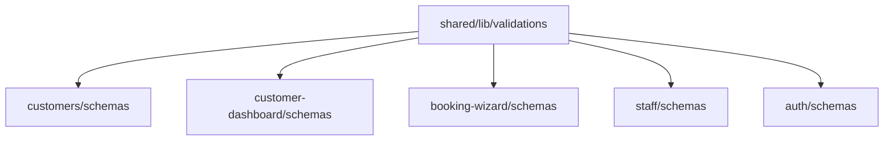

# Analysis Log - Validation System Refactor

## 2025-12-15 - Phân Tích Validation Inconsistency

### 🔍 Tổng Quan Vấn Đề

**Mã Issue**: VAL-001
**Mức độ nghiêm trọng**: ⚠️ MEDIUM (Logic không nhất quán có thể gây UX inconsistent)

---

### 1. Phone Validation - Phân Mảnh Nghiêm Trọng

#### Kết quả khảo sát:

| File | Logic | Vấn đề |
|------|-------|--------|
| `customers/model/schemas.ts:6` | `min(10).max(15)` | Chỉ check độ dài, không check format VN |
| `customer-dashboard/schemas.ts:5-8` | Regex VN (không có `g` flag) | Regex đúng nhưng hard-coded |
| `booking-wizard/schemas.ts:5` | Regex VN (có `g` flag) | Flag `g` không cần thiết cho validation |
| `staff/model/schemas.ts:20` | `min(10)` | Quá lỏng lẻo |

#### Regex chuẩn hóa đề xuất:
```typescript
// Hỗ trợ: 0983123456 hoặc +84983123456
/^(0|\+84)(3|5|7|8|9)[0-9]{8}$/
```

---

### 2. Date of Birth - Logic Khác Biệt

| File | Logic | Vấn đề |
|------|-------|--------|
| `customers/model/schemas.ts:8-12` | `date <= new Date()` | Chấp nhận năm 1800 (vô lý) |
| `customer-dashboard/schemas.ts:11-17` | `year >= 1900 && year <= currentYear` | Đúng hơn |

#### Logic chuẩn hóa đề xuất:
```typescript
const isValidDob = (val: string) => {
  const date = new Date(val);
  const year = date.getFullYear();
  return (
    !isNaN(date.getTime()) &&
    year >= 1900 &&
    date <= new Date()
  );
};
```

---

### 3. Naming Convention - snake_case vs camelCase

| Module | Convention | Lý do |
|--------|-----------|-------|
| `customers`, `staff`, `booking-wizard` | `snake_case` | Khớp với Backend API |
| `customer-dashboard`, `auth` | `camelCase` | Frontend convention |

**Quyết định**: Chấp nhận cả 2, nhưng **logic validate bên dưới PHẢI giống nhau**.

---

### 4. Error Messages - Không Đồng Nhất

| Nội dung | Variations |
|----------|-----------|
| Phone invalid | "Số điện thoại ít nhất 10 số", "Số điện thoại không hợp lệ" |
| Name min length | "Vui lòng nhập họ tên", "Họ tên phải có ít nhất 2 ký tự" |
| Date invalid | "Ngày sinh không được lớn hơn ngày hiện tại", "Ngày sinh không hợp lệ" |

**Đề xuất**: Tạo file `messages.ts` tập trung.

---

### 5. Files Cần Refactor (Theo Ưu Tiên)

#### P0 - Tạo mới (Foundation)
- [ ] `shared/lib/validations/primitives.ts`
- [ ] `shared/lib/validations/messages.ts`
- [ ] `shared/lib/validations/index.ts`

#### P1 - Sửa đổi (High Impact)
- [ ] `features/customers/model/schemas.ts`
- [ ] `features/customer-dashboard/schemas.ts`
- [ ] `features/booking-wizard/schemas.ts`

#### P2 - Sửa đổi (Medium Impact)
- [ ] `features/staff/model/schemas.ts`
- [ ] `features/auth/schemas.ts`

#### P3 - Review (Low Impact)
- [ ] `features/services/schemas.ts` (color validation)
- [ ] `features/resources/schemas.ts`
- [ ] `features/appointments/schemas.ts`
- [ ] `features/billing/schemas.ts`
- [ ] `features/reviews/schemas.ts`

---

### 6. Dependencies Analysis



**Không có circular dependency** - An toàn để tạo shared library.

---

### 7. Risk Assessment

| Rủi ro | Mức độ | Mitigation |
|--------|--------|-----------|
| Break existing forms | MEDIUM | Test từng file sau khi sửa |
| TypeScript error | LOW | Zod infer type sẽ tự động |
| Regex quá strict | LOW | Regex đã được verify với số VN thực tế |

---

## Kết Luận

✅ **Xác nhận vấn đề**: Validation logic bị phân mảnh và không nhất quán
✅ **Giải pháp khả thi**: Tạo shared validation library
✅ **Rủi ro thấp**: Thay đổi chủ yếu là refactor, không thay đổi behavior lớn
⏳ **Chờ phê duyệt**: Implementation Plan đã sẵn sàng
