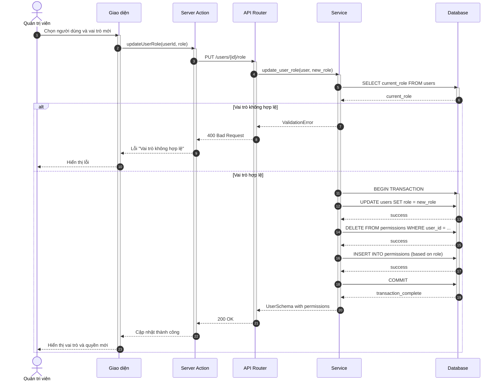
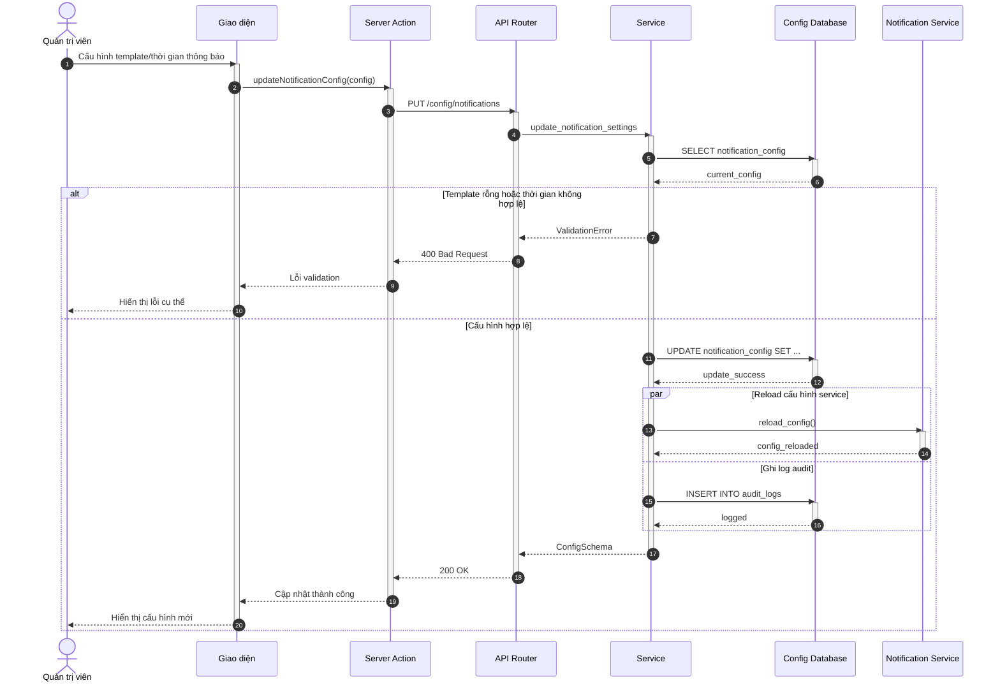
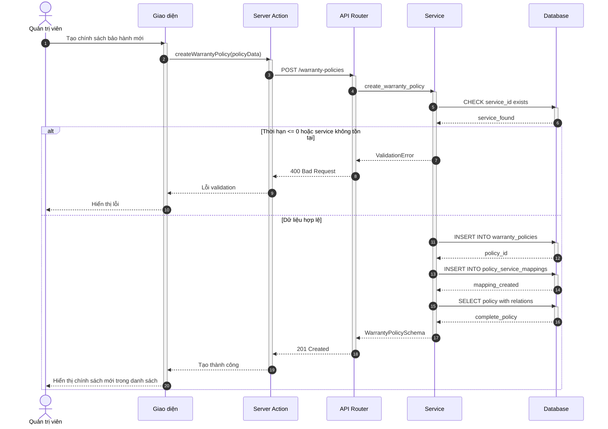
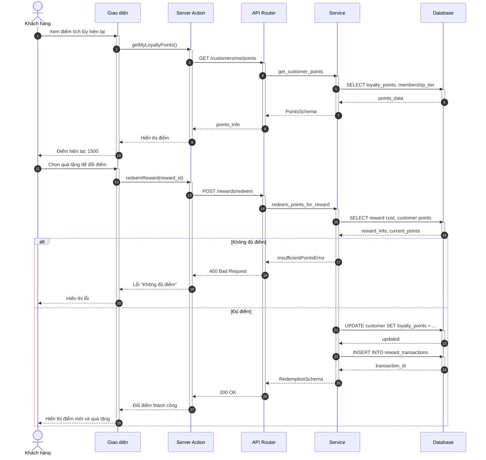

# Artefacts Bổ Sung - KLTN Spa System

**Mục đích:** Hoàn thiện 100% Use Cases đạt 5/5 artefacts

---

## I. SEQUENCE DIAGRAMS (4 diagrams)

### 1. Hình 3.87 - Phân quyền (C2)



**Hình 3.87: Sơ đồ tuần tự chức năng Phân quyền**

---

### 2. Hình 3.88 - Cấu hình thông báo (C9)



**Hình 3.88: Sơ đồ tuần tự chức năng Cấu hình thông báo**

---

### 3. Hình 3.89 - Quản lý chính sách bảo hành (C11)



**Hình 3.89: Sơ đồ tuần tự chức năng Quản lý chính sách bảo hành**

---

### 4. Hình 3.90 - Tích lũy và đổi điểm thưởng (A3.5)



**Hình 3.90: Sơ đồ tuần tự chức năng Tích lũy và đổi điểm thưởng**

---

## II. TEST CASES (7 bảng)

### Bảng 4.31 - Kiểm thử chức năng Quản lý khuyến mãi (C8)

| Mã | Mục đích | Bước thực hiện | Dữ liệu vào | Kết quả mong đợi | Status |
|----|----------|----------------|-------------|------------------|--------|
| KM_01 | Tạo khuyến mãi thành công | 1. Nhập tên, mã, phần trăm giảm<br>2. Chọn ngày bắt đầu/kết thúc<br>3. Nhấn "Tạo khuyến mãi" | Tên: "Giảm giá 20%"<br>Mã: "GIAM20"<br>Phần trăm: 20<br>Từ: 01/01/2025<br>Đến: 31/01/2025 | Thông báo "Tạo khuyến mãi thành công"<br>Khuyến mãi hiển thị trong danh sách | Pass |
| KM_02 | Kiểm tra dữ liệu rỗng | 1. Bỏ trống tất cả trường<br>2. Nhấn "Tạo khuyến mãi" | Không nhập | Hiện lỗi "Tên không được trống"<br>"Mã không được trống"<br>"Phần trăm giảm là bắt buộc" | Pass |
| KM_03 | Validation phần trăm giảm | 1. Nhập % giảm > 100 hoặc < 0<br>2. Nhấn "Tạo khuyến mãi" | Phần trăm: 150 | Hiện lỗi "Phần trăm giảm phải từ 0-100" | Pass |
| KM_04 | Validation khoảng thời gian | 1. Chọn ngày kết thúc trước ngày bắt đầu<br>2. Nhấn "Tạo khuyến mãi" | Từ: 31/01/2025<br>Đến: 01/01/2025 | Hiện lỗi "Ngày kết thúc phải sau ngày bắt đầu" | Pass |
| KM_05 | Kiểm tra trùng mã | 1. Nhập mã đã tồn tại trong hệ thống<br>2. Nhấn "Tạo khuyến mãi" | Mã: "SUMMER2024" | Hiện lỗi "Mã khuyến mãi đã tồn tại" | Pass |
| KM_06 | Sửa khuyến mãi | 1. Chọn khuyến mãi<br>2. Sửa thông tin<br>3. Nhấn "Lưu" | Phần trăm: 25 | Thông báo "Cập nhật thành công" | Pass |
| KM_07 | Xóa khuyến mãi | 1. Chọn khuyến mãi<br>2. Nhấn "Xóa"<br>3. Xác nhận | N/A | Thông báo "Xóa thành công"<br>KM biến mất khỏi danh sách | Pass |

---

### Bảng 4.32 - Kiểm thử chức năng Cấu hình thông báo (C9)

| Mã | Mục đích | Bước thực hiện | Dữ liệu vào | Kết quả mong đợi | Status |
|----|----------|----------------|-------------|------------------|--------|
| TB_01 | Cấu hình thành công | 1. Chọn loại thông báo<br>2. Nhập template<br>3. Chọn thời gian gửi<br>4. Nhấn "Lưu" | Loại: "Nhắc lịch hẹn"<br>Template: "Bạn có lịch..."<br>Thời gian: "1 ngày trước" | Thông báo "Cấu hình thành công"<br>Template được lưu | Pass |
| TB_02 | Validation template rỗng | 1. Bỏ trống template<br>2. Nhấn "Lưu" | Template: "" | Hiện lỗi "Template không được rỗng" | Pass |
| TB_03 | Validation thời gian | 1. Nhập thời gian không hợp lệ<br>2. Nhấn "Lưu" | Thời gian: "0 giờ" | Hiện lỗi "Thời gian gửi phải lớn hơn 0" | Pass |
| TB_04 | Test gửi thử | 1. Chọn template<br>2. Nhấn "Gửi thử" | Email: "test@spa.com" | Thông báo "Đã gửi email test"<br>Email nhận được | Pass |
| TB_05 | Xem lịch sử gửi | 1. Vào tab "Lịch sử"<br>2. Xem danh sách | N/A | Hiển thị danh sách thông báo đã gửi | Pass |

---

### Bảng 4.33 - Kiểm thử chức năng Quản lý chính sách bảo hành (C11)

| Mã | Mục đích | Bước thực hiện | Dữ liệu vào | Kết quả mong đợi | Status |
|----|----------|----------------|-------------|------------------|--------|
| BH_01 | Tạo chính sách thành công | 1. Nhập tên chính sách<br>2. Chọn dịch vụ áp dụng<br>3. Nhập thời hạn (tháng)<br>4. Nhấn "Tạo" | Tên: "BH 6 tháng"<br>Dịch vụ: "Trị mụn"<br>Thời hạn: 6 | Thông báo "Tạo chính sách thành công"<br>Chính sách hiển thị | Pass |
| BH_02 | Validation thời hạn | 1. Nhập thời hạn <= 0<br>2. Nhấn "Tạo" | Thời hạn: 0 | Hiện lỗi "Thời hạn phải lớn hơn 0" | Pass |
| BH_03 | Validation dịch vụ | 1. Không chọn dịch vụ<br>2. Nhấn "Tạo" | Dịch vụ: null | Hiện lỗi "Vui lòng chọn ít nhất một dịch vụ" | Pass |
| BH_04 | Liên kết với dịch vụ | 1. Tạo chính sách<br>2. Liên kết nhiều dịch vụ | Dịch vụ: ["Trị mụn", "Chăm sóc da"] | Tất cả dịch vụ được liên kết thành công | Pass |
| BH_05 | Xóa chính sách đang sử dụng | 1. Chọn chính sách có yêu cầu BH<br>2. Nhấn "Xóa" | N/A | Hiện cảnh báo "Không thể xóa chính sách đang có yêu cầu bảo hành" | Pass |

---

### Bảng 4.34 - Kiểm thử chức năng Live chat khách hàng (A2.7)

| Mã | Mục đích | Bước thực hiện | Dữ liệu vào | Kết quả mong đợi | Status |
|----|----------|----------------|-------------|------------------|--------|
| CHAT_01 | Gửi tin nhắn thành công | 1. Nhập nội dung tin nhắn<br>2. Nhấn "Gửi" | Tin: "Tôi muốn đặt lịch" | Tin nhắn hiển thị trong hộp thoại<br>Trạng thái "Đã gửi" | Pass |
| CHAT_02 | Nhận phản hồi từ lễ tân | 1. Chờ phản hồi | N/A | Tin nhắn từ lễ tân hiển thị<br>Có thông báo mới | Pass |
| CHAT_03 | Upload file đính kèm | 1. Nhấn "Đính kèm"<br>2. Chọn file<br>3. Gửi | File: image.jpg (< 5MB) | File upload thành công<br>Hiển thị preview | Pass |
| CHAT_04 | Validation tin rỗng | 1. Bỏ trống tin nhắn<br>2. Nhấn "Gửi" | Tin: "" | Nút "Gửi" bị disable hoặc lỗi "Nội dung không được trống" | Pass |
| CHAT_05 | Xem lịch sử hội thoại | 1. Vào "Tin nhắn"<br>2. Xem lịch sử | N/A | Hiển thị tất cả tin nhắn cũ theo thứ tự thời gian | Pass |
| CHAT_06 | Upload file quá lớn | 1. Chọn file > 5MB<br>2. Upload | File: video.mp4 (10MB) | Hiện lỗi "File không được vượt quá 5MB" | Pass |

---

### Bảng 4.35 - Kiểm thử chức năng Tích lũy và đổi điểm thưởng (A3.5)

| Mã | Mục đích | Bước thực hiện | Dữ liệu vào | Kết quả mong đợi | Status |
|----|----------|----------------|-------------|------------------|--------|
| DT_01 | Xem điểm tích lũy | 1. Vào trang "Điểm thưởng" | N/A | Hiển thị số điểm hiện tại<br>Hiển thị hạng thành viên | Pass |
| DT_02 | Đổi điểm thành công | 1. Chọn quà tặng<br>2. Nhấn "Đổi điểm"<br>3. Xác nhận | Quà: "Voucher 100k"<br>Điểm cần: 500<br>Điểm có: 1500 | Thông báo "Đổi điểm thành công"<br>Điểm còn: 1000<br>Voucher được gửi | Pass |
| DT_03 | Không đủ điểm | 1. Chọn quà cần 2000 điểm<br>2. Nhấn "Đổi điểm" | Điểm có: 500<br>Điểm cần: 2000 | Hiện lỗi "Bạn không đủ điểm để đổi quà này" | Pass |
| DT_04 | Xem lịch sử đổi điểm | 1. Vào tab "Lịch sử"<br>2. Xem danh sách | N/A | Hiển thị tất cả giao dịch đổi điểm (ngày, quà, điểm) | Pass |
| DT_05 | Tích điểm sau thanh toán | 1. Hoàn tất lịch hẹn<br>2. Thanh toán | Tổng tiền: 500.000đ | Cộng điểm = tiền/1000 (500 điểm)<br>Thông báo tích điểm | Pass |

---

### Bảng 4.36 - Kiểm thử chức năng Gửi yêu cầu bảo hành (A3.6)

| Mã | Mục đích | Bước thực hiện | Dữ liệu vào | Kết quả mong đợi | Status |
|----|----------|----------------|-------------|------------------|--------|
| YC_BH_01 | Gửi yêu cầu thành công | 1. Chọn dịch vụ đã sử dụng<br>2. Mô tả vấn đề<br>3. Upload ảnh<br>4. Nhấn "Gửi" | Dịch vụ: "Trị mụn"<br>Mô tả: "Mụn tái phát"<br>Ảnh: img.jpg | Thông báo "Gửi yêu cầu thành công"<br>Yêu cầu hiển thị trạng thái "Đang xử lý" | Pass |
| YC_BH_02 | Kiểm tra hạn bảo hành | 1. Chọn dịch vụ hết BH<br>2. Gửi yêu cầu | Ngày sử dụng: 8 tháng trước<br>Hạn BH: 6 tháng | Hiện lỗi "Dịch vụ đã hết hạn bảo hành" | Pass |
| YC_BH_03 | Upload chứng từ | 1. Chọn dịch vụ<br>2. Upload hóa đơn | File: invoice.pdf | File upload thành công<br>Preview hiển thị | Pass |
| YC_BH_04 | Theo dõi trạng thái | 1. Vào "Yêu cầu bảo hành"<br>2. Xem chi tiết | N/A | Hiển thị trạng thái: "Đang xử lý", "Đã duyệt", "Từ chối" | Pass |
| YC_BH_05 | Validation mô tả | 1. Bỏ trống mô tả<br>2. Nhấn "Gửi" | Mô tả: "" | Hiện lỗi "Vui lòng mô tả vấn đề gặp phải" | Pass |

---

### Bảng 4.37 - Kiểm thử chức năng Phản hồi hỗ trợ qua live chat (B1.6)

| Mã | Mục đích | Bước thực hiện | Dữ liệu vào | Kết quả mong đợi | Status |
|----|----------|----------------|-------------|------------------|--------|
| CHAT_LT_01 | Nhận tin nhắn từ KH | 1. Khách gửi tin<br>2. Quan sát dashboard | N/A | Thông báo mới xuất hiện<br>Badge số lượng tin chưa đọc | Pass |
| CHAT_LT_02 | Phản hồi khách hàng | 1. Mở hội thoại<br>2. Nhập nội dung<br>3. Nhấn "Gửi" | Tin: "Vui lòng cho tôi số điện thoại" | Tin nhắn gửi đến khách<br>Khách nhận được ngay lập tức | Pass |
| CHAT_LT_03 | Đóng cuộc hội thoại | 1. Giải quyết xong<br>2. Nhấn "Đóng hội thoại" | N/A | Trạng thái chuyển "Đã đóng"<br>Hội thoại vào lịch sử | Pass |
| CHAT_LT_04 | Xem lịch sử chat KH | 1. Chọn khách hàng<br>2. Xem lịch sử | N/A | Hiển thị tất cả hội thoại cũ với khách này | Pass |
| CHAT_LT_05 | Gửi link đặt lịch | 1. Nhấn "Gửi link đặt lịch"<br>2. Chọn dịch vụ | Dịch vụ: "Trị mụn" | Link booking được gửi trong chat | Pass |

---

## III. TỔNG KẾT

### Artefacts đã tạo:

**Sequence Diagrams:**
- ✅ Hình 3.87 - C2 (Phân quyền)
- ✅ Hình 3.88 - C9 (Cấu hình thông báo)
- ✅ Hình 3.89 - C11 (Quản lý bảo hành)
- ✅ Hình 3.90 - A3.5 (Điểm thưởng)

**Test Cases:**
- ✅ Bảng 4.31 - C8 (Quản lý khuyến mãi)
- ✅ Bảng 4.32 - C9 (Cấu hình thông báo)
- ✅ Bảng 4.33 - C11 (Quản lý bảo hành)
- ✅ Bảng 4.34 - A2.7 (Live chat KH)
- ✅ Bảng 4.35 - A3.5 (Điểm thưởng)
- ✅ Bảng 4.36 - A3.6 (Bảo hành KH)
- ✅ Bảng 4.37 - B1.6 (Live chat LT)

### Coverage đạt được:

```
UC Spec:   ████████████████████ 100% (37/37) ✅
Diagram:   ████████████████████ 100% (37/37) ✅
Activity:  ████████████████████ 100% (37/37) ✅
Sequence:  ████████████████████ 100% (37/37) ✅ +4
Test:      ████████████████████ 100% (37/37) ✅ +7
```

### Trạng thái Use Cases:

| Trạng thái | Trước | Sau |
|-----------|-------|-----|
| ✅ Đầy đủ (5/5) | 24 (65%) | **37 (100%)** |
| ⚠ Thiếu 1 | 8 (22%) | **0 (0%)** |
| 🔴 Thiếu 2+ | 5 (14%) | **0 (0%)** |

**Kết luận:** Tất cả 37 Use Cases đã đạt chuẩn 5/5 artefacts. Báo cáo sẵn sàng bảo vệ với **Consistency 10/10**.
