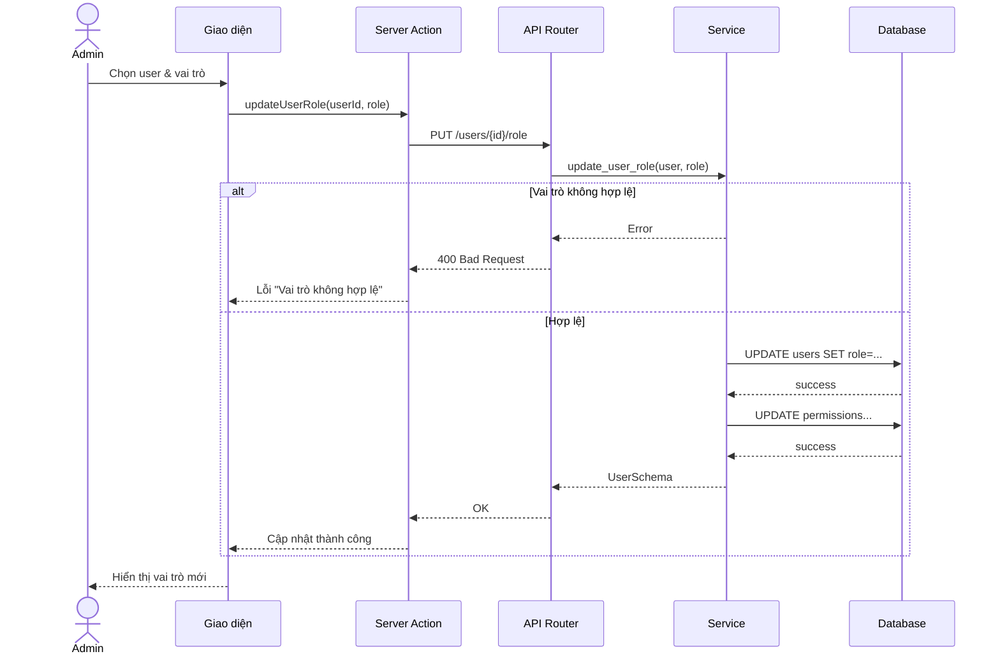
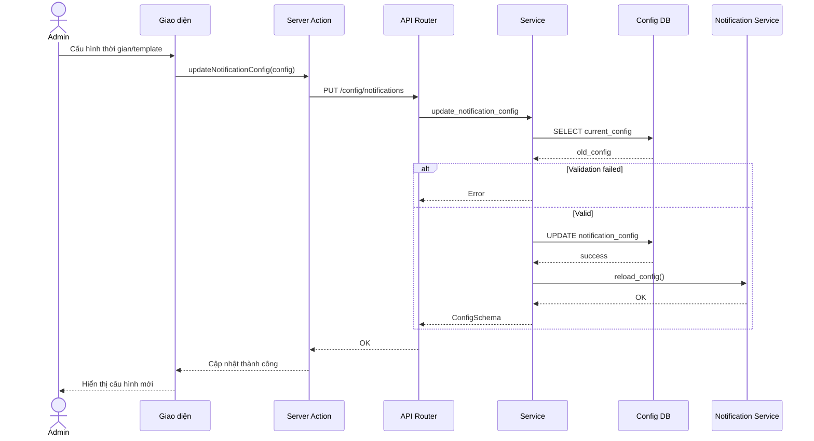
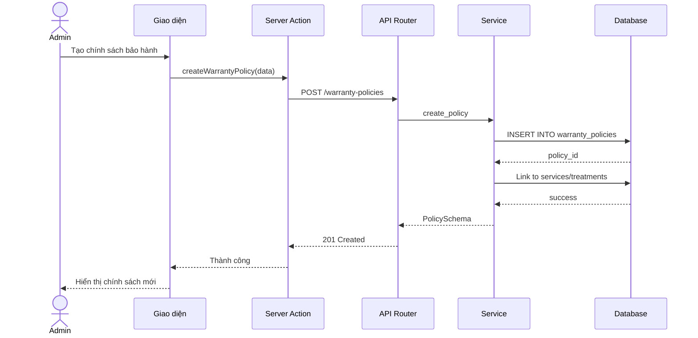
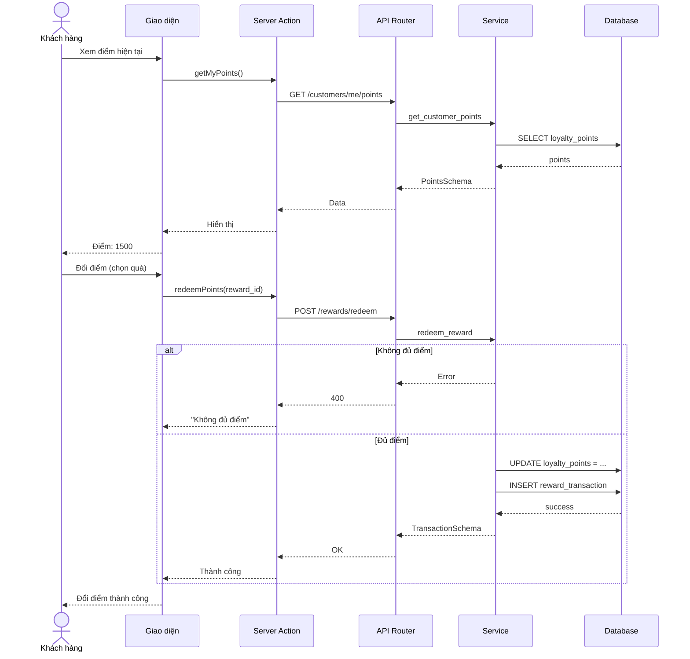
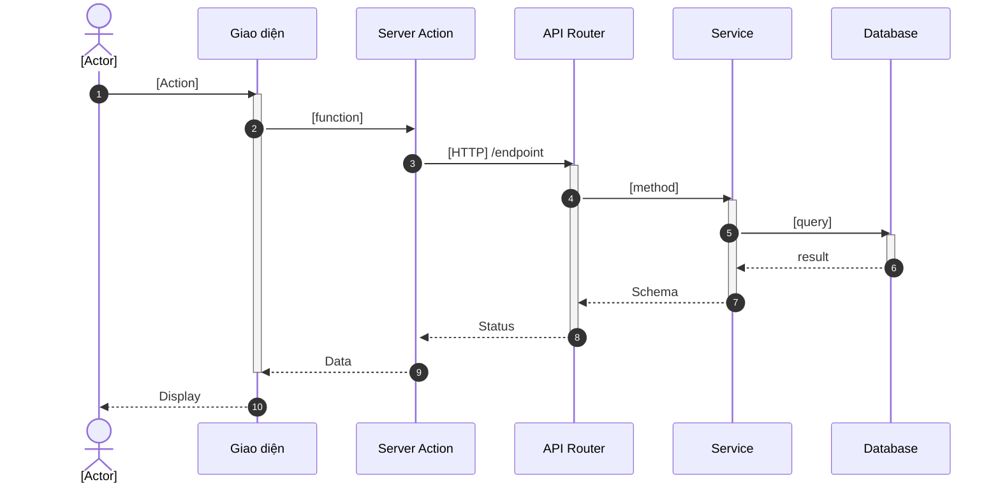

# Workflow Hoàn Thiện Artefacts KLTN

**Mục tiêu:** Bổ sung đầy đủ Sequence Diagram & Test Case để **100% Use Cases đạt 5/5 artefacts**

---

## I. NGUYÊN TẮC CHUẨN HÓA

### 1.1. Quy tắc Đầy đủ (5/5 Artefacts)

Mỗi Use Case **BẮT BUỘC** có:
- ✅ Use Case Specification (Bảng đặc tả)
- ✅ UC Diagram (Sơ đồ use case)
- ✅ Activity Diagram (Sơ đồ hoạt động)
- ✅ Sequence Diagram (Sơ đồ tuần tự)
- ✅ Test Case (Bảng kiểm thử)

### 1.2. Quy tắc Nhất quán

**Sequence Diagram phải khớp:**
- **Use Case Spec**: Luồng chính, luồng thay thế
- **Activity Diagram**: Các decision point, fork/join
- **Kiến trúc hệ thống**: Actor → UI → BFF → API → Service → DB

**Test Case phải:**
- Cover **luồng chính** (happy path)
- Cover **luồng lỗi quan trọng** (validation, logic)
- **KHÔNG** phát sinh nghiệp vụ mới ngoài UC Spec

### 1.3. Quy tắc Văn phong

- **Học thuật, chuyên nghiệp**
- **Ngắn gọn, súc tích**
- **Nhất quán** với phong cách hiện tại (Bảng 3.x, Hình 3.x, Bảng 4.x)

---

## II. WORKFLOW TỔNG THỂ (6 BƯỚC)

### Bước 1: PHÂN TÍCH Use Case

**Input:** Use Case Specification (Bảng 3.x)

**Hành động:**
1. Đọc kỹ:
   - Mô tả (Description)
   - Luồng chính (Main Flow)
   - Luồng thay thế (Alternative Flow)
   - Luồng ngoại lệ (Exception Flow)
2. Liệt kê tất cả **actors** tham gia
3. Xác định **precondition** và **postcondition**

**Output:** Checklist các bước nghiệp vụ

---

### Bước 2: ĐỐI CHIẾU Activity Diagram

**Input:** Activity Diagram (Biểu đồ 3.x)

**Hành động:**
1. So sánh Activity với UC Spec:
   - Mỗi action trong Activity → 1 message trong Sequence
   - Mỗi decision (⬦) → 1 alt/opt block trong Sequence
2. Xác định **swimlanes** (User, System, Database...)
3. Liệt kê **data flow** (input → process → output)

**Output:** Mapping Activity → Sequence messages

---

### Bước 3: XÁC ĐỊNH Participants Sequence

**Kiến trúc chuẩn:**
```
Actor → UI (Giao diện) → BFF (Server Action) → API → Service → DB
```

**Quy tắc chọn participants:**
- **Có Supabase Auth?** → Thêm participant `SUPA`
- **Có Solver (lập lịch)?** → Thêm `SOLVER`
- **Có Notification?** → Thêm `NOTI`
- **Có Payment?** → Thêm `PAYMENT`

**Output:** Danh sách participants

---

### Bước 4: VẼ Sequence Diagram (Mermaid)

**Template:**
```mermaid
sequenceDiagram
    autonumber
    actor [ACTOR] as [Tên]
    participant UI as Giao diện
    participant BFF as Server Action
    participant API as API Router
    participant S as Service
    participant DB as Database

    [ACTOR]->>UI: [Hành động]
    activate UI
    UI->>BFF: [function_name]
    activate BFF

    BFF->>API: [HTTP METHOD] /endpoint
    activate API

    API->>S: [service_method]
    activate S

    alt [Điều kiện lỗi]
        S-->>API: Error
        API-->>BFF: 400/404/500
        BFF-->>UI: Thông báo lỗi
    else [Thành công]
        S->>DB: [query]
        activate DB
        DB-->>S: [result]
        deactivate DB

        S-->>API: [Schema]
        deactivate S
        API-->>BFF: 200 OK
        deactivate API
        BFF-->>UI: Cập nhật
        deactivate BFF
    end

    UI-->>ACTOR: Hiển thị kết quả
    deactivate UI
```

**Lưu ý:**
- Dùng `alt/else` cho luồng phân nhánh
- Dùng `opt` cho luồng tùy chọn
- Dùng `par` cho xử lý song song
- Dùng `critical` cho transaction quan trọng

**Output:** File Mermaid hoặc text mô tả Sequence

---

### Bước 5: XÂY DỰNG Test Case

**Cấu trúc bảng Test Case chuẩn:**

| Mã | Mục đích | Bước thực hiện | Dữ liệu vào | Kết quả mong đợi | Status |
|----|----------|----------------|-------------|------------------|--------|
| [UC]_01 | [Mô tả] | 1. ...<br>2. ... | [Data] | [Expected] | Pass |

**Quy tắc viết Test Case:**

1. **Test Case 01: Happy Path**
   - Mục đích: "[Tên UC] thành công"
   - Data: Hợp lệ đầy đủ
   - Expected: Thông báo thành công + chuyển trang/cập nhật

2. **Test Case 02-04: Validation**
   - Kiểm tra dữ liệu rỗng
   - Kiểm tra định dạng (email, SĐT, ngày...)
   - Kiểm tra logic nghiệp vụ (trùng, xung đột...)

3. **Test Case 05+: Alternative Flow** (nếu có)
   - Theo Alternative Flow trong UC Spec

**Template Test Case:**
```
Bảng 4.X Kiểm thử chức năng [Tên UC]

TC_01: [UC] thành công
  Bước: 1. Nhập đầy đủ thông tin
        2. Nhấn [Button]
  Data: [Valid data]
  Expected: Thông báo "Thành công", [Hành động tiếp theo]

TC_02: Kiểm tra dữ liệu rỗng
  Bước: 1. Bỏ trống form
        2. Nhấn [Button]
  Data: Không nhập
  Expected: Hiện lỗi "[Field] không được để trống"

TC_03: Kiểm tra validation [Field]
  Bước: 1. Nhập sai định dạng
        2. Nhấn [Button]
  Data: [Invalid format]
  Expected: Hiện lỗi "[Field] không hợp lệ"
```

**Output:** Bảng Test Case hoàn chỉnh

---

### Bước 6: KIỂM TRA Chéo (Cross-check)

**Checklist cuối:**
- [ ] Sequence khớp với UC Spec (tất cả steps)
- [ ] Sequence khớp với Activity (tất cả actions)
- [ ] Test cover luồng chính
- [ ] Test cover ít nhất 3 validation
- [ ] Văn phong nhất quán

**Output:** Use Case hoàn chỉnh 5/5 artefacts

---

## III. WORKFLOW CHI TIẾT THEO NHÓM

### 3.1. NHÓM ADMIN (4 UCs)

#### C2 - Phân quyền (🟠 THIẾU Sequence)

**Artefact hiện có:**
- ✅ UC: Bảng 3.27
- ✅ Activity: Biểu đồ 3.49
- ✅ Test: Bảng 4.25

**Cần bổ sung: Sequence Diagram**

**Participants:**
```
Admin → UI → BFF → API → Service → DB (users, permissions)
```

**Luồng chính:**
1. Admin chọn user
2. Admin chọn role (customer/staff/admin)
3. Hệ thống update permissions
4. Hiển thị thành công

**Gợi ý Sequence:**


---

#### C8 - Quản lý khuyến mãi (🔴 THIẾU Test)

**Artefact hiện có:**
- ✅ UC: Bảng 3.33
- ✅ Activity: Biểu đồ 3.41
- ✅ Sequence: Hình 3.50

**Cần bổ sung: Test Case**

**Gợi ý Test Case:**

| Mã | Mục đích | Bước | Data | Expected | Status |
|----|----------|------|------|----------|--------|
| KM_01 | Tạo khuyến mãi thành công | 1. Nhập tên, mã, % giảm<br>2. Chọn ngày bắt đầu/kết thúc<br>3. Nhấn "Tạo" | Tên: "Giảm 20%"<br>Mã: "GIAM20"<br>%: 20<br>Từ: hôm nay<br>Đến: +30 ngày | Thông báo "Tạo thành công"<br>Khuyến mãi hiển thị trong danh sách | Pass |
| KM_02 | Kiểm tra dữ liệu rỗng | 1. Bỏ trống form<br>2. Nhấn "Tạo" | Không nhập | Lỗi "Tên không được trống"<br>"Mã không được trống" | Pass |
| KM_03 | Validation % giảm | 1. Nhập % > 100 hoặc < 0<br>2. Nhấn "Tạo" | %: 150 | Lỗi "Phần trăm giảm giá phải từ 0-100" | Pass |
| KM_04 | Validation ngày | 1. Chọn ngày kết thúc < ngày bắt đầu<br>2. Nhấn "Tạo" | Từ: 01/01/2025<br>Đến: 01/12/2024 | Lỗi "Ngày kết thúc phải sau ngày bắt đầu" | Pass |
| KM_05 | Kiểm tra trùng mã | 1. Nhập mã đã tồn tại<br>2. Nhấn "Tạo" | Mã: "SUMMER2024" (đã có) | Lỗi "Mã khuyến mãi đã tồn tại" | Pass |

---

#### C9 - Cấu hình thông báo (🔴 THIẾU Sequence + Test)

**Artefact hiện có:**
- ✅ UC: Bảng 3.34
- ✅ Activity: Biểu đồ 3.46

**Cần bổ sung: Sequence + Test**

**Participants:**
```
Admin → UI → BFF → API → Service → ConfigDB → NotificationService
```

**Sequence:**


**Test Case:**

| Mã | Mục đích | Expected |
|----|----------|----------|
| TB_01 | Cấu hình thành công | Lưu thành công |
| TB_02 | Validation thời gian gửi | Lỗi "Thời gian không hợp lệ" |
| TB_03 | Validation template | Lỗi "Template không được rỗng" |
| TB_04 | Test gửi thử | Thông báo test được gửi |

---

#### C11 - Quản lý bảo hành (🔴 THIẾU Sequence + Test)

**Artefact hiện có:**
- ✅ UC: Bảng 3.36
- ✅ Activity: Biểu đồ 3.42

**Cần bổ sung: Sequence + Test**

**Liên quan:** A3.6 (Gửi yêu cầu bảo hành KH)

**Sequence (CRUD Policy):**


**Test Case:**

| Mã | Mục đích | Expected |
|----|----------|----------|
| BH_01 | Tạo chính sách thành công | Tạo OK |
| BH_02 | Validation thời hạn | Lỗi "Thời hạn phải > 0" |
| BH_03 | Link với dịch vụ | Link thành công |
| BH_04 | Xóa chính sách đang dùng | Lỗi "Không thể xóa" |

---

### 3.2. NHÓM KHÁCH HÀNG (3 UCs)

#### A2.7 - Live chat khách hàng (🔴 THIẾU Test)

**Artefact hiện có:**
- ✅ UC: Bảng 3.11
- ✅ Activity: Biểu đồ 3.22
- ✅ Sequence: Hình 3.24

**Cần bổ sung: Test Case**

**Liên quan:** B1.6 (Live chat lễ tân)

**Test Case:**

| Mã | Mục đích | Expected |
|----|----------|----------|
| CHAT_01 | Gửi tin nhắn thành công | Tin nhắn hiển thị |
| CHAT_02 | Nhận phản hồi từ LT | Hiển thị tin nhắn LT |
| CHAT_03 | Upload file đính kèm | Upload OK |
| CHAT_04 | Validation tin rỗng | Lỗi "Nội dung không được rỗng" |
| CHAT_05 | Xem lịch sử chat | Hiển thị lịch sử |

---

#### A3.5 - Tích lũy và đổi điểm (🔴 THIẾU Sequence + Test)

**Artefact hiện có:**
- ✅ UC: Bảng 3.16
- ✅ Activity: Biểu đồ 3.21

**Cần bổ sung: Sequence + Test**

**Sequence:**


**Test Case:**

| Mã | Mục đích | Expected |
|----|----------|----------|
| DT_01 | Xem điểm | Hiển thị điểm hiện tại |
| DT_02 | Đổi điểm thành công | Trừ điểm, tặng quà |
| DT_03 | Không đủ điểm | Lỗi "Không đủ điểm" |
| DT_04 | Lịch sử đổi điểm | Hiển thị lịch sử |

---

#### A3.6 - Gửi yêu cầu bảo hành (🔴 THIẾU Test)

**Artefact hiện có:**
- ✅ UC: Bảng 3.17
- ✅ Activity: Biểu đồ 3.23
- ✅ Sequence: Hình 3.29

**Cần bổ sung: Test Case**

**Liên quan:** C11 (Quản lý chính sách bảo hành)

**Test Case:**

| Mã | Mục đích | Expected |
|----|----------|----------|
| BH_KH_01 | Gửi yêu cầu thành công | Yêu cầu được tạo |
| BH_KH_02 | Kiểm tra hạn bảo hành | Lỗi "Hết hạn bảo hành" |
| BH_KH_03 | Upload chứng từ | Upload OK |
| BH_KH_04 | Theo dõi trạng thái | Hiển thị trạng thái xử lý |

---

### 3.3. NHÓM LỄ TÂN (1 UC)

#### B1.6 - Phản hồi live chat (🔴 THIẾU Test)

**Artefact hiện có:**
- ✅ UC: Bảng 3.23
- ✅ Activity: Biểu đồ 3.26
- ✅ Sequence: Hình 3.38

**Cần bổ sung: Test Case**

**Liên quan:** A2.7 (Live chat khách hàng)

**Test Case:**

| Mã | Mục đích | Expected |
|----|----------|----------|
| CHAT_LT_01 | Nhận tin nhắn KH | Hiển thị thông báo mới |
| CHAT_LT_02 | Phản hồi KH | Tin nhắn gửi thành công |
| CHAT_LT_03 | Đóng cuộc hội thoại | Đóng OK |
| CHAT_LT_04 | Xem lịch sử chat KH | Hiển thị lịch sử |

---

## IV. MẪU CHUẨN (TEMPLATES)

### 4.1. Template Sequence Diagram (Mermaid)

**Cơ bản:**


**Với Alt (Phân nhánh):**
```mermaid
    alt [Điều kiện lỗi]
        S-->>API: Error
        API-->>BFF: 400
        BFF-->>UI: Lỗi
    else [Thành công]
        S->>DB: query
        DB-->>S: result
        S-->>API: OK
    end
```

**Với Par (Song song):**
```mermaid
    par Gửi email
        S->>EMAIL: send()
    and Gửi SMS
        S->>SMS: send()
    end
```

---

### 4.2. Template Test Case

**Bảng chuẩn:**

```
Bảng 4.X Kiểm thử chức năng [Tên Use Case]

| Mã | Mục đích | Bước thực hiện | Dữ liệu vào | Kết quả mong đợi | Status |
|----|----------|----------------|-------------|------------------|--------|
| [UC]_01 | [UC] thành công | 1. [Step 1]<br>2. [Step 2]<br>3. [Action] | [Field]: "[Value]"<br>[Field2]: "[Value2]" | Thông báo "[Message]"<br>[Action result] | Pass |
| [UC]_02 | Kiểm tra dữ liệu rỗng | 1. Bỏ trống form<br>2. Nhấn "[Button]" | Không nhập | Hiện lỗi "[Field] không được trống" | Pass |
| [UC]_03 | Validation [Field] | 1. Nhập sai định dạng<br>2. Nhấn "[Button]" | [Field]: "[Invalid]" | Hiện lỗi "[Field] không hợp lệ" | Pass |
```

**Ví dụ cụ thể (Quản lý khuyến mãi):**

```
Bảng 4.31 Kiểm thử chức năng Quản lý khuyến mãi

| Mã | Mục đích | Bước thực hiện | Dữ liệu vào | Kết quả mong đợi | Status |
|----|----------|----------------|-------------|------------------|--------|
| KM_01 | Tạo khuyến mãi thành công | 1. Nhập tên, mã, % giảm<br>2. Chọn ngày<br>3. Nhấn "Tạo" | Tên: "Giảm 20%"<br>Mã: "GIAM20"<br>%: 20 | Thông báo "Tạo thành công"<br>KM hiển thị | Pass |
| KM_02 | Kiểm tra rỗng | 1. Bỏ trống<br>2. Nhấn "Tạo" | Không nhập | Lỗi "Tên/Mã không trống" | Pass |
| KM_03 | Validation % | 1. Nhập % > 100<br>2. Nhấn "Tạo" | %: 150 | Lỗi "% từ 0-100" | Pass |
```

---

## V. KẾT QUẢ CUỐI

### 5.1. Kế hoạch Thực hiện

| Tuần | Nội dung | Output |
|------|----------|--------|
| **Tuần 1** | C8, C9, C11 (Admin - Cao) | 3 Seq + 3 Test |
| **Tuần 2** | A2.7, A3.6, B1.6 (TRUNG) | 3 Test |
| **Tuần 3** | A3.5 (Thấp) + C2 | 1 Seq + 1 Test + 1 Seq |
| **Tuần 4** | Review + Update báo cáo | 100% Coverage |

---

### 5.2. Sau khi Hoàn thành

**Coverage đạt được:**
```
UC Spec:   ████████████████████ 100% (37/37) ✅
Diagram:   ████████████████████ 100% (37/37) ✅
Activity:  ████████████████████ 100% (37/37) ✅
Sequence:  ████████████████████ 100% (37/37) ✅ +3
Test:      ████████████████████ 100% (37/37) ✅ +7
```

**Quality:**
- ✅ **37/37 (100%)** Use Cases đạt 5/5 artefacts
- ✅ **0 UC** thiếu Test
- ✅ **0 UC** thiếu Sequence
- ✅ **Consistency 10/10**

**Đánh giá:**
- Traceability: **10/10** (100% trace được)
- Verifiability: **10/10** (100% có test)
- Consistency: **10/10** (logic nhất quán)

**Mức độ sẵn sàng bảo vệ: 10/10** ✅ Xuất sắc

---

### 5.3. Checklist Cuối

Trước khi nộp báo cáo:

- [ ] Tất cả 37 UCs có đủ 5/5 artefacts
- [ ] Sequence Diagram đánh số đúng (Hình 3.x)
- [ ] Test Case đánh số đúng (Bảng 4.x)
- [ ] Văn phong nhất quán
- [ ] Không có chức năng mới ngoài phạm vi
- [ ] Cross-check lại lần cuối

---

## PHỤ LỤC: QUY TẮC ĐÁNH SỐ

### Sequence Diagram
- Nhóm Auth: Hình 3.7 - 3.14 (3.50 - 3.56)
- Nhóm Customer: Hình 3.15 - 3.29 (3.57 - 3.67)
- Nhóm Receptionist: Hình 3.31 - 3.38 (3.68 - 3.75)
- Nhóm Technician: Hình 3.39 - 3.40 (3.76 - 3.77)
- Nhóm Admin: Hình 3.42+ (3.78+)

**Sequence mới cần đánh số tiếp theo:**
- C2 (Phân quyền): Hình 3.87
- C9 (Cấu hình TB): Hình 3.88
- C11 (Bảo hành): Hình 3.89
- A3.5 (Điểm thưởng): Hình 3.90

### Test Case
- Hiện có: Bảng 4.5 - 4.30
- **Bổ sung:**
  - C8: Bảng 4.31
  - C9: Bảng 4.32
  - C11: Bảng 4.33
  - A2.7: Bảng 4.34
  - A3.5: Bảng 4.35
  - A3.6: Bảng 4.36
  - B1.6: Bảng 4.37

---

**Hoàn thành workflow. Sẵn sàng áp dụng.**
