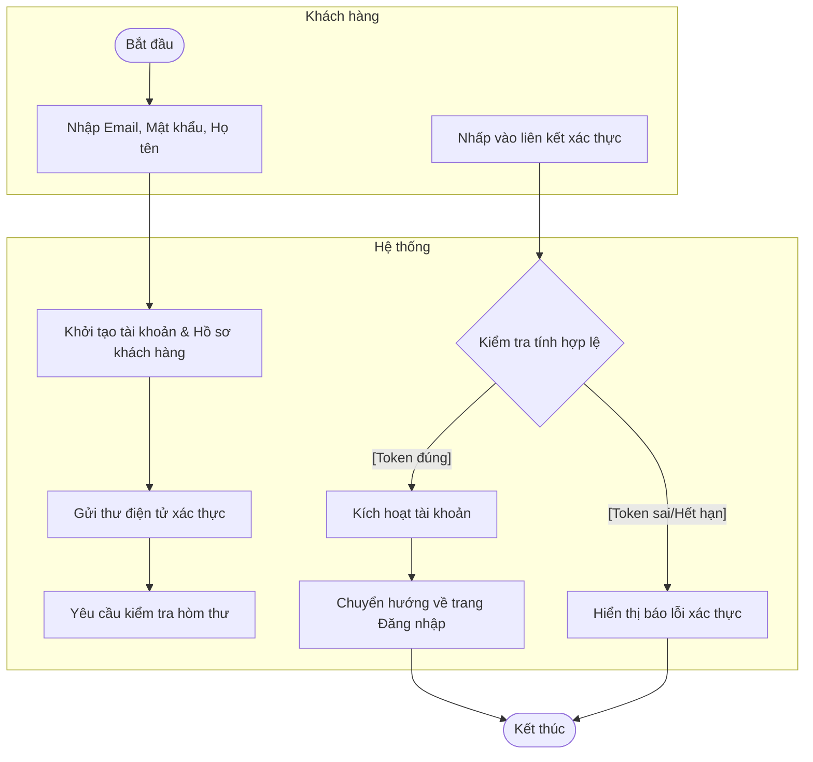
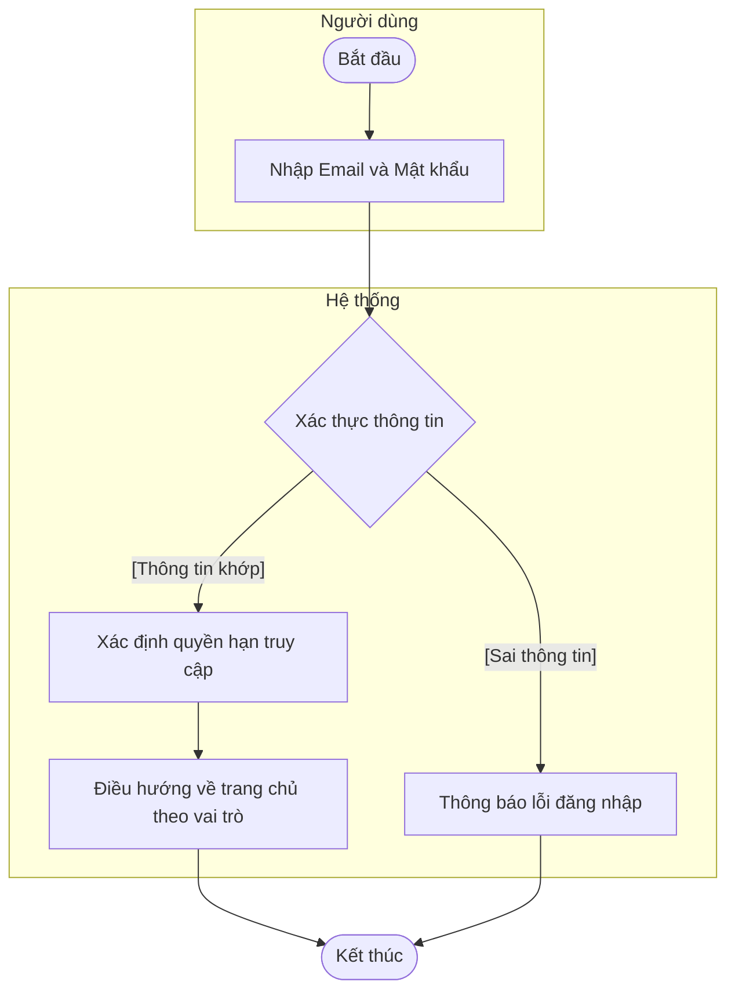
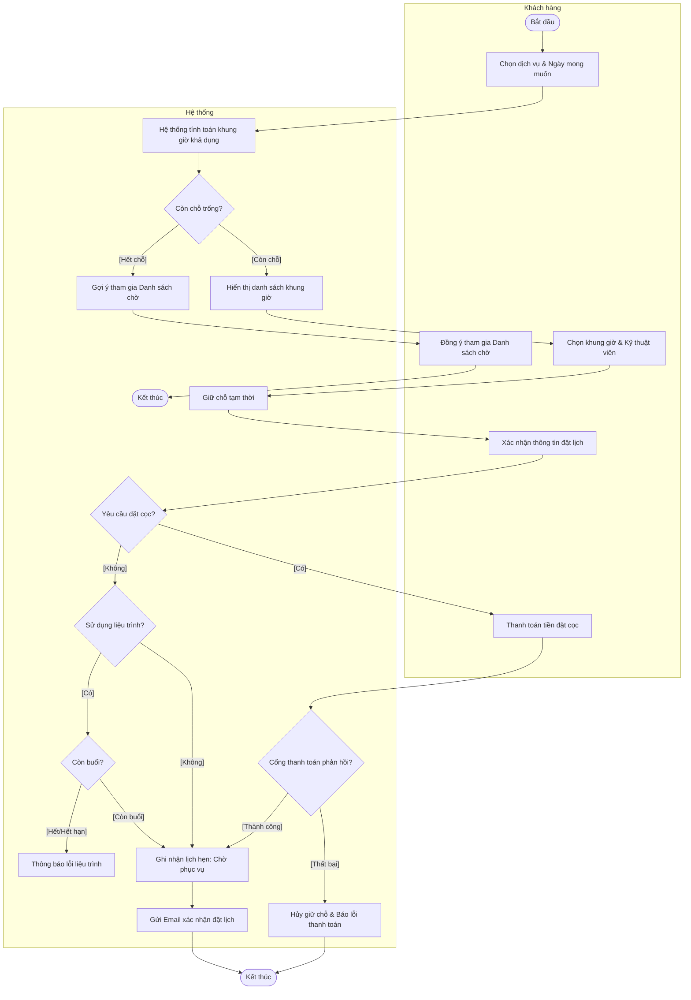
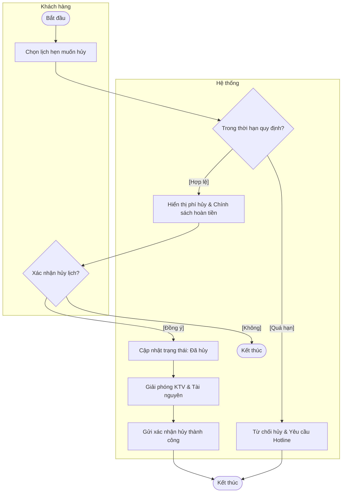
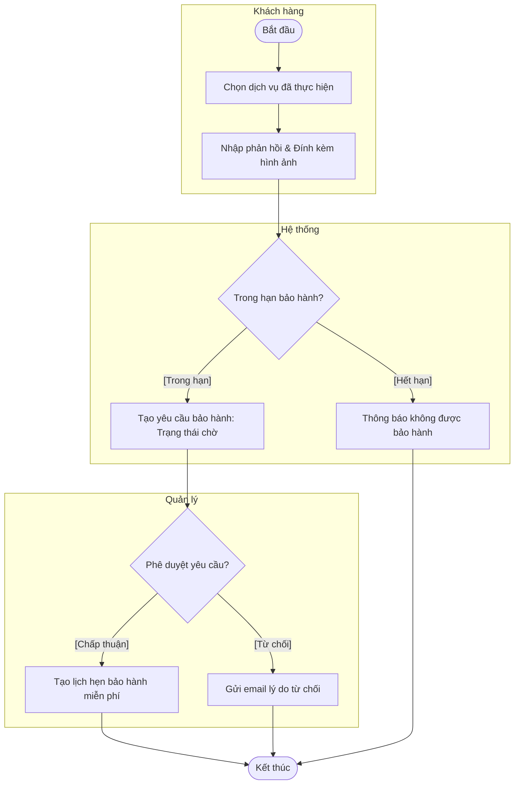
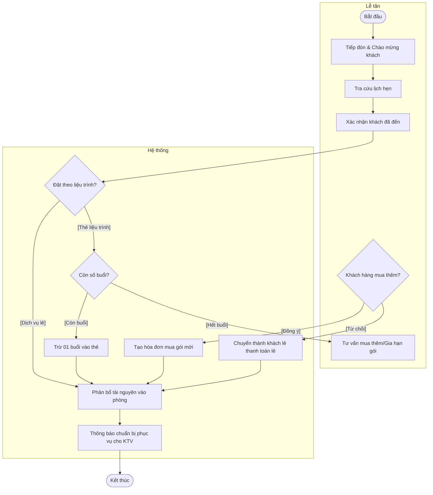
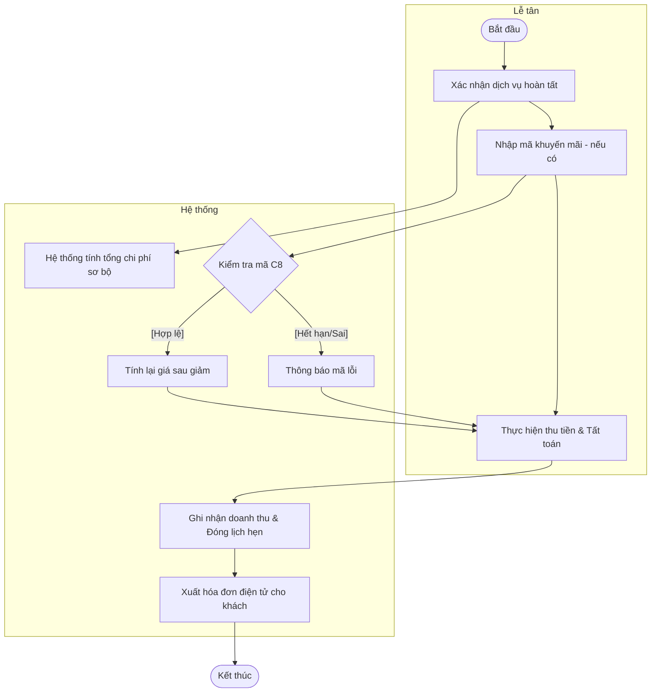
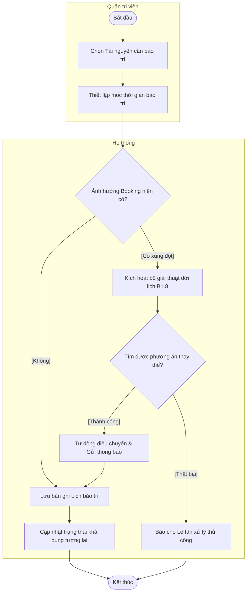
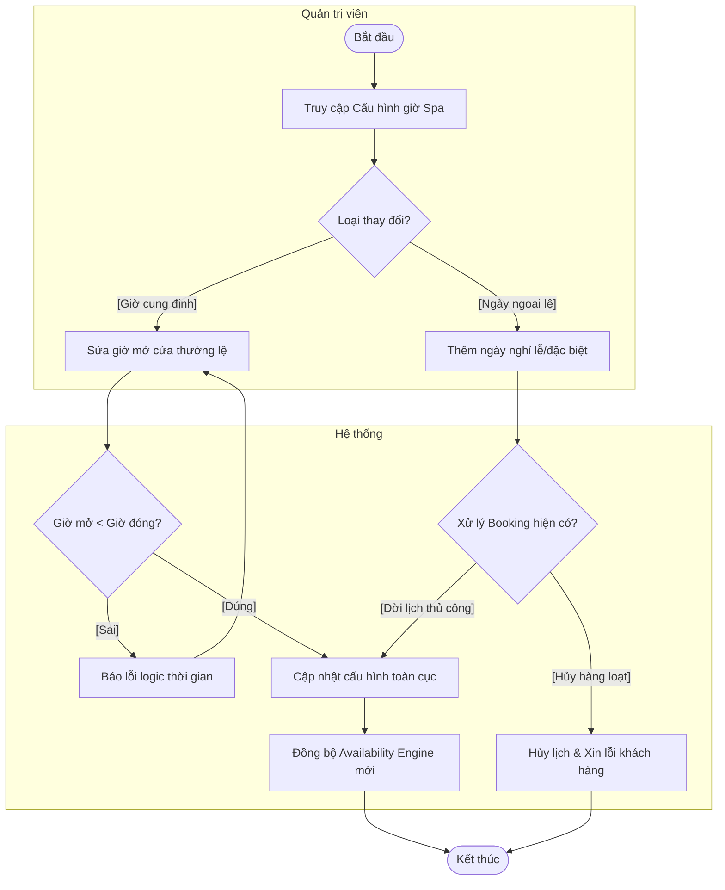
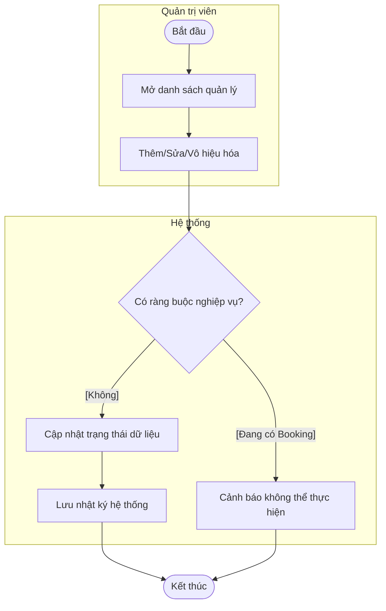

# Tổng hợp Sơ đồ Hoạt động (Activity Diagrams) - Synapse

Tài liệu này mô tả các luồng nghiệp vụ cấp hệ thống (Business Process Flows), tập trung vào sự phối hợp giữa tác nhân và trách nhiệm của hệ thống, tuân thủ nghiêm ngặt các tiêu chuẩn UML cho báo cáo học thuật.

---

## 1. Phân hệ Xác thực (Authentication)

### 1.1. Quy trình Đăng ký tài khoản khách hàng (A1.1)
Mô tả luồng từ khi người dùng đăng ký đến khi kích hoạt tài khoản thành công.

### 1.2. Quy trình Đăng nhập hệ thống (A1.2)
Xác thực danh tính người dùng và phân quyền truy cập.

---

## 2. Phân hệ Khách hàng (Customer)

### 2.1. Quy trình Đặt lịch hẹn trực tuyến (A2.4, A2.5)
Quy trình nghiệp vụ cốt lõi cho phép khách hàng chủ động đặt lịch dịch vụ.

### 2.2. Quy trình Hủy lịch hẹn (A3.2)
Kiểm soát hành vi hủy lịch dựa trên chính sách vận hành của doanh nghiệp.

### 2.3. Quy trình Gửi yêu cầu Bảo hành (A3.6)
Tiếp nhận và xử lý khiếu nại về chất lượng dịch vụ.

---

## 3. Phân hệ Lễ tân (Receptionist)

### 3.1. Quy trình Tiếp đón & Check-in (B1.4)
Nghiệp vụ khi khách hàng có mặt tại Spa để thực hiện dịch vụ.

### 3.2. Quy trình Thanh toán & Checkout (B1.5)
Tất toán dịch vụ, áp dụng mã khuyến mãi và xuất hóa đơn.

---

## 4. Phân hệ Quản trị (Admin)

### 4.1. Quy trình Bảo trì Tài nguyên & Xử lý sự cố (C7, B1.8)
Đảm bảo tính linh hoạt khi tài nguyên (phòng, thiết bị) bị hỏng hoặc cần bảo trì định kỳ.

### 4.2. Quy trình Cấu hình Lịch Spa & Ngày nghỉ (C1, C2)
Quản lý thời gian vận hành tổng quát của toàn hệ thống.

### 4.3. Quy trình Quản lý Master Data (C4, C5, C9)
Cập nhật dữ liệu nền tảng (Nhân sự, Dịch vụ).

---

## 5. Các quy tắc tuân thủ (UML Compliance)
1. **Swimlanes (subgraph):** Phân định rõ trách nhiệm giữa các Actor và System.
2. **Hành vi nghiệp vụ:** Tuyệt đối không dùng thuật ngữ kỹ thuật (SQL, JSON, Request).
3. **Guard Conditions:** Mọi điểm rẽ nhánh đều có điều kiện mô tả trong ngoặc vuông `[ ]`.
4. **Action Naming:** Đặt tên hành động theo góc nhìn tác nhân (đã làm gì).
5. **Start/End Node:** Một điểm khởi đầu và kết thúc rõ ràng cho toàn quy trình.
