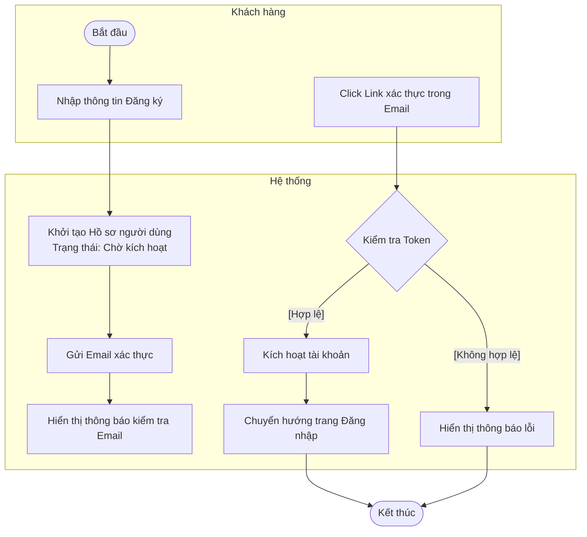
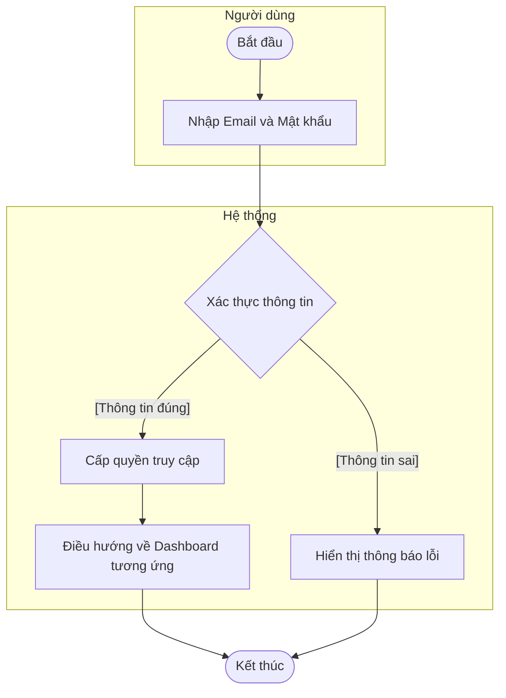
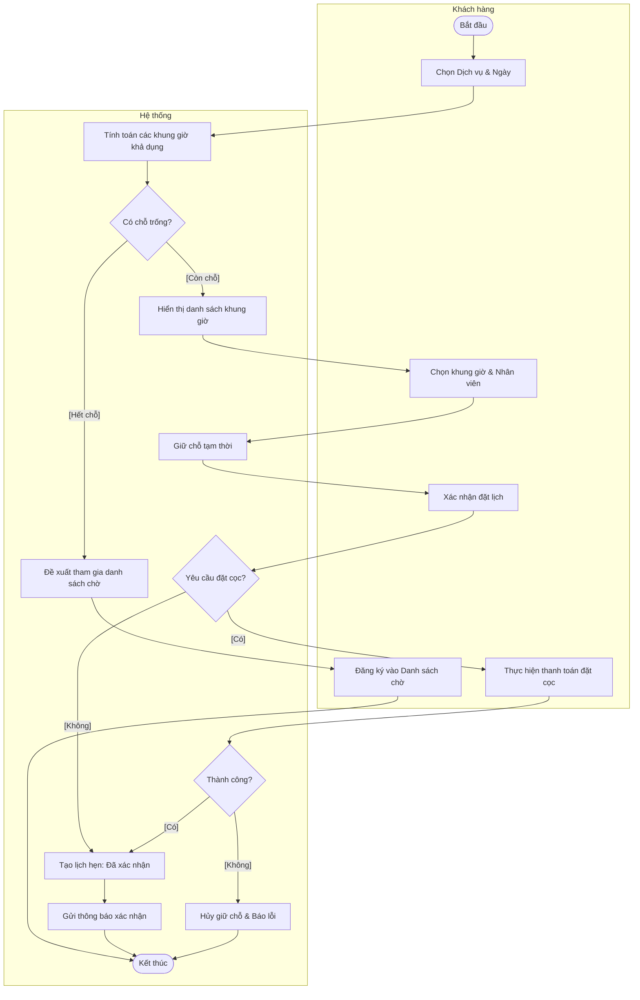
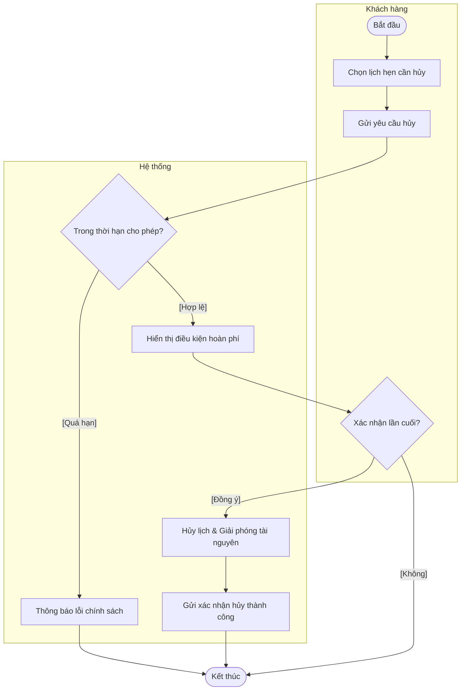
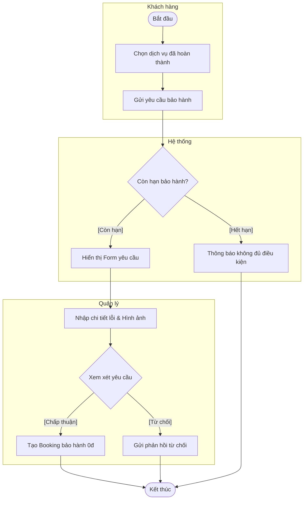
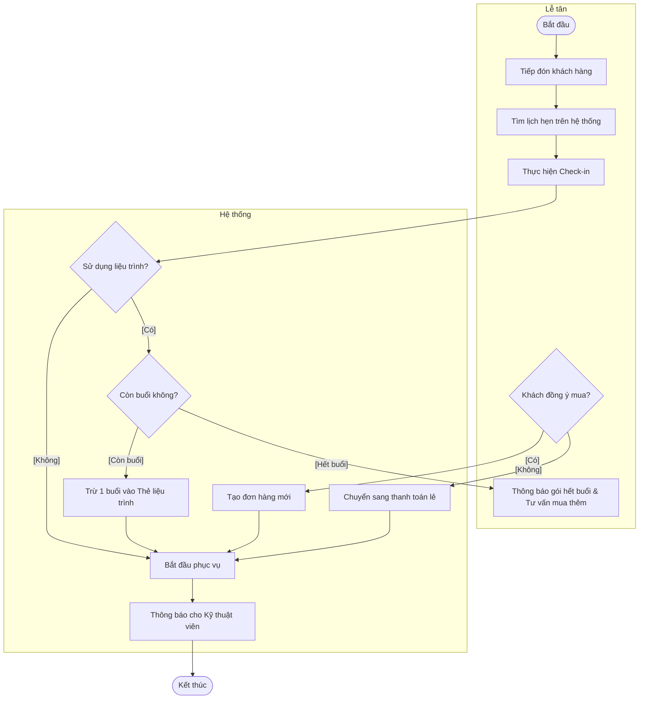
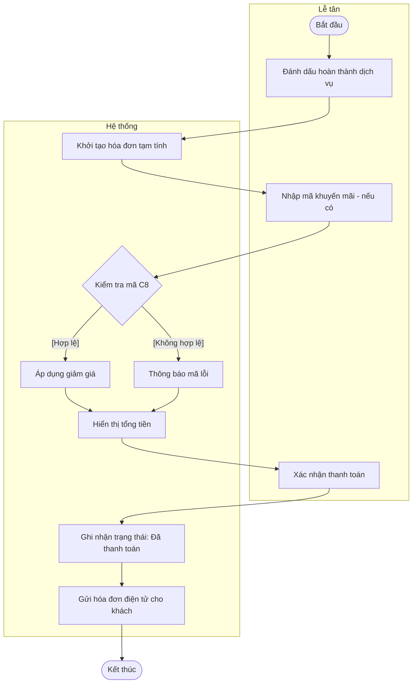
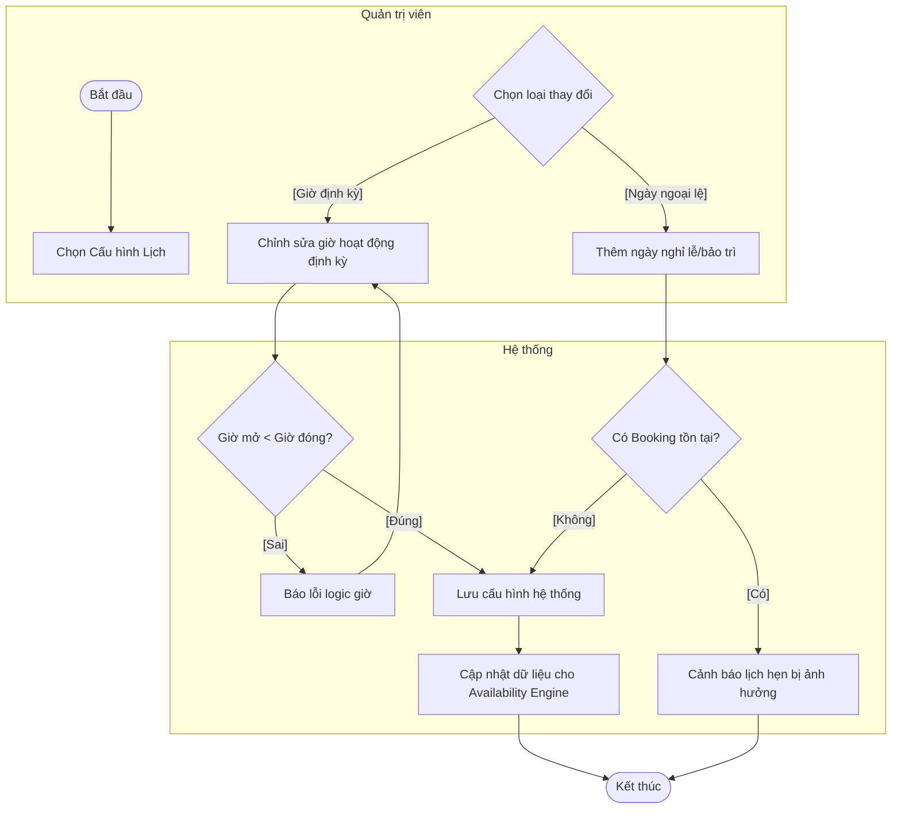
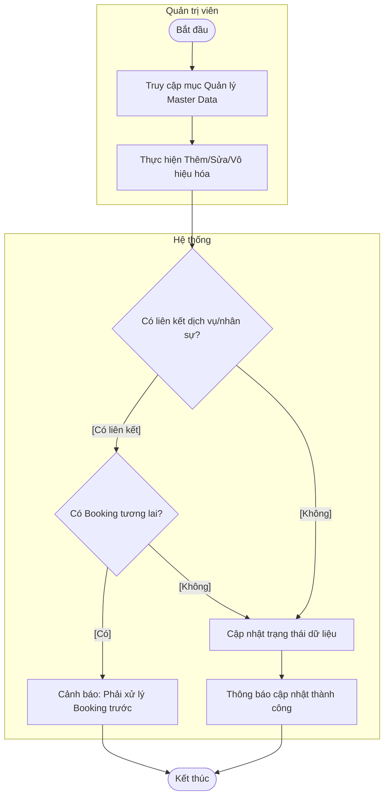

# Tổng hợp Sơ đồ Hoạt động (Activity Diagrams) - Synapse

Tài liệu này mô tả các luồng nghiệp vụ cấp hệ thống (Business Process Flows), tập trung vào tương tác giữa các tác nhân và trách nhiệm của hệ thống.

---

## 1. Phân hệ Xác thực (Authentication)

### 1.1. Quy trình Đăng ký tài khoản khách hàng (A1.1)
Mô tả luồng nghiệp vụ từ khi khách hàng tạo tài khoản đến khi kích hoạt.

### 1.2. Quy trình Đăng nhập hệ thống (A1.2)
Mô tả luồng xác thực người dùng và điều hướng theo vai trò.

---

## 2. Phân hệ Khách hàng (Customer)

### 2.1. Quy trình Đặt lịch hẹn trực tuyến (A2.4, A2.5)
Mô tả quy trình tìm kiếm và xác nhận lịch hẹn từ phía khách hàng.

### 2.2. Quy trình Hủy lịch hẹn (A3.2)
Kiểm soát hành vi hủy lịch theo chính sách của Spa.

### 2.3. Quy trình Gửi yêu cầu Bảo hành (A3.6)
Mô tả luồng xử lý khi khách hàng yêu cầu hỗ trợ cho dịch vụ đã hoàn thành.

---

## 3. Phân hệ Lễ tân (Receptionist)

### 3.1. Quy trình Tiếp đón & Check-in (B1.4)
Mô tả quy trình nghiệp vụ khi khách hàng đến Spa.

### 3.2. Quy trình Thanh toán & Checkout (B1.5)
Mô tả quy trình tất toán dịch vụ và áp dụng khuyến mãi.

---

## 4. Phân hệ Quản trị (Admin)

### 4.1. Quy trình Cấu hình Lịch hoạt động & Ngày nghỉ (C1, C2)
Hợp nhất luồng quản lý thời gian vận hành của Spa.

### 4.2. Quy trình Quản lý Master Data (C4, C5, C7)
Luồng nghiệp vụ khi thay đổi dữ liệu nhân sự, dịch vụ hoặc tài nguyên.

---
*Lưu ý: Các sơ đồ trên tập trung vào luồng nghiệp vụ cấp cao để đối chiếu với Sequence Diagram và Use Case.*
