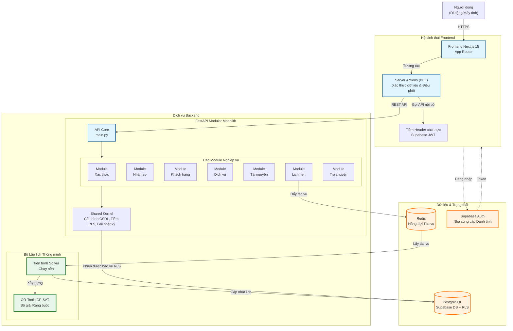

# Kiến Trúc Hệ Thống Synapse

Tài liệu này mô tả kiến trúc tổng thể của hệ thống chăm sóc khách hàng trực tuyến cho Spa, tuân thủ mô hình Modular Monolith.

---

## 1. Sơ đồ Kiến trúc Tổng quan



---

## 2. Các Thành phần Chính

### 2.1. Lớp Frontend (Next.js 15)
| Thành phần | Mô tả |
|------------|-------|
| **App Router** | Định tuyến dựa trên thư mục, hỗ trợ Server Components |
| **Server Actions** | Backend-for-Frontend, xử lý logic nghiệp vụ phía server |
| **Shadcn/UI** | Thư viện thành phần giao diện |

### 2.2. Lớp Backend (FastAPI)
| Thành phần | Mô tả |
|------------|-------|
| **API Core** | Điểm vào chính, gộp các Router từ các Module |
| **Vertical Slices** | Các Module nghiệp vụ độc lập (Xác thực, Khách hàng, Lịch hẹn...) |
| **Shared Kernel** | Mã hạ tầng dùng chung (Cấu hình CSDL, Tiêm RLS, Ghi nhật ký) |

### 2.3. Bộ Lập lịch Thông minh
| Thành phần | Mô tả |
|------------|-------|
| **Redis Queue** | Hàng đợi tác vụ cho các tính toán nặng |
| **Solver Worker** | Tiến trình nền xử lý thuật toán tối ưu |
| **OR-Tools CP-SAT** | Bộ giải ràng buộc của Google |

### 2.4. Lớp Dữ liệu
| Thành phần | Mô tả |
|------------|-------|
| **PostgreSQL** | Cơ sở dữ liệu chính với Supabase |
| **Row Level Security** | Bảo mật mức hàng theo vai trò người dùng |
| **Supabase Auth** | Xác thực và quản lý phiên đăng nhập |

---

## 3. Luồng Dữ liệu Chính

### 3.1. Luồng Đặt lịch Hẹn
```
Người dùng → Server Action → API Booking → Solver Worker → Cập nhật CSDL → Thông báo
```

### 3.2. Luồng Xác thực
```
Người dùng → Server Action → Supabase Auth → Nhận JWT → Tiêm vào Header
```

### 3.3. Luồng Truy vấn Dữ liệu
```
Server Action → API Router → Service → CSDL (qua phiên RLS) → Trả kết quả
```

---

## 4. Nguyên tắc Kiến trúc

### 4.1. Modular Monolith
- Mỗi Module là một "lát cắt dọc" chứa đầy đủ Router, Service, Schema, Model.
- Các Module giao tiếp qua Interface công khai (`__init__.py`).
- Cấm import trực tiếp vào file nội bộ của Module khác.

### 4.2. Bảo mật Mức Hàng (RLS)
- Mỗi phiên kết nối CSDL được tiêm thông tin người dùng hiện tại.
- PostgreSQL RLS Policy tự động lọc dữ liệu theo vai trò.

### 4.3. Bất đồng bộ cho Tác vụ Nặng
- Các tác vụ tính toán phức tạp (lập lịch tối ưu) được đẩy vào hàng đợi Redis.
- Tiến trình Solver chạy nền để tránh chặn API chính.

---

*Lưu ý: Sơ đồ này thể hiện kiến trúc logic. Việc triển khai thực tế có thể được đơn giản hóa trong phiên bản MVP.*
