# Thiết Kế Cơ Sở Dữ Liệu Synapse (Database Design)

Tài liệu này mô tả chi tiết mô hình dữ liệu (Data Model) và cung cấp script SQL khởi tạo cho hệ thống Synapse.

## 1. Mô hình Quan hệ Thực thể (ER Diagram)

```mermaid
erDiagram
    %% --- USERS & AUTH ---
    users {
        uuid id PK "Supabase Auth ID"
        string email
        string full_name
        string phone_number
        enum role "admin, manager, staff, customer"
        string avatar_url
        int loyalty_points "Only for customers"
        enum membership_tier "SILVER, GOLD, PLATINUM"
        timestamp created_at
    }

    staff_profiles {
        uuid user_id PK, FK
        string title "Example: Senior Stylist"
        string bio
        string color_code "Display color"
        float commission_rate
        date hired_at
    }

    users ||--o| staff_profiles : "has"

    %% --- SERVICES & SKILLS ---
    skills {
        uuid id PK
        string name
        string code "Unique code"
    }

    staff_skills {
        uuid staff_id PK, FK
        uuid skill_id PK, FK
    }

    staff_profiles ||--|{ staff_skills : "possesses"
    skills ||--|{ staff_skills : "assigned_to"

    service_categories {
        uuid id PK
        string name
        string description
    }

    services {
        uuid id PK
        string name
        int duration_minutes
        decimal price
        int buffer_time_minutes
        string description
        string color_code
        bool is_active
        uuid category_id FK
    }

    service_categories ||--|{ services : "contains"

    service_required_skills {
        uuid service_id PK, FK
        uuid skill_id PK, FK
    }
    services ||--|{ service_required_skills : "requires"

    %% --- RESOURCES ---
    resources {
        uuid id PK
        string name
        enum type "ROOM, EQUIPMENT"
        enum status "ACTIVE, MAINTENANCE"
        int capacity
        int setup_time_minutes
    }

    service_resource_requirements {
        uuid service_id PK, FK
        enum resource_type "ROOM, EQUIPMENT"
        int quantity
    }
    services ||--|{ service_resource_requirements : "needs"

    %% --- SCHEDULING ---
    shifts {
        uuid id PK
        string name
        time start_time
        time end_time
        string color_code
    }

    staff_schedules {
        uuid id PK
        uuid staff_id FK
        uuid shift_id FK
        date work_date
        enum status "PUBLISHED, DRAFT"
    }
    staff_profiles ||--|{ staff_schedules : "assigned"
    shifts ||--|{ staff_schedules : "defined_by"

    %% --- BOOKINGS ---
    bookings {
        uuid id PK
        uuid customer_id FK
        timestamp start_time
        timestamp end_time
        enum status "PENDING, CONFIRMED, IN_PROGRESS, COMPLETED, CANCELLED, NO_SHOW"
        string notes
        decimal total_price
        timestamp created_at
    }
    users ||--|{ bookings : "makes"

    booking_items {
        uuid id PK
        uuid booking_id FK
        uuid service_id FK
        uuid staff_id FK "Assigned Technician"
        uuid resource_id FK "Assigned Room"
        timestamp start_time
        timestamp end_time
        decimal price
    }
    bookings ||--|{ booking_items : "includes"
    services ||--|{ booking_items : "instance_of"
    staff_profiles ||--o{ booking_items : "performs"
    resources ||--o{ booking_items : "occupies"

    %% --- TREATMENTS (PACKAGES) ---
    customer_treatments {
        uuid id PK
        uuid customer_id FK
        uuid service_id FK
        int total_sessions
        int used_sessions
        date expiry_date
        enum status "ACTIVE, COMPLETED, EXPIRED"
    }
    users ||--|{ customer_treatments : "owns"

    %% --- BILLING ---
    invoices {
        uuid id PK
        uuid booking_id FK
        decimal amount
        timestamp issued_at
        enum status "PAID, UNPAID, REFUNDED"
    }
    bookings ||--|| invoices : "generates"

    payments {
        uuid id PK
        uuid invoice_id FK
        decimal amount
        enum method "CASH, CARD, TRANSFER"
        timestamp transaction_time
    }
    invoices ||--|{ payments : "paid_by"

    %% --- REVIEWS ---
    reviews {
        uuid id PK
        uuid booking_id FK
        uuid customer_id FK
        int rating "1-5"
        string comment
        timestamp created_at
    }
    bookings ||--o| reviews : "rated_in"
```



## 2. PostgreSQL Creation Script

```sql
-- Kích hoạt Extension UUID
CREATE EXTENSION IF NOT EXISTS "uuid-ossp";

-- --- ENUMS ---
CREATE TYPE user_role AS ENUM ('admin', 'manager', 'staff', 'customer');
CREATE TYPE membership_tier AS ENUM ('SILVER', 'GOLD', 'PLATINUM');
CREATE TYPE resource_type AS ENUM ('ROOM', 'EQUIPMENT');
CREATE TYPE resource_status AS ENUM ('ACTIVE', 'MAINTENANCE', 'INACTIVE');
CREATE TYPE booking_status AS ENUM ('PENDING', 'CONFIRMED', 'IN_PROGRESS', 'COMPLETED', 'CANCELLED', 'NO_SHOW');
CREATE TYPE invoice_status AS ENUM ('PAID', 'UNPAID', 'REFUNDED');
CREATE TYPE payment_method AS ENUM ('CASH', 'CARD', 'TRANSFER');
CREATE TYPE treatment_status AS ENUM ('ACTIVE', 'COMPLETED', 'EXPIRED');
CREATE TYPE schedule_status AS ENUM ('PUBLISHED', 'DRAFT');

-- --- USERS MODULE ---
CREATE TABLE users (
    id UUID PRIMARY KEY DEFAULT uuid_generate_v4(),
    email VARCHAR(255) UNIQUE NOT NULL,
    full_name VARCHAR(255),
    phone_number VARCHAR(50),
    avatar_url TEXT,
    role user_role DEFAULT 'customer',
    is_active BOOLEAN DEFAULT TRUE,

    -- Customer specific fields
    loyalty_points INTEGER DEFAULT 0,
    membership_tier membership_tier DEFAULT 'SILVER',
    date_of_birth DATE,
    address TEXT,

    created_at TIMESTAMPTZ DEFAULT NOW(),
    updated_at TIMESTAMPTZ DEFAULT NOW()
);

-- --- STAFF MODULE ---
CREATE TABLE staff_profiles (
    user_id UUID PRIMARY KEY REFERENCES users(id) ON DELETE CASCADE,
    title VARCHAR(100) NOT NULL,
    bio TEXT,
    color_code VARCHAR(7) DEFAULT '#000000',
    commission_rate DECIMAL(5, 2) DEFAULT 0.0,
    hired_at DATE DEFAULT CURRENT_DATE
);

CREATE TABLE skills (
    id UUID PRIMARY KEY DEFAULT uuid_generate_v4(),
    name VARCHAR(100) NOT NULL,
    code VARCHAR(50) UNIQUE NOT NULL,
    description TEXT
);

CREATE TABLE staff_skills (
    staff_id UUID REFERENCES staff_profiles(user_id) ON DELETE CASCADE,
    skill_id UUID REFERENCES skills(id) ON DELETE CASCADE,
    PRIMARY KEY (staff_id, skill_id)
);

-- --- SERVICES MODULE ---
CREATE TABLE service_categories (
    id UUID PRIMARY KEY DEFAULT uuid_generate_v4(),
    name VARCHAR(100) NOT NULL,
    description TEXT
);

CREATE TABLE services (
    id UUID PRIMARY KEY DEFAULT uuid_generate_v4(),
    category_id UUID REFERENCES service_categories(id) ON DELETE SET NULL,
    name VARCHAR(255) NOT NULL,
    duration_minutes INTEGER NOT NULL,
    buffer_time_minutes INTEGER DEFAULT 0,
    price DECIMAL(12, 2) NOT NULL,
    description TEXT,
    image_url TEXT,
    color_code VARCHAR(7),
    is_active BOOLEAN DEFAULT TRUE,
    created_at TIMESTAMPTZ DEFAULT NOW(),
    updated_at TIMESTAMPTZ DEFAULT NOW()
);

CREATE TABLE service_required_skills (
    service_id UUID REFERENCES services(id) ON DELETE CASCADE,
    skill_id UUID REFERENCES skills(id) ON DELETE CASCADE,
    PRIMARY KEY (service_id, skill_id)
);

-- --- RESOURCES MODULE ---
CREATE TABLE resources (
    id UUID PRIMARY KEY DEFAULT uuid_generate_v4(),
    name VARCHAR(100) NOT NULL,
    code VARCHAR(50) UNIQUE,
    type resource_type NOT NULL,
    status resource_status DEFAULT 'ACTIVE',
    capacity INTEGER DEFAULT 1,
    setup_time_minutes INTEGER DEFAULT 0,
    description TEXT,
    image_url TEXT
);

-- Mapping relationship: Service needs Resource Types (not specific instances)
CREATE TABLE service_resource_requirements (
    service_id UUID REFERENCES services(id) ON DELETE CASCADE,
    resource_type resource_type NOT NULL,
    quantity INTEGER DEFAULT 1,
    PRIMARY KEY (service_id, resource_type)
);

-- --- SCHEDULING MODULE ---
CREATE TABLE shifts (
    id UUID PRIMARY KEY DEFAULT uuid_generate_v4(),
    name VARCHAR(100) NOT NULL,
    start_time TIME NOT NULL,
    end_time TIME NOT NULL,
    color_code VARCHAR(7)
);

CREATE TABLE staff_schedules (
    id UUID PRIMARY KEY DEFAULT uuid_generate_v4(),
    staff_id UUID REFERENCES staff_profiles(user_id) ON DELETE CASCADE,
    shift_id UUID REFERENCES shifts(id) ON DELETE CASCADE,
    work_date DATE NOT NULL,
    status schedule_status DEFAULT 'DRAFT',
    created_at TIMESTAMPTZ DEFAULT NOW(),
    UNIQUE(staff_id, work_date, shift_id)
);

-- --- BOOKING MODULE ---
CREATE TABLE bookings (
    id UUID PRIMARY KEY DEFAULT uuid_generate_v4(),
    customer_id UUID REFERENCES users(id) ON DELETE SET NULL,

    start_time TIMESTAMPTZ NOT NULL,
    end_time TIMESTAMPTZ NOT NULL,

    status booking_status DEFAULT 'PENDING',
    notes TEXT,
    cancel_reason TEXT,

    total_price DECIMAL(12, 2) DEFAULT 0,

    created_at TIMESTAMPTZ DEFAULT NOW(),
    updated_at TIMESTAMPTZ DEFAULT NOW()
);

-- Chi tiết từng dịch vụ trong booking (có thể book nhiều dịch vụ 1 lần)
CREATE TABLE booking_items (
    id UUID PRIMARY KEY DEFAULT uuid_generate_v4(),
    booking_id UUID REFERENCES bookings(id) ON DELETE CASCADE,
    service_id UUID REFERENCES services(id),

    -- Assigned Resources
    staff_id UUID REFERENCES staff_profiles(user_id),
    resource_id UUID REFERENCES resources(id), -- Room assignment

    start_time TIMESTAMPTZ NOT NULL,
    end_time TIMESTAMPTZ NOT NULL,
    original_price DECIMAL(12, 2) NOT NULL
);

-- --- CUSTOMER TREATMENTS (PACKAGES) ---
CREATE TABLE customer_treatments (
    id UUID PRIMARY KEY DEFAULT uuid_generate_v4(),
    customer_id UUID REFERENCES users(id) ON DELETE CASCADE,
    service_id UUID REFERENCES services(id), -- Liệu trình gốc

    name VARCHAR(255) NOT NULL, -- Tên gói đã mua
    total_sessions INTEGER NOT NULL,
    used_sessions INTEGER DEFAULT 0,

    expiry_date DATE,
    status treatment_status DEFAULT 'ACTIVE',
    created_at TIMESTAMPTZ DEFAULT NOW()
);

-- --- BILLING & REVIEWS ---
CREATE TABLE invoices (
    id UUID PRIMARY KEY DEFAULT uuid_generate_v4(),
    booking_id UUID REFERENCES bookings(id),
    amount DECIMAL(12, 2) NOT NULL,
    status invoice_status DEFAULT 'UNPAID',
    issued_at TIMESTAMPTZ DEFAULT NOW()
);

CREATE TABLE payments (
    id UUID PRIMARY KEY DEFAULT uuid_generate_v4(),
    invoice_id UUID REFERENCES invoices(id) ON DELETE CASCADE,
    amount DECIMAL(12, 2) NOT NULL,
    method payment_method NOT NULL,
    transaction_time TIMESTAMPTZ DEFAULT NOW()
);

CREATE TABLE reviews (
    id UUID PRIMARY KEY DEFAULT uuid_generate_v4(),
    booking_id UUID REFERENCES bookings(id),
    customer_id UUID REFERENCES users(id),
    rating INTEGER CHECK (rating >= 1 AND rating <= 5),
    comment TEXT,
    created_at TIMESTAMPTZ DEFAULT NOW()
);

-- --- INDEXES ---
CREATE INDEX idx_users_email ON users(email);
CREATE INDEX idx_bookings_customer ON bookings(customer_id);
CREATE INDEX idx_bookings_date ON bookings(start_time);
CREATE INDEX idx_staff_schedules_date ON staff_schedules(work_date);
```
## 3. Bảng Đặc Tả Dữ Liệu (Data Dictionary)

Dưới đây là chi tiết kỹ thuật cho từng bảng dữ liệu trong hệ thống.

### 3.1. Users & Staff

#### Bảng `users`
Lưu trữ thông tin xác thực và hồ sơ cơ bản của mọi người dùng hệ thống.

| Tên Trường | Kiểu Dữ Liệu | Bắt buộc | Mặc định | Mô tả |
| :--- | :--- | :--- | :--- | :--- |
| `id` | UUID | Có | `uuid_generate_v4()` | Khóa chính, đồng nhất với Supabase Auth ID. |
| `email` | VARCHAR(255) | Có | - | Địa chỉ email duy nhất. |
| `full_name` | VARCHAR(255) | Không | - | Tên hiển thị đầy đủ. |
| `phone_number` | VARCHAR(50) | Không | - | Số điện thoại liên lạc. |
| `avatar_url` | TEXT | Không | - | Đường dẫn ảnh đại diện. |
| `role` | ENUM `user_role` | Có | `'customer'` | Vai trò: `admin`, `manager`, `staff`, `customer`. |
| `is_active` | BOOLEAN | Có | `TRUE` | Trạng thái hoạt động của tài khoản. |
| `loyalty_points` | INTEGER | Không | `0` | Điểm tích lũy (chỉ áp dụng cho khách hàng). |
| `membership_tier` | ENUM | Không | `'SILVER'` | Hạng thành viên: `SILVER`, `GOLD`, `PLATINUM`. |
| `date_of_birth` | DATE | Không | - | Ngày sinh (phục vụ CSKH/Marketing). |
| `address` | TEXT | Không | - | Địa chỉ liên lạc. |

#### Bảng `staff_profiles`
Thông tin mở rộng cho người dùng có vai trò nhân viên. Quan hệ 1-1 với `users`.

| Tên Trường | Kiểu Dữ Liệu | Bắt buộc | Mặc định | Mô tả |
| :--- | :--- | :--- | :--- | :--- |
| `user_id` | UUID | Có | - | Khóa chính, FK trỏ tới `users.id`. |
| `title` | VARCHAR(100) | Có | - | Chức danh (ví dụ: Senior Stylist). |
| `bio` | TEXT | Không | - | Giới thiệu ngắn về kỹ năng/kinh nghiệm. |
| `color_code` | VARCHAR(7) | Không | `'#000000'` | Mã màu hiển thị trên lịch (Hex). |
| `commission_rate` | DECIMAL(5,2) | Không | `0.0` | Tỷ lệ hoa hồng (%) trên dịch vụ. |
| `hired_at` | DATE | Không | `CURRENT_DATE` | Ngày bắt đầu làm việc. |

### 3.2. Services & Skills

#### Bảng `skills`
Danh sách các kỹ năng chuyên môn mà nhân viên có thể sở hữu.

| Tên Trường | Kiểu Dữ Liệu | Bắt buộc | Mô tả |
| :--- | :--- | :--- | :--- |
| `id` | UUID | Có | Khóa chính. |
| `name` | VARCHAR(100) | Có | Tên kỹ năng hiển thị. |
| `code` | VARCHAR(50) | Có | Mã định danh duy nhất (Unique). |
| `description` | TEXT | Không | Mô tả chi tiết kỹ năng. |

#### Bảng `services`
Danh mục các dịch vụ Spa cung cấp.

| Tên Trường | Kiểu Dữ Liệu | Bắt buộc | Mặc định | Mô tả |
| :--- | :--- | :--- | :--- | :--- |
| `id` | UUID | Có | - | Khóa chính. |
| `category_id` | UUID | Không | - | FK trỏ tới `service_categories`. |
| `name` | VARCHAR(255) | Có | - | Tên dịch vụ. |
| `duration_minutes` | INTEGER | Có | - | Thời lượng thực hiện tiêu chuẩn (phút). |
| `buffer_time_minutes` | INTEGER | Không | `0` | Thời gian nghỉ/dọn dẹp sau dịch vụ. |
| `price` | DECIMAL(12,2)| Có | - | Giá niêm yết. |
| `color_code` | VARCHAR(7) | Không | - | Màu hiển thị trên bảng giá/lịch. |
| `is_active` | BOOLEAN | Có | `TRUE` | Trạng thái kinh doanh dịch vụ. |

### 3.3. Resources (Tài nguyên)

#### Bảng `resources`
Quản lý phòng ốc và thiết bị máy móc.

| Tên Trường | Kiểu Dữ Liệu | Bắt buộc | Mặc định | Mô tả |
| :--- | :--- | :--- | :--- | :--- |
| `id` | UUID | Có | - | Khóa chính. |
| `name` | VARCHAR(100) | Có | - | Tên phòng/thiết bị. |
| `type` | ENUM | Có | - | Loại tài nguyên: `ROOM` hoặc `EQUIPMENT`. |
| `status` | ENUM | Có | `'ACTIVE'` | Trạng thái: `ACTIVE`, `MAINTENANCE`, `INACTIVE`. |
| `capacity` | INTEGER | Không | `1` | Sức chứa (số khách đồng thời). |
| `setup_time_minutes` | INTEGER | Không | `0` | Thời gian chuẩn bị trước khi sử dụng. |

### 3.4. Scheduling (Lịch làm việc)

#### Bảng `shifts`
Định nghĩa các ca làm việc tiêu chuẩn.

| Tên Trường | Kiểu Dữ Liệu | Bắt buộc | Mô tả |
| :--- | :--- | :--- | :--- |
| `id` | UUID | Có | Khóa chính. |
| `name` | VARCHAR(100) | Có | Tên ca (Sáng, Chiều, Full). |
| `start_time` | TIME | Có | Giờ bắt đầu. |
| `end_time` | TIME | Có | Giờ kết thúc. |

#### Bảng `staff_schedules`
Phân công ca làm việc cho nhân viên theo ngày.

| Tên Trường | Kiểu Dữ Liệu | Bắt buộc | Mô tả |
| :--- | :--- | :--- | :--- |
| `id` | UUID | Có | Khóa chính. |
| `staff_id` | UUID | Có | Nhân viên được phân công. |
| `shift_id` | UUID | Có | Ca làm việc được gán. |
| `work_date` | DATE | Có | Ngày làm việc. |
| `status` | ENUM | Có | Trạng thái bản ghi (`DRAFT`/`PUBLISHED`). |

### 3.5. Booking (Đặt hẹn)

#### Bảng `bookings`
Lưu trữ thông tin tổng quát của một lần đặt hẹn.

| Tên Trường | Kiểu Dữ Liệu | Bắt buộc | Mặc định | Mô tả |
| :--- | :--- | :--- | :--- | :--- |
| `id` | UUID | Có | - | Khóa chính. |
| `customer_id` | UUID | Không | - | Khách hàng đặt (Null nếu khách vãng lai không tlb). |
| `start_time` | TIMESTAMPTZ | Có | - | Thời gian bắt đầu dự kiến tổng thể. |
| `end_time` | TIMESTAMPTZ | Có | - | Thời gian kết thúc dự kiến tổng thể. |
| `status` | ENUM | Có | `'PENDING'` | Trạng thái quy trình (Pending, Confirmed, ...). |
| `total_price` | DECIMAL | Không | `0` | Tổng giá trị booking (tạm tính). |

#### Bảng `booking_items`
Chi tiết các dịch vụ trong một booking (để hỗ trợ gán nhiều KTV/Phòng cho 1 booking).

| Tên Trường | Kiểu Dữ Liệu | Bắt buộc | Mô tả |
| :--- | :--- | :--- | :--- |
| `id` | UUID | Có | Khóa chính. |
| `booking_id` | UUID | Có | Thuộc về booking nào. |
| `service_id` | UUID | Có | Dịch vụ được chọn. |
| `staff_id` | UUID | Không | Kỹ thuật viên thực hiện (Có thể null lúc mới đặt). |
| `resource_id` | UUID | Không | Phòng/Thiết bị sử dụng. |
| `original_price`| DECIMAL | Có | Giá gốc tại thời điểm đặt. |

### 3.6. Billing (Thanh toán)

#### Bảng `invoices`
Hóa đơn thanh toán cho booking.

| Tên Trường | Kiểu Dữ Liệu | Bắt buộc | Mô tả |
| :--- | :--- | :--- | :--- |
| `id` | UUID | Có | Khóa chính. |
| `booking_id` | UUID | Có | Tham chiếu booking. |
| `amount` | DECIMAL | Có | Số tiền cần thanh toán. |
| `status` | ENUM | Có | `PAID`, `UNPAID`, `REFUNDED`. |

#### Bảng `payments`
Giao dịch thanh toán thực tế (có thể thanh toán nhiều lần cho 1 hóa đơn).

| Tên Trường | Kiểu Dữ Liệu | Bắt buộc | Mô tả |
| :--- | :--- | :--- | :--- |
| `id` | UUID | Có | Khóa chính. |
| `invoice_id` | UUID | Có | Thuộc về hóa đơn nào. |
| `amount` | DECIMAL | Có | Số tiền giao dịch. |

### 3.7. Treatments (Gói Liệu Trình)

#### Bảng `customer_treatments`
Lưu trữ thông tin các gói liệu trình/combo mà khách hàng đã mua và trạng thái sử dụng.

| Tên Trường | Kiểu Dữ Liệu | Bắt buộc | Mặc định | Mô tả |
| :--- | :--- | :--- | :--- | :--- |
| `id` | UUID | Có | - | Khóa chính. |
| `customer_id` | UUID | Có | - | Khách hàng sở hữu gói. |
| `service_id` | UUID | Có | - | Dịch vụ gốc (Dịch vụ gói). |
| `name` | VARCHAR(255) | Có | - | Tên gói tại thời điểm mua (Snapshot). |
| `total_sessions` | INTEGER | Có | - | Tổng số buổi trong liệu trình. |
| `used_sessions` | INTEGER | Không | `0` | Số buổi đã sử dụng. |
| `expiry_date` | DATE | Không | - | Ngày hết hạn sử dụng. |
| `status` | ENUM | Có | `'ACTIVE'` | `ACTIVE` (Còn hạn), `COMPLETED` (Hết buổi), `EXPIRED`. |

### 3.8. Reviews (Đánh Giá)

#### Bảng `reviews`
Lưu trữ phản hồi của khách hàng sau khi hoàn tất dịch vụ.

| Tên Trường | Kiểu Dữ Liệu | Bắt buộc | Mô tả |
| :--- | :--- | :--- | :--- |
| `id` | UUID | Có | Khóa chính. |
| `booking_id` | UUID | Có | Đánh giá cho lần đặt hẹn nào. |
| `customer_id` | UUID | Có | Người đánh giá. |
| `rating` | INTEGER | Có | Điểm số (1-5 sao). |
| `comment` | TEXT | Không | Nội dung phản hồi chi tiết. |
