# Thiết Kế Cơ Sở Dữ Liệu Synapse (Database Design) v2.0

Tài liệu này mô tả chi tiết mô hình dữ liệu (Data Model) và cung cấp script SQL khởi tạo cho hệ thống Synapse. **Phiên bản 2.0** đã được tối ưu hóa về bảo mật (RLS), hiệu năng (Index), và toàn vẹn dữ liệu (Constraints).

## 1. Mô hình Quan hệ Thực thể (ER Diagram)

```mermaid
erDiagram
    %% === USERS & PROFILES ===
    users {
        uuid id PK "Supabase Auth ID"
        string email UK
        string full_name
        string phone_number UK
        enum role "admin, manager, staff, customer"
        string avatar_url
        boolean is_active
        timestamp deleted_at "Soft Delete"
        timestamp created_at
        timestamp updated_at
    }

    staff_profiles {
        uuid user_id PK,FK
        string title
        string bio
        string color_code
        decimal commission_rate "0-100%"
        date hired_at
    }

    customer_profiles {
        uuid user_id PK,FK
        int loyalty_points
        enum membership_tier "SILVER, GOLD, PLATINUM"
        date date_of_birth
        text address
    }

    users ||--o| staff_profiles : "has"
    users ||--o| customer_profiles : "has"

    %% === SKILLS ===
    skills {
        uuid id PK
        string name
        string code UK
        text description
    }

    staff_skills {
        uuid staff_id PK,FK
        uuid skill_id PK,FK
        int proficiency_level "1-3"
    }

    staff_profiles ||--|{ staff_skills : "possesses"
    skills ||--|{ staff_skills : "assigned_to"

    %% === SERVICES ===
    service_categories {
        uuid id PK
        string name
        text description
        int sort_order
    }

    services {
        uuid id PK
        uuid category_id FK
        string name
        int duration_minutes
        int buffer_time_minutes
        decimal price
        text description
        string image_url
        string color_code
        boolean is_active
        timestamp created_at
        timestamp updated_at
    }

    service_categories ||--|{ services : "contains"

    service_required_skills {
        uuid service_id PK,FK
        uuid skill_id PK,FK
        int min_proficiency_level
    }

    services ||--|{ service_required_skills : "requires"
    skills ||--|{ service_required_skills : "needed_by"

    %% === RESOURCES ===
    resources {
        uuid id PK
        string name
        string code UK
        enum type "ROOM, EQUIPMENT"
        enum status "ACTIVE, MAINTENANCE, INACTIVE"
        int capacity
        int setup_time_minutes
        text description
        string image_url
    }

    service_resource_requirements {
        uuid service_id PK,FK
        enum resource_type
        int quantity
    }

    services ||--|{ service_resource_requirements : "needs"

    %% === SCHEDULING ===
    shifts {
        uuid id PK
        string name
        time start_time
        time end_time
        string color_code
    }

    staff_schedules {
        uuid id PK
        uuid staff_id FK
        uuid shift_id FK
        date work_date
        enum status "PUBLISHED, DRAFT"
        timestamp created_at
    }

    staff_profiles ||--|{ staff_schedules : "assigned"
    shifts ||--|{ staff_schedules : "defined_by"

    %% === BOOKINGS ===
    bookings {
        uuid id PK
        uuid customer_id FK
        timestamp start_time
        timestamp end_time
        enum status
        text notes
        text cancel_reason
        timestamp check_in_time
        timestamp actual_start_time
        timestamp actual_end_time
        decimal total_price
        timestamp created_at
        timestamp updated_at
    }

    users ||--|{ bookings : "makes"

    booking_items {
        uuid id PK
        uuid booking_id FK
        uuid service_id FK
        uuid staff_id FK
        uuid resource_id FK
        uuid treatment_id FK
        timestamp start_time
        timestamp end_time
        decimal original_price
    }

    bookings ||--|{ booking_items : "includes"
    services ||--|{ booking_items : "instance_of"
    staff_profiles ||--o{ booking_items : "performs"
    resources ||--o{ booking_items : "occupies"

    %% === TREATMENTS ===
    customer_treatments {
        uuid id PK
        uuid customer_id FK
        uuid service_id FK
        string name
        int total_sessions
        int used_sessions
        date expiry_date
        enum status "ACTIVE, COMPLETED, EXPIRED"
        timestamp created_at
    }

    users ||--|{ customer_treatments : "owns"
    booking_items ||--o| customer_treatments : "redeems"

    %% === BILLING ===
    invoices {
        uuid id PK
        uuid booking_id FK,UK
        decimal amount
        enum status "PAID, UNPAID, REFUNDED"
        timestamp issued_at
    }

    bookings ||--|| invoices : "generates"

    payments {
        uuid id PK
        uuid invoice_id FK
        decimal amount
        enum method "CASH, CARD, TRANSFER"
        timestamp transaction_time
    }

    invoices ||--|{ payments : "paid_by"

    %% === REVIEWS ===
    reviews {
        uuid id PK
        uuid booking_id FK
        uuid customer_id FK
        int rating "1-5"
        text comment
        timestamp created_at
    }

    bookings ||--o| reviews : "rated_in"

    %% === SYSTEM ===
    notifications {
        uuid id PK
        uuid user_id FK
        string title
        text message
        boolean is_read
        string type
        timestamp created_at
    }

    users ||--|{ notifications : "receives"

    audit_logs {
        uuid id PK
        string table_name
        uuid record_id
        string action
        jsonb old_data
        jsonb new_data
        uuid changed_by FK
        timestamp changed_at
    }
```



## 2. PostgreSQL Creation Script

```sql
-- ============================================================
-- SYNAPSE DATABASE v2.0
-- Optimized for: Security (RLS), Performance (Indexes), Integrity
-- ============================================================

-- Kích hoạt Extensions
CREATE EXTENSION IF NOT EXISTS "uuid-ossp";
CREATE EXTENSION IF NOT EXISTS "pg_trgm"; -- For text search

-- ============================================================
-- ENUMS
-- ============================================================
CREATE TYPE user_role AS ENUM ('admin', 'manager', 'staff', 'customer');
CREATE TYPE membership_tier AS ENUM ('SILVER', 'GOLD', 'PLATINUM');
CREATE TYPE resource_type AS ENUM ('ROOM', 'EQUIPMENT');
CREATE TYPE resource_status AS ENUM ('ACTIVE', 'MAINTENANCE', 'INACTIVE');
CREATE TYPE booking_status AS ENUM ('PENDING', 'CONFIRMED', 'IN_PROGRESS', 'COMPLETED', 'CANCELLED', 'NO_SHOW');
CREATE TYPE invoice_status AS ENUM ('PAID', 'UNPAID', 'REFUNDED');
CREATE TYPE payment_method AS ENUM ('CASH', 'CARD', 'TRANSFER');
CREATE TYPE treatment_status AS ENUM ('ACTIVE', 'COMPLETED', 'EXPIRED');
CREATE TYPE schedule_status AS ENUM ('PUBLISHED', 'DRAFT');

-- ============================================================
-- HELPER FUNCTIONS
-- ============================================================

-- Auto-update updated_at timestamp
CREATE OR REPLACE FUNCTION update_modified_column()
RETURNS TRIGGER AS $$
BEGIN
    NEW.updated_at = NOW();
    RETURN NEW;
END;
$$ LANGUAGE plpgsql;

-- Get current user ID from JWT claims (for RLS)
CREATE OR REPLACE FUNCTION auth.uid()
RETURNS UUID AS $$
BEGIN
    RETURN NULLIF(current_setting('request.jwt.claims', true)::json->>'sub', '')::UUID;
EXCEPTION
    WHEN OTHERS THEN RETURN NULL;
END;
$$ LANGUAGE plpgsql STABLE;

-- Get current user role
CREATE OR REPLACE FUNCTION auth.role()
RETURNS user_role AS $$
BEGIN
    RETURN (
        SELECT role FROM users WHERE id = auth.uid()
    );
EXCEPTION
    WHEN OTHERS THEN RETURN NULL;
END;
$$ LANGUAGE plpgsql STABLE;

-- ============================================================
-- TABLES: USERS MODULE
-- ============================================================

CREATE TABLE users (
    id UUID PRIMARY KEY DEFAULT uuid_generate_v4(),
    email VARCHAR(255) UNIQUE NOT NULL,
    full_name VARCHAR(255),
    phone_number VARCHAR(50),
    avatar_url TEXT,
    role user_role DEFAULT 'customer' NOT NULL,
    is_active BOOLEAN DEFAULT TRUE NOT NULL,
    deleted_at TIMESTAMPTZ, -- Soft delete
    created_at TIMESTAMPTZ DEFAULT NOW() NOT NULL,
    updated_at TIMESTAMPTZ DEFAULT NOW() NOT NULL
);

-- Unique phone number (only for non-null values)
CREATE UNIQUE INDEX idx_users_phone_unique
    ON users(phone_number) WHERE phone_number IS NOT NULL AND deleted_at IS NULL;

CREATE TABLE staff_profiles (
    user_id UUID PRIMARY KEY REFERENCES users(id) ON DELETE CASCADE,
    title VARCHAR(100) NOT NULL,
    bio TEXT,
    color_code VARCHAR(7) DEFAULT '#6366F1',
    commission_rate DECIMAL(5, 2) DEFAULT 0.0,
    hired_at DATE DEFAULT CURRENT_DATE,

    CONSTRAINT chk_commission_rate CHECK (commission_rate >= 0 AND commission_rate <= 100)
);

CREATE TABLE customer_profiles (
    user_id UUID PRIMARY KEY REFERENCES users(id) ON DELETE CASCADE,
    loyalty_points INTEGER DEFAULT 0,
    membership_tier membership_tier DEFAULT 'SILVER',
    date_of_birth DATE,
    address TEXT,

    CONSTRAINT chk_loyalty_points CHECK (loyalty_points >= 0)
);

-- ============================================================
-- TABLES: SKILLS MODULE
-- ============================================================

CREATE TABLE skills (
    id UUID PRIMARY KEY DEFAULT uuid_generate_v4(),
    name VARCHAR(100) NOT NULL,
    code VARCHAR(50) UNIQUE NOT NULL,
    description TEXT
);

CREATE TABLE staff_skills (
    staff_id UUID REFERENCES staff_profiles(user_id) ON DELETE CASCADE,
    skill_id UUID REFERENCES skills(id) ON DELETE CASCADE,
    proficiency_level INTEGER DEFAULT 1,
    PRIMARY KEY (staff_id, skill_id),

    CONSTRAINT chk_proficiency CHECK (proficiency_level BETWEEN 1 AND 3)
);

-- ============================================================
-- TABLES: SERVICES MODULE
-- ============================================================

CREATE TABLE service_categories (
    id UUID PRIMARY KEY DEFAULT uuid_generate_v4(),
    name VARCHAR(100) NOT NULL,
    description TEXT,
    sort_order INTEGER DEFAULT 0
);

CREATE TABLE services (
    id UUID PRIMARY KEY DEFAULT uuid_generate_v4(),
    category_id UUID REFERENCES service_categories(id) ON DELETE SET NULL,
    name VARCHAR(255) NOT NULL,
    duration_minutes INTEGER NOT NULL,
    buffer_time_minutes INTEGER DEFAULT 0,
    price DECIMAL(12, 2) NOT NULL,
    description TEXT,
    image_url TEXT,
    color_code VARCHAR(7),
    is_active BOOLEAN DEFAULT TRUE NOT NULL,
    created_at TIMESTAMPTZ DEFAULT NOW() NOT NULL,
    updated_at TIMESTAMPTZ DEFAULT NOW() NOT NULL,

    CONSTRAINT chk_duration CHECK (duration_minutes > 0),
    CONSTRAINT chk_buffer CHECK (buffer_time_minutes >= 0),
    CONSTRAINT chk_price CHECK (price >= 0)
);

CREATE TABLE service_required_skills (
    service_id UUID REFERENCES services(id) ON DELETE CASCADE,
    skill_id UUID REFERENCES skills(id) ON DELETE CASCADE,
    min_proficiency_level INTEGER DEFAULT 1,
    PRIMARY KEY (service_id, skill_id),

    CONSTRAINT chk_min_proficiency CHECK (min_proficiency_level BETWEEN 1 AND 3)
);

-- ============================================================
-- TABLES: RESOURCES MODULE
-- ============================================================

CREATE TABLE resources (
    id UUID PRIMARY KEY DEFAULT uuid_generate_v4(),
    name VARCHAR(100) NOT NULL,
    code VARCHAR(50) UNIQUE,
    type resource_type NOT NULL,
    status resource_status DEFAULT 'ACTIVE' NOT NULL,
    capacity INTEGER DEFAULT 1,
    setup_time_minutes INTEGER DEFAULT 0,
    description TEXT,
    image_url TEXT,

    CONSTRAINT chk_capacity CHECK (capacity > 0),
    CONSTRAINT chk_setup_time CHECK (setup_time_minutes >= 0)
);

CREATE TABLE service_resource_requirements (
    service_id UUID REFERENCES services(id) ON DELETE CASCADE,
    resource_type resource_type NOT NULL,
    quantity INTEGER DEFAULT 1,
    PRIMARY KEY (service_id, resource_type),

    CONSTRAINT chk_quantity CHECK (quantity > 0)
);

-- ============================================================
-- TABLES: SCHEDULING MODULE
-- ============================================================

CREATE TABLE shifts (
    id UUID PRIMARY KEY DEFAULT uuid_generate_v4(),
    name VARCHAR(100) NOT NULL,
    start_time TIME NOT NULL,
    end_time TIME NOT NULL,
    color_code VARCHAR(7),

    CONSTRAINT chk_shift_time CHECK (end_time > start_time)
);

CREATE TABLE staff_schedules (
    id UUID PRIMARY KEY DEFAULT uuid_generate_v4(),
    staff_id UUID REFERENCES staff_profiles(user_id) ON DELETE CASCADE NOT NULL,
    shift_id UUID REFERENCES shifts(id) ON DELETE CASCADE NOT NULL,
    work_date DATE NOT NULL,
    status schedule_status DEFAULT 'DRAFT' NOT NULL,
    created_at TIMESTAMPTZ DEFAULT NOW() NOT NULL,

    UNIQUE(staff_id, work_date, shift_id)
);

-- ============================================================
-- TABLES: BOOKING MODULE
-- ============================================================

CREATE TABLE bookings (
    id UUID PRIMARY KEY DEFAULT uuid_generate_v4(),
    customer_id UUID REFERENCES users(id) ON DELETE SET NULL,
    start_time TIMESTAMPTZ NOT NULL,
    end_time TIMESTAMPTZ NOT NULL,
    status booking_status DEFAULT 'PENDING' NOT NULL,
    notes TEXT,
    cancel_reason TEXT,
    check_in_time TIMESTAMPTZ,
    actual_start_time TIMESTAMPTZ,
    actual_end_time TIMESTAMPTZ,
    total_price DECIMAL(12, 2) DEFAULT 0,
    created_at TIMESTAMPTZ DEFAULT NOW() NOT NULL,
    updated_at TIMESTAMPTZ DEFAULT NOW() NOT NULL,

    CONSTRAINT chk_booking_time CHECK (end_time > start_time),
    CONSTRAINT chk_total_price CHECK (total_price >= 0)
);

CREATE TABLE customer_treatments (
    id UUID PRIMARY KEY DEFAULT uuid_generate_v4(),
    customer_id UUID REFERENCES users(id) ON DELETE CASCADE NOT NULL,
    service_id UUID REFERENCES services(id) ON DELETE SET NULL,
    name VARCHAR(255) NOT NULL,
    total_sessions INTEGER NOT NULL,
    used_sessions INTEGER DEFAULT 0,
    expiry_date DATE,
    status treatment_status DEFAULT 'ACTIVE' NOT NULL,
    created_at TIMESTAMPTZ DEFAULT NOW() NOT NULL,

    CONSTRAINT chk_sessions CHECK (used_sessions >= 0 AND used_sessions <= total_sessions),
    CONSTRAINT chk_total_sessions CHECK (total_sessions > 0)
);

CREATE TABLE booking_items (
    id UUID PRIMARY KEY DEFAULT uuid_generate_v4(),
    booking_id UUID REFERENCES bookings(id) ON DELETE CASCADE NOT NULL,
    service_id UUID REFERENCES services(id) ON DELETE SET NULL,
    staff_id UUID REFERENCES staff_profiles(user_id) ON DELETE SET NULL,
    resource_id UUID REFERENCES resources(id) ON DELETE SET NULL,
    treatment_id UUID REFERENCES customer_treatments(id) ON DELETE SET NULL,
    start_time TIMESTAMPTZ NOT NULL,
    end_time TIMESTAMPTZ NOT NULL,
    original_price DECIMAL(12, 2) NOT NULL,

    CONSTRAINT chk_item_time CHECK (end_time > start_time),
    CONSTRAINT chk_item_price CHECK (original_price >= 0)
);

-- ============================================================
-- TABLES: BILLING MODULE
-- ============================================================

CREATE TABLE invoices (
    id UUID PRIMARY KEY DEFAULT uuid_generate_v4(),
    booking_id UUID REFERENCES bookings(id) ON DELETE SET NULL UNIQUE, -- 1-1 relationship
    amount DECIMAL(12, 2) NOT NULL,
    status invoice_status DEFAULT 'UNPAID' NOT NULL,
    issued_at TIMESTAMPTZ DEFAULT NOW() NOT NULL,

    CONSTRAINT chk_amount CHECK (amount >= 0)
);

CREATE TABLE payments (
    id UUID PRIMARY KEY DEFAULT uuid_generate_v4(),
    invoice_id UUID REFERENCES invoices(id) ON DELETE CASCADE NOT NULL,
    amount DECIMAL(12, 2) NOT NULL,
    method payment_method NOT NULL,
    transaction_time TIMESTAMPTZ DEFAULT NOW() NOT NULL,

    CONSTRAINT chk_payment_amount CHECK (amount > 0)
);

-- ============================================================
-- TABLES: REVIEWS MODULE
-- ============================================================

CREATE TABLE reviews (
    id UUID PRIMARY KEY DEFAULT uuid_generate_v4(),
    booking_id UUID REFERENCES bookings(id) ON DELETE CASCADE NOT NULL,
    customer_id UUID REFERENCES users(id) ON DELETE CASCADE NOT NULL,
    rating INTEGER NOT NULL,
    comment TEXT,
    created_at TIMESTAMPTZ DEFAULT NOW() NOT NULL,

    CONSTRAINT chk_rating CHECK (rating BETWEEN 1 AND 5),
    UNIQUE(booking_id, customer_id) -- One review per customer per booking
);

-- ============================================================
-- TABLES: NOTIFICATIONS & SYSTEM
-- ============================================================

CREATE TABLE notifications (
    id UUID PRIMARY KEY DEFAULT uuid_generate_v4(),
    user_id UUID REFERENCES users(id) ON DELETE CASCADE NOT NULL,
    title VARCHAR(255) NOT NULL,
    message TEXT NOT NULL,
    is_read BOOLEAN DEFAULT FALSE NOT NULL,
    type VARCHAR(50),
    created_at TIMESTAMPTZ DEFAULT NOW() NOT NULL
);

CREATE TABLE system_configurations (
    key VARCHAR(100) PRIMARY KEY,
    value JSONB NOT NULL,
    description TEXT,
    updated_at TIMESTAMPTZ DEFAULT NOW() NOT NULL
);

CREATE TABLE audit_logs (
    id UUID PRIMARY KEY DEFAULT uuid_generate_v4(),
    table_name VARCHAR(50) NOT NULL,
    record_id UUID,
    action VARCHAR(20) NOT NULL, -- INSERT, UPDATE, DELETE
    old_data JSONB,
    new_data JSONB,
    changed_by UUID REFERENCES users(id) ON DELETE SET NULL,
    changed_at TIMESTAMPTZ DEFAULT NOW() NOT NULL
);

-- ============================================================
-- INDEXES: PERFORMANCE OPTIMIZATION
-- ============================================================

-- Users
CREATE INDEX idx_users_email ON users(email);
CREATE INDEX idx_users_role ON users(role) WHERE deleted_at IS NULL;
CREATE INDEX idx_users_active ON users(is_active) WHERE deleted_at IS NULL;

-- Staff Skills (for join optimization)
CREATE INDEX idx_staff_skills_skill ON staff_skills(skill_id);

-- Services
CREATE INDEX idx_services_category ON services(category_id) WHERE is_active = TRUE;
CREATE INDEX idx_services_active ON services(is_active);
CREATE INDEX idx_service_skills_skill ON service_required_skills(skill_id);

-- Resources
CREATE INDEX idx_resources_type_status ON resources(type, status);

-- Staff Schedules (CRITICAL for scheduling)
CREATE INDEX idx_staff_schedules_staff_date ON staff_schedules(staff_id, work_date);
CREATE INDEX idx_staff_schedules_date_status ON staff_schedules(work_date, status);

-- Bookings (CRITICAL for availability check)
CREATE INDEX idx_bookings_customer ON bookings(customer_id);
CREATE INDEX idx_bookings_date ON bookings(start_time);
CREATE INDEX idx_bookings_status_date ON bookings(status, start_time);

-- Partial indexes for common status queries
CREATE INDEX idx_bookings_pending ON bookings(start_time) WHERE status = 'PENDING';
CREATE INDEX idx_bookings_confirmed ON bookings(start_time) WHERE status = 'CONFIRMED';

-- Booking Items (CRITICAL for conflict detection)
CREATE INDEX idx_booking_items_staff_time ON booking_items(staff_id, start_time, end_time);
CREATE INDEX idx_booking_items_resource_time ON booking_items(resource_id, start_time, end_time);
CREATE INDEX idx_booking_items_booking ON booking_items(booking_id);
CREATE INDEX idx_booking_items_date ON booking_items((start_time::date));

-- Customer Treatments
CREATE INDEX idx_treatments_customer_active ON customer_treatments(customer_id) WHERE status = 'ACTIVE';

-- Notifications
CREATE INDEX idx_notifications_user_unread ON notifications(user_id, created_at DESC) WHERE is_read = FALSE;

-- Audit Logs
CREATE INDEX idx_audit_table_record ON audit_logs(table_name, record_id);
CREATE INDEX idx_audit_changed_at ON audit_logs(changed_at DESC);

-- ============================================================
-- TRIGGERS: AUTO-UPDATE TIMESTAMPS
-- ============================================================

CREATE TRIGGER update_users_modtime
    BEFORE UPDATE ON users
    FOR EACH ROW EXECUTE FUNCTION update_modified_column();

CREATE TRIGGER update_services_modtime
    BEFORE UPDATE ON services
    FOR EACH ROW EXECUTE FUNCTION update_modified_column();

CREATE TRIGGER update_bookings_modtime
    BEFORE UPDATE ON bookings
    FOR EACH ROW EXECUTE FUNCTION update_modified_column();

CREATE TRIGGER update_system_config_modtime
    BEFORE UPDATE ON system_configurations
    FOR EACH ROW EXECUTE FUNCTION update_modified_column();

-- ============================================================
-- ROW LEVEL SECURITY (RLS)
-- ============================================================

-- Enable RLS on all tables
ALTER TABLE users ENABLE ROW LEVEL SECURITY;
ALTER TABLE staff_profiles ENABLE ROW LEVEL SECURITY;
ALTER TABLE customer_profiles ENABLE ROW LEVEL SECURITY;
ALTER TABLE bookings ENABLE ROW LEVEL SECURITY;
ALTER TABLE booking_items ENABLE ROW LEVEL SECURITY;
ALTER TABLE customer_treatments ENABLE ROW LEVEL SECURITY;
ALTER TABLE invoices ENABLE ROW LEVEL SECURITY;
ALTER TABLE payments ENABLE ROW LEVEL SECURITY;
ALTER TABLE reviews ENABLE ROW LEVEL SECURITY;
ALTER TABLE notifications ENABLE ROW LEVEL SECURITY;

-- Public tables (no RLS needed for read)
ALTER TABLE skills ENABLE ROW LEVEL SECURITY;
ALTER TABLE service_categories ENABLE ROW LEVEL SECURITY;
ALTER TABLE services ENABLE ROW LEVEL SECURITY;
ALTER TABLE resources ENABLE ROW LEVEL SECURITY;
ALTER TABLE shifts ENABLE ROW LEVEL SECURITY;

-- === USERS POLICIES ===
-- Users can read their own profile
CREATE POLICY users_select_own ON users
    FOR SELECT USING (id = auth.uid() OR auth.role() IN ('admin', 'manager', 'staff'));

-- Staff can see basic info of customers
CREATE POLICY users_select_customers ON users
    FOR SELECT USING (role = 'customer' AND auth.role() IN ('staff', 'manager', 'admin'));

-- Only admins can modify users
CREATE POLICY users_admin_all ON users
    FOR ALL USING (auth.role() = 'admin');

-- === BOOKINGS POLICIES ===
-- Customers see their own bookings
CREATE POLICY bookings_customer_select ON bookings
    FOR SELECT USING (customer_id = auth.uid());

-- Staff see all bookings
CREATE POLICY bookings_staff_select ON bookings
    FOR SELECT USING (auth.role() IN ('staff', 'manager', 'admin'));

-- Customers can create bookings
CREATE POLICY bookings_customer_insert ON bookings
    FOR INSERT WITH CHECK (customer_id = auth.uid() OR auth.role() IN ('staff', 'manager', 'admin'));

-- Staff can update bookings
CREATE POLICY bookings_staff_update ON bookings
    FOR UPDATE USING (auth.role() IN ('staff', 'manager', 'admin'));

-- === NOTIFICATIONS POLICIES ===
-- Users see only their notifications
CREATE POLICY notifications_own ON notifications
    FOR ALL USING (user_id = auth.uid());

-- === PUBLIC READ POLICIES ===
CREATE POLICY skills_public_read ON skills FOR SELECT USING (true);
CREATE POLICY categories_public_read ON service_categories FOR SELECT USING (true);
CREATE POLICY services_public_read ON services FOR SELECT USING (is_active = true);
CREATE POLICY resources_staff_read ON resources FOR SELECT USING (auth.role() IN ('staff', 'manager', 'admin'));
CREATE POLICY shifts_staff_read ON shifts FOR SELECT USING (auth.role() IN ('staff', 'manager', 'admin'));

-- === CUSTOMER PROFILES POLICIES ===
CREATE POLICY customer_profiles_own ON customer_profiles
    FOR ALL USING (user_id = auth.uid() OR auth.role() IN ('staff', 'manager', 'admin'));

-- === STAFF PROFILES POLICIES ===
CREATE POLICY staff_profiles_public_read ON staff_profiles
    FOR SELECT USING (true); -- Customers can see staff info for booking

CREATE POLICY staff_profiles_admin_write ON staff_profiles
    FOR ALL USING (auth.role() IN ('manager', 'admin'));

-- === REVIEWS POLICIES ===
CREATE POLICY reviews_customer_create ON reviews
    FOR INSERT WITH CHECK (customer_id = auth.uid());

CREATE POLICY reviews_public_read ON reviews
    FOR SELECT USING (true);

-- === TREATMENTS POLICIES ===
CREATE POLICY treatments_customer_read ON customer_treatments
    FOR SELECT USING (customer_id = auth.uid() OR auth.role() IN ('staff', 'manager', 'admin'));

CREATE POLICY treatments_staff_write ON customer_treatments
    FOR ALL USING (auth.role() IN ('staff', 'manager', 'admin'));
```

## 3. Bảng Đặc Tả Dữ Liệu (Data Dictionary)

### 3.1. Users & Profiles

#### Bảng `users`
Lưu trữ thông tin xác thực và hồ sơ cơ bản của mọi người dùng.

| Tên Trường | Kiểu Dữ Liệu | Ràng buộc | Mô tả |
|:---|:---|:---|:---|
| `id` | UUID | PK | Khóa chính, đồng bộ Supabase Auth. |
| `email` | VARCHAR(255) | UNIQUE, NOT NULL | Địa chỉ email duy nhất. |
| `phone_number` | VARCHAR(50) | UNIQUE (partial) | Số điện thoại (unique khi không null). |
| `role` | ENUM | NOT NULL | Vai trò: `admin`, `manager`, `staff`, `customer`. |
| `is_active` | BOOLEAN | NOT NULL, DEFAULT TRUE | Trạng thái hoạt động. |
| `deleted_at` | TIMESTAMPTZ | NULL | Thời điểm xóa mềm (Soft Delete). |

#### Bảng `staff_profiles`
Thông tin mở rộng cho nhân viên. Quan hệ 1-1 với `users`.

| Tên Trường | Kiểu Dữ Liệu | Ràng buộc | Mô tả |
|:---|:---|:---|:---|
| `user_id` | UUID | PK, FK → users | Khóa chính. |
| `commission_rate` | DECIMAL(5,2) | CHECK 0-100 | Tỷ lệ hoa hồng (%). |

#### Bảng `customer_profiles` *(MỚI)*
Thông tin mở rộng cho khách hàng. Quan hệ 1-1 với `users`.

| Tên Trường | Kiểu Dữ Liệu | Ràng buộc | Mô tả |
|:---|:---|:---|:---|
| `user_id` | UUID | PK, FK → users | Khóa chính. |
| `loyalty_points` | INTEGER | CHECK >= 0 | Điểm tích lũy. |
| `membership_tier` | ENUM | - | Hạng thành viên. |

### 3.2. Booking Module

#### Bảng `booking_items`
Chi tiết từng dịch vụ trong booking.

| Tên Trường | Kiểu Dữ Liệu | Ràng buộc | Mô tả |
|:---|:---|:---|:---|
| `treatment_id` | UUID | FK → customer_treatments | **ĐÃ SỬA**: Thêm FK constraint. |
| `start_time` | TIMESTAMPTZ | NOT NULL | Thời gian bắt đầu. |
| `end_time` | TIMESTAMPTZ | CHECK > start_time | Thời gian kết thúc. |

### 3.3. Billing Module

#### Bảng `invoices`

| Tên Trường | Kiểu Dữ Liệu | Ràng buộc | Mô tả |
|:---|:---|:---|:---|
| `booking_id` | UUID | FK, **UNIQUE** | **ĐÃ SỬA**: Thêm UNIQUE cho quan hệ 1-1. |

#### Bảng `reviews`

| Tên Trường | Kiểu Dữ Liệu | Ràng buộc | Mô tả |
|:---|:---|:---|:---|
| (booking_id, customer_id) | - | **UNIQUE** | **ĐÃ SỬA**: 1 review/khách/booking. |

### 3.4. System Module *(MỚI)*

#### Bảng `audit_logs`
Ghi lại mọi thay đổi quan trọng trong hệ thống.

| Tên Trường | Kiểu Dữ Liệu | Mô tả |
|:---|:---|:---|
| `table_name` | VARCHAR(50) | Tên bảng bị thay đổi. |
| `record_id` | UUID | ID bản ghi bị thay đổi. |
| `action` | VARCHAR(20) | INSERT, UPDATE, DELETE. |
| `old_data` | JSONB | Dữ liệu trước khi thay đổi. |
| `new_data` | JSONB | Dữ liệu sau khi thay đổi. |
| `changed_by` | UUID | Người thực hiện thay đổi. |

---

## 4. Changelog (So với v1.0)

| Hạng mục | Thay đổi |
|:---|:---|
| **Cấu trúc** | Tách `customer_profiles` ra khỏi `users`. |
| **FK Constraints** | Thêm FK cho `booking_items.treatment_id`. |
| **UNIQUE Constraints** | Thêm cho `invoices.booking_id`, `reviews.(booking_id, customer_id)`. |
| **CHECK Constraints** | Thêm cho tất cả các trường số (price, duration, sessions, commission). |
| **Indexes** | Thêm 20+ indexes tối ưu cho scheduling và conflict detection. |
| **RLS Policies** | Bổ sung đầy đủ chính sách bảo mật mức hàng. |
| **Triggers** | Tự động cập nhật `updated_at`. |
| **Audit Logs** | Bảng mới để tracking thay đổi. |
| **Soft Delete** | Thêm `deleted_at` cho bảng `users`. |
| **JSONB** | Chuyển `system_configurations.value` sang JSONB. |
