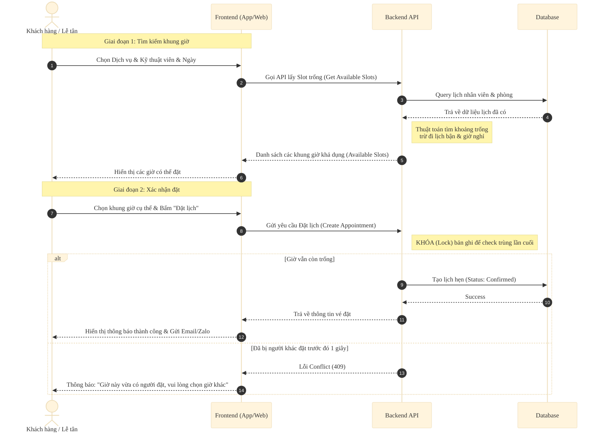
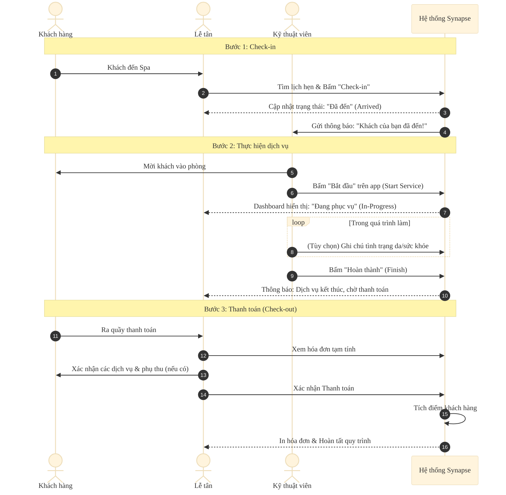
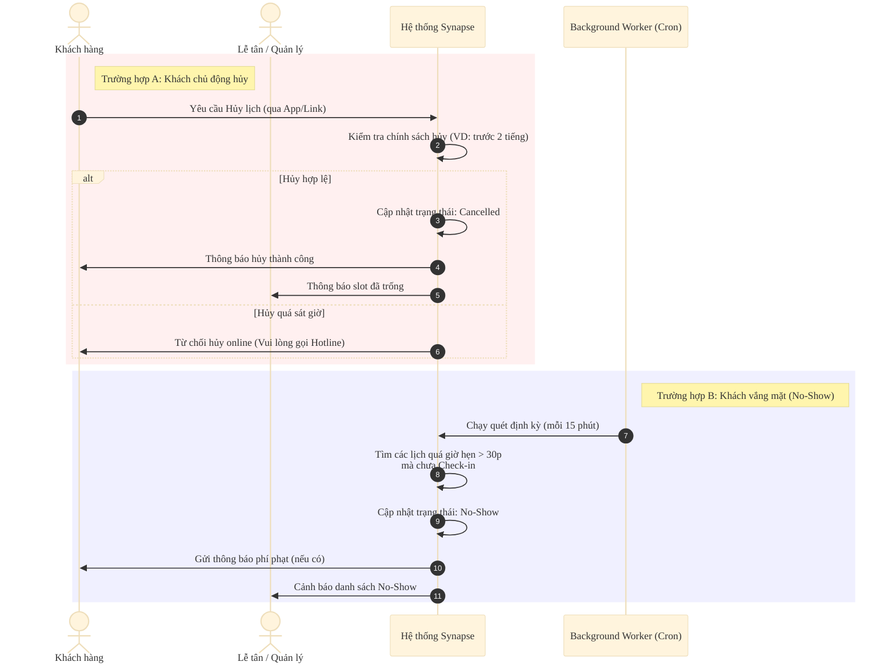

# Sequence Diagrams - Hệ Thống Synapse

Tài liệu này mô tả các luồng nghiệp vụ cốt lõi của hệ thống Synapse dưới dạng biểu đồ tuần tự (Sequence Diagram) đơn giản, tập trung vào tương tác giữa các vai trò người dùng và hệ thống.

## 1. Luồng Đặt Lịch Hẹn (Booking Flow)
Quy trình quan trọng nhất để đảm bảo không bị trùng lịch (Double Booking).

## 2. Luồng Phục Vụ & Thanh Toán (Service & Payment Flow)
Quy trình diễn ra khi khách hàng đến Spa sử dụng dịch vụ.

## 3. Luồng Xử Lý Hủy & Vắng Mặt (Cancel & No-Show Flow)
Quy trình xử lý khi lịch hẹn thay đổi hoặc khách không đến.

