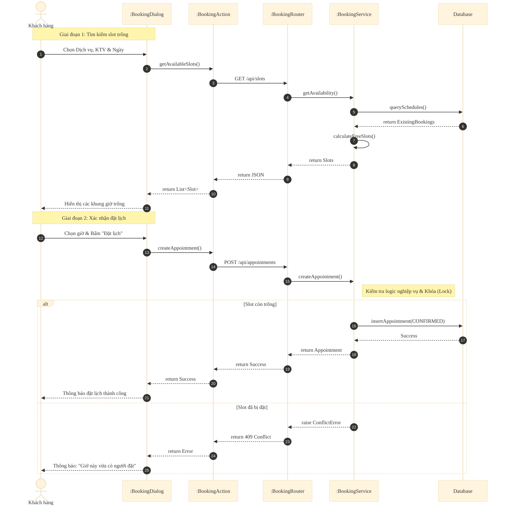
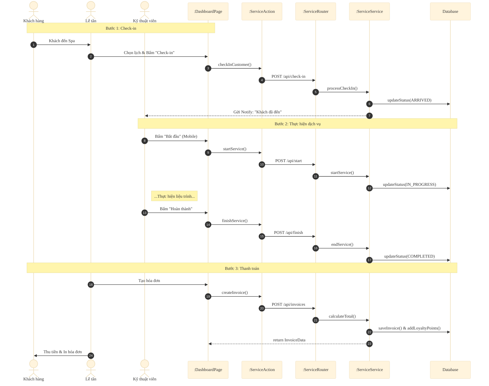
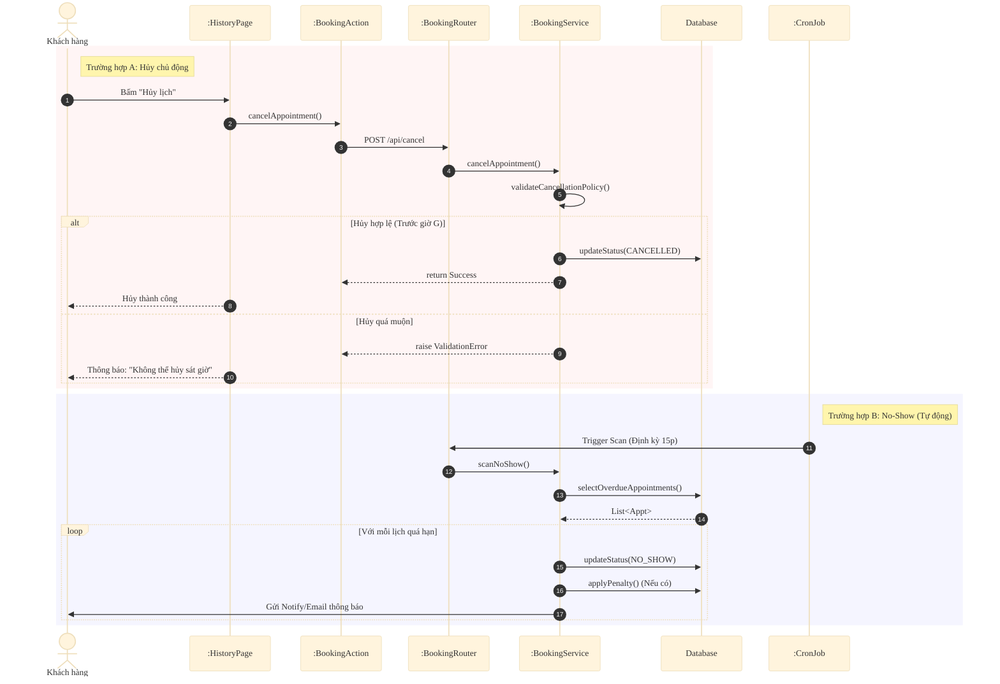

# Sequence Diagrams - Hệ Thống Synapse

Tài liệu này mô tả chi tiết các luồng tương tác trong hệ thống Synapse, tuân thủ kiến trúc **Modular Monolith** (Next.js + FastAPI).

## 1. Luồng Đặt Lịch Hẹn (Booking Flow)
Mô tả quá trình khách hàng chọn dịch vụ, kỹ thuật viên và xác nhận lịch hẹn để tránh trùng lặp.

## 2. Luồng Phục Vụ & Thanh Toán (Service & Payment)
Quy trình vận hành tại Spa từ lúc khách đến (Check-in) cho đến khi thanh toán (Check-out).

## 3. Luồng Xử Lý Hủy & Vắng Mặt (Cancel & No-Show)
Xử lý các trường hợp ngoại lệ khi lịch hẹn bị hủy hoặc khách không đến.

