# Sơ đồ Tuần tự (Sequence Diagrams) - Dự án Synapse

Tài liệu này mô tả chi tiết các luồng tương tác trong hệ thống Synapse theo kiến trúc **Modular Monolith** (Next.js + FastAPI).

## Quy ước
- **Actor (Tác nhân)**: Tiếng Việt.
- **Components/Classes**: Tiếng Anh (PascalCase).
- **Messages/Functions**: Tiếng Anh (camelCase).
- **Architecture**: Actor -> View (Next.js) -> Server Action (BFF) -> Router (FastAPI) -> Service -> Database.

---

## 1. Hệ thống xác thực (Authentication System)

### 3.7. Đăng ký tài khoản khách hàng
Người dùng tạo tài khoản mới để sử dụng dịch vụ.

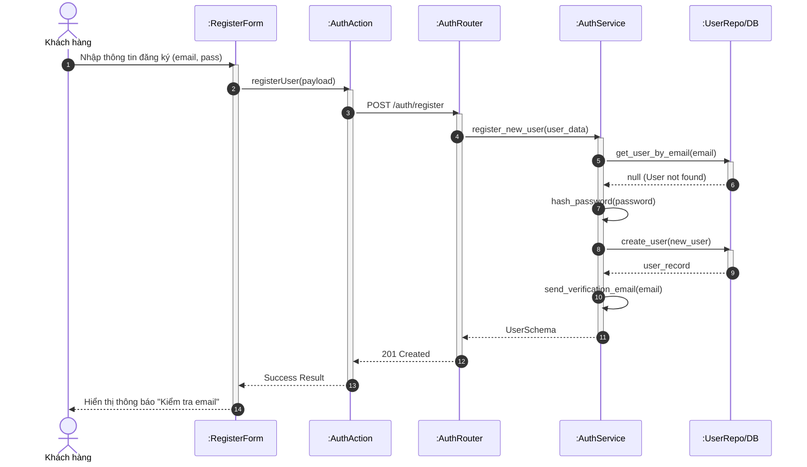

### 3.8. Xác thực email
Người dùng nhấp vào link trong email để kích hoạt tài khoản.

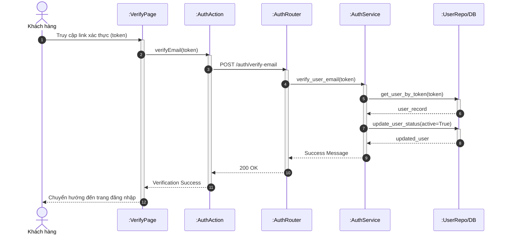

### 3.9. Đăng nhập
Người dùng đăng nhập vào hệ thống.

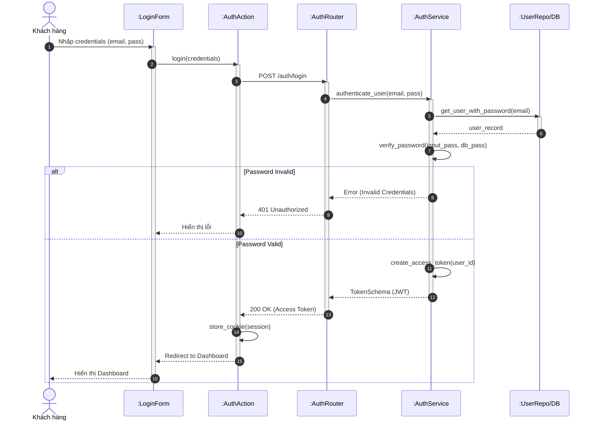

### 3.10. Quên mật khẩu
Người dùng yêu cầu đặt lại mật khẩu khi quên.

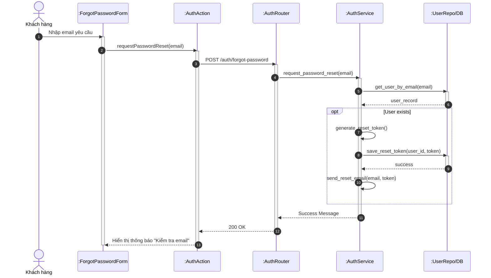

### 3.11. Đặt lại mật khẩu
Người dùng nhập mật khẩu mới sau khi xác thực token.

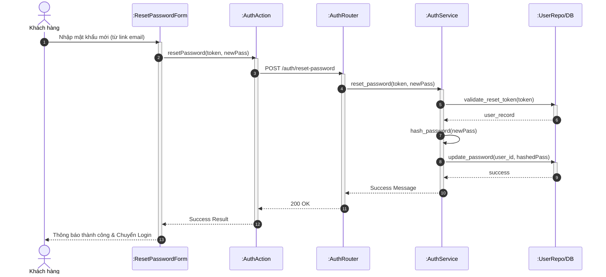

### 3.14. Đăng xuất

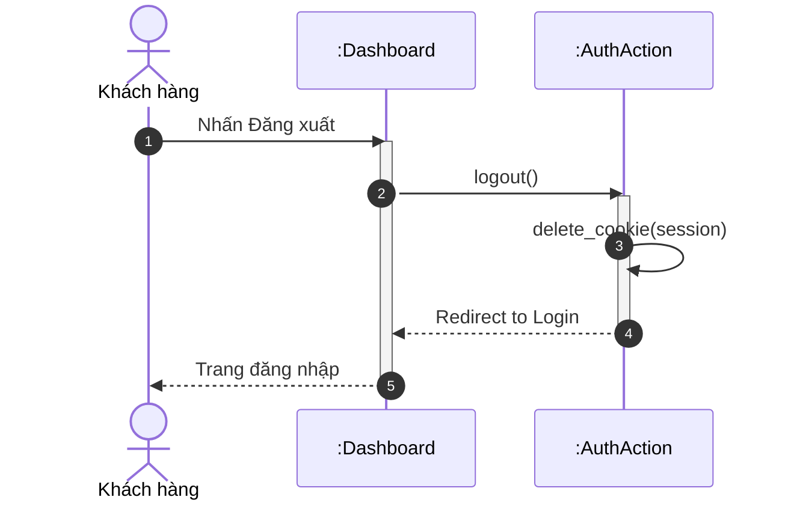

## 2. Hoạt động khách hàng (Customer Flows)

### 3.15. Xem danh sách dịch vụ
Khách hàng xem danh sách các dịch vụ spa.

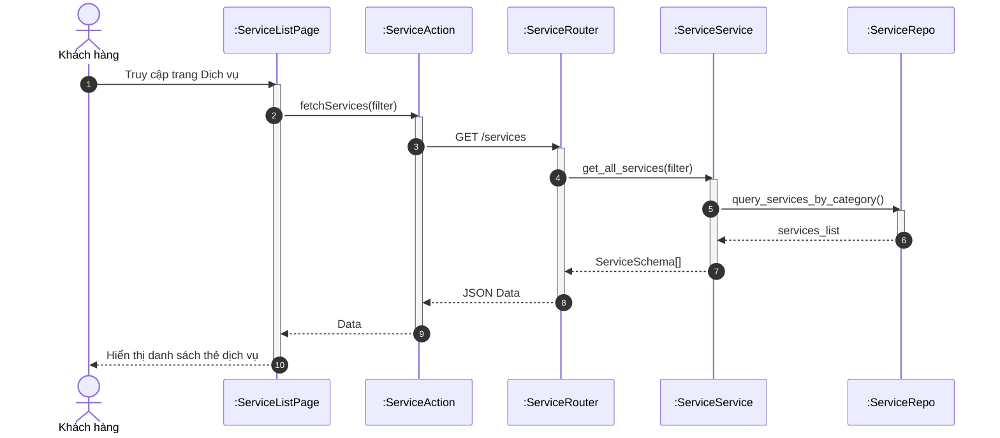

### 3.21. Tìm kiếm khung giờ (Smart Scheduling)
Khách hàng chọn dịch vụ và tìm giờ trống. Hệ thống sử dụng thuật toán OR-Tools để kiểm tra ràng buộc tài nguyên.

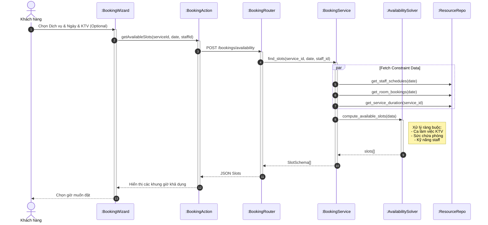

### 3.22. Hoàn tất đặt lịch
Khách hàng xác nhận thông tin và tạo cuộc hẹn.

```mermaid
sequenceDiagram
    autonumber
    actor KH as Khách hàng
    participant UI as :BookingSummary
    participant BFF as :BookingAction
    participant API as :BookingRouter
    participant S as :BookingService
    participant DB as :BookingRepo
    participant NOTI as :NotificationService

    KH->>UI: Nhấn "Xác nhận đặt lịch"
    activate UI
    UI->>BFF: submitBooking(payload)
    activate BFF
    BFF->>API: POST /bookings
    activate API
    API->>S: create_booking(user_id, slot_info)
    activate S

    crit Double Booking Guard
        S->>DB: lock_resources(staff_id, room_id, time)
        S->>DB: check_availability_again()
        activate DB
        DB-->>S: available
        deactivate DB
    end

    S->>DB: insert_booking(status='PENDING')
    activate DB
    DB-->>S: booking_record
    deactivate DB

    par Notifications
        S->>NOTI: send_customer_confirmation(email)
        S->>NOTI: notify_staff(staff_id)
    end

    S-->>API: BookingSchema
    deactivate S
    API-->>BFF: 201 Created
    deactivate API
    BFF-->>UI: Success
    deactivate BFF
    UI-->>KH: Hiển thị màn hình thành công
    deactivate UI
```

### 3.25. Hủy lịch hẹn
Khách hàng hủy lịch hẹn đã đặt.

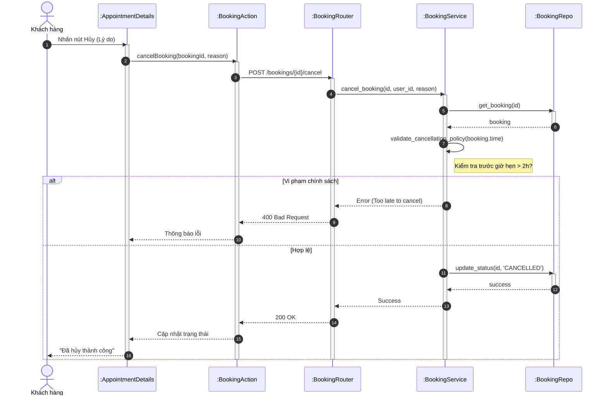

## 3. Hoạt động Lễ tân (Receptionist Flows)

### 3.31. Xem lịch hẹn tổng quan
Lễ tân xem Dashboard lịch trình của toàn bộ Spa.

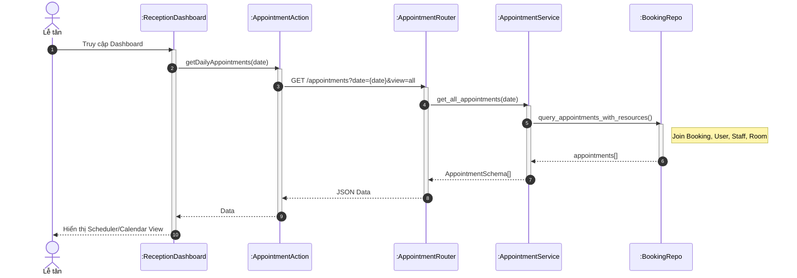

### 3.34. Tạo lịch hẹn thủ công (Walk-in)
Lễ tân tạo lịch cho khách vãng lai hoặc đặt hộ.

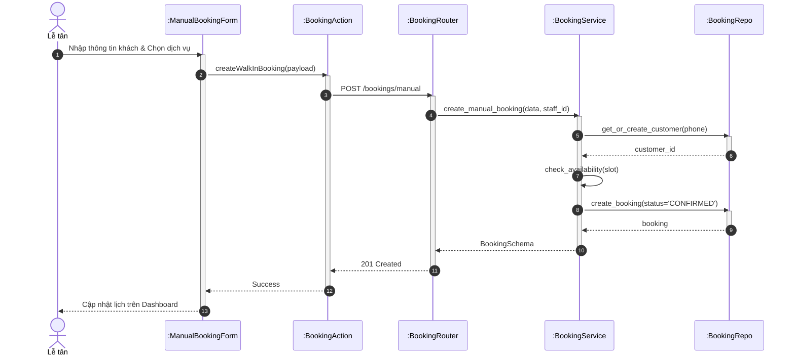

### 3.35. Check-in lịch hẹn
Khách đến Spa, lễ tân xác nhận có mặt.

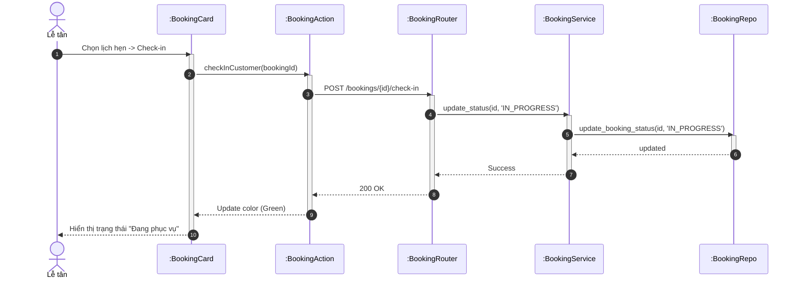

### 3.37. Xử lý thanh toán
Lễ tân kết thúc lịch hẹn và thu tiền.

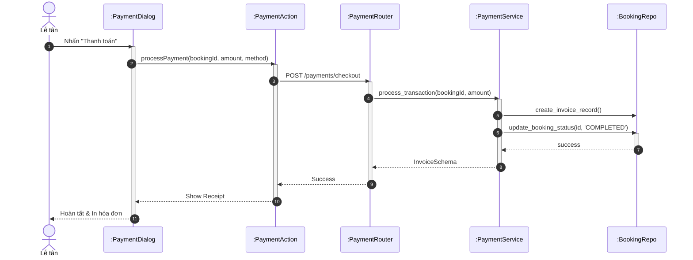

## 4. Hoạt động Kỹ thuật viên (Technician Flows)

### 3.39. Xem lịch làm việc cá nhân

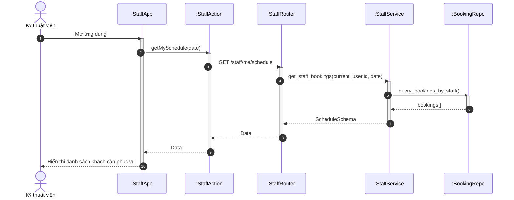

## 5. Hoạt động Quản trị viên (Admin Flows)

### 3.42. Quản lý dịch vụ (CRUD Service)

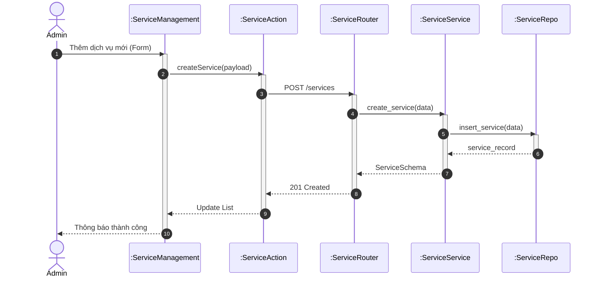

### 3.44. Quản lý tài nguyên (Phòng/Thiết bị)

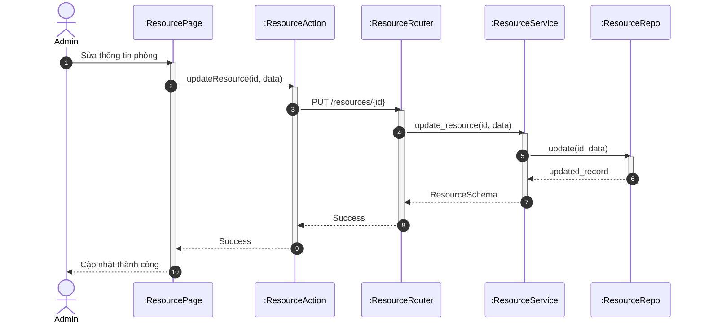

### 3.47. Cấu hình lịch làm việc nhân viên
Admin phân ca làm việc cho KTV.

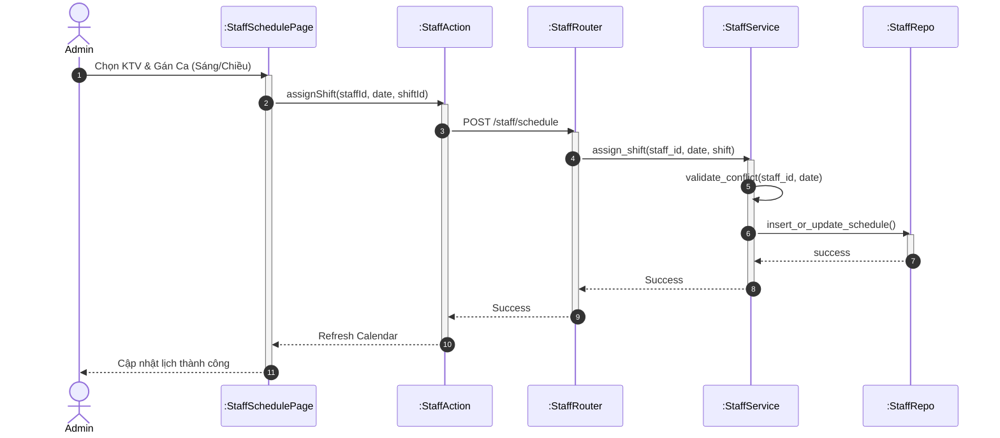

### 3.53. Xem báo cáo doanh thu

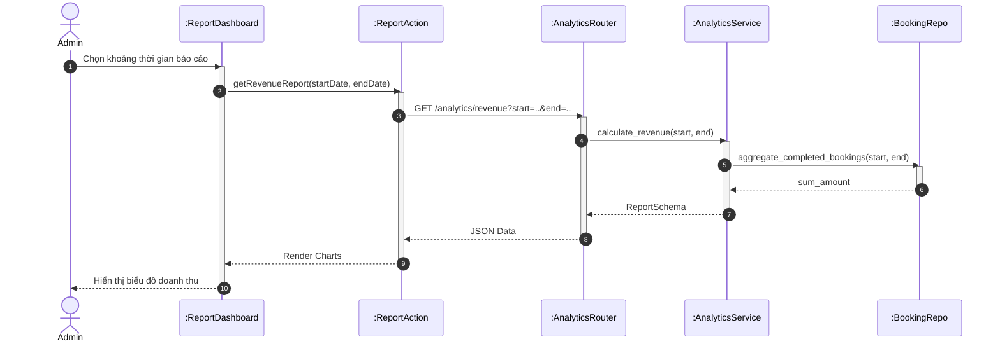
