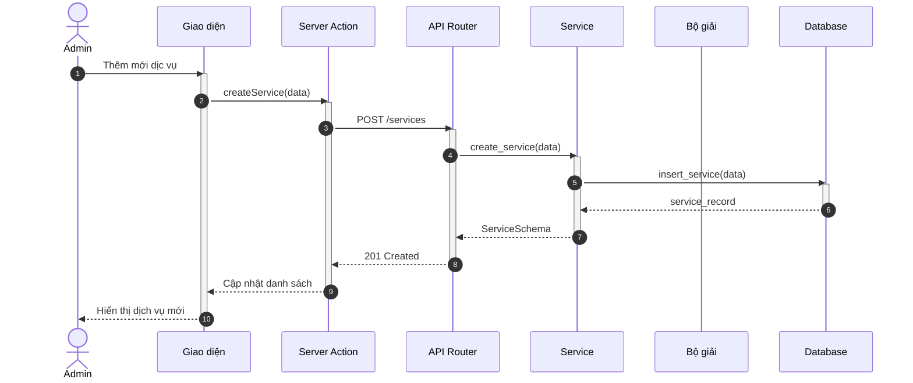
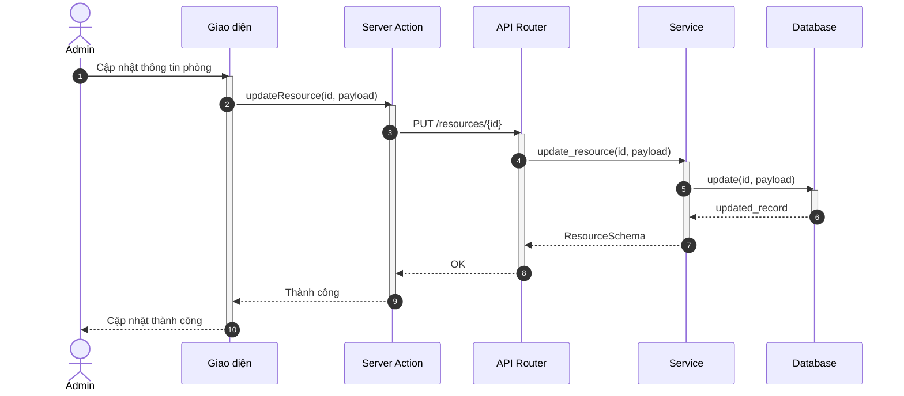
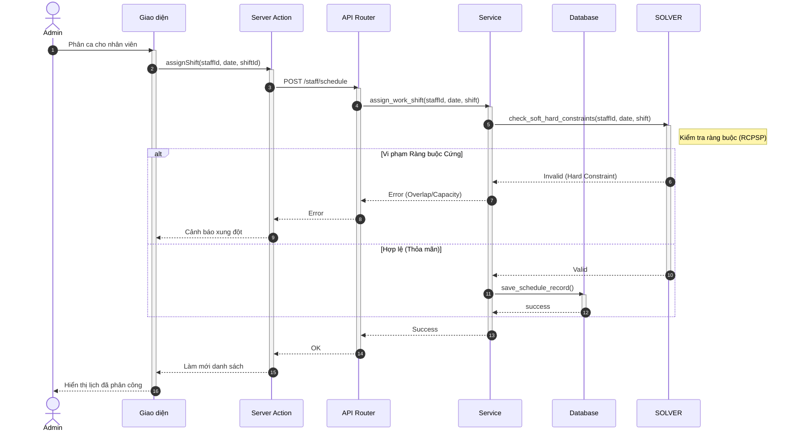
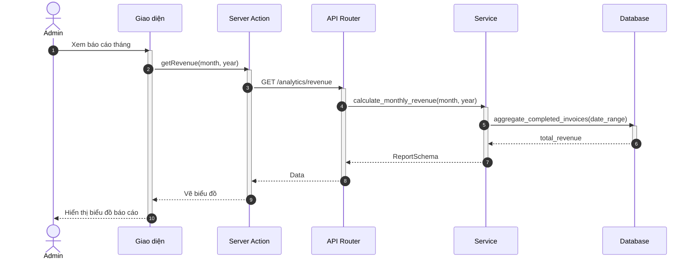

# Sơ đồ Tuần tự: Hoạt động Quản trị viên (Admin Flows)

Tài liệu này chứa các sơ đồ tuần tự cho phân hệ Quản trị viên.

%%{
  init: {
    'theme': 'neutral',
    'themeVariables': {
      'fontFamily': 'Arial, Helvetica, sans-serif',
      'fontSize': '16px',
      'sequenceMessageFontSize': '14px',
      'sequenceActorMargin': 15,
      'sequenceActivationPadding': 5,
      'sequenceDiagramMarginY': 10,
      'sequenceLogLifeline': 'transparent',
      'primaryColor': '#ffffff',
      'primaryTextColor': '#000000',
      'lineColor': '#000000',
      'secondaryColor': '#f5f5f5'
    }
  }
}%%

## 1.1.5 Sơ đồ hoạt động cho quản trị viên

### 3.42. Quản lý dịch vụ (CRUD Service)

**Hình 3.42: Sơ đồ tuần tự chức năng Quản lý dịch vụ**

### 3.44. Quản lý tài nguyên (Phòng/Thiết bị)

**Hình 3.44: Sơ đồ tuần tự chức năng Quản lý tài nguyên**

### 3.47. Cấu hình lịch làm việc nhân viên

**Hình 3.47: Sơ đồ tuần tự chức năng Cấu hình lịch làm việc nhân viên**

### 3.53. Xem báo cáo doanh thu

**Hình 3.53: Sơ đồ tuần tự chức năng Xem báo cáo**
