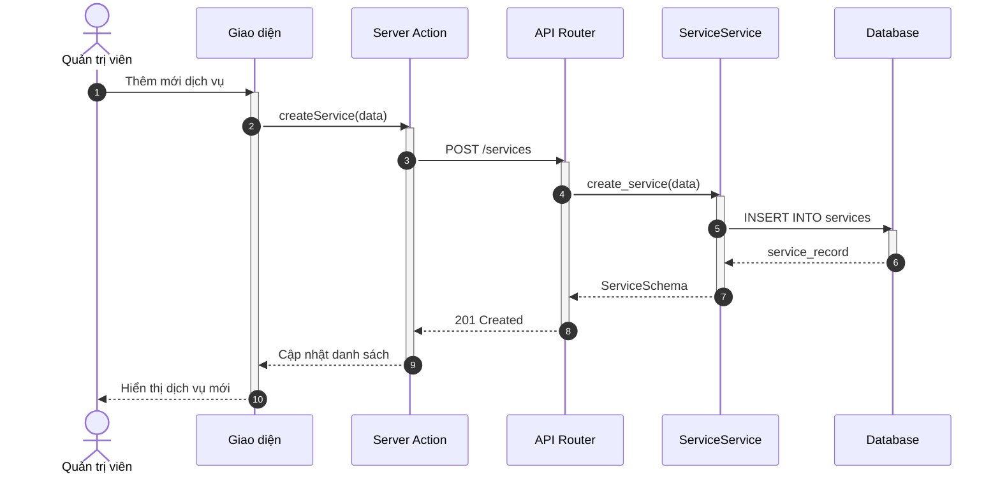
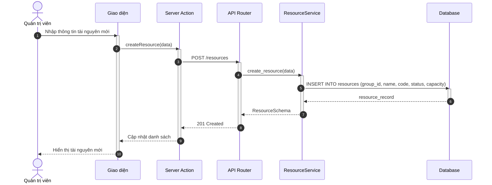
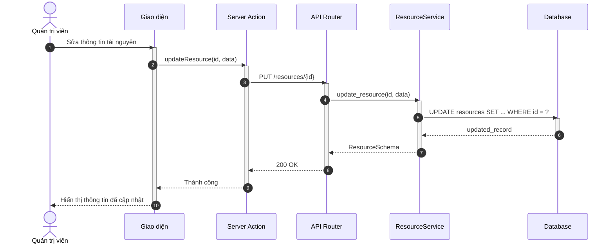
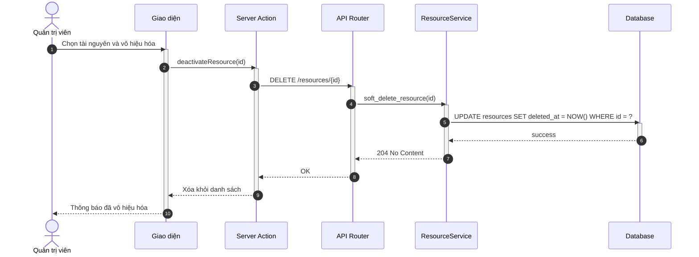
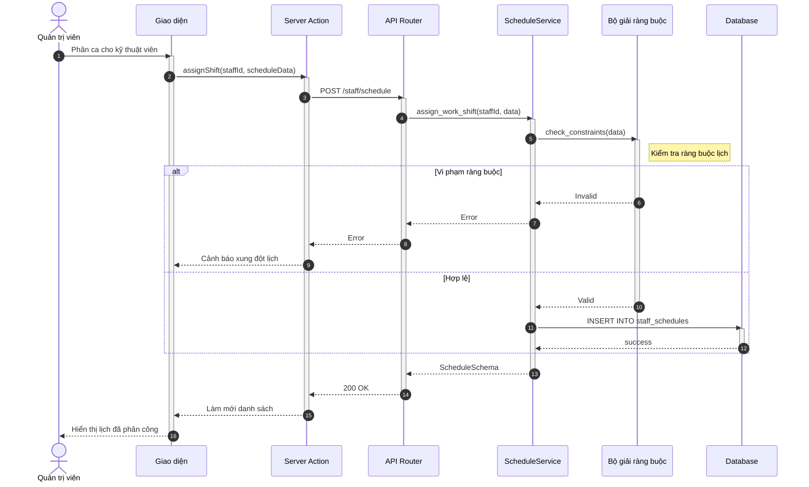

# Sơ đồ Tuần tự: Hoạt động Quản trị viên

Tài liệu này chứa các sơ đồ tuần tự cho phân hệ Quản trị viên.

%%{
  init: {
    'theme': 'neutral',
    'themeVariables': {
      'fontFamily': 'Arial, Helvetica, sans-serif',
      'fontSize': '16px',
      'sequenceMessageFontSize': '14px',
      'sequenceActorMargin': 15,
      'sequenceActivationPadding': 5,
      'sequenceDiagramMarginY': 10,
      'sequenceLogLifeline': 'transparent',
      'primaryColor': '#ffffff',
      'primaryTextColor': '#000000',
      'lineColor': '#000000',
      'secondaryColor': '#f5f5f5'
    }
  }
}%%

## Sơ đồ hoạt động cho Quản trị viên

### 3.22. Quản lý danh mục dịch vụ (C5)

**Hình 3.22: Sơ đồ tuần tự chức năng Quản lý danh mục dịch vụ**

### 3.23. Quản lý tài nguyên (C7)

> **Lưu ý:** Theo thiết kế cơ sở dữ liệu, hệ thống quản lý tài nguyên theo 2 cấp:
> - **Nhóm tài nguyên** (Resource Group): Ví dụ: "Phòng VIP", "Phòng Thường", "Máy Laser"
> - **Tài nguyên** (Resource): Ví dụ: "Giường 1 - Phòng VIP", "Máy Laser A"

#### 3.23a. Thêm mới tài nguyên

**Hình 3.23a: Sơ đồ tuần tự chức năng Thêm mới tài nguyên**

#### 3.23b. Cập nhật tài nguyên

**Hình 3.23b: Sơ đồ tuần tự chức năng Cập nhật tài nguyên**

#### 3.23c. Vô hiệu hóa tài nguyên

**Hình 3.23c: Sơ đồ tuần tự chức năng Vô hiệu hóa tài nguyên**

### 3.24. Cấu hình lịch làm việc nhân viên (C4)

**Hình 3.24: Sơ đồ tuần tự chức năng Cấu hình lịch làm việc nhân viên**
