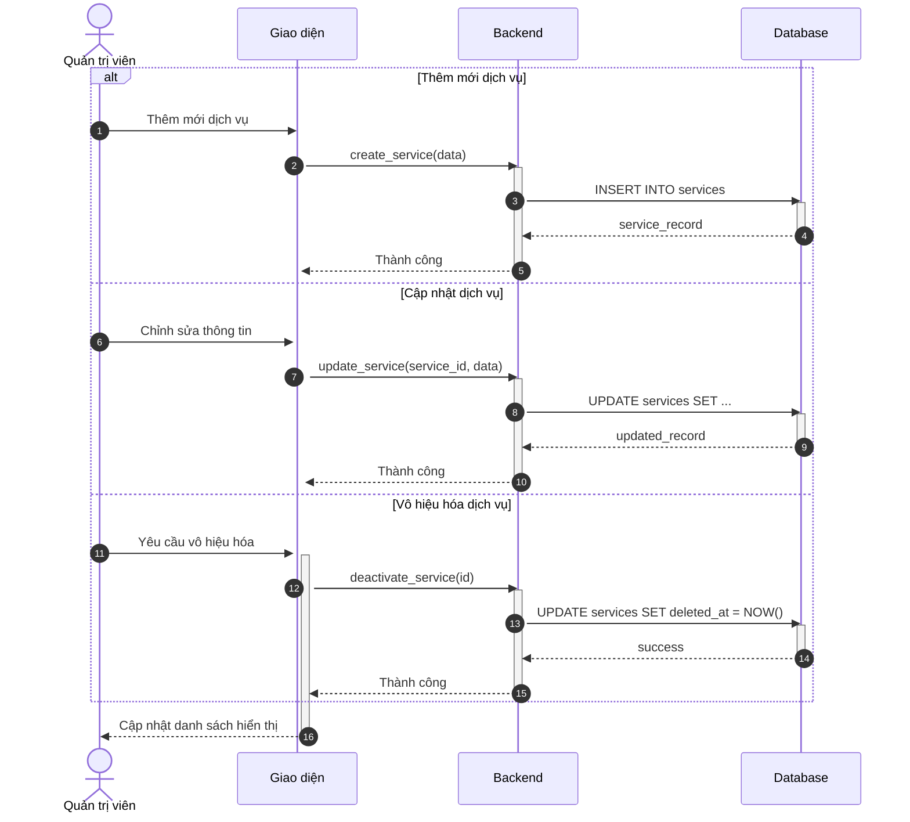
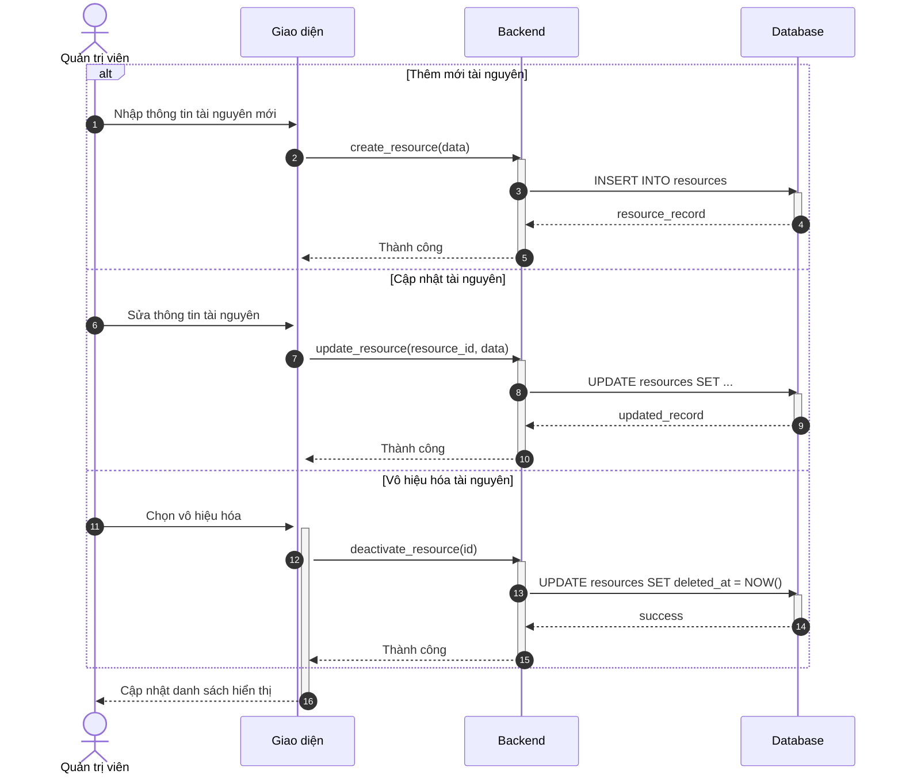
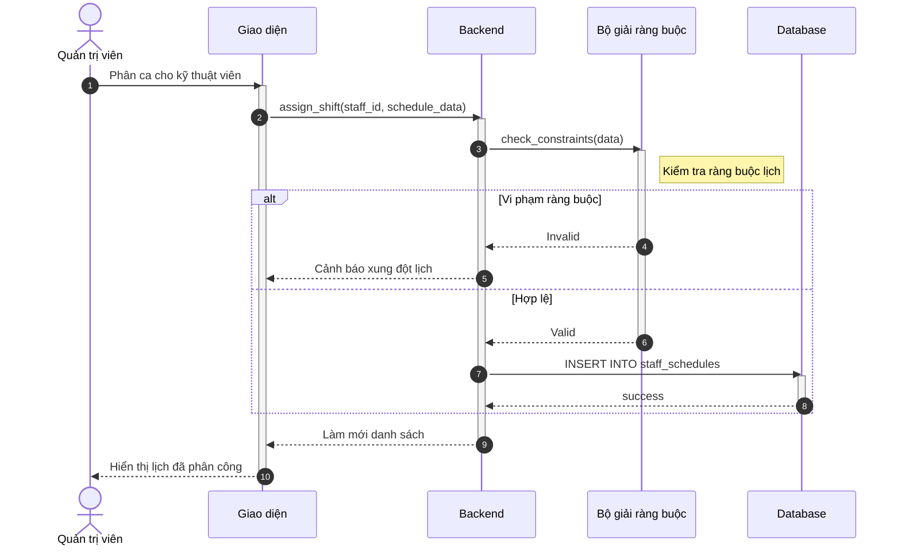
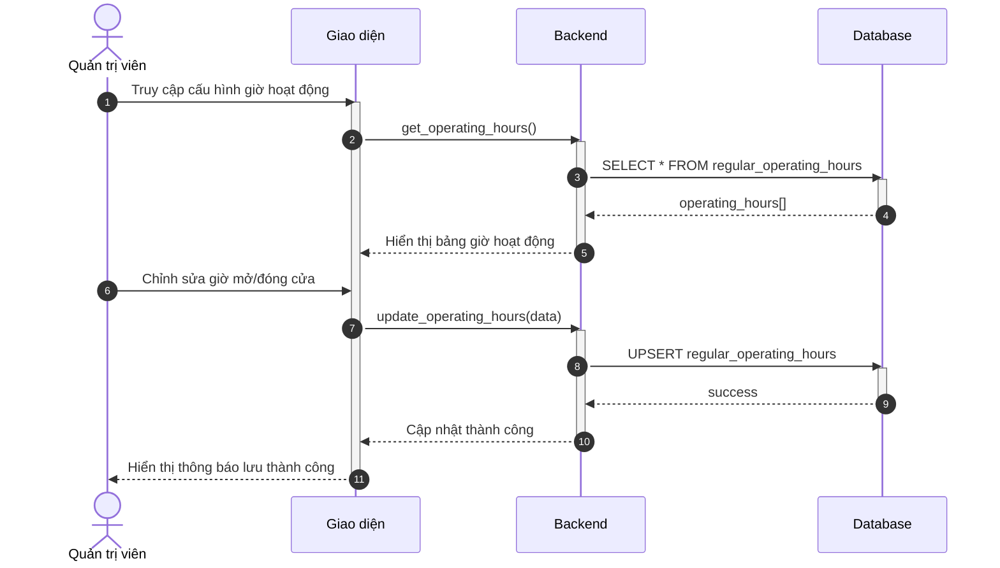
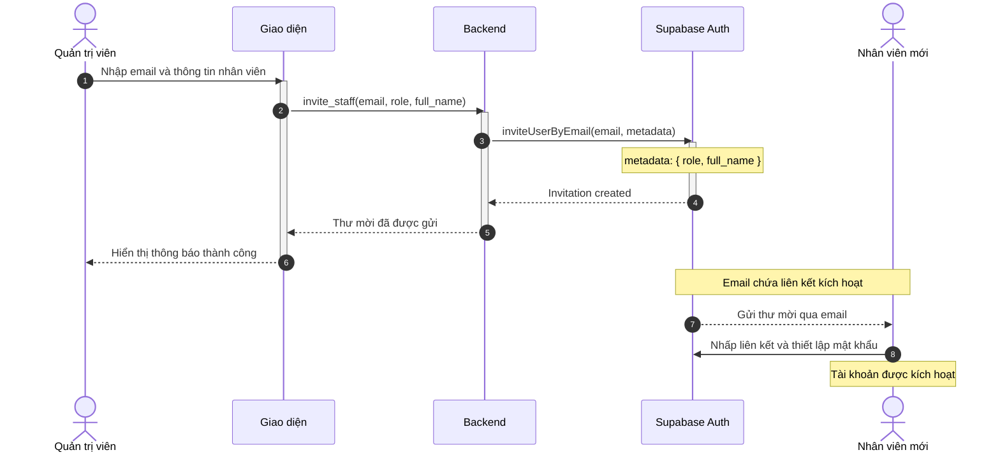
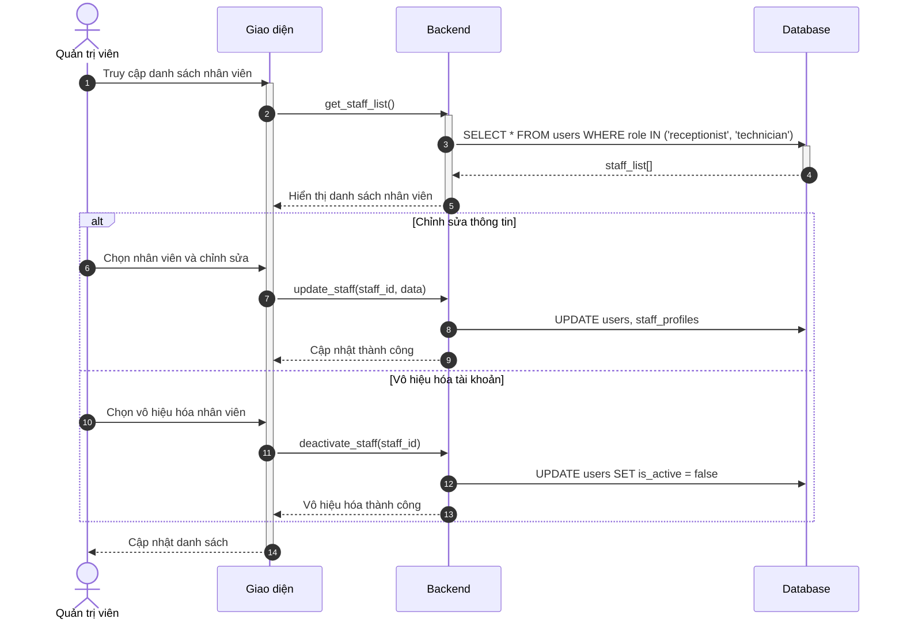
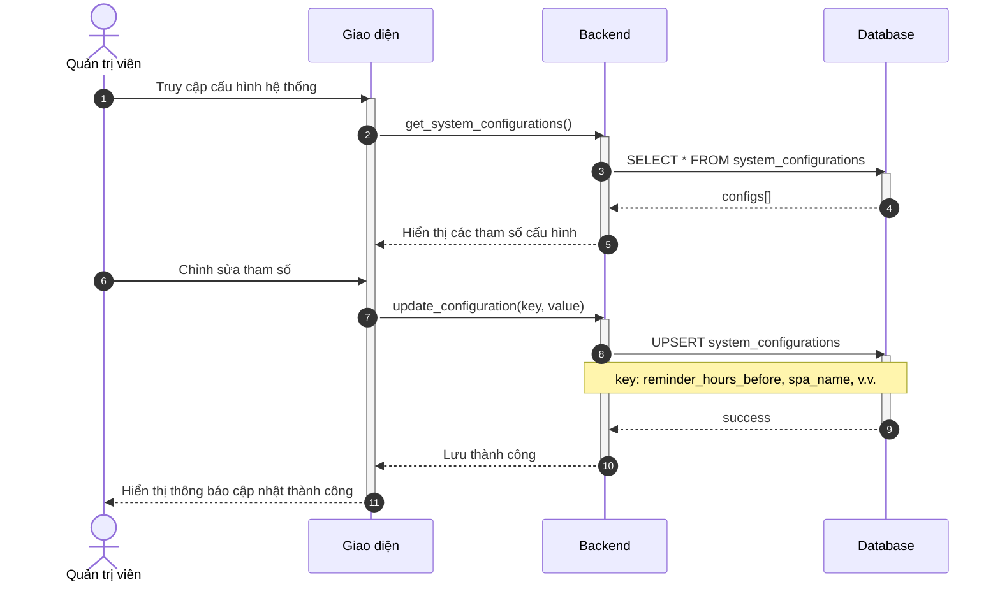
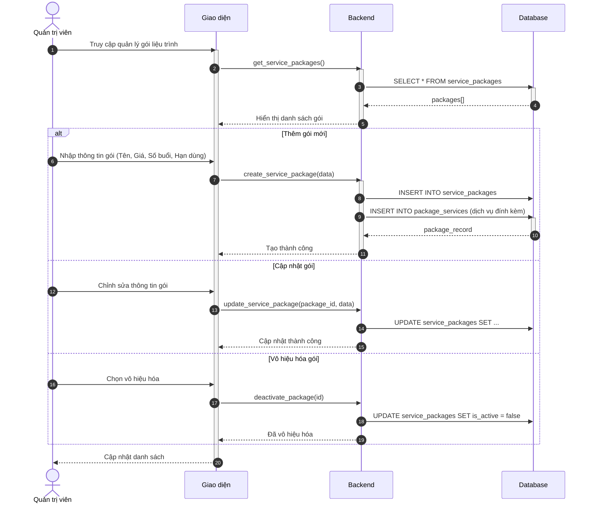
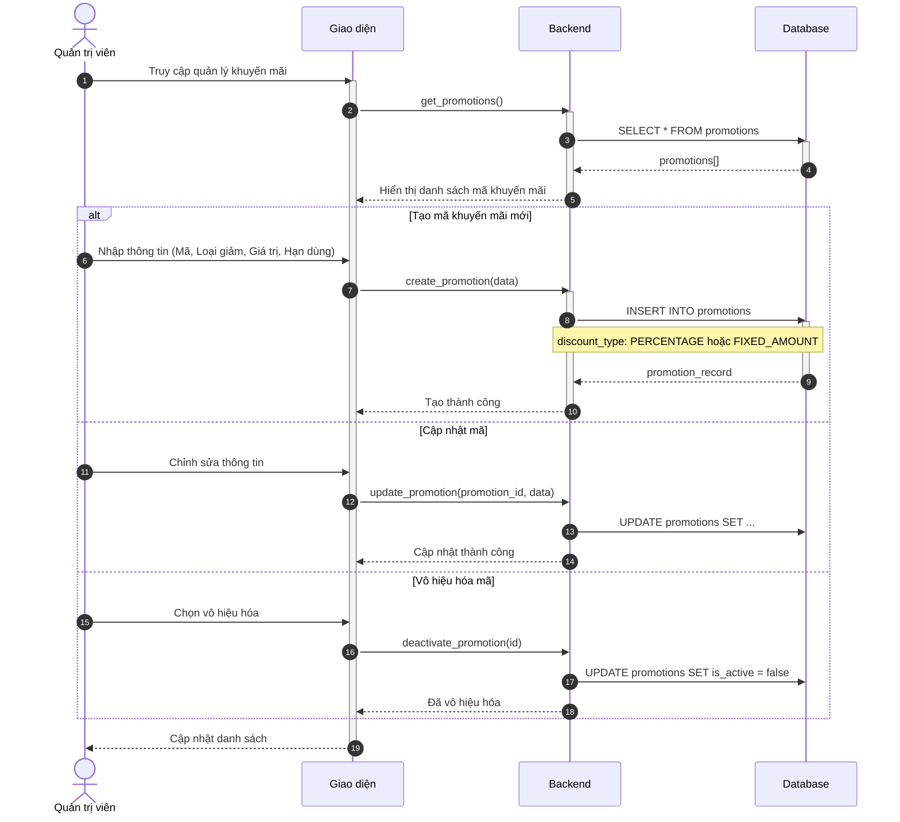
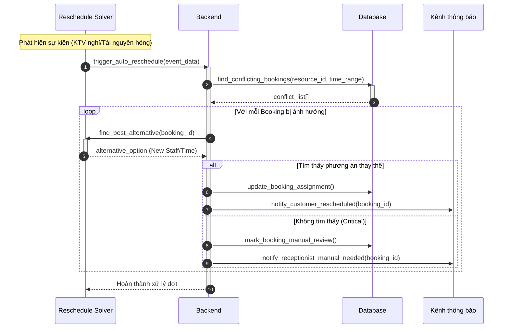

# Sơ đồ Tuần tự: Hoạt động Quản trị viên

Tài liệu này chứa các sơ đồ tuần tự cho phân hệ Quản trị viên.

%%{
  init: {
    'theme': 'neutral',
    'themeVariables': {
      'fontFamily': 'Arial, Helvetica, sans-serif',
      'fontSize': '16px',
      'sequenceMessageFontSize': '14px',
      'sequenceActorMargin': 15,
      'sequenceActivationPadding': 5,
      'sequenceDiagramMarginY': 10,
      'sequenceLogLifeline': 'transparent',
      'primaryColor': '#ffffff',
      'primaryTextColor': '#000000',
      'lineColor': '#000000',
      'secondaryColor': '#f5f5f5'
    }
  }
}%%

## Sơ đồ hoạt động cho Quản trị viên

### 3.28. Quản lý danh mục dịch vụ (C5)

**Hình 3.28: Sơ đồ tuần tự chức năng Quản lý danh mục dịch vụ (CRUD)**

### 3.29. Quản lý tài nguyên (C7)

> **Lưu ý:** Theo thiết kế cơ sở dữ liệu, hệ thống quản lý tài nguyên theo 2 cấp:
> - **Nhóm tài nguyên** (Resource Group): Ví dụ: "Giường Spa Premium", "Máy Laser" (Loại: BED/EQUIPMENT)
> - **Tài nguyên** (Resource): Ví dụ: "Giường 01", "Máy Laser A"

**Hình 3.29: Sơ đồ tuần tự chức năng Quản lý tài nguyên (CRUD)**

### 3.30. Cấu hình lịch làm việc nhân viên (C4)

**Hình 3.30: Sơ đồ tuần tự chức năng Cấu hình lịch làm việc nhân viên**

---

### 3.31. Cấu hình giờ hoạt động Spa (C1)

**Hình 3.31: Sơ đồ tuần tự chức năng Cấu hình giờ hoạt động Spa**

---

### 3.32. Quản lý ngày nghỉ lễ (C2)

**Hình 3.32: Sơ đồ tuần tự chức năng Quản lý ngày nghỉ lễ**

---

### 3.33. Mời nhân viên qua thư điện tử (C3)

**Hình 3.33: Sơ đồ tuần tự chức năng Mời nhân viên qua thư điện tử**

---

### 3.34. Quản lý tài khoản nhân viên (C9)

**Hình 3.34: Sơ đồ tuần tự chức năng Quản lý tài khoản nhân viên**

---

### 3.35. Cấu hình hệ thống (C10)

**Hình 3.35: Sơ đồ tuần tự chức năng Cấu hình hệ thống**

---

### 3.36. Quản lý thẻ liệu trình (C6)

**Hình 3.36: Sơ đồ tuần tự chức năng Quản lý thẻ liệu trình**

---

### 3.37. Quản lý chương trình khuyến mãi (C8)

**Hình 3.37: Sơ đồ tuần tự chức năng Quản lý chương trình khuyến mãi**

### 3.38. Tái lập lịch tự động khi có sự cố (B1.8)

**Hình 3.38: Sơ đồ tuần tự chức năng Tái lập lịch tự động**

---
