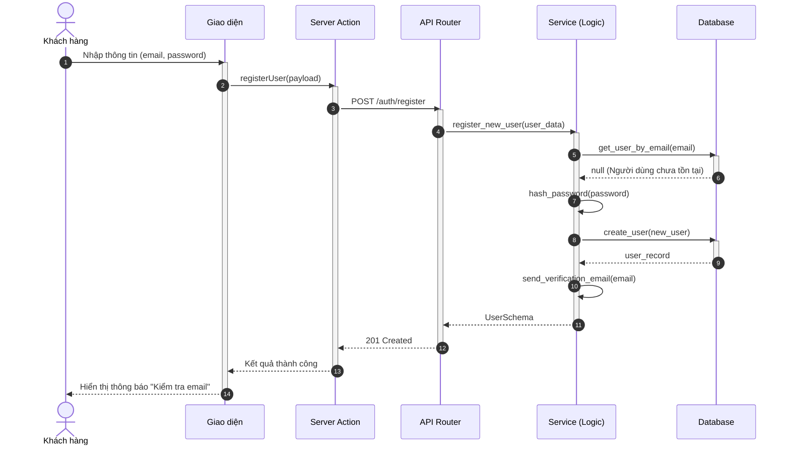
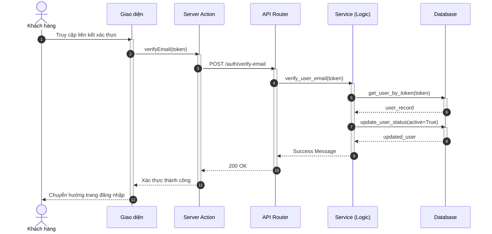
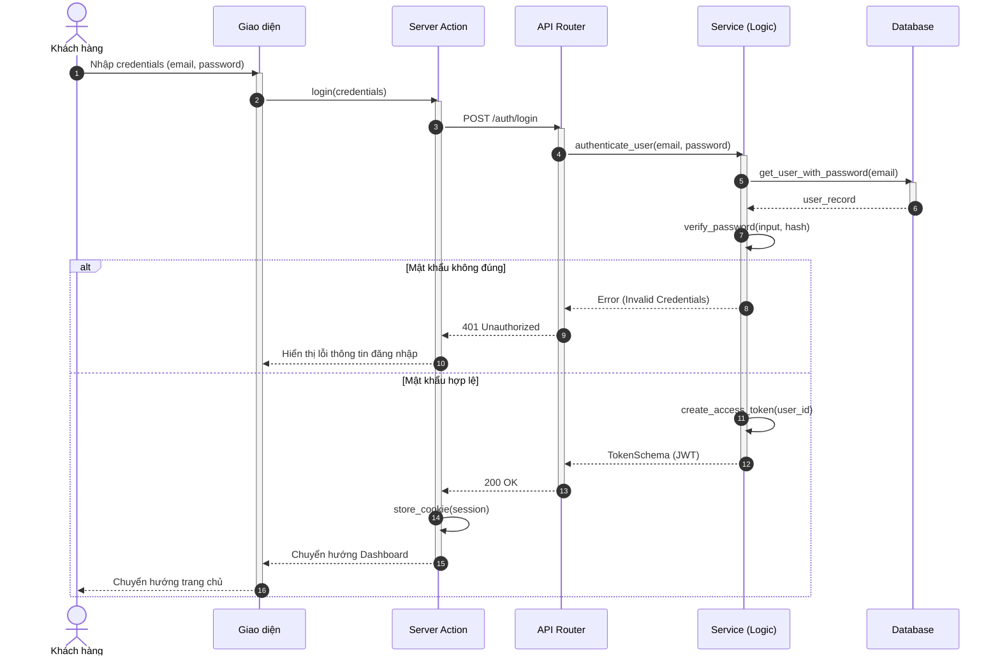
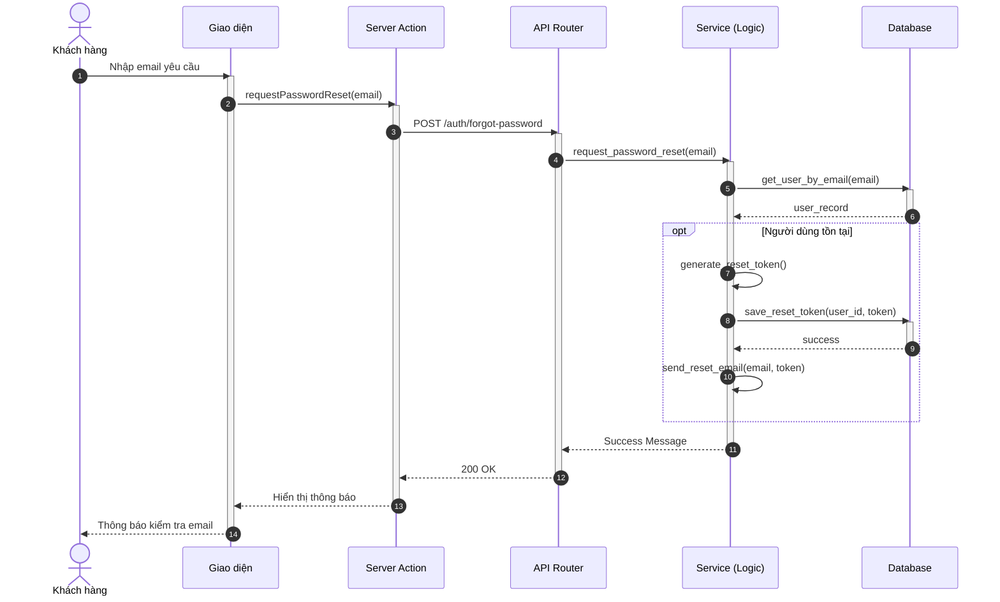
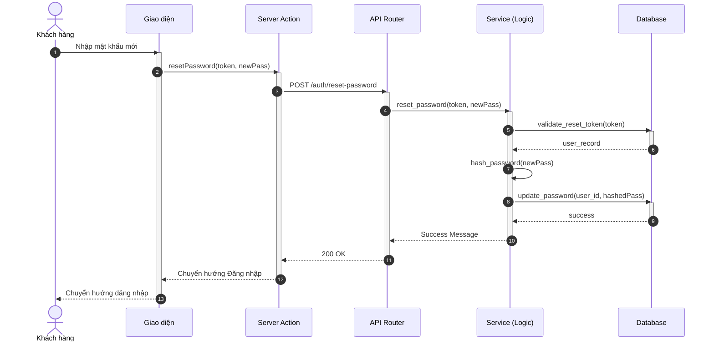
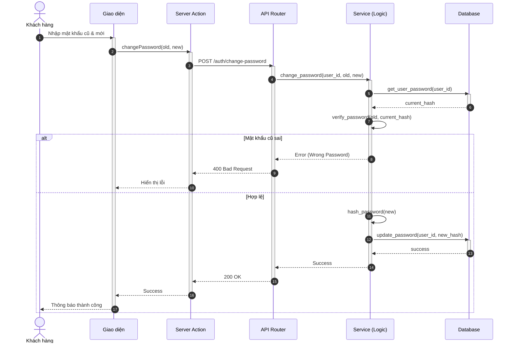
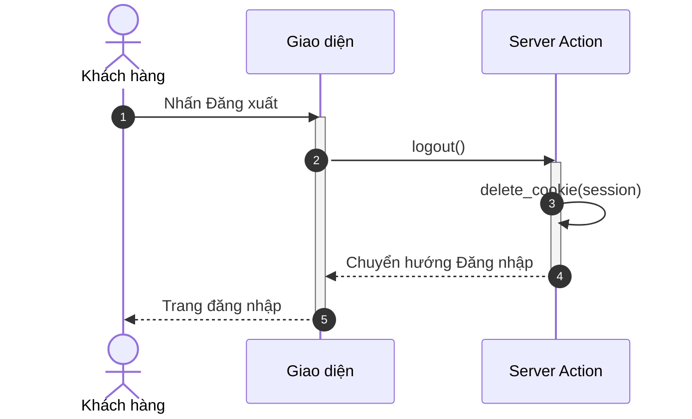

# Sơ đồ Tuần tự: Hệ thống Xác thực (Authentication)

Tài liệu này chứa các sơ đồ tuần tự cho phân hệ Xác thực, tuân thủ quy chuẩn định dạng và kiến trúc Modular Monolith.

%%{
  init: {
    'theme': 'neutral',
    'themeVariables': {
      'fontFamily': 'Arial, Helvetica, sans-serif',
      'fontSize': '16px',
      'sequenceMessageFontSize': '14px',
      'sequenceActorMargin': 15,
      'sequenceActivationPadding': 5,
      'sequenceDiagramMarginY': 10,
      'sequenceLogLifeline': 'transparent',
      'primaryColor': '#ffffff',
      'primaryTextColor': '#000000',
      'lineColor': '#000000',
      'secondaryColor': '#f5f5f5'
    }
  }
}%%

## 1.1.1 Sơ đồ hoạt động cho hệ thống xác thực

### 3.7. Đăng ký tài khoản khách hàng

**Hình 3.7: Sơ đồ tuần tự chức năng Đăng ký tài khoản khách hàng**

### 3.8. Xác thực email

**Hình 3.8: Sơ đồ tuần tự chức năng Xác thực email**

### 3.9. Đăng nhập

**Hình 3.9: Sơ đồ tuần tự chức năng Đăng nhập**

### 3.10. Quên mật khẩu

**Hình 3.10: Sơ đồ tuần tự chức năng Quên mật khẩu**

### 3.11. Đặt lại mật khẩu

**Hình 3.11: Sơ đồ tuần tự chức năng Đặt lại mật khẩu**

### 3.12. Thay đổi mật khẩu khi đã đăng nhập

**Hình 3.12: Sơ đồ tuần tự chức năng Thay đổi mật khẩu khi đã đăng nhập**

### 3.13. Cập nhật thông tin cá nhân

**Hình 3.13: Sơ đồ tuần tự chức năng Cập nhật thông tin cá nhân**

### 3.14. Đăng xuất

**Hình 3.14: Sơ đồ tuần tự chức năng Đăng xuất**
