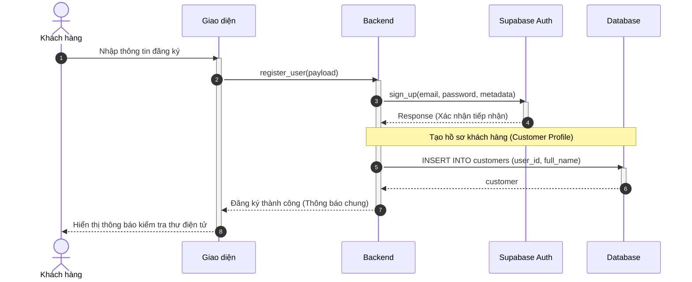
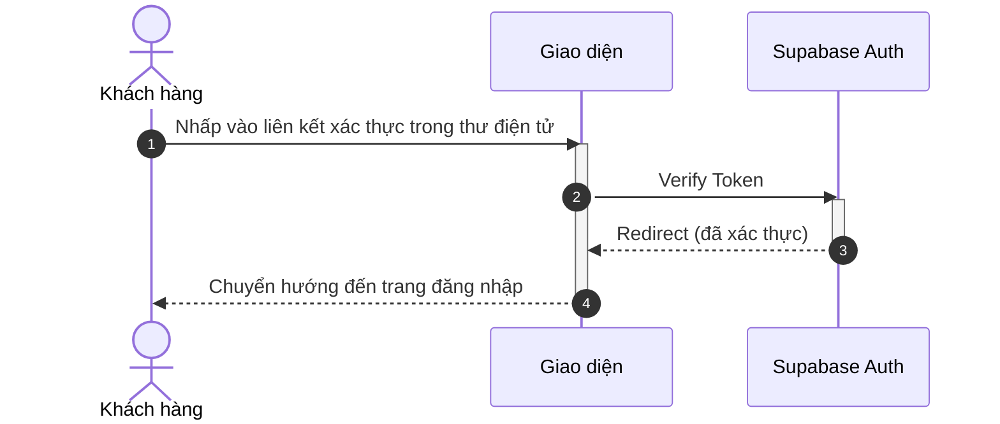
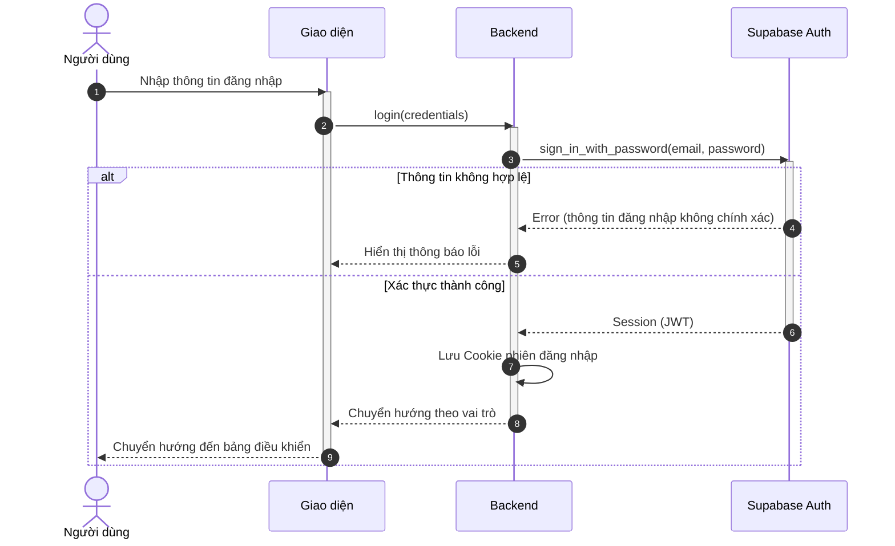
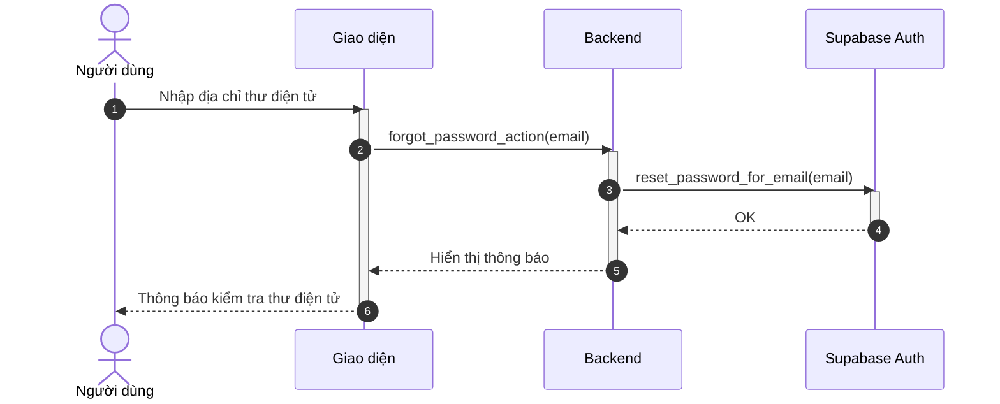
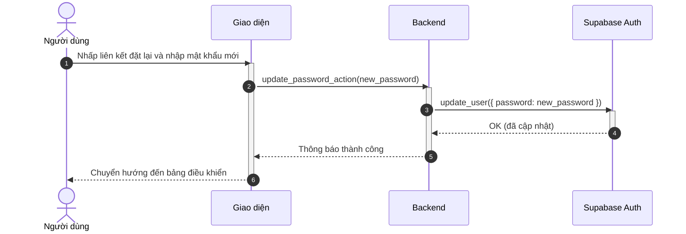
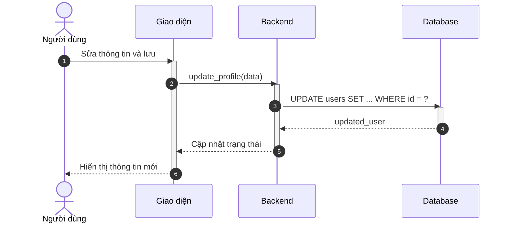
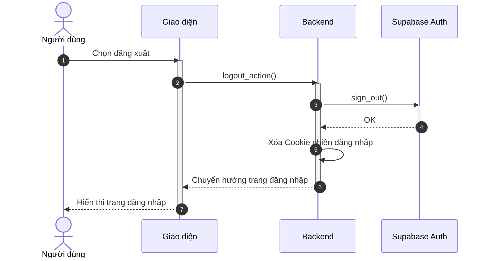

# Sơ đồ Tuần tự: Phân hệ Xác thực

Tài liệu này chứa các sơ đồ tuần tự cho phân hệ Xác thực, tuân thủ quy chuẩn định dạng và kiến trúc Modular Monolith.

%%{
  init: {
    'theme': 'neutral',
    'themeVariables': {
      'fontFamily': 'Arial, Helvetica, sans-serif',
      'fontSize': '16px',
      'sequenceMessageFontSize': '14px',
      'sequenceActorMargin': 15,
      'sequenceActivationPadding': 5,
      'sequenceDiagramMarginY': 10,
      'sequenceLogLifeline': 'transparent',
      'primaryColor': '#ffffff',
      'primaryTextColor': '#000000',
      'lineColor': '#000000',
      'secondaryColor': '#f5f5f5'
    }
  }
}%%

## Sơ đồ hoạt động cho Phân hệ Xác thực

### 3.1. Đăng ký tài khoản khách hàng (A1.1)

**Hình 3.1: Sơ đồ tuần tự chức năng Đăng ký tài khoản khách hàng**

> **Ghi chú:** Khi đăng ký thành công, hệ thống tự động tạo hồ sơ khách hàng (Customer Profile) để đảm bảo khách hàng có thể đặt lịch hẹn ngay sau khi xác thực thư điện tử.

### 3.2. Xác thực thư điện tử (A1.1)

**Hình 3.2: Sơ đồ tuần tự chức năng Xác thực thư điện tử**

### 3.3. Đăng nhập (A1.2)

**Hình 3.3: Sơ đồ tuần tự chức năng Đăng nhập**

### 3.4. Khôi phục mật khẩu (A1.3)

**Hình 3.4: Sơ đồ tuần tự chức năng Khôi phục mật khẩu (Bước 1)**

### 3.5. Đặt lại mật khẩu từ thư điện tử (A1.3)

**Hình 3.5: Sơ đồ tuần tự chức năng Đặt lại mật khẩu (Bước 2)**

### 3.6. Cập nhật thông tin cá nhân (A1.4)

**Hình 3.6: Sơ đồ tuần tự chức năng Cập nhật thông tin cá nhân**

### 3.7. Đăng xuất (A1.5)

**Hình 3.7: Sơ đồ tuần tự chức năng Đăng xuất**
