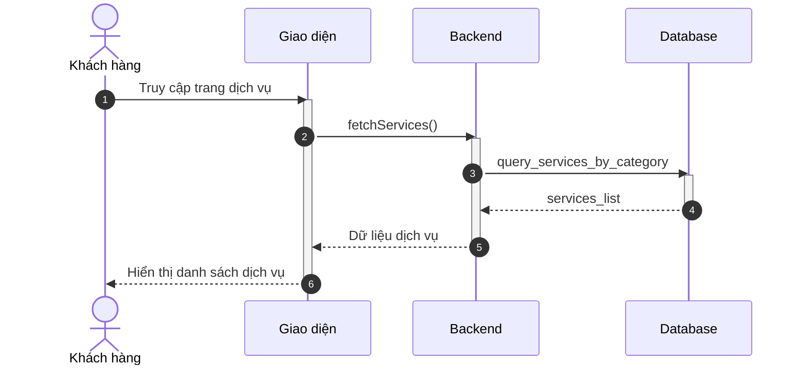
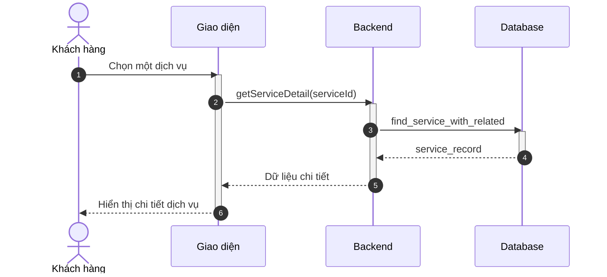
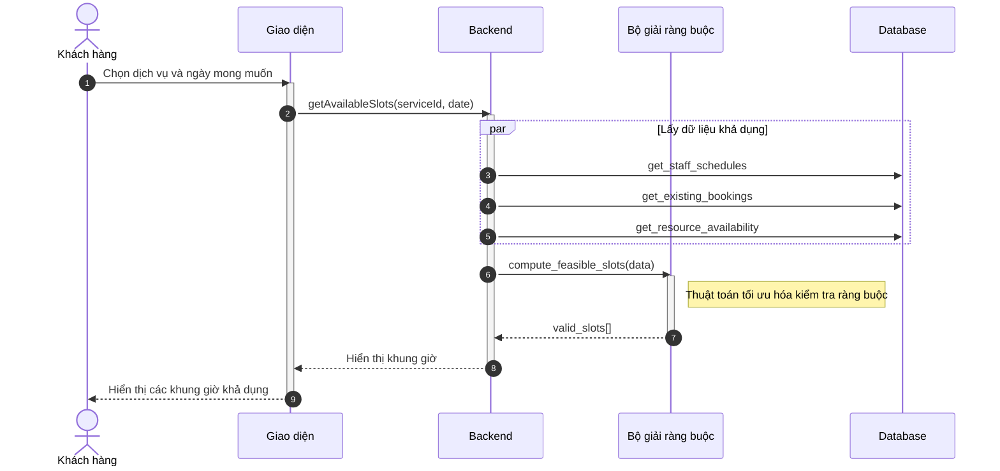
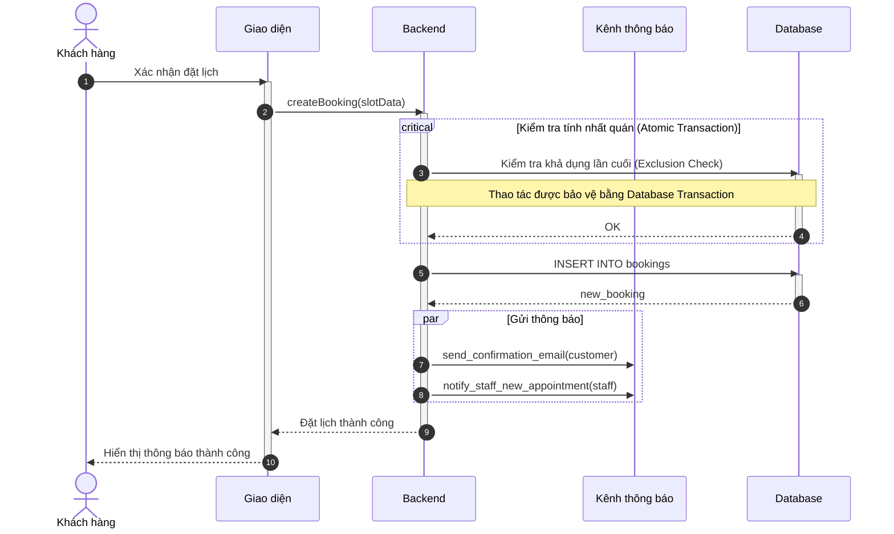
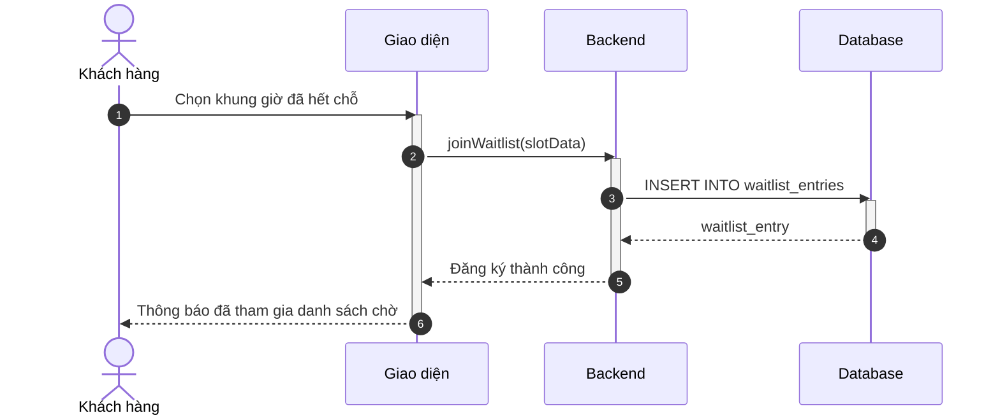
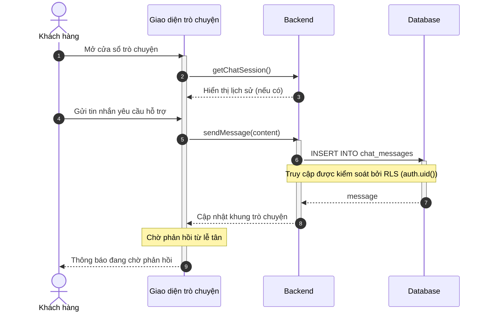
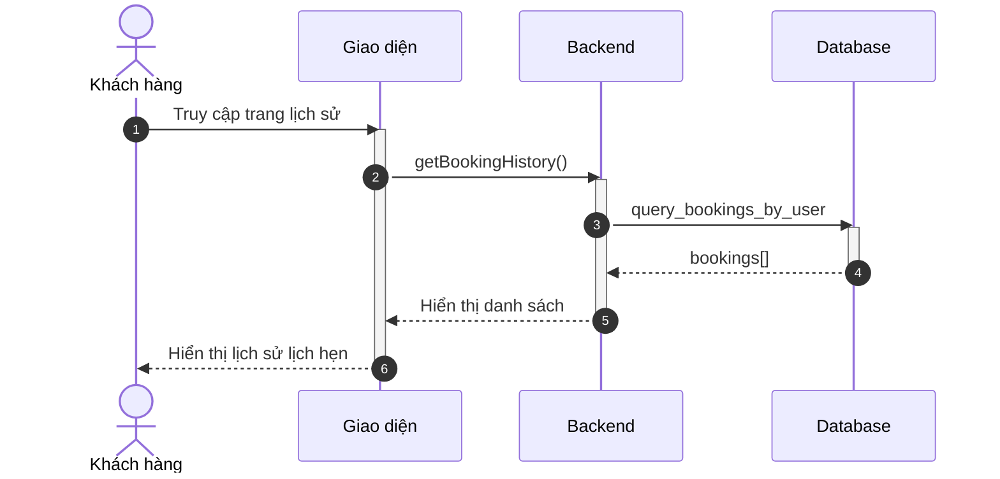
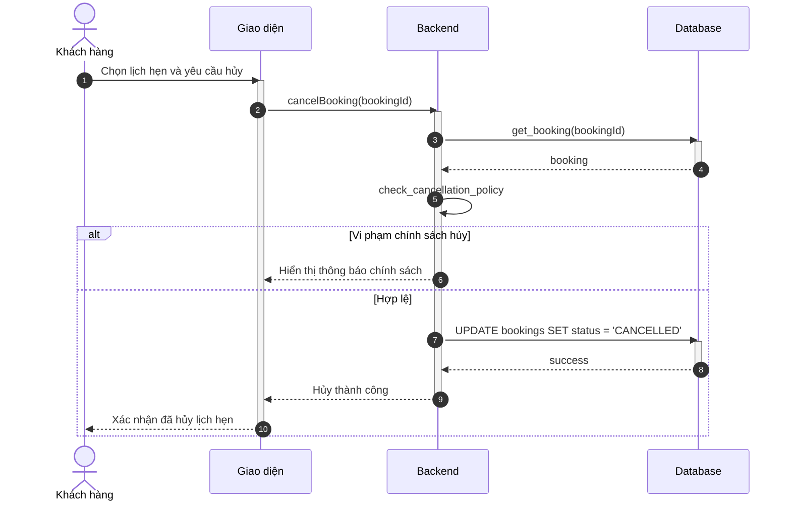
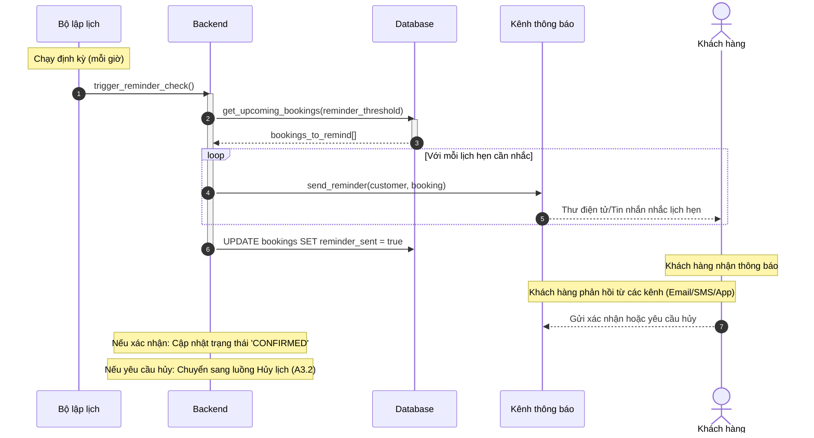
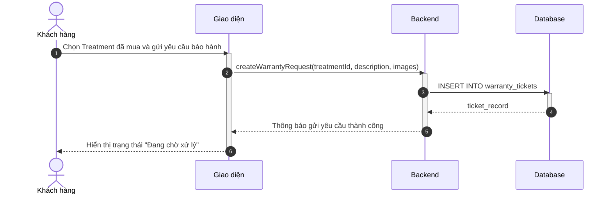

# Sơ đồ Tuần tự: Hoạt động Khách hàng

Tài liệu này chứa các sơ đồ tuần tự cho phân hệ Khách hàng.

%%{
  init: {
    'theme': 'neutral',
    'themeVariables': {
      'fontFamily': 'Arial, Helvetica, sans-serif',
      'fontSize': '16px',
      'sequenceMessageFontSize': '14px',
      'sequenceActorMargin': 15,
      'sequenceActivationPadding': 5,
      'sequenceDiagramMarginY': 10,
      'sequenceLogLifeline': 'transparent',
      'primaryColor': '#ffffff',
      'primaryTextColor': '#000000',
      'lineColor': '#000000',
      'secondaryColor': '#f5f5f5'
    }
  }
}%%

## Sơ đồ hoạt động cho Khách hàng

### 3.8. Xem danh sách dịch vụ (A2.1)

**Hình 3.8: Sơ đồ tuần tự chức năng Xem danh sách dịch vụ**

### 3.9. Xem chi tiết dịch vụ (A2.2)

**Hình 3.9: Sơ đồ tuần tự chức năng Xem chi tiết dịch vụ**

### 3.10. Tìm kiếm khung giờ khả dụng (A2.4)

**Hình 3.10: Sơ đồ tuần tự chức năng Tìm kiếm khung giờ khả dụng**

### 3.11. Hoàn tất đặt lịch hẹn (A2.5)

**Hình 3.11: Sơ đồ tuần tự chức năng Hoàn tất đặt lịch hẹn**

### 3.12. Tham gia danh sách chờ (A2.6)

**Hình 3.12: Sơ đồ tuần tự chức năng Tham gia danh sách chờ**

### 3.13. Nhận hỗ trợ qua trò chuyện trực tuyến (A2.7)

**Hình 3.12: Sơ đồ tuần tự chức năng Nhận hỗ trợ qua trò chuyện trực tuyến**

### 3.13. Xem lịch sử đặt lịch hẹn (A3.1)

**Hình 3.13: Sơ đồ tuần tự chức năng Xem lịch sử đặt lịch hẹn**

### 3.14. Hủy lịch hẹn (A3.2)

**Hình 3.15: Sơ đồ tuần tự chức năng Hủy lịch hẹn**

### 3.16. Nhận thông báo nhắc lịch (A3.3)

**Hình 3.16: Sơ đồ tuần tự chức năng Nhận thông báo nhắc lịch**
### 3.17. Gửi yêu cầu bảo hành (A3.6)

**Hình 3.17: Sơ đồ tuần tự chức năng Gửi yêu cầu bảo hành**
