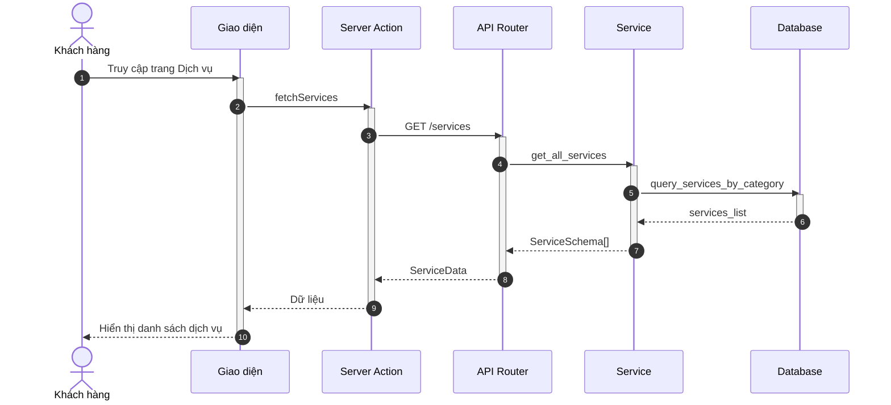
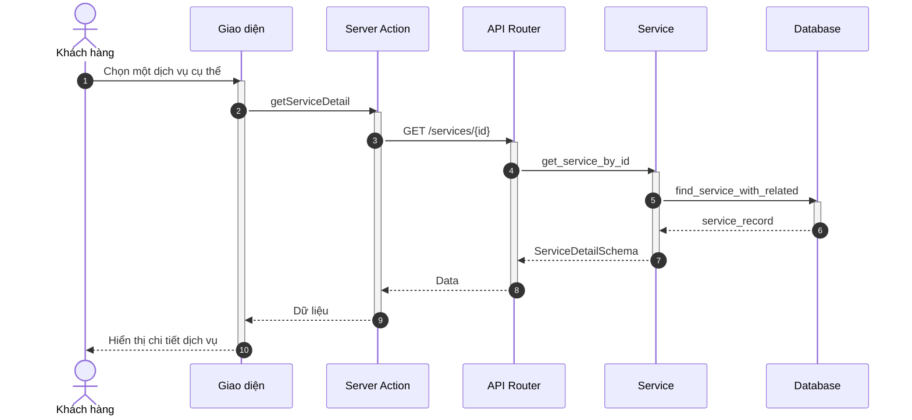
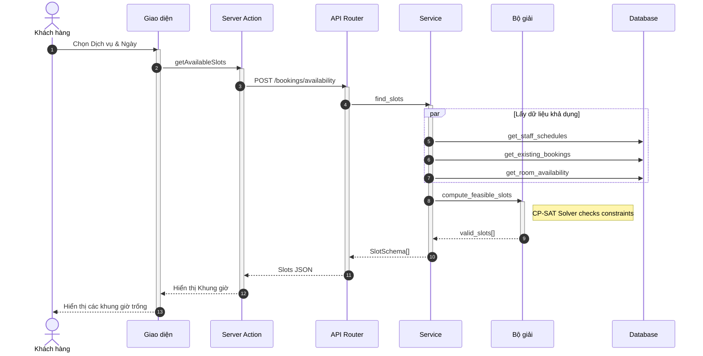
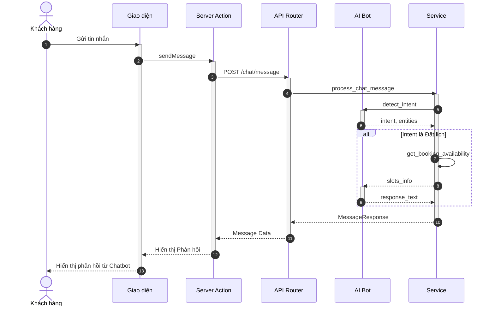
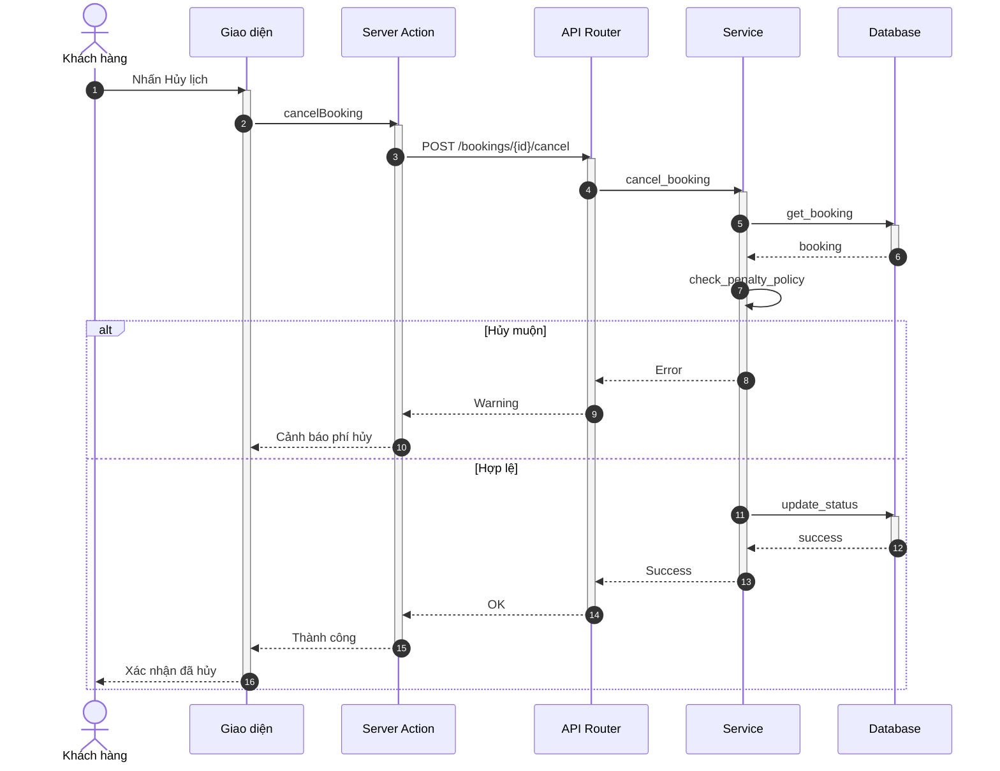
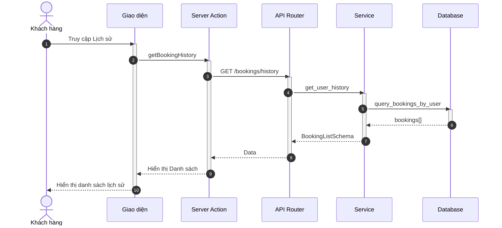
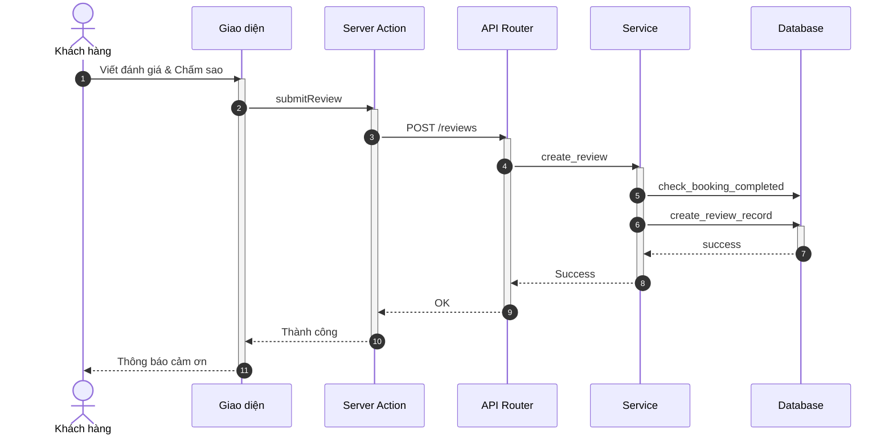

# Sơ đồ Tuần tự: Hoạt động Khách hàng (Customer Flows)

Tài liệu này chứa các sơ đồ tuần tự cho phân hệ Khách hàng, bao gồm xem dịch vụ, đặt lịch và quản lý lịch hẹn.

%%{
  init: {
    'theme': 'neutral',
    'themeVariables': {
      'fontFamily': 'Arial, Helvetica, sans-serif',
      'fontSize': '16px',
      'sequenceMessageFontSize': '14px',
      'sequenceActorMargin': 15,
      'sequenceActivationPadding': 5,
      'sequenceDiagramMarginY': 10,
      'sequenceLogLifeline': 'transparent',
      'primaryColor': '#ffffff',
      'primaryTextColor': '#000000',
      'lineColor': '#000000',
      'secondaryColor': '#f5f5f5'
    }
  }
}%%

## 1.1.2 Sơ đồ hoạt động cho khách hàng

### 3.15. Xem danh sách dịch vụ


**Hình 3.15: Sơ đồ tuần tự chức năng Xem danh sách dịch vụ**

### 3.16. Xem chi tiết dịch vụ


**Hình 3.16: Sơ đồ tuần tự chức năng Xem chi tiết dịch vụ**

### 3.21. Tìm kiếm khung giờ


**Hình 3.21: Sơ đồ tuần tự chức năng Tìm kiếm khung giờ**

### 3.22. Hoàn tất đặt lịch

```mermaid
sequenceDiagram
    autonumber
    actor KH as Khách hàng
    participant UI as Giao diện
    participant BFF as Server Action
    participant API as API Router
    participant S as Service
    participant NOTI as Notification Service
    participant DB as Database

    KH->>UI: Xác nhận đặt lịch
    activate UI
    UI->>BFF: createBooking
    activate BFF

    BFF->>API: POST /bookings
    activate API

    API->>S: create_booking
    activate S

    crit Kiểm tra tính nhất quán
        S->>DB: lock_resources
        S->>DB: check_conflict_last_time
        activate DB
        DB-->>S: OK
        deactivate DB
    end

    S->>DB: insert_booking
    activate DB
    DB-->>S: new_booking
    deactivate DB

    par Gửi thông báo
        S->>NOTI: email_customer_confirmation
        S->>NOTI: notify_staff_new_appointment
    end

    S-->>API: BookingSchema
    deactivate S

    API-->>BFF: 201 Created
    deactivate API

    BFF-->>UI: Thành công
    deactivate BFF

    UI-->>KH: Hiển thị thông báo thành công
    deactivate UI
```
**Hình 3.22: Sơ đồ tuần tự chức năng Hoàn tất đặt lịch**

### 3.24. Nhận tư vấn và đặt lịch qua Chatbot


**Hình 3.24: Sơ đồ tuần tự chức năng Nhận tư vấn và đặt lịch qua chatbot**

### 3.25. Hủy lịch hẹn


**Hình 3.25: Sơ đồ tuần tự chức năng Hủy lịch hẹn**

### 3.26. Xem lịch sử đặt lịch


**Hình 3.26: Sơ đồ tuần tự chức năng Xem lịch sử đặt lịch**

### 3.28. Đánh giá dịch vụ


**Hình 3.28: Sơ đồ tuần tự chức năng Đánh giá dịch vụ**
