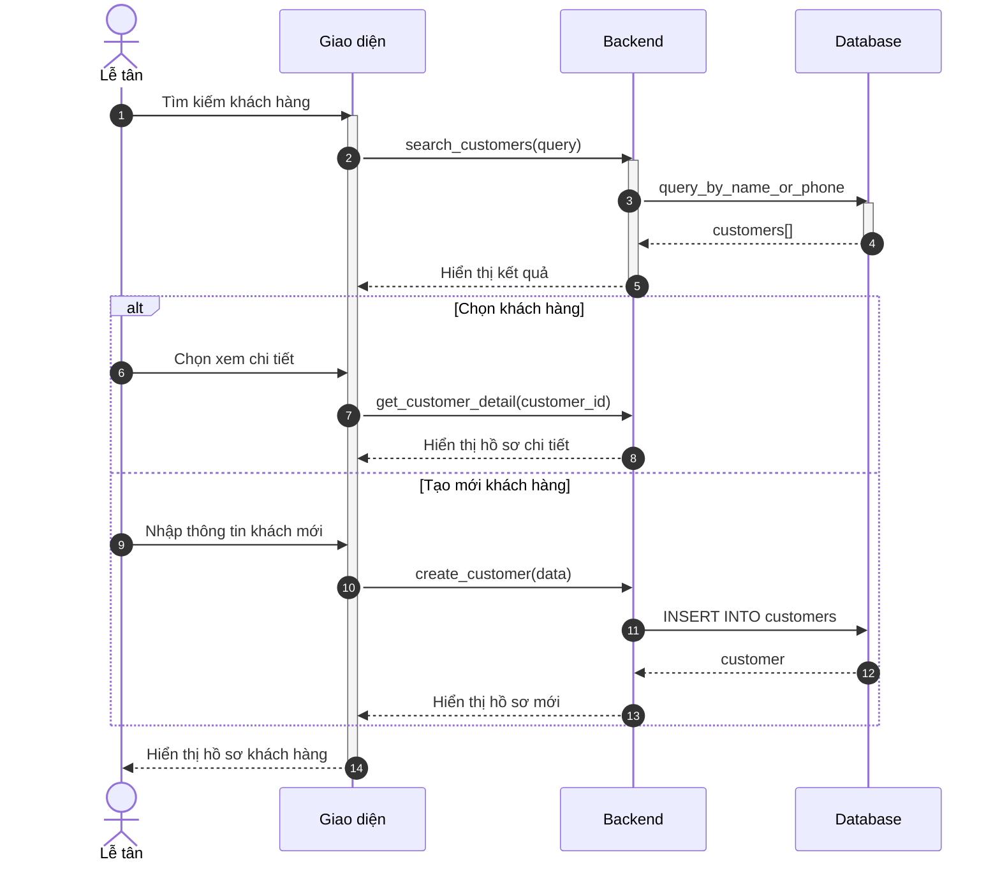
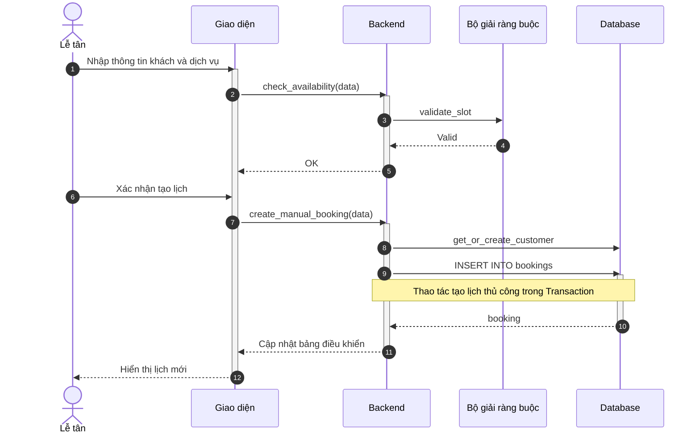
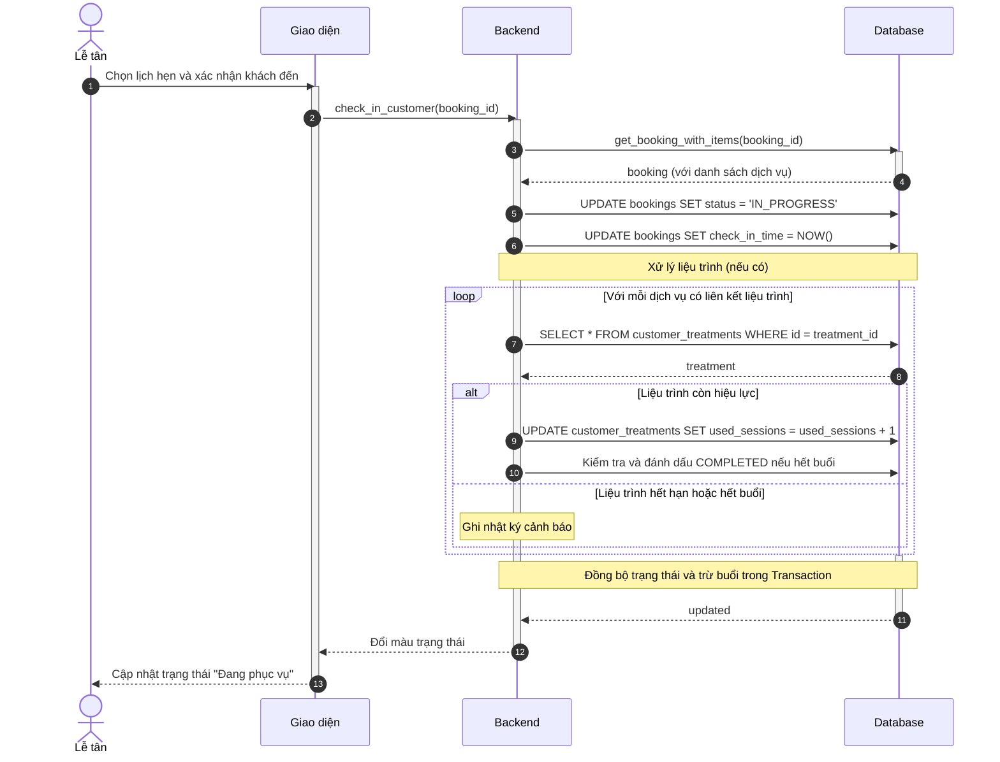
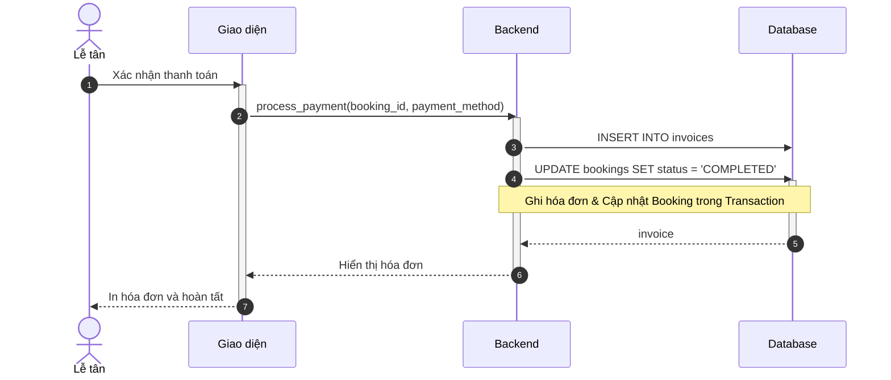
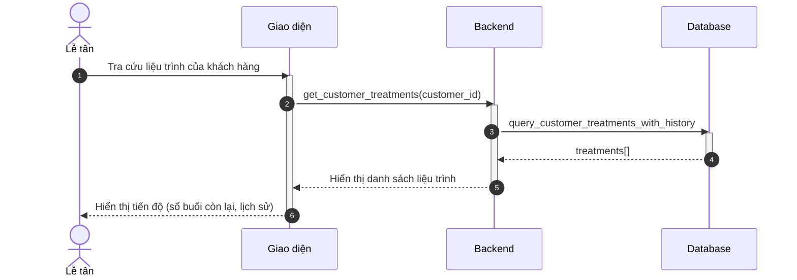

# Sơ đồ Tuần tự: Hoạt động Lễ tân

Tài liệu này chứa các sơ đồ tuần tự cho phân hệ Lễ tân.

%%{
  init: {
    'theme': 'neutral',
    'themeVariables': {
      'fontFamily': 'Arial, Helvetica, sans-serif',
      'fontSize': '16px',
      'sequenceMessageFontSize': '14px',
      'sequenceActorMargin': 15,
      'sequenceActivationPadding': 5,
      'sequenceDiagramMarginY': 10,
      'sequenceLogLifeline': 'transparent',
      'primaryColor': '#ffffff',
      'primaryTextColor': '#000000',
      'lineColor': '#000000',
      'secondaryColor': '#f5f5f5'
    }
  }
}%%

## Sơ đồ hoạt động cho Lễ tân

### 3.18. Xem lịch hẹn tổng quan (B1.1)

**Hình 3.18: Sơ đồ tuần tự chức năng Xem lịch hẹn tổng quan**

### 3.19. Quản lý hồ sơ khách hàng (B1.2)

**Hình 3.19: Sơ đồ tuần tự chức năng Quản lý hồ sơ khách hàng**

### 3.20. Tạo lịch hẹn thủ công (B1.3)

**Hình 3.20: Sơ đồ tuần tự chức năng Tạo lịch hẹn thủ công**

### 3.21. Xác nhận khách đến (B1.4)

**Hình 3.21: Sơ đồ tuần tự chức năng Xác nhận khách đến**

> **Ghi chú:** Sơ đồ này bao gồm logic **trừ buổi liệu trình** tự động. Khi xác nhận khách đến, nếu lịch hẹn có liên kết với thẻ liệu trình, hệ thống sẽ tự động tăng số buổi đã sử dụng.

### 3.22. Xử lý thanh toán (B1.5)

**Hình 3.22: Sơ đồ tuần tự chức năng Xử lý thanh toán**

### 3.23. Phản hồi hỗ trợ qua trò chuyện trực tuyến (B1.6)

**Hình 3.23: Sơ đồ tuần tự chức năng Phản hồi hỗ trợ qua trò chuyện trực tuyến**

### 3.24. Theo dõi tiến độ liệu trình (B1.7)

**Hình 3.24: Sơ đồ tuần tự chức năng Theo dõi tiến độ liệu trình**

