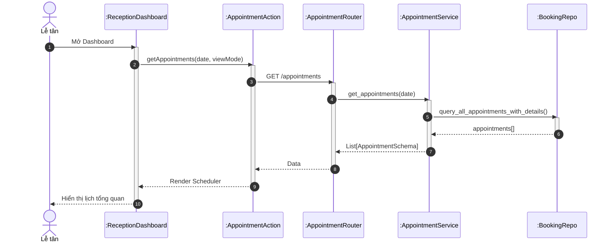
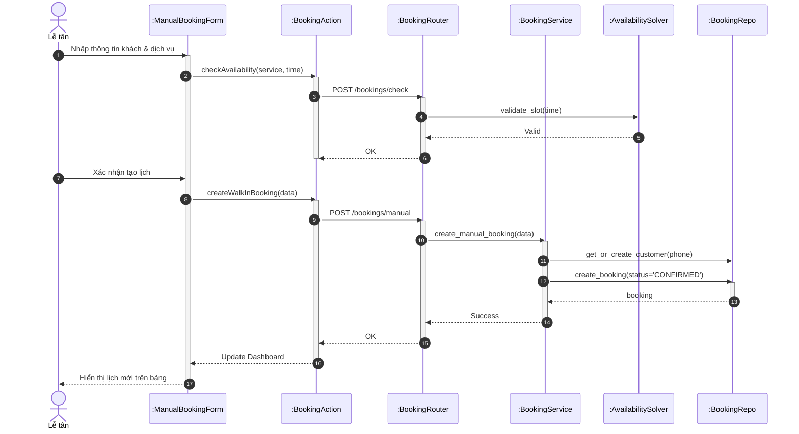
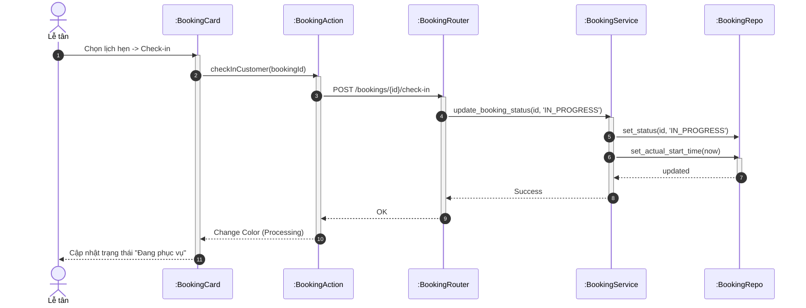
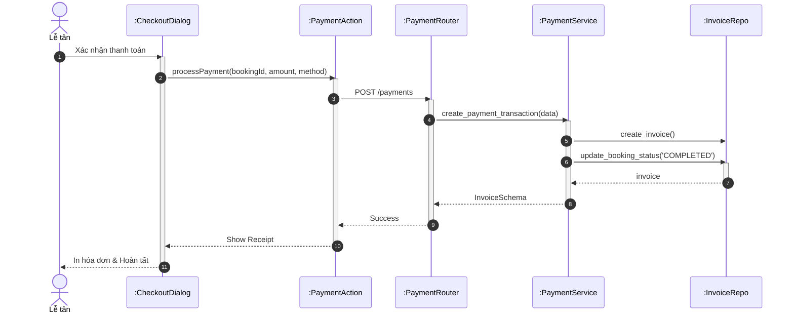

# Sơ đồ Tuần tự: Hoạt động Lễ tân (Receptionist Flows)

Tài liệu này chứa các sơ đồ tuần tự cho phân hệ Lễ tân.

%%{
  init: {
    'theme': 'neutral',
    'themeVariables': {
      'fontFamily': 'Arial, Helvetica, sans-serif',
      'fontSize': '16px',
      'sequenceMessageFontSize': '14px',
      'sequenceActorMargin': 15,
      'sequenceActivationPadding': 5,
      'sequenceDiagramMarginY': 10,
      'sequenceLogLifeline': 'transparent',
      'primaryColor': '#ffffff',
      'primaryTextColor': '#000000',
      'lineColor': '#000000',
      'secondaryColor': '#f5f5f5'
    }
  }
}%%

## 1.1.3 Sơ đồ hoạt động cho nhân viên lễ tân

### 3.31. Xem lịch hẹn tổng quan

**Hình 3.31: Sơ đồ tuần tự chức năng Xem lịch hẹn tổng quan**

### 3.34. Tạo lịch hẹn thủ công (Walk-in)

**Hình 3.34: Sơ đồ tuần tự chức năng Tạo lịch hẹn thủ công**

### 3.35. Check-in lịch hẹn

**Hình 3.35: Sơ đồ tuần tự chức năng Check-in lịch hẹn**

### 3.37. Xử lý thanh toán

**Hình 3.37: Sơ đồ tuần tự chức năng Xử lý thanh toán**
