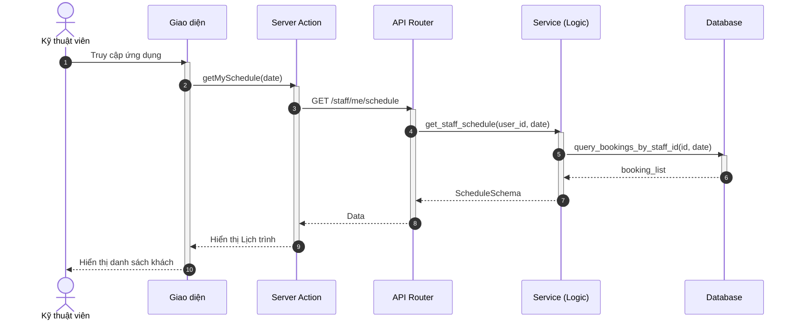
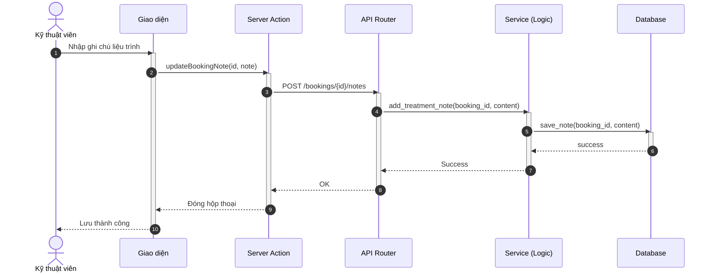

# Sơ đồ Tuần tự: Hoạt động Kỹ thuật viên (Technician Flows)

Tài liệu này chứa các sơ đồ tuần tự cho phân hệ Kỹ thuật viên.

%%{
  init: {
    'theme': 'neutral',
    'themeVariables': {
      'fontFamily': 'Arial, Helvetica, sans-serif',
      'fontSize': '16px',
      'sequenceMessageFontSize': '14px',
      'sequenceActorMargin': 15,
      'sequenceActivationPadding': 5,
      'sequenceDiagramMarginY': 10,
      'sequenceLogLifeline': 'transparent',
      'primaryColor': '#ffffff',
      'primaryTextColor': '#000000',
      'lineColor': '#000000',
      'secondaryColor': '#f5f5f5'
    }
  }
}%%

## 1.1.4 Sơ đồ hoạt động cho kỹ thuật viên

### 3.39. Xem lịch làm việc cá nhân

**Hình 3.39: Sơ đồ tuần tự chức năng Xem lịch làm việc cá nhân**

### 3.40. Ghi chú buổi hẹn (Treatment Notes)

**Hình 3.40: Sơ đồ tuần tự chức năng Ghi chú buổi hẹn**
