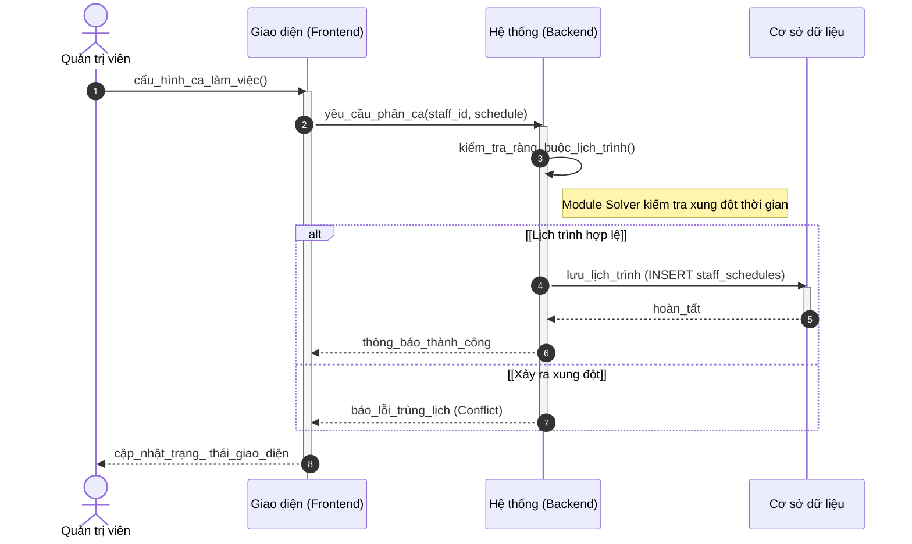
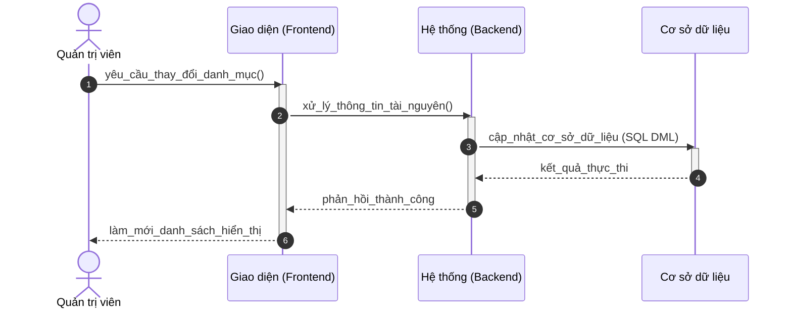

# Sơ đồ Tuần tự: Hoạt động Quản trị viên (Chuẩn học thuật)

Tài liệu này trình bày các luồng quản lý hệ thống cho Quản trị viên, bao gồm thiết lập tài nguyên và nhân sự.

---

### 3.1. Thiết lập Lịch làm việc nhân sự (C4)

---

### 3.2. Quản lý Tài nguyên và Dịch vụ (C5, C7)

