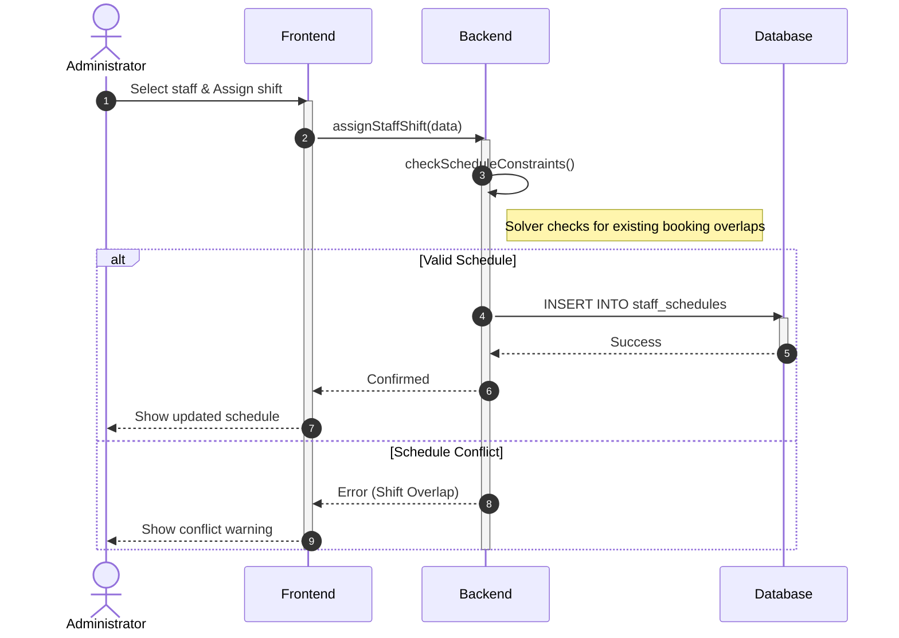
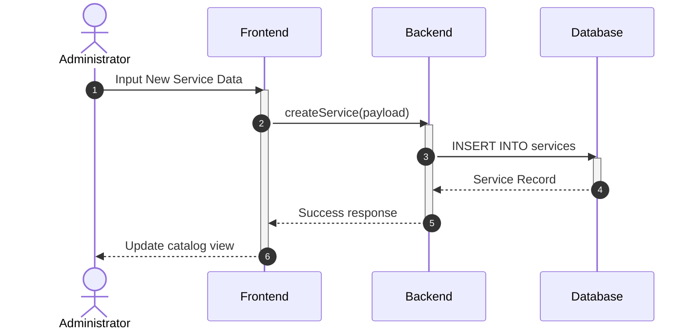
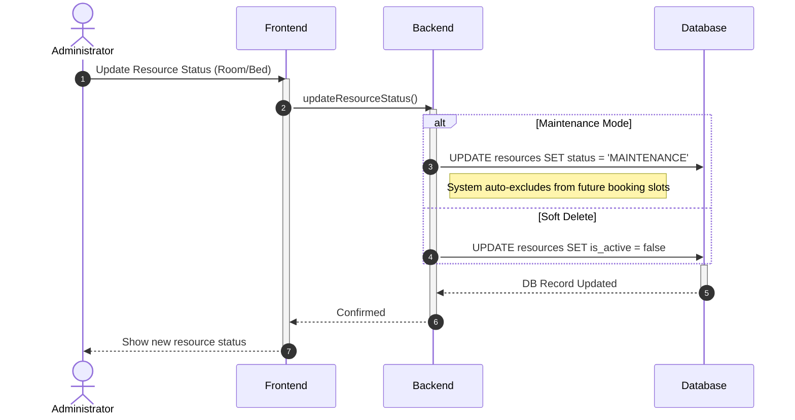
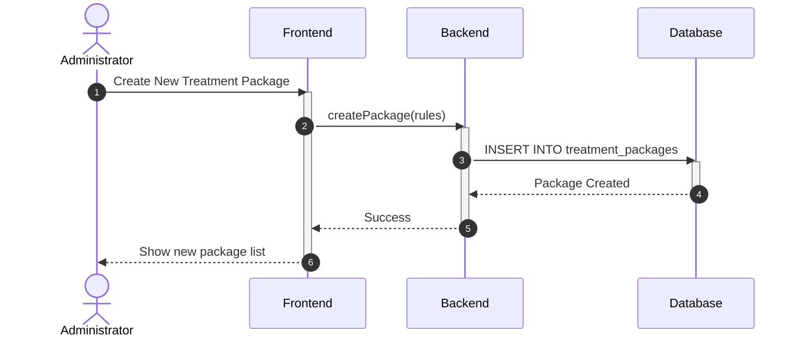
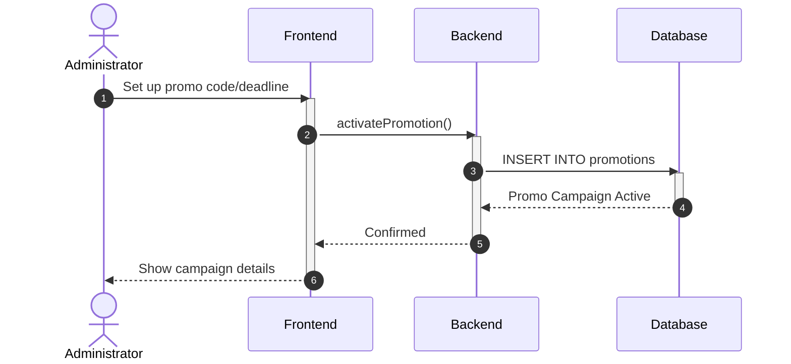

# Sequence Diagram: Administrator Module (Simplified)

---

### 3.1. Staff Shift Management & Scheduling (C4)

---

### 3.2. Service Catalog Management (C5)

---

### 3.3. Resource & Maintenance Management (C7)

---

### 3.4. Treatment Package Configuration (Punch Card) (C6)

---

### 3.5. Promotion & Voucher Campaign (C8)

