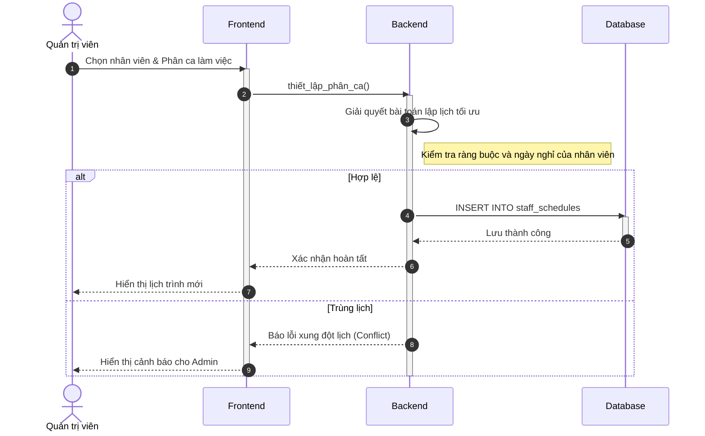
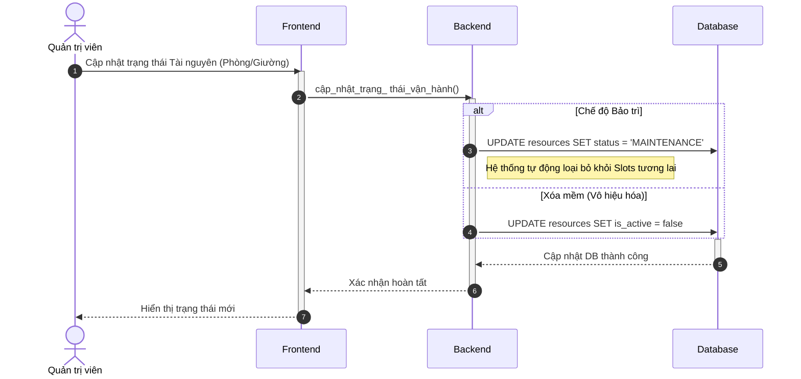
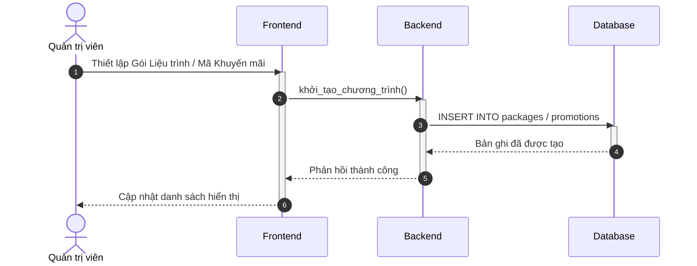

# Sequence Diagram: Administrator Module (Simplified)

---

### 3.1. Quản lý phân ca nhân sự (C4)

---

### 3.2. Quản lý Tài nguyên & Bảo trì (C7)

---

### 3.3. Cấu hình gói Liệu trình & Khuyến mãi (C6, C8)

