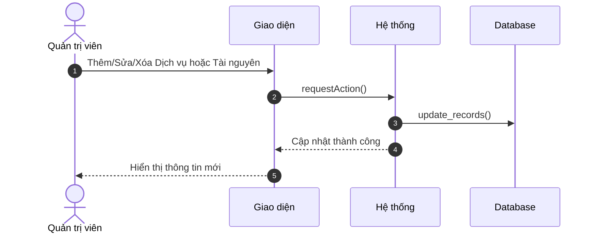
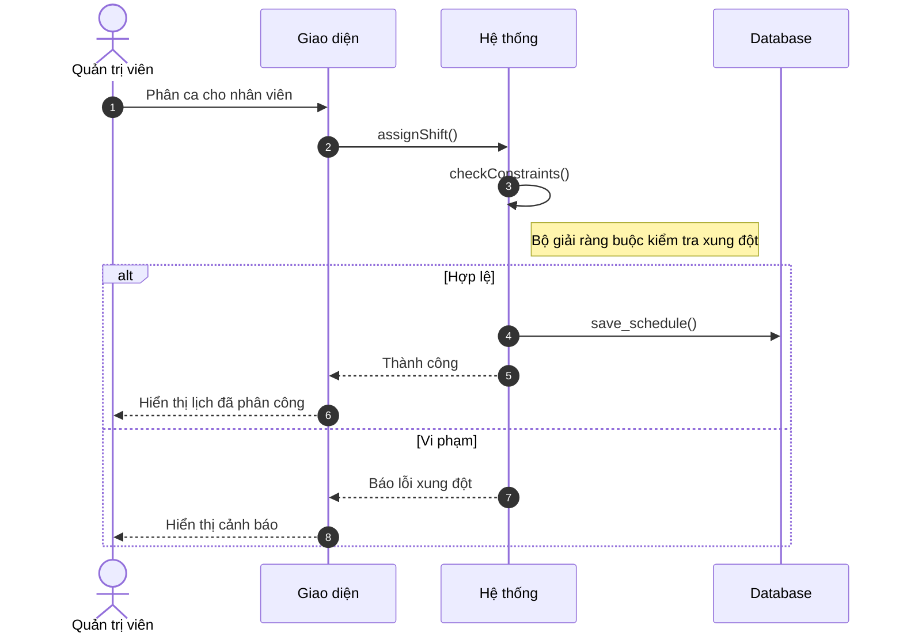

# Sơ đồ Tuần tự Rút gọn: Hoạt động Quản trị viên

Tài liệu này trình bày các sơ đồ tuần tự tối giản dành cho Quản trị viên.

---

### 3.1. Quản lý danh mục & Tài nguyên (C5, C7)

---

### 3.2. Cấu hình lịch làm việc nhân viên (C4)

