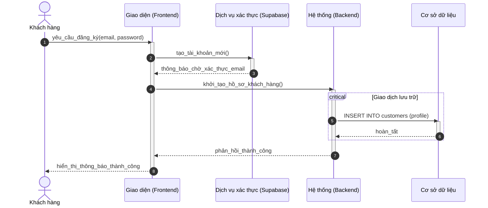
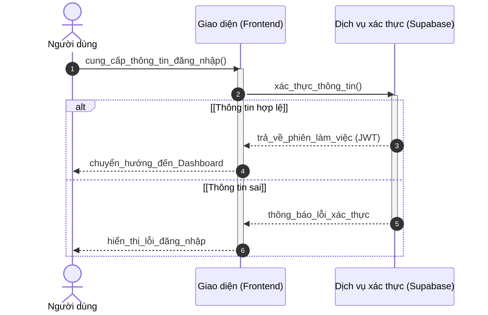
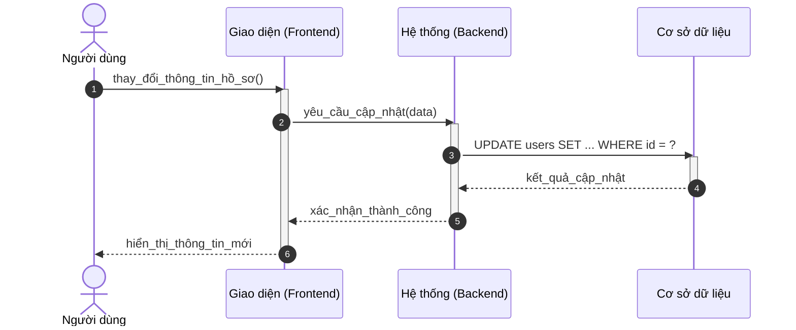

# Sơ đồ Tuần tự: Phân hệ Xác thực (Chuẩn học thuật)

Tài liệu này trình bày quy trình trao đổi thông điệp cho các chức năng xác thực, phân định rõ ranh giới giữa Frontend, Backend và Dịch vụ hạ tầng.

---

### 3.1. Đăng ký tài khoản khách hàng (A1.1)

---

### 3.2. Đăng nhập hệ thống (A1.2)

---

### 3.3. Cập nhật thông tin cá nhân (A1.4)

