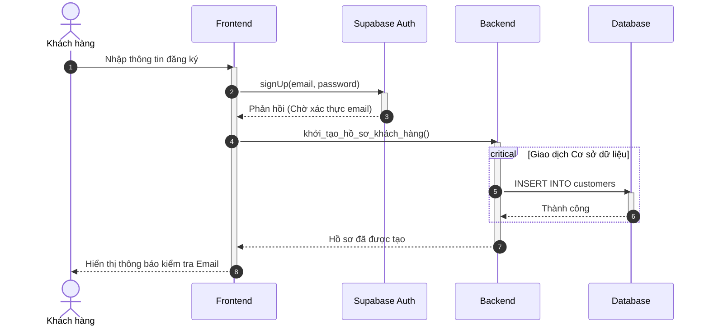
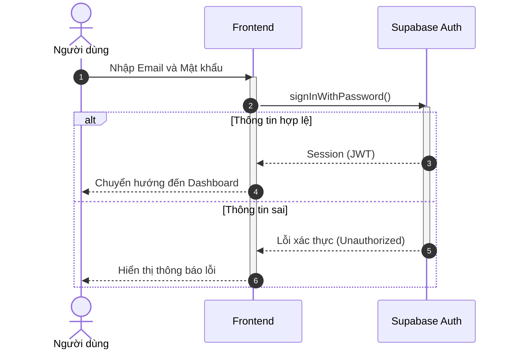
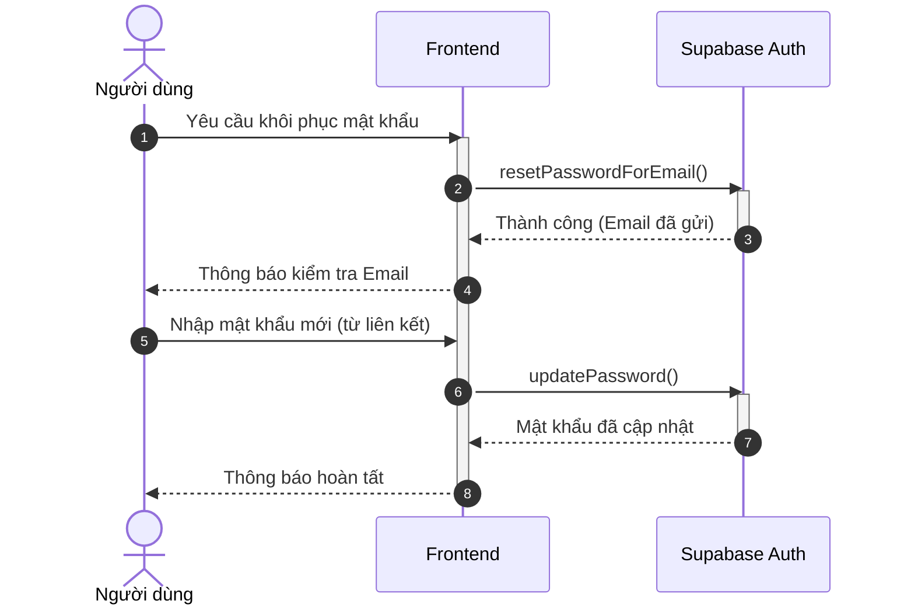

# Sequence Diagram: Authentication (Simplified)

---

### 3.1. Đăng ký tài khoản (A1.1)

```mermaid
sequenceDiagram
    autonumber
    actor User as Khách hàng
    participant FE as Frontend
    participant Auth as Supabase Auth
    participant BE as Backend
    participant DB as Database

    User->>FE: Nhập thông tin đăng ký
    activate FE
    FE->>Auth: signUp(email, password)
    activate Auth
    Auth-->>FE: Phản hồi (Chờ xác thực email)
    deactivate Auth

    FE->>BE: khởi_tạo_hồ_sơ_khách_hàng()
    activate BE
    critical Giao dịch Cơ sở dữ liệu
        BE->>DB: INSERT INTO customers
        activate DB
        DB-->>BE: Thành công
        deactivate DB
    end
    BE-->>FE: Hồ sơ đã được tạo
    deactivate BE

    FE-->>User: Hiển thị thông báo kiểm tra Email
    deactivate FE
```

---

### 3.2. Đăng nhập (A1.2)

```mermaid
sequenceDiagram
    autonumber
    actor User as Người dùng
    participant FE as Frontend
    participant Auth as Supabase Auth

    User->>FE: Nhập Email và Mật khẩu
    activate FE
    FE->>Auth: signInWithPassword()
    activate Auth

    alt Thông tin hợp lệ
        Auth-->>FE: Session (JWT)
        FE-->>User: Chuyển hướng đến Dashboard
    else Thông tin sai
        Auth-->>FE: Lỗi xác thực (Unauthorized)
        deactivate Auth
        FE-->>User: Hiển thị thông báo lỗi
    end
    deactivate FE
```

---

### 3.3. Khôi phục mật khẩu (A1.3)

```mermaid
sequenceDiagram
    autonumber
    actor User as Người dùng
    participant FE as Frontend
    participant Auth as Supabase Auth

    User->>FE: Yêu cầu khôi phục mật khẩu
    activate FE
    FE->>Auth: resetPasswordForEmail()
    activate Auth
    Auth-->>FE: Thành công (Email đã gửi)
    deactivate Auth
    FE-->>User: Thông báo kiểm tra Email

    User->>FE: Nhập mật khẩu mới (từ liên kết)
    FE->>Auth: updatePassword()
    activate Auth
    Auth-->>FE: Mật khẩu đã cập nhật
    deactivate Auth
    FE-->>User: Thông báo hoàn tất
    deactivate FE
```
