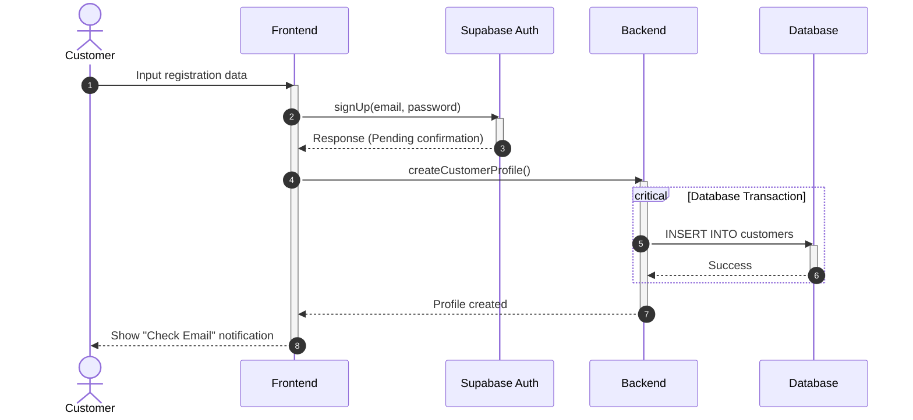
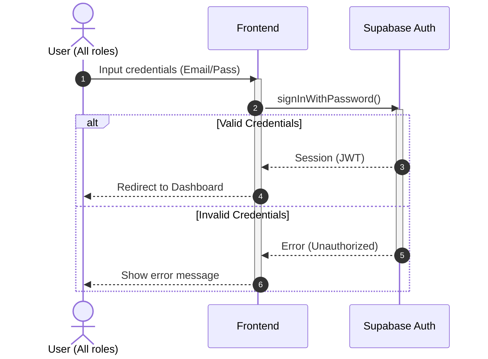
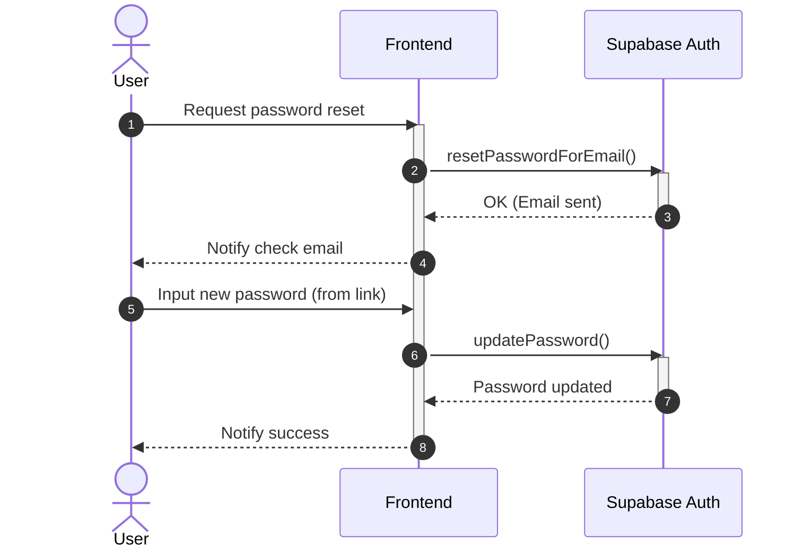
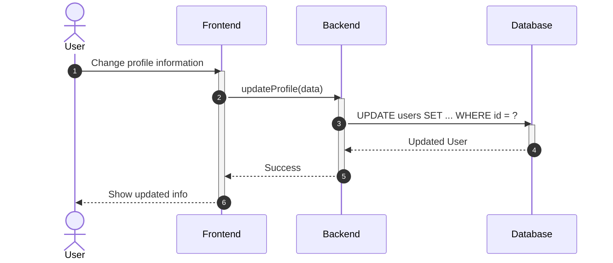
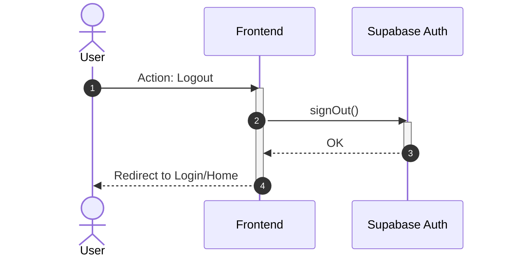

# Sequence Diagram: Authentication (Simplified)

---

### 3.1. Register Account (A1.1)

---

### 3.2. Login (A1.2)

---

### 3.3. Password Recovery (A1.3)

---

### 3.4. Update Profile (A1.4)

---

### 3.5. Logout (A1.5)

