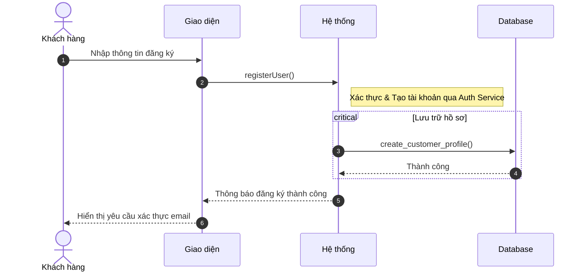
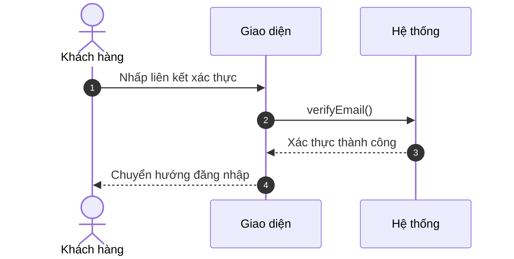
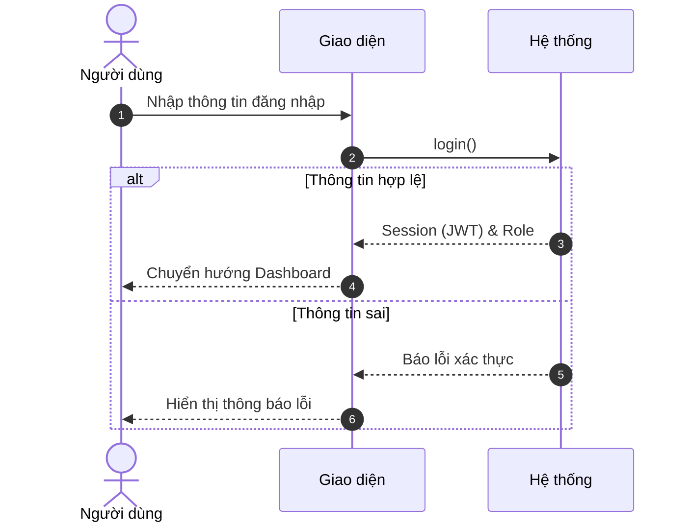
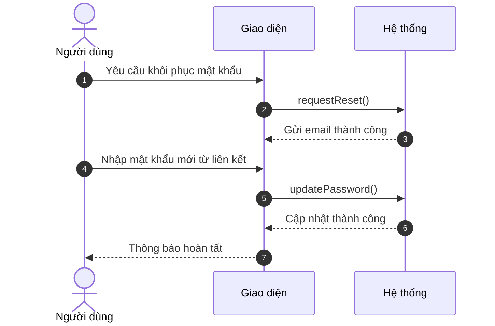
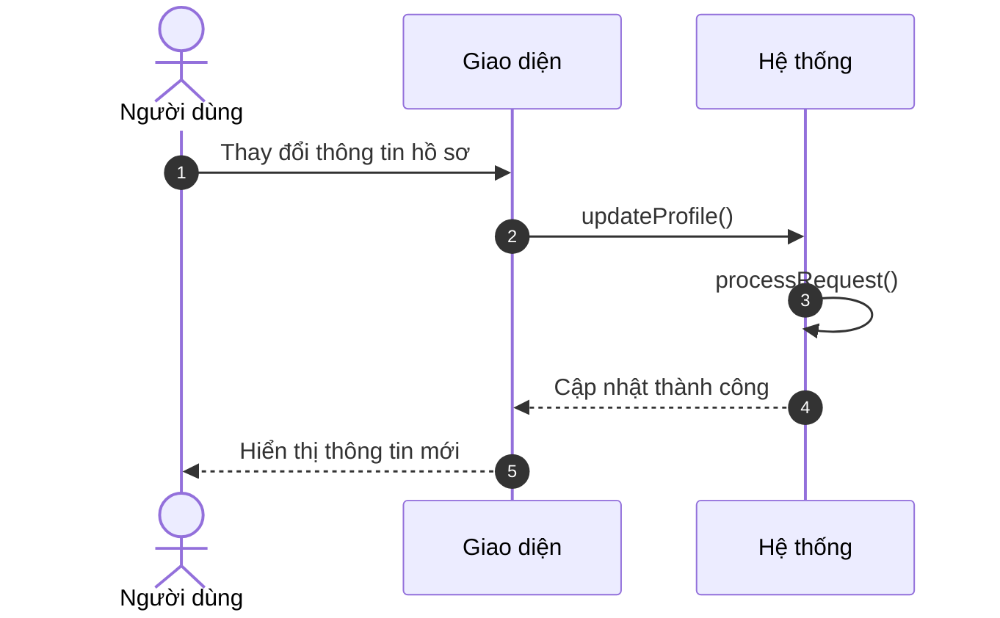
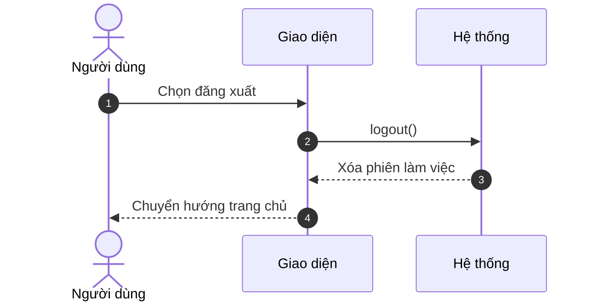

# Sơ đồ Tuần tự Rút gọn: Phân hệ Xác thực

Tài liệu này trình bày các sơ đồ tuần tự đã được tối giản, tập trung vào luồng nghiệp vụ chính phục vụ báo cáo học thuật.

---

### 3.1. Đăng ký tài khoản khách hàng (A1.1)

---

### 3.2. Xác thực thư điện tử (A1.1)

---

### 3.3. Đăng nhập (A1.2)

---

### 3.4. Khôi phục & Đặt lại mật khẩu (A1.3)

---

### 3.5. Cập nhật thông tin cá nhân (A1.4)

---

### 3.6. Đăng xuất (A1.5)

