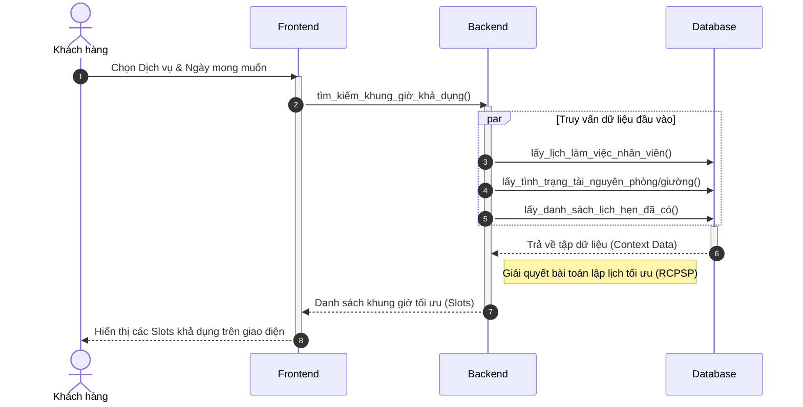
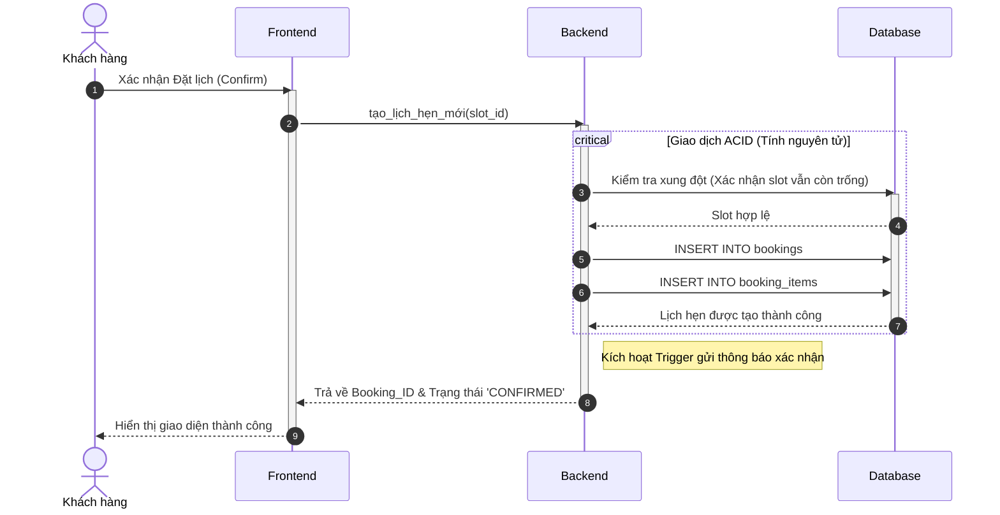
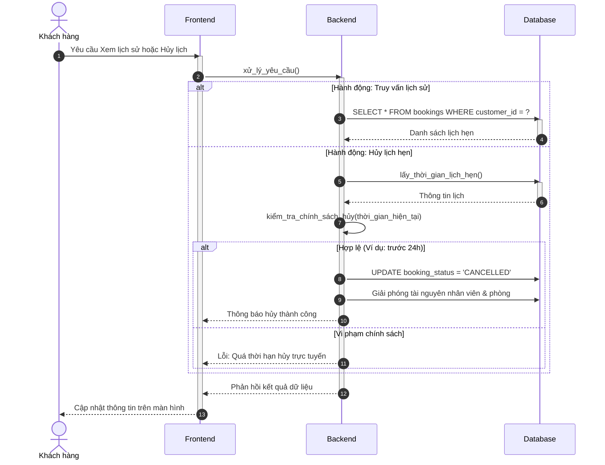
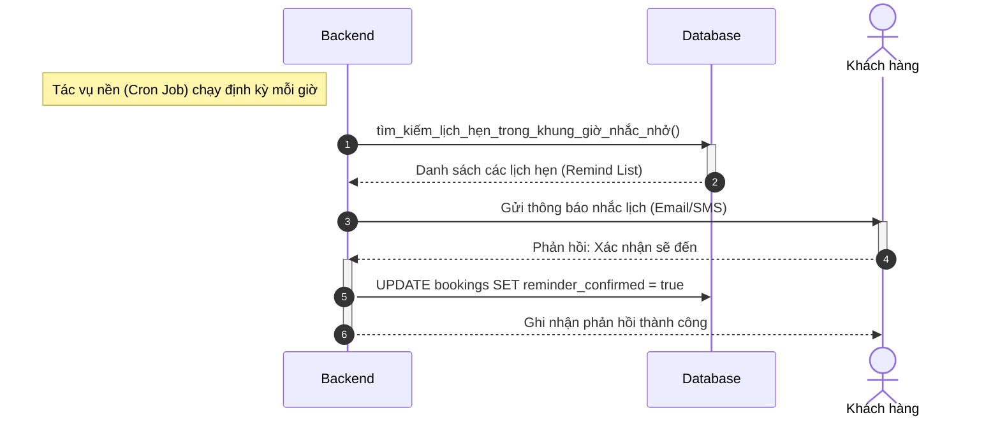

# Sequence Diagram: Customer Module (Simplified)

---

### 3.1. Tìm kiếm khung giờ thông minh (A2.4)

---

### 3.2. Hoàn tất đặt lịch hẹn (A2.5)

---

### 3.3. Quản lý và Hủy lịch hẹn (A3.1, A3.2)

---

### 3.4. Nhận thông báo nhắc lịch & Phản hồi (A3.3)

