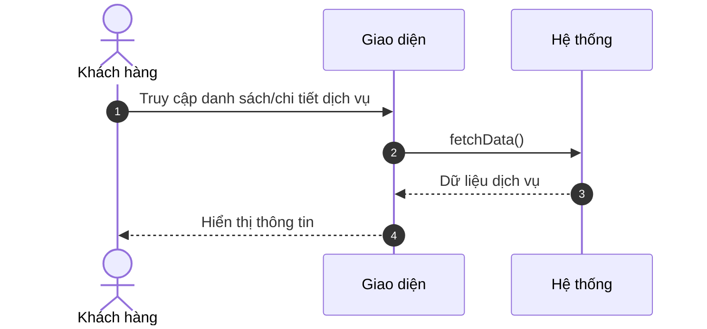
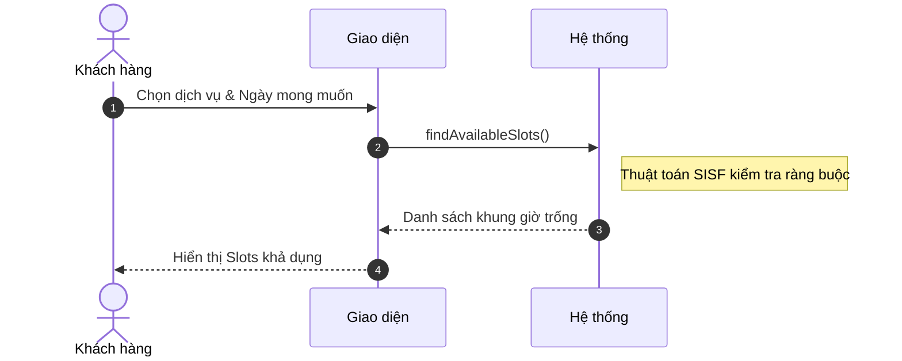
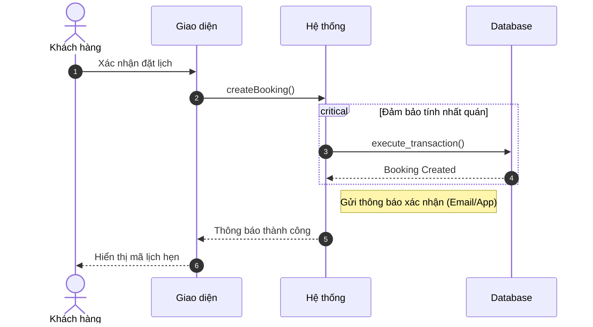
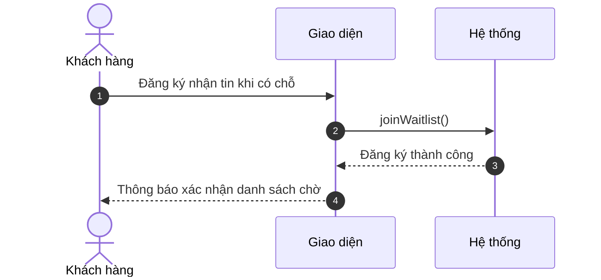
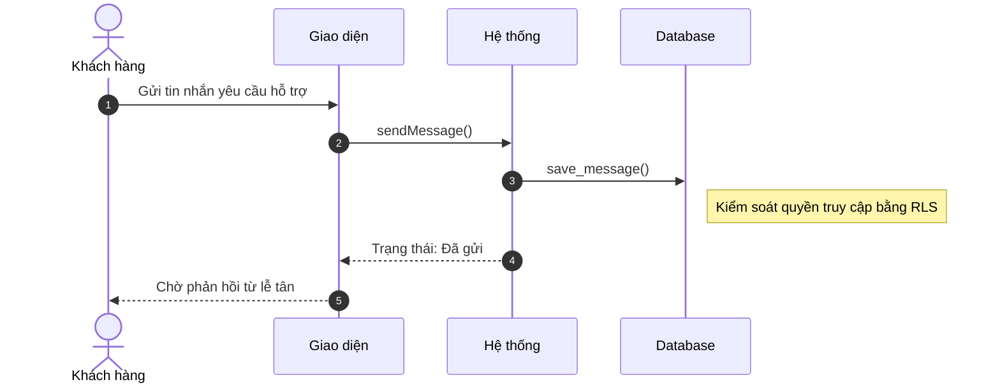
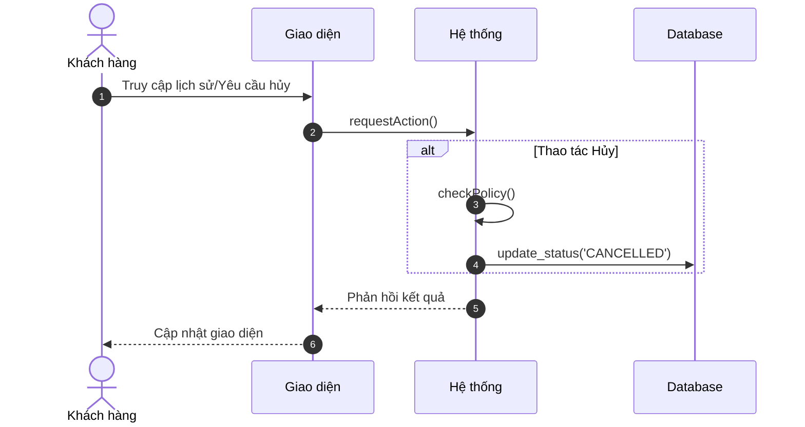
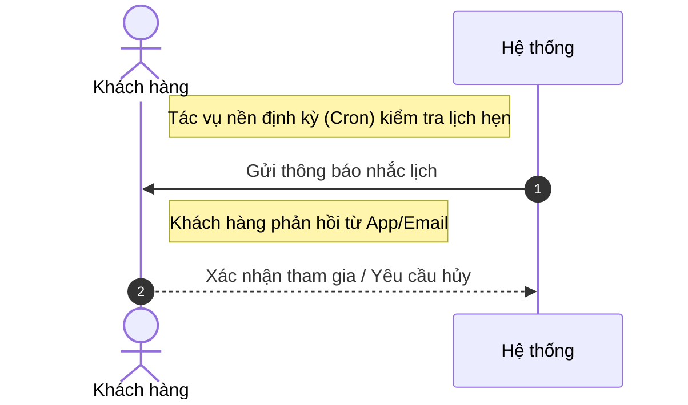
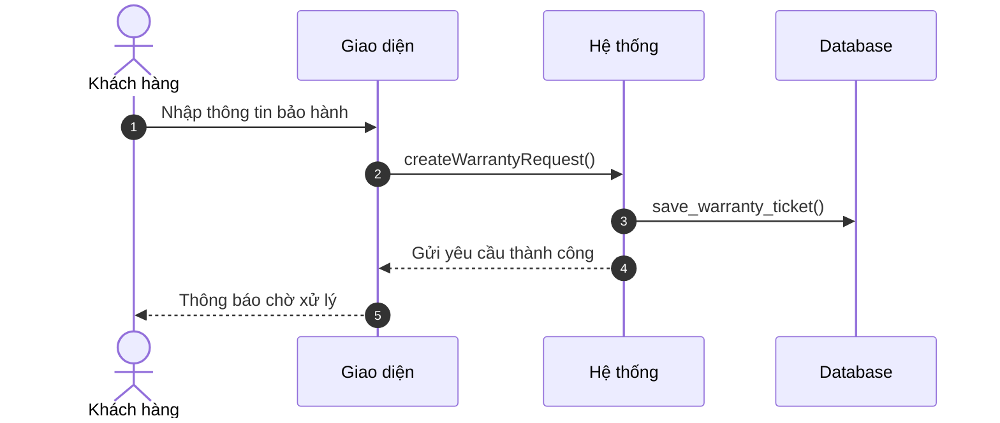

# Sơ đồ Tuần tự Rút gọn: Hoạt động Khách hàng

Tài liệu này trình bày các sơ đồ tuần tự tối giản cho các luồng công việc của Khách hàng.

---

### 3.1. Xem & Đặt lịch dịch vụ (A2.1, A2.2)

---

### 3.2. Tìm kiếm khung giờ khả dụng (A2.4)

---

### 3.3. Hoàn tất đặt lịch hẹn (A2.5)

---

### 3.4. Tham gia danh sách chờ (A2.6)

---

### 3.5. Hỗ trợ qua trò chuyện (A2.7)

---

### 3.6. Quản lý lịch hẹn cá nhân (A3.1, A3.2)

---

### 3.7. Nhận thông báo nhắc lịch (A3.3)

---

### 3.8. Gửi yêu cầu bảo hành (A3.6)

