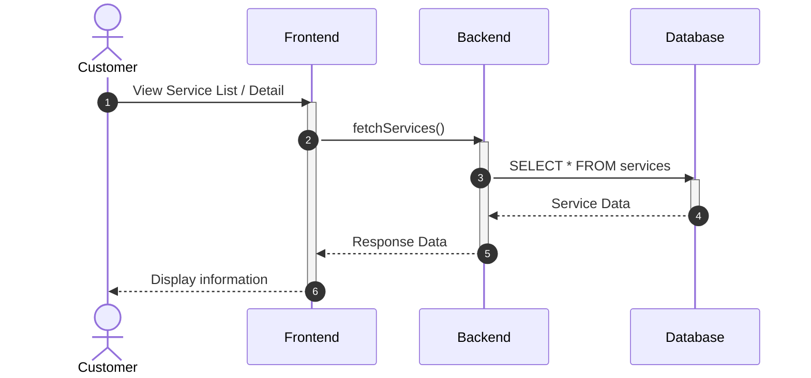
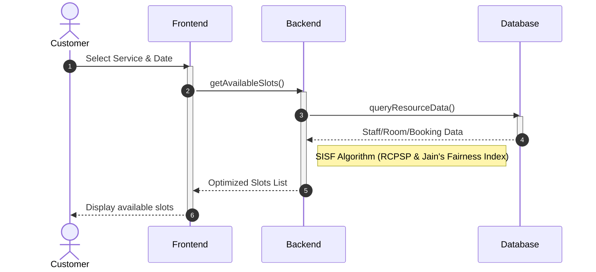
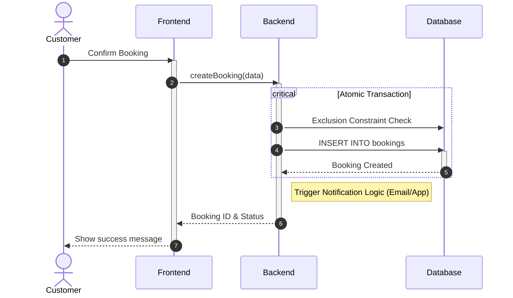
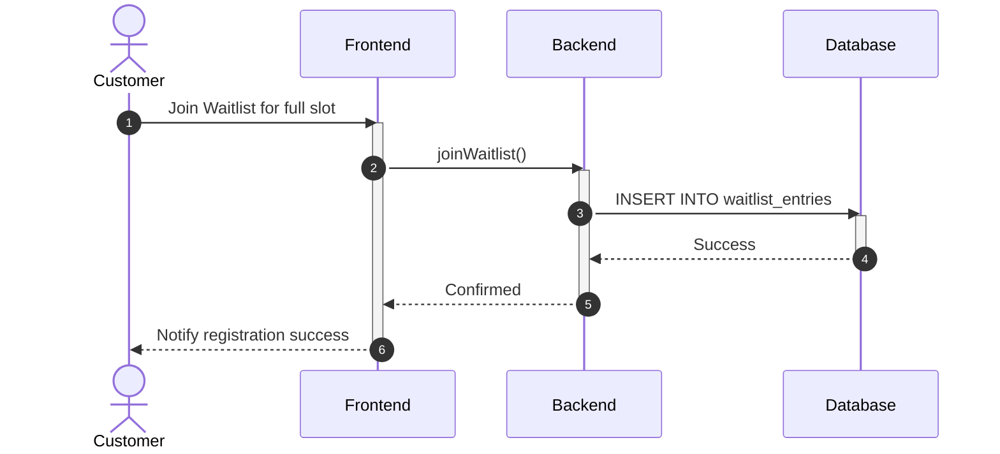
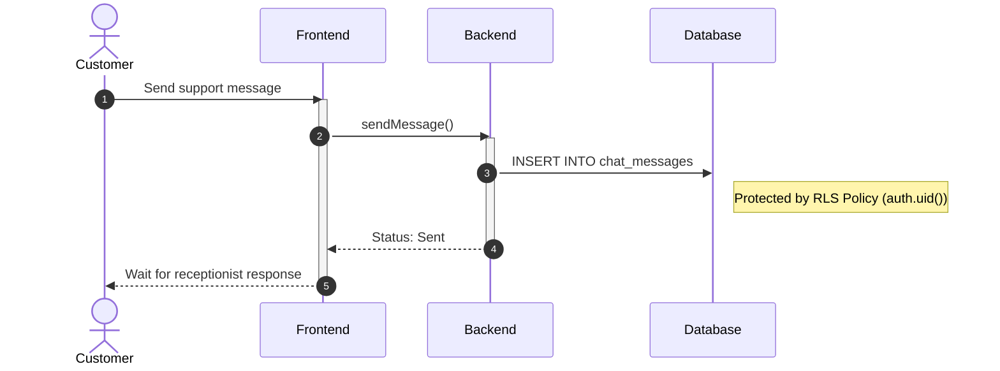
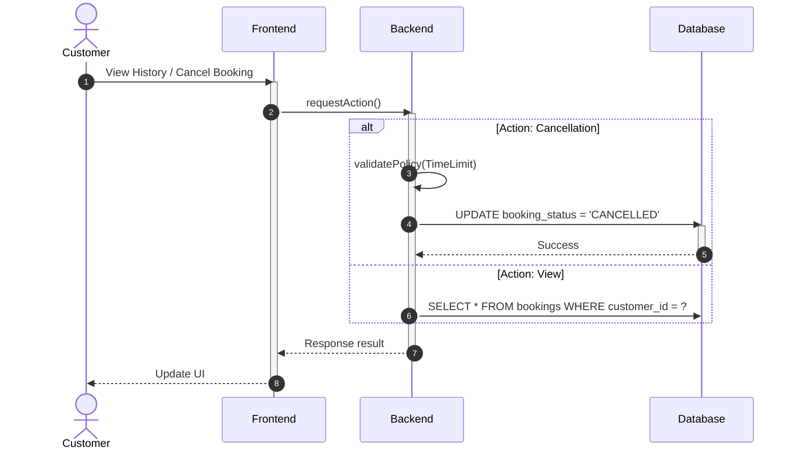
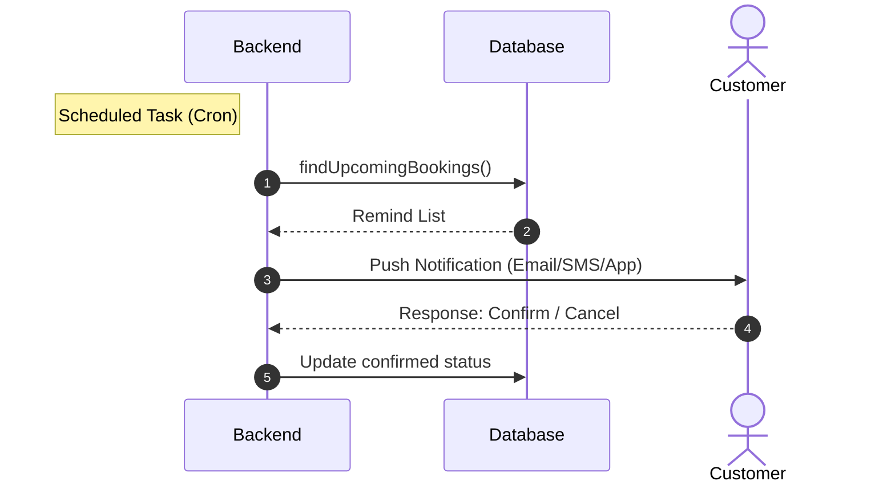
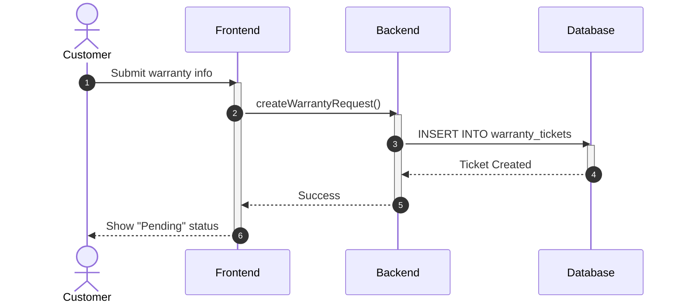

# Sequence Diagram: Customer Module (Simplified)

---

### 3.1. Browse Services & Details (A2.1, A2.2)

---

### 3.2. Intelligent Slot Searching (A2.4)

---

### 3.3. Create Booking (A2.5)

---

### 3.4. Join Waitlist (A2.6)

---

### 3.5. Live Chat Support (A2.7)

---

### 3.6. View History & Request Cancellation (A3.1, A3.2)

---

### 3.7. Receive Reminder Notification (A3.3)

---

### 3.8. Warranty Request (A3.6)

