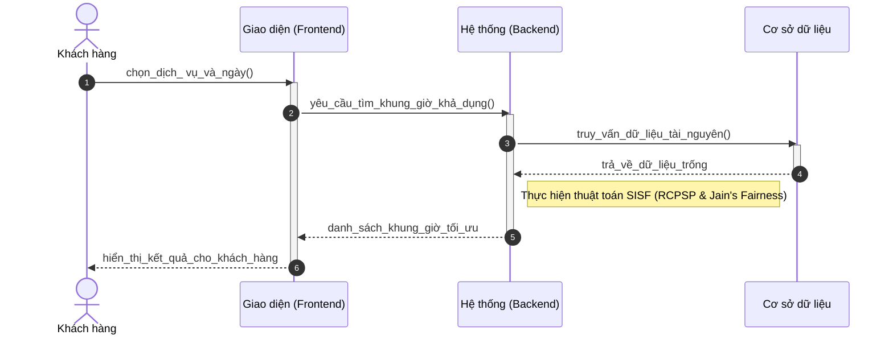
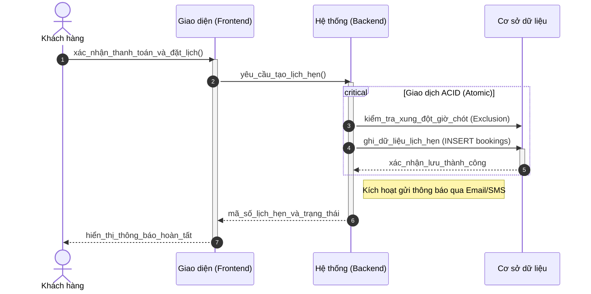
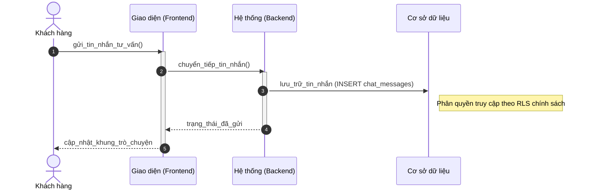
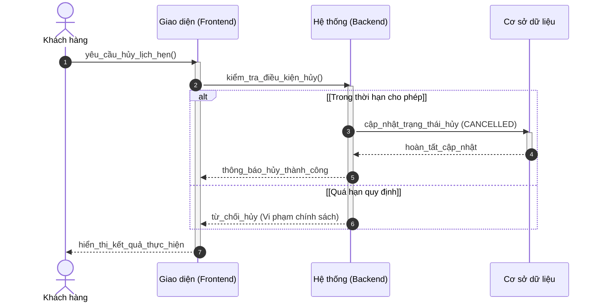

# Sơ đồ Tuần tự: Hoạt động Khách hàng (Chuẩn học thuật)

Tài liệu này chi tiết hóa trình tự liên lạc giữa các tác nhân và thành phần hệ thống cho các nghiệp vụ dành cho Khách hàng.

---

### 3.1. Tìm kiếm và Lựa chọn khung giờ (A2.4)

---

### 3.2. Hoàn tất đặt lịch hẹn (A2.5)

---

### 3.3. Hỗ trợ qua trò chuyện (A2.7)

---

### 3.4. Quản lý và Hủy lịch hẹn (A3.1, A3.2)

