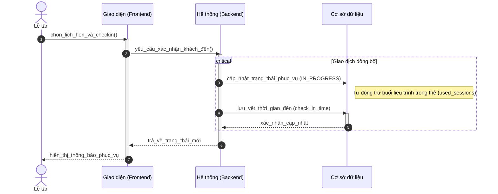
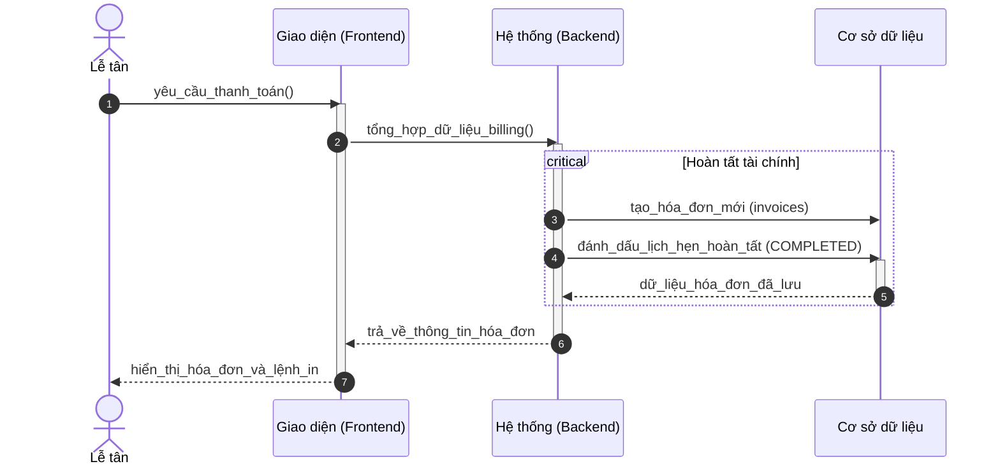
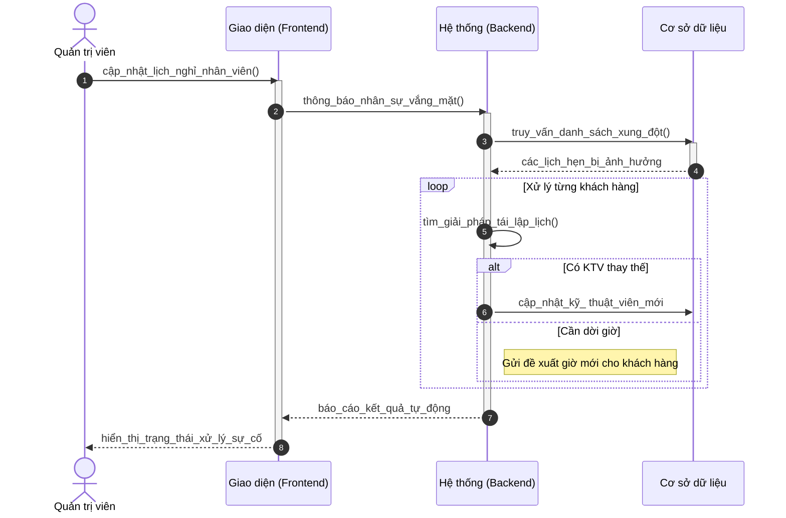

# Sơ đồ Tuần tự: Hoạt động Lễ tân (Chuẩn học thuật)

Tài liệu này trình bày các luồng thông điệp cho công tác quản lý và vận hành Spa của nhân viên Lễ tân.

---

### 3.1. Tiếp nhận và Check-in khách hàng (B1.4)

---

### 3.2. Xử lý thanh toán và In hóa đơn (B1.5)

---

### 3.3. Tái lập lịch tự động (B1.8)

